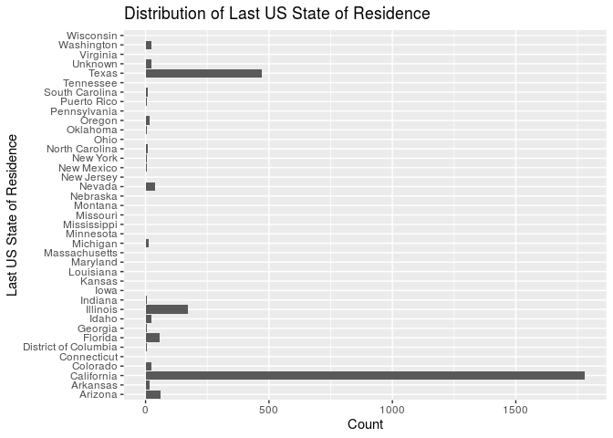
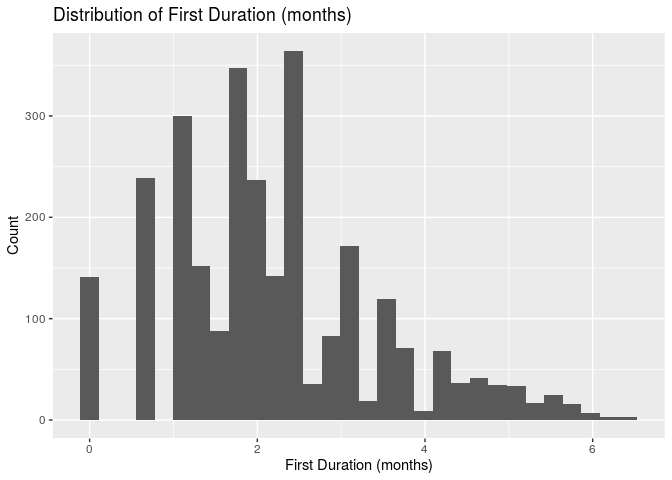
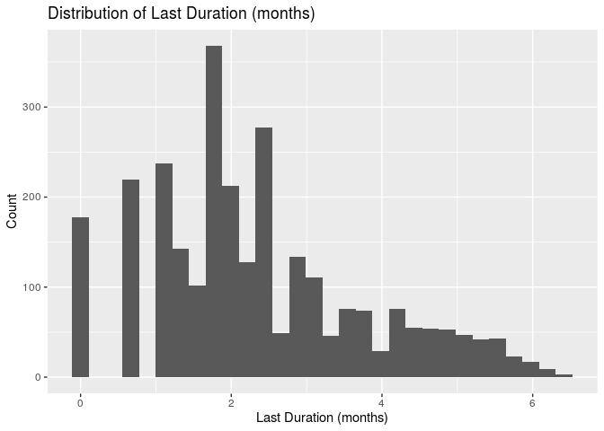
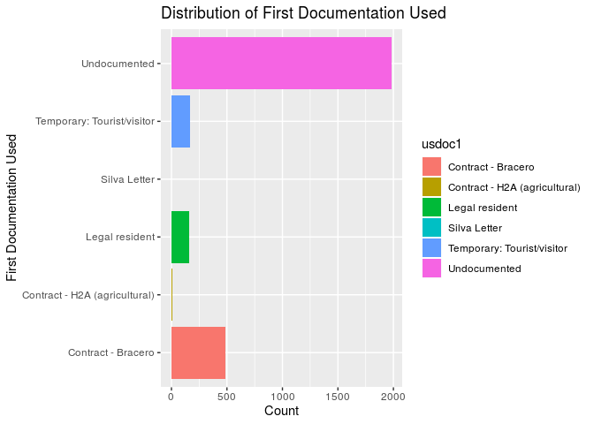
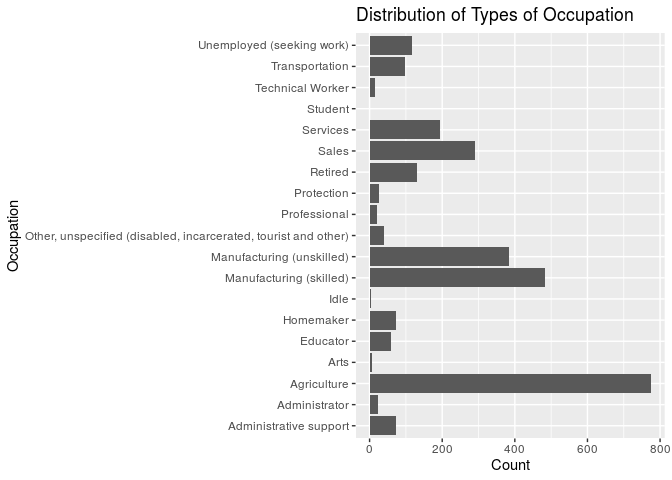
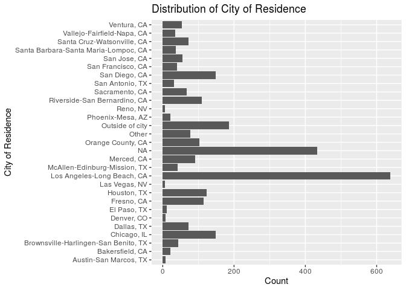
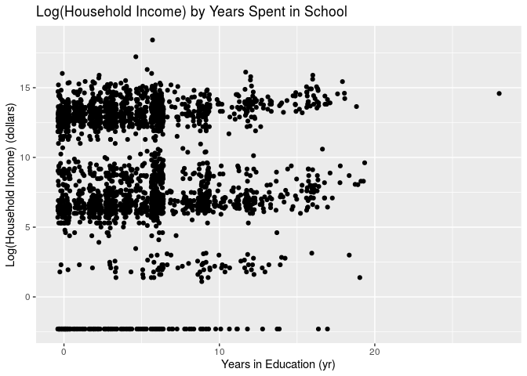
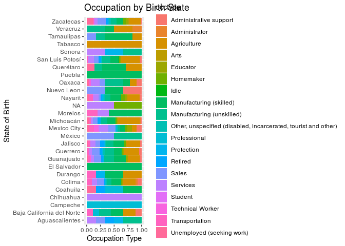
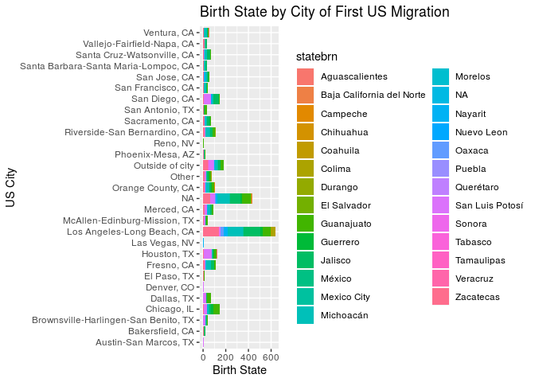

Characteristics of Recent Mexican Immigrants to the US
================
Ben 10
October 27, 2019

``` r
library(readr)
library(knitr)
library(tidyverse)
```

    ## ── Attaching packages ────────────────────────────────────────────────────────── tidyverse 1.2.1 ──

    ## ✔ ggplot2 3.2.1     ✔ purrr   0.3.2
    ## ✔ tibble  2.1.3     ✔ dplyr   0.8.3
    ## ✔ tidyr   0.8.3     ✔ stringr 1.4.0
    ## ✔ ggplot2 3.2.1     ✔ forcats 0.4.0

    ## ── Conflicts ───────────────────────────────────────────────────────────── tidyverse_conflicts() ──
    ## ✖ dplyr::filter() masks stats::filter()
    ## ✖ dplyr::lag()    masks stats::lag()

``` r
library(dplyr)
```

## Section 1. Introduction

In recent years, immigration has been a topic of intense controversy.
Given the complexity of immigration law, we are interested in examining
the experiences of immigrants since the beginning of the millenia. The
U.S. stance on immigration has grown increasingly strict, not only for
“illegal” immigration, but also for legal immigration: naturalization,
visa use, lawful permanent residency, refugee status, and asylum
seekers.

For example, the number of refugees accepted from all countries
worldwide to the US fell to 22,491 in 2018 from 84,994 in 2016 according
to the Department of State, likely as a result of hard line policies
against refugees coming to the US. As immigration policies seem likely
to tighten in the lead up to the 2020 elections, we are examining
immigration to the US from Mexico and the characteristics of these
immigrants.

Given the variety of ways to immigrate legally,and the widely varying
experiences of immigrants from different backgrounds, we expect that the
success of immigrants, measured in the form of annual income, to stem
from their demographic differences and experiences of immigration.

Our research project aims to determine the characteristics of Mexican
immigration to the US. We hypothesize that there exist statistically
significant trends in Mexican immigrants to the US, and that we can
determine where migrants are coming from, why and where they are going,
as well as explore their experiences when they arrive.

## Section 2. Exploratory Data Analysis

``` r
data <- read_csv("/cloud/project/02-data/dat.csv")
```

    ## Warning: Missing column names filled in: 'X1' [1]

    ## Parsed with column specification:
    ## cols(
    ##   X1 = col_double(),
    ##   sex = col_double(),
    ##   relhead = col_double(),
    ##   yrborn = col_double(),
    ##   age = col_double(),
    ##   statebrn = col_double(),
    ##   marstat = col_double(),
    ##   edyrs = col_double(),
    ##   occ = col_double(),
    ##   hhincome = col_double(),
    ##   usstate1 = col_double(),
    ##   usstatel = col_double(),
    ##   usplace1 = col_double(),
    ##   usplacel = col_double(),
    ##   usdur1 = col_double(),
    ##   usdurl = col_double(),
    ##   usdoc1 = col_double()
    ## )

### Data Collection Method and Description

The dataset is from The Mexican Migration Project (MMP, \*see References
below for confidentiality terms). It was created in 1982 by an
interdisciplinary team of researchers to further our understanding of
the complex process of Mexican migration to the United States. The
project is a binational research effort co-directed by Jorge Durand,
professor of Social Anthropology at the University of Guadalajara
(Mexico), and Douglas S. Massey, professor of Sociology and Public
Affairs, with a joint appointment in the Woodrow Wilson School, at
Princeton University (US).

Since its inception, the MMP’s main focus has been to gather social as
well as economic information on Mexican-US migration. The data collected
has been compiled in a comprehensive database that is available to the
public free of charge for research and educational purposes through its
web-site. The MMP uses the ethnosurvey approach to gather data: in
winter months, they randomly sample households in communities throughout
Mexico, surveying household heads and members about their first and last
trip to the US, as well as economic and demographic information. They
then conduct the same survey in destination areas in the US, sampling
migrants from the same communities they survey in Mexico but who have
not returned to Mexico. Thus, the sample of migrants includes residents
in both Mexico and the US.

The MMP170 Database contains an initial file with general demographic,
economic, and migratory information for each member of a surveyed
household (PERS). Pers170 has 132 variables and 176701 observations,and
hence it is very large. Therefore, we selected 17 meaningful variables
and filtered out rows that contain N/A’s to create a new dataset labeled
`data`.

The response variable we will be examining is `hhincome`, or household
income. It is a numeric variable.

The predictors we will consider are sex (categorical), relhead
(relationship to head of household, categorical), yrborn (year of birth,
numeric), age (in years, numeric), statebrn (state of birth,
categorical), marstat (marital status, categorical), edyrs (years of
school completed, numeric), usstate1 (state of residence on first US
migration, categorical), usstatel (state of residence on last US
migration, categorical), uscity (city of residence on first US
migration, categorical), usplacel (city of residence on last US
migration, categorical), usdur1 (duration of first US migration in
months, numeric), usdurl (duration of last US migration in months,
numeric), usdoc1 (type of documentation used on first US migration,
categorical), and occtype (category of occupation, categorical).

### Variable Cleaning and Recoding

“X1”: Number of observation

“sex”: Sex

“relhead”: Relationship to household head

“yrborn”: Year of birth

“age”: Age

“statebrn”: State of birth

“marstat”: Marital status

“edyrs”: School years completed

“occ”: Principal occupation

“hhincome” : Household income

“usstate1”: First US mig: State of residence

“usstatel”: Latest US mig: State of residence

“usplace1”: First US mig: City of residence (in place codes)

“usplacel”: Latest US mig: City of residence (in place codes)

“usdur1”: First US mig: Duration (in months)

“usdurl”: Latest US mig: Duration (in months)

“usdoc1”: Type of documentation

“occtype”: Category of occupation

“uscity”: City of residence during first US migration

``` r
data <- data %>%
  mutate(relhead = factor(relhead))
data <- data %>%
  mutate(sex = case_when(
    sex == 1 ~ "M",
    sex == 2 ~ "F",
    sex == 9999 ~ "NA"
  ))
```

``` r
data <- data %>%
  mutate(statebrn = case_when(
    statebrn == 1 ~ "Aguascalientes", 
    statebrn == 2 ~ "Baja California del Norte", 
    statebrn == 3 ~ "Baja California del Sur",
    statebrn == 4 ~ "Campeche",
    statebrn == 5 ~ "Coahuila",
    statebrn == 6 ~ "Colima",
    statebrn == 7 ~ "Chiapas",
    statebrn == 8 ~ "Chihuahua",
    statebrn == 9 ~ "Mexico City",
    statebrn == 10 ~ "Durango",
    statebrn == 11 ~ "Guanajuato",
    statebrn == 12 ~ "Guerrero",
    statebrn == 13 ~ "Hidalgo",
    statebrn == 14 ~ "Jalisco",
    statebrn == 15 ~ "México",
    statebrn == 16 ~ "Michoacán",
    statebrn == 17 ~ "Morelos",
    statebrn == 18 ~ "Nayarit",
    statebrn == 19 ~ "Nuevo Leon",
    statebrn == 20 ~ "Oaxaca",
    statebrn == 21 ~ "Puebla",
    statebrn == 22 ~ "Querétaro",
    statebrn == 23 ~ "Quintana Roo",
    statebrn == 24 ~ "San Luis Potosí",
    statebrn == 25 ~ "Sinaloa",
    statebrn == 26 ~ "Sonora",
    statebrn == 27 ~ "Tabasco",
    statebrn == 28 ~ "Tamaulipas",
    statebrn == 29 ~ "Tlaxcala",
    statebrn == 30 ~ "Veracruz",
    statebrn == 31 ~ "Yucatán",
    statebrn == 32 ~ "Zacatecas",
    statebrn == 212 ~ "El Salvador",
    statebrn == 9999 ~ "NA"
    ))
```

``` r
data <- data %>%
  mutate(marstat = case_when(
    marstat == 1 ~ "Never married",
    marstat == 2 ~ "Married",
    marstat == 3 ~ "Consensual union", 
    marstat == 4 ~ "Widowed",
    marstat == 5 ~ "Divorced",
    marstat == 6 ~ "Separated"
  ))
```

``` r
data <- data %>%
  mutate(occtype = case_when(
    occ == 10 ~ "Unemployed (seeking work)", 
    occ == 20 ~ "Homemaker",
    occ == 30 ~ "Idle",
    occ == 42 ~ "Student",
    occ == 50 ~ "Retired",
    occ == 60 ~ "Other, unspecified (disabled, incarcerated, tourist and other)", 
    occ %in% c(110, 113, 116, 119) ~ "Professional", 
    occ %in% c(120, 123, 124, 129) ~ "Technical Worker",
    occ == 130 ~ "Educator",
    occ %in% c(142, 143, 145, 146, 149) ~ "Arts",
    occ == 144 ~ "Athlete",
    occ %in% c(210, 211) ~ "Administrator",
    occ %in% c(410, 411, 415, 417, 419) ~ "Agriculture", 
    occ %in% c(519, 520, 522, 523, 524, 526, 527, 529, 539) ~ "Manufacturing (skilled)", 
    occ %in% c(541, 547, 549) ~ "Manufacturing (unskilled)", 
    occ %in% c(552, 559) ~ "Transportation",
    occ %in% c(620, 621, 625, 629) ~ "Administrative support", 
    occ %in% c(711, 713, 719, 720, 721) ~ "Sales", 
    occ %in% c(810, 819, 820) ~ "Services", 
    occ %in% c(830, 831) ~ "Protection",
    occ == 9999 ~ "NA"
  ))
```

``` r
data <- data %>%
  mutate(usstate1 = case_when(
    usstate1 == 100 ~ "Alabama",
    usstate1 == 102 ~ "Alaska",
    usstate1 == 103 ~ "Arizona",
    usstate1 == 104 ~ "Arkansas",
    usstate1 == 105 ~ "California",
    usstate1 == 106 ~ "Colorado",
    usstate1 == 107 ~ "Connecticut",
    usstate1 == 108 ~ "Delaware",
    usstate1 == 109 ~ "District of Columbia",
    usstate1 == 110 ~ "Florida",
    usstate1 == 111 ~ "Georgia",
    usstate1 == 112 ~ "Hawaii",
    usstate1 == 113 ~ "Idaho",
    usstate1 == 114 ~ "Illinois",
    usstate1 == 115 ~ "Indiana",
    usstate1 == 116 ~ "Iowa",
    usstate1 == 117 ~ "Kansas",
    usstate1 == 118 ~ "Kentucky",
    usstate1 == 119 ~ "Louisiana",
    usstate1 == 120 ~ "Maine",
    usstate1 == 121 ~ "Maryland",
    usstate1 == 122 ~ "Massachusetts",
    usstate1 == 123 ~ "Michigan",
    usstate1 == 124 ~ "Minnesota",
    usstate1 == 125 ~ "Mississippi",
    usstate1 == 126 ~ "Missouri",
    usstate1 == 127 ~ "Montana",
    usstate1 == 128 ~ "Nebraska",
    usstate1 == 129 ~ "Nevada",
    usstate1 == 130 ~ "New Hampshire",
    usstate1 == 131 ~ "New Jersey", 
    usstate1 == 132 ~ "New Mexico", 
    usstate1 == 133 ~ "New York",
    usstate1 == 134 ~ "North Carolina",
    usstate1 == 135 ~ "North Dakota",
    usstate1 == 136 ~ "Ohio",
    usstate1 == 137 ~ "Oklahoma", 
    usstate1 == 138 ~ "Oregon",
    usstate1 == 139 ~ "Pennsylvania",
    usstate1 == 140 ~ "Rhode Island",
    usstate1 == 141 ~ "South Carolina",
    usstate1 == 142 ~ "South Dakota",
    usstate1 == 143 ~ "Tennessee",
    usstate1 == 144 ~ "Texas",
    usstate1 == 145 ~ "Utah",
    usstate1 == 146 ~ "Vermont",
    usstate1 == 147 ~ "Virginia",
    usstate1 == 148 ~ "Washington",
    usstate1 == 149 ~ "West Virginia",
    usstate1 == 150 ~ "Wisconsin",
    usstate1 == 151 ~ "Wyoming",
    usstate1 == 152 ~ "Various States",
    usstate1 == 153 ~ "Puerto Rico",
    usstate1 == 199 ~ "Unknown"
  ))
```

``` r
data <- data %>%
  mutate(usstatel = case_when(
    usstatel == 100 ~ "Alabama",
    usstatel == 102 ~ "Alaska",
    usstatel == 103 ~ "Arizona",
    usstatel == 104 ~ "Arkansas",
    usstatel == 105 ~ "California",
    usstatel == 106 ~ "Colorado",
    usstatel == 107 ~ "Connecticut",
    usstatel == 108 ~ "Delaware",
    usstatel == 109 ~ "District of Columbia",
    usstatel == 110 ~ "Florida",
    usstatel == 111 ~ "Georgia",
    usstatel == 112 ~ "Hawaii",
    usstatel == 113 ~ "Idaho",
    usstatel == 114 ~ "Illinois",
    usstatel == 115 ~ "Indiana",
    usstatel == 116 ~ "Iowa",
    usstatel == 117 ~ "Kansas",
    usstatel == 118 ~ "Kentucky",
    usstatel == 119 ~ "Louisiana",
    usstatel == 120 ~ "Maine",
    usstatel == 121 ~ "Maryland",
    usstatel == 122 ~ "Massachusetts",
    usstatel == 123 ~ "Michigan",
    usstatel == 124 ~ "Minnesota",
    usstatel == 125 ~ "Mississippi",
    usstatel == 126 ~ "Missouri",
    usstatel == 127 ~ "Montana",
    usstatel == 128 ~ "Nebraska",
    usstatel == 129 ~ "Nevada",
    usstatel == 130 ~ "New Hampshire",
    usstatel == 131 ~ "New Jersey", 
    usstatel == 132 ~ "New Mexico", 
    usstatel == 133 ~ "New York",
    usstatel == 134 ~ "North Carolina",
    usstatel == 135 ~ "North Dakota",
    usstatel == 136 ~ "Ohio",
    usstatel == 137 ~ "Oklahoma", 
    usstatel == 138 ~ "Oregon",
    usstatel == 139 ~ "Pennsylvania",
    usstatel == 140 ~ "Rhode Island",
    usstatel == 141 ~ "South Carolina",
    usstatel == 142 ~ "South Dakota",
    usstatel == 143 ~ "Tennessee",
    usstatel == 144 ~ "Texas",
    usstatel == 145 ~ "Utah",
    usstatel == 146 ~ "Vermont",
    usstatel == 147 ~ "Virginia",
    usstatel == 148 ~ "Washington",
    usstatel == 149 ~ "West Virginia",
    usstatel == 150 ~ "Wisconsin",
    usstatel == 151 ~ "Wyoming",
    usstatel == 152 ~ "Various States",
    usstatel == 153 ~ "Puerto Rico",
    usstatel == 199 ~ "Unknown"
  ))
```

``` r
data <- data %>%
  mutate(uscity = case_when(
    usplace1 == 9999 ~ "NA",
    usplace1 == 640 ~ "Austin-San Marcos, TX",
    usplace1 == 680 ~ "Bakersfield, CA",
    usplace1 == 1240 ~ "Brownsville-Harlingen-San Benito, TX",
    usplace1 == 1600 ~ "Chicago, IL",
    usplace1 == 1920 ~ "Dallas, TX",
    usplace1 == 2080 ~ "Denver, CO",
    usplace1 == 2320 ~ "El Paso, TX",
    usplace1 == 2840 ~ "Fresno, CA",
    usplace1 == 3360 ~ "Houston, TX",
    usplace1 == 4120 ~ "Las Vegas, NV",
    usplace1 == 4480 ~ "Los Angeles-Long Beach, CA",
    usplace1 == 4880 ~ "McAllen-Edinburg-Mission, TX",
    usplace1 == 4940 ~ "Merced, CA",
    usplace1 == 5945 ~ "Orange County, CA",
    usplace1 == 6200 ~ "Phoenix-Mesa, AZ",
    usplace1 == 6720 ~ "Reno, NV",
    usplace1 == 6780 ~ "Riverside-San Bernardino, CA",
    usplace1 == 6920 ~ "Sacramento, CA",
    usplace1 == 7240 ~ "San Antonio, TX",
    usplace1 == 7320 ~ "San Diego, CA",
    usplace1 == 7360 ~ "San Francisco, CA",
    usplace1 == 7400 ~ "San Jose, CA",
    usplace1 == 7480 ~ "Santa Barbara-Santa Maria-Lompoc, CA",
    usplace1 == 7485 ~ "Santa Cruz-Watsonville, CA",
    usplace1 == 7777 ~ "Outside of city",
    usplace1 == 8720 ~ "Vallejo-Fairfield-Napa, CA",
    usplace1 == 8735 ~ "Ventura, CA",
    TRUE ~ "Other"
  ))
```

``` r
data <- data %>%
  mutate(usdoc1 = case_when(
    usdoc1 == 1 ~ "Legal resident",
    usdoc1 == 2 ~ "Contract - Bracero",
    usdoc1 == 3 ~ "Contract - H2A (agricultural)",
    usdoc1 == 4 ~ "Temporary: Worker",
    usdoc1 == 5 ~ "Temporary: Tourist/visitor",
    usdoc1 == 6 ~ "Citizen",
    usdoc1 == 7 ~ "Silva Letter",
    usdoc1 == 8 ~ "Undocumented",
    usdoc1 == 9 ~ "Refugee / asylum",
    usdoc1 == 12 ~ "DACA (Deferred Action for Childhood Arrivals)",
    usdoc1 %in% c(8888, 9999) ~ "NA"
  ))
```

``` r
data <- data %>%
  filter(sex != "NA", relhead != 9999, yrborn != 9999, age != 9999, edyrs != 9999, hhincome != 9999, usdoc1 != "NA", occtype != "NA")
data <- data %>%
  mutate(hhincome = case_when(
    hhincome == 0 ~ .1,
    TRUE ~ hhincome
  )) #so log transforming hhincome will not remove incomes of zero
```

### Summary Statistics

``` r
data %>%
  select(hhincome) %>%
  summary()
```

    ##     hhincome        
    ##  Min.   :        0  
    ##  1st Qu.:      560  
    ##  Median :     4688  
    ##  Mean   :   412647  
    ##  3rd Qu.:   440000  
    ##  Max.   :100000000

The household incomes of migrants represented in the dataset range from
0 dollars to 100 million dollars, with a median of 4,200 dollars and a
mean of 410,185 dollars. Likely due to a few outliers with extremely
high incomes, the distribution is right-skewed and the median offers a
better measure of center.

``` r
data %>%
  select(edyrs) %>%
  summary()
```

    ##      edyrs       
    ##  Min.   : 0.000  
    ##  1st Qu.: 2.000  
    ##  Median : 4.000  
    ##  Mean   : 4.929  
    ##  3rd Qu.: 6.000  
    ##  Max.   :28.000

The number of years of education completed ranges from 0 to 28, with a
median of 4 and a mean of 4.933. On average, the migrants sampled were
in school for four to five years.

### Exploratory Visualizations

``` r
ggplot(data = data, aes(x = sex, fill = sex)) + 
  geom_bar()+
  labs(title = "Distribution of Sex", x = "Sex", y = "Count")
```

<!-- -->

We can see that there is far more data for male migrants than female.
While it is possible, and reasonable based on historic trends, that men
are more likely to migrate, sending funds back home, it is also likely
that men answered the survey as the heads of households which contained
more equal numbers of women.

``` r
ggplot(data = data, aes(x = age)) +
  geom_histogram()+
  labs(title = "Distribution of Age", x= "Age", y = "Count")
```

    ## `stat_bin()` using `bins = 30`. Pick better value with `binwidth`.

<!-- -->

Age of survey respondants is clearly left skewed, with the highest
number of migrant respondants in their early adulthood.

``` r
ggplot(data = data, aes(x = statebrn, fill = statebrn)) + 
  geom_bar() +
  coord_flip()+
  labs(title = "Distribution of State of Birth", x= "State of Birth", y = "Count")
```

<!-- -->

Clearly, the most common states of birth by far are Zacatecas, San Luis
Potosí, Michoacán, Jalisco, and Guanajuato. These states border one
another and are in the west-central part of Mexico.

``` r
ggplot(data = data, aes(x = marstat, fill = marstat)) +
  geom_bar()+ labs(title = "Distribution of Marital Status", x= "Marital Status", y = "Count")
```

<!-- -->

The majority of those surveyed were married.

``` r
ggplot(data = data, aes(x = edyrs)) +
  geom_histogram()+
  labs(title = "Distribution of Years of Education", x= "Years of Education", y = "Count")
```

    ## `stat_bin()` using `bins = 30`. Pick better value with `binwidth`.

<!-- -->

``` r
ggplot(data = data, aes(x = log(hhincome))) +
  geom_histogram()+
  labs(title = "Distribution of Log(Household Income)", x= "log(Household Income)", y = "Count")
```

    ## `stat_bin()` using `bins = 30`. Pick better value with `binwidth`.

<!-- -->

``` r
ggplot(data = data, aes(x = usstate1)) + 
  geom_bar() +
  coord_flip()+
  labs(title = "Distribution of First US State of Residence", x= "First US State of Residence", y = "Count")
```

<!-- -->

``` r
ggplot(data = data, aes(x = usstatel)) + 
  geom_bar() +
  coord_flip()+
  labs(title = "Distribution of Last US State of Residence", x= "Last US State of Residence", y = "Count")
```

<!-- -->

``` r
ggplot(data = data, aes(x = log(usdur1))) +
  geom_histogram()+
  labs(title = "Distribution of First Duration (months)", x= "First Duration (months)", y = "Count")
```

    ## `stat_bin()` using `bins = 30`. Pick better value with `binwidth`.

<!-- -->

``` r
ggplot(data = data, aes(x = log(usdurl))) +
  geom_histogram()+
  labs(title = "Distribution of Last Duration (months)", x= "Last Duration (months)", y = "Count")
```

    ## `stat_bin()` using `bins = 30`. Pick better value with `binwidth`.

<!-- -->

``` r
ggplot(data = data, aes(x = usdoc1, fill = usdoc1)) + 
  geom_bar() +
  coord_flip()+
  labs(title = "Distribution of First Documentation Used", x= "First Documentation Used", y = "Count")
```

<!-- -->

``` r
ggplot(data = data, aes(x = occtype)) + 
  geom_bar()+
  coord_flip()+
  labs(title = "Distribution of Types of Occupation", x= "Occupation", y = "Count")
```

<!-- -->

``` r
ggplot(data = data, aes(x = uscity)) + 
  geom_bar() +
  coord_flip()+
  labs(title = "Distribution of City of Residence", x= "City of Residence", y = "Count")
```

<!-- -->

``` r
pairs(log(hhincome) ~ age + edyrs + usdur1, data = data, 
      lower.panel = NULL)
```

<!-- -->

``` r
ggplot(data = data, aes(x = occtype, y = log(hhincome))) +
  geom_boxplot() +
  coord_flip() +
  labs(title = "Log(Income) by Occupation Type", x = "Occupation Type", y = "Log(Household Income) (dollars)")
```

<!-- -->

From the boxplot, most of the occupations have similar IQR for
log(household income), except for “Other”, “Homemaker”, and “Idle”,
which are significantly lower. This makes sense because these types of
job may not have a stable income. Among the rest of the occupations,
educators seem to have the largest median log(household income),
followed by transportation workers. It is possible that many of them
became foreign language teachers or ride service drivers. However,
combining this graph with the distribution of occupations, there is a
large class imbalance. An overwhelming majority of migrants work in the
agricultural sector, which does not warrant high income. The second most
common occupation is in manufacturing.

``` r
ggplot(data = data, aes(x = edyrs, y = log(hhincome))) +
  geom_jitter() +
  labs(title = "Log(Household Income) by Years Spent in School", x = "Years in Education (yr)", y = "Log(Household Income) (dollars)")
```

<!-- -->

From the scatterplot, it seems that there is no obvious relationship
between years of education and log(household income). This is
discouraging because we can infer that many of the immigrants are
underemployed, or are not paid according to their skill and professional
experience level.

``` r
ggplot(data = data, aes(x = statebrn, fill = occtype)) +
  geom_bar() +
  coord_flip() +
  labs(title = "Occupation by Birth State", x = "State of Birth", y = "Occupation Type")
```

<!-- -->

``` r
ggplot(data = data, aes(x = statebrn, fill = occtype)) +
  geom_bar(position = "fill") +
  coord_flip()+
  labs(title = "Occupation by Birth State", x = "State of Birth", y = "Occupation Type")
```

<!-- -->

It would seem possible that more migrants of a certain occupation would
migrate to the US from a certain region (i.e., that the state a person
is from has an effect on their occupation type, depending on the
specialty types of their region, such as agriculture or manufacturing).
However, no trends are immediately clear from either of these graphs-
the few differences in the proportion graph (such as El Salvador as the
origin of solely skilled manufacturers) are likely skewed by the fact
that very few migrants in the dataset were born in those states.

``` r
ggplot(data = data, aes(x = uscity, fill = statebrn)) +
  geom_bar(position = "fill") +
  coord_flip() +
  labs(title = "Birth State by City of First US Migration", x = "US City", y = "Birth State")
```

<!-- -->

``` r
ggplot(data = data, aes(x = uscity, fill = statebrn)) +
  geom_bar()+
  coord_flip()+
  labs(title = "Birth State by City of First US Migration", x = "US City", y = "Birth State")
```

<!-- -->

If migrants born in certain states in Mexico tend to migrate to the same
places in the US as other migrants from their home state, we would
expect to see an effect here. It does appear that San Diego and Houston
have a disproportionately low number of migrants born in Zacatecas, and
there may be a higher concentration of migrants born in Colima in
LA-Long Beach. This interaction might be worth further investigation.

``` r
ggplot(data = data, aes(x = uscity, y = log(hhincome))) +
  geom_boxplot() +
  coord_flip() +
  labs(title = "Log(Household Income) by City of First US Migration", x = "US City", y = "Log(Household Income (dollars)")
```

<!-- -->

The city in which a migrant lives and works in the US could also have an
effect on their income- most IQRs for these cities appear very similar,
but Las Vegas’s median log(income) is significantly lower, although the
spread is greater. It is also interesting that the IQRs appear so even
city-to-city despite the difference in minimum wage laws and living
expenses in various states.

``` r
ggplot(data = data, aes(x = usstate1, y = log(hhincome))) +
  geom_boxplot() +
  coord_flip() +
  labs(title = "Log(Household Income) by State of First US Migration", x = "State", y = "Log(Household Income) (dollars)")
```

<!-- -->

The log(household income) appears to differ much more significantly by
state than by city. With income in Puerto Rico and Pennsylvania
noticeably lower than the other states, depending on skew due to
different sample sizes in each state, this may prove an important
interaction. Grouping states into regions of the US to create more
evenly sized groups will aid in future analysis.

``` r
ggplot(data = data, aes(x = occtype, fill = usdoc1)) +
  geom_bar(position = "fill") +
  coord_flip() +
  labs(title = "Occupation Type by Documentation on First Migration to US", x = "Occupation Type")
```

<!-- -->

Undocumented immigrants are the most represented in this dataset
overall, but there do appear to be some differences in documentation
status in between occupation type groups. For example, most migrants in
manufacturing jobs in the dataset are undocumented, whereas a signficant
proportion of educators, homemakers, administrators, and professionals
are legal residents or temporary residents. The students in the dataset
are all temporary residents. There are a much higher number of contract
workers in the unemployed category than any other occupation category.
This would also be an interesting interaction to investigate.

## Section 3. Regression Analysis Plan

In an effort to determine which characteristics of candidates influence
their household income, we will be using a multiple linear regression
model. Since our response variable is numerical with mulitple potential
predictors, this is the best model at our disposal for us to use.

We will consider the potential interaction between principal occupation
and number of years of school completed, since those are generally
interconnected. We may also consider the interaction between
documentation type and occupation type, although the effect may be
insignificant.

We will select our model using AIC criteria, because since we’re dealing
with people, we want to build a model that accounts for volatile human
nature and the ever-changing socioeconomic and political climate that
could influence someone’s household income. AIC is used when we would
rather say a variable is a relevant predictor, when in reality it might
not be and so in this case, we would rather err on the side of a false
positive because we are dealing with a constantly fluctuating issue.

## Section 4. References

Below is a glimpse of our data:

``` r
glimpse(data)
```

    ## Observations: 2,805
    ## Variables: 19
    ## $ X1       <dbl> 1, 2, 3, 4, 5, 6, 7, 8, 9, 10, 11, 12, 13, 14, 15, 16, …
    ## $ sex      <chr> "M", "M", "M", "M", "M", "M", "M", "M", "M", "M", "M", …
    ## $ relhead  <fct> 1, 1, 1, 1, 1, 1, 1, 1, 1, 1, 1, 1, 1, 1, 1, 1, 1, 1, 1…
    ## $ yrborn   <dbl> 1938, 1928, 1950, 1946, 1956, 1921, 1914, 1932, 1945, 1…
    ## $ age      <dbl> 49, 59, 37, 41, 31, 66, 73, 55, 42, 42, 51, 36, 41, 69,…
    ## $ statebrn <chr> "Guanajuato", "Guanajuato", "Guanajuato", "Guanajuato",…
    ## $ marstat  <chr> "Married", "Married", "Never married", "Married", "Marr…
    ## $ edyrs    <dbl> 3, 3, 6, 6, 6, 0, 0, 6, 6, 6, 3, 2, 6, 2, 0, 2, 3, 6, 3…
    ## $ occ      <dbl> 522, 522, 410, 522, 142, 529, 830, 719, 559, 819, 522, …
    ## $ hhincome <dbl> 2.50e+05, 2.00e+05, 1.44e+06, 3.00e+05, 3.00e+05, 2.00e…
    ## $ usstate1 <chr> "Illinois", "California", "California", "Colorado", "Ca…
    ## $ usstatel <chr> "Illinois", "California", "Illinois", "Unknown", "Calif…
    ## $ usplace1 <dbl> 1600, 7360, 7320, 2080, 4480, 7360, 9999, 6920, 7320, 9…
    ## $ usplacel <dbl> 1600, 4480, 1600, 9999, 4480, 7360, 9999, 2080, 7320, 9…
    ## $ usdur1   <dbl> 12, 12, 36, 6, 12, 24, 6, 6, 6, 12, 8, 12, 12, 4, 24, 3…
    ## $ usdurl   <dbl> 6, 12, 48, 6, 12, 24, 6, 6, 6, 12, 4, 8, 6, 14, 24, 24,…
    ## $ usdoc1   <chr> "Undocumented", "Contract - Bracero", "Undocumented", "…
    ## $ occtype  <chr> "Manufacturing (skilled)", "Manufacturing (skilled)", "…
    ## $ uscity   <chr> "Chicago, IL", "San Francisco, CA", "San Diego, CA", "D…

``` r
write_csv(data, "/cloud/project/03-regression-analysis/data.csv")
```

Sources:

Statistic used in Introduction: RPC. (January 31, 2019). Number of
refugee admissions in the U.S. from the fiscal year of 1990 to the
fiscal year of 2018 \[Graph\]. In Statista. Retrieved October 29, 2019,
from
<https://www-statista-com.proxy.lib.duke.edu/statistics/200061/number-of-refugees-arriving-in-the-us/>

Dataset obtained at <https://mmp.opr.princeton.edu/home-en.aspx> This
data is under the following confidentiality terms: -Only for use for
research and/or educational purposes -Do not try to identify any
individual, household or migrant community -Do not give access to the
MMP data to anyone who does not agree to respect these confidentiality
terms.
