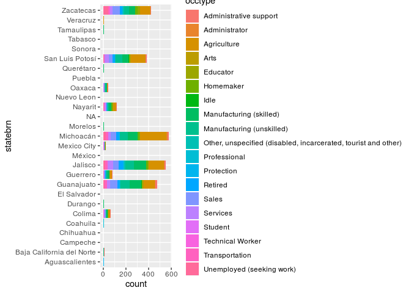
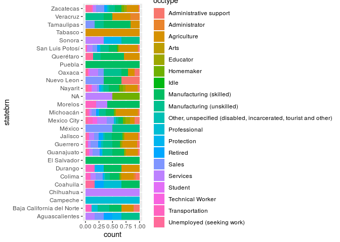
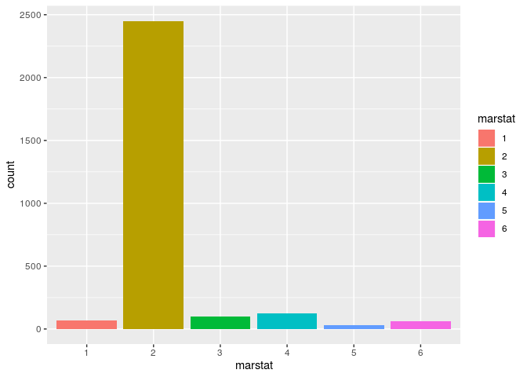
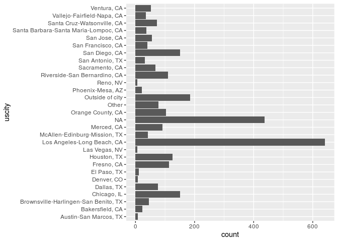
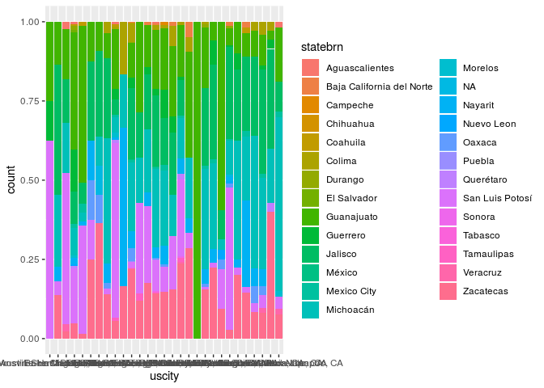

Characteristics of Immigrants to the US by Type of Immigration Status
================
Ben 10
October 27, 2019

``` r
library(readr)
library(knitr)
library(tidyverse)
```

    ## ── Attaching packages ─────────────────────────────────────── tidyverse 1.2.1 ──

    ## ✔ ggplot2 3.2.1     ✔ purrr   0.3.2
    ## ✔ tibble  2.1.3     ✔ dplyr   0.8.3
    ## ✔ tidyr   0.8.3     ✔ stringr 1.4.0
    ## ✔ ggplot2 3.2.1     ✔ forcats 0.4.0

    ## ── Conflicts ────────────────────────────────────────── tidyverse_conflicts() ──
    ## ✖ dplyr::filter() masks stats::filter()
    ## ✖ dplyr::lag()    masks stats::lag()

``` r
library(dplyr)
```

## Section 1. Introduction

In recent years, immigration has been a topic of intense controversy.
Given the complexity of immigration law, we are interested in examining
patterns in immigration since the beginning of the millenia. The U.S.
stance on immigration has grown increasingly strict, not only for
“illegal” immigration, but also for legal immigration: naturalization,
visa use, lawful permanent residency, refugee status, and asylum
seekers. For example, the number of refugees accepted to the US fell to
22,491 in 2018 from 84,994 in 2016 according to the Department of State,
likely as a result of hard line policies against refugees coming to the
US. As immigration policies seem likely to tighten in the lead up to the
2020 elections,\#\#\#logistic regression on whetehr they got citizenship
or not of those who applied… (what prop applied compared to overall. It
would be interesting to see what contributed to who applies
(Tackett)\#\#\#

Given the variety of ways to immigrate legally, and the varying
processes and timelines for each, we would expect that the
characteristics of immigrants using each pathway to differ. By examining
the demographics of each immigration pathway, we can determine the
trends, if any, that exist in the current immigration infrastructure.

Our research project aims to determine the differences in
characteristics between different classes of legal immigration. We
hypothesize that there exist statistically significant differences in
the populations which recieve different types of visa, and we
particularly are interested in region of origin as a way to identify
populations that may be targeted by federal policy.

## Section 2: Exploratory Data Analysis

## Section 2. Analysis plan

``` r
data <- read_csv(paste0("/cloud/project/02-data/data.csv"))
```

    ## Warning: Missing column names filled in: 'X1' [1]

    ## Parsed with column specification:
    ## cols(
    ##   X1 = col_double(),
    ##   sex = col_double(),
    ##   relhead = col_double(),
    ##   yrborn = col_double(),
    ##   age = col_double(),
    ##   statebrn = col_double(),
    ##   marstat = col_double(),
    ##   edyrs = col_double(),
    ##   occ = col_double(),
    ##   hhincome = col_double(),
    ##   usstate1 = col_double(),
    ##   usstatel = col_double(),
    ##   usplace1 = col_double(),
    ##   usplacel = col_double(),
    ##   usdur1 = col_double(),
    ##   usdurl = col_double()
    ## )

``` r
data
```

    ## # A tibble: 2,840 x 16
    ##       X1   sex relhead yrborn   age statebrn marstat edyrs   occ hhincome
    ##    <dbl> <dbl>   <dbl>  <dbl> <dbl>    <dbl>   <dbl> <dbl> <dbl>    <dbl>
    ##  1     1     1       1   1938    49       11       2     3   522   250000
    ##  2     2     1       1   1928    59       11       2     3   522   200000
    ##  3     3     1       1   1950    37       11       1     6   410  1440000
    ##  4     4     1       1   1946    41       11       2     6   522   300000
    ##  5     5     1       1   1956    31       11       2     6   142   300000
    ##  6     6     1       1   1921    66       14       2     0   529   200000
    ##  7     7     1       1   1914    73       11       2     0   830   240000
    ##  8     8     1       1   1932    55       11       2     6   719    90000
    ##  9     9     1       1   1945    42       11       3     6   559   200000
    ## 10    10     1       1   1945    42       11       2     6   819   300000
    ## # … with 2,830 more rows, and 6 more variables: usstate1 <dbl>,
    ## #   usstatel <dbl>, usplace1 <dbl>, usplacel <dbl>, usdur1 <dbl>,
    ## #   usdurl <dbl>

The dataset is from The Mexican Migration Project (MMP). It was created
in 1982 by an interdisciplinary team of researchers to further our
understanding of the complex process of Mexican migration to the United
States. The project is a binational research effort co-directed by Jorge
Durand, professor of Social Anthropology at the University of
Guadalajara (Mexico), and Douglas S. Massey, professor of Sociology and
Public Affairs, with a joint appointment in the Woodrow Wilson School,
at Princeton University (US).

Since its inception, the MMP’s main focus has been to gather social as
well as economic information on Mexican-US migration. The data collected
has been compiled in a comprehensive database that is available to the
public free of charge for research and educational purposes through this
web-site.

The MMP170 Database contains an initial file with general demographic
and migratory information for each member of a surveyed household
(PERS). Pers170 has 132 variables and 176701 observations, hence is very
large. Therefore, we selected 16 variables and filtered out rows that
contain N/A’s to create a new data table “data”. These variables
include:

“X1”: “sex” : Sex   1= male   2= female “relhead”: Relationship to
household head   1= Head   2= Husband/wife   3= Son/daughter   4=
Father/mother   5= Brother/sister   6= Niece/nephew   7= Uncle/aunt   8=
Cousin   9= Grandfather/grandmother   10= Grands on/granddaughter   11=
Stepson/stepdaughter   12= Stepbrother/stepsister   13=
Stepmother/stepfather   14= Son-in-law/daughter-in-law   15=
Brother-in-law/sister-in-law   16= Father-in-law/m other-in-law   17=
Other blood relative   18= Other relative by marriage   19= Non-relative
  20= Adopted/foster child

``` r
data <- data %>%
  mutate(statebrn = case_when(
    statebrn == 1 ~ "Aguascalientes", 
    statebrn == 2 ~ "Baja California del Norte", 
    statebrn == 3 ~ "Baja California del Sur",
    statebrn == 4 ~ "Campeche",
    statebrn == 5 ~ "Coahuila",
    statebrn == 6 ~ "Colima",
    statebrn == 7 ~ "Chiapas",
    statebrn == 8 ~ "Chihuahua",
    statebrn == 9 ~ "Mexico City",
    statebrn == 10 ~ "Durango",
    statebrn == 11 ~ "Guanajuato",
    statebrn == 12 ~ "Guerrero",
    statebrn == 13 ~ "Hidalgo",
    statebrn == 14 ~ "Jalisco",
    statebrn == 15 ~ "México",
    statebrn == 16 ~ "Michoacán",
    statebrn == 17 ~ "Morelos",
    statebrn == 18 ~ "Nayarit",
    statebrn == 19 ~ "Nuevo Leon",
    statebrn == 20 ~ "Oaxaca",
    statebrn == 21 ~ "Puebla",
    statebrn == 22 ~ "Querétaro",
    statebrn == 23 ~ "Quintana Roo",
    statebrn == 24 ~ "San Luis Potosí",
    statebrn == 25 ~ "Sinaloa",
    statebrn == 26 ~ "Sonora",
    statebrn == 27 ~ "Tabasco",
    statebrn == 28 ~ "Tamaulipas",
    statebrn == 29 ~ "Tlaxcala",
    statebrn == 30 ~ "Veracruz",
    statebrn == 31 ~ "Yucatán",
    statebrn == 32 ~ "Zacatecas",
    statebrn == 212 ~ "El Salvador",
    statebrn == 9999 ~ "NA")
  )
```

“yrborn”: Year of birth “age”: Age “statebrn”: State of birth 1
Aguascalientes 2 Baja California del Norte 3 Baja California del Sur 4
Campeche 5 Coahuila 6 Colima 7 Chiapas 8 Chihuahua 9 Mexico City 10
Durango 11 Guanajuato 12 Guerrero 13 Hidalgo 14 Jalisco 15 México 16
Michoacán 17 Morelos 18 Nayarit 19 Nuevo Leon 20 Oaxaca 21 Puebla 22
Querétaro 23 Quintana Roo 24 San Luis Potosí 25 Sinaloa 26 Sonora 27
Tabasco 28 Tamaulipas 29 Tlaxcala 30 Veracruz 31 Yucatán 32 Zacatecas
212 El Salvador

“marstat”: Marital status   1= Never married   2= Married (civil or
religious)   3= Consensual union   4= Widowed   5= Divorced   6=
Separated “edyrs”: School years completed “occ”: Principal occupation

``` r
data <- data %>%
  mutate(occtype = case_when(
    occ == 10 ~ "Unemployed (seeking work)", 
    occ == 20 ~ "Homemaker",
    occ == 30 ~ "Idle",
    occ == 42 ~ "Student",
    occ == 50 ~ "Retired",
    occ == 60 ~ "Other, unspecified (disabled, incarcerated, tourist and other)", 
    occ %in% c(110, 113, 116, 119) ~ "Professional", 
    occ %in% c(120, 123, 124, 129) ~ "Technical Worker",
    occ == 130 ~ "Educator",
    occ %in% c(142, 143, 145, 146, 149) ~ "Arts",
    occ == 144 ~ "Athlete",
    occ %in% c(210, 211) ~ "Administrator",
    occ %in% c(410, 411, 415, 417, 419) ~ "Agriculture", 
    occ %in% c(519, 520, 522, 523, 524, 526, 527, 529, 539) ~ "Manufacturing (skilled)", 
    occ %in% c(541, 547, 549) ~ "Manufacturing (unskilled)", 
    occ %in% c(552, 559) ~ "Transportation",
    occ %in% c(620, 621, 625, 629) ~ "Administrative support", 
    occ %in% c(711, 713, 719, 720, 721) ~ "Sales", 
    occ %in% c(810, 819, 820) ~ "Services", 
    occ %in% c(830, 831) ~ "Protection",
    occ == 9999 ~ "NA"
  ))
data %>%
  group_by(occtype) %>%
  count() %>%
  arrange(desc(n))
```

    ## # A tibble: 20 x 2
    ## # Groups:   occtype [20]
    ##    occtype                                                            n
    ##    <chr>                                                          <int>
    ##  1 Agriculture                                                      781
    ##  2 Manufacturing (skilled)                                          484
    ##  3 Manufacturing (unskilled)                                        384
    ##  4 Sales                                                            289
    ##  5 Services                                                         193
    ##  6 Retired                                                          130
    ##  7 Unemployed (seeking work)                                        117
    ##  8 Transportation                                                    97
    ##  9 Administrative support                                            74
    ## 10 Homemaker                                                         74
    ## 11 Educator                                                          60
    ## 12 Other, unspecified (disabled, incarcerated, tourist and other)    40
    ## 13 Protection                                                        26
    ## 14 Administrator                                                     23
    ## 15 Professional                                                      23
    ## 16 NA                                                                19
    ## 17 Technical Worker                                                  15
    ## 18 Arts                                                               6
    ## 19 Idle                                                               4
    ## 20 Student                                                            1

Unemployed/Not in the labor force (10 - 99) 10 Unemployed (seeking work)
20 Homemaker 30 Idle (adult not seeking work and not helping around the
house) 42 Student 50 Retired, unspecified 60 Other, unspecified
(disabled, incarcerated, tourist and other) Professionals (110-119) 110
Architects; civil, chemical, industrial engineers; etc. 113 Physicians;
dentists; optometrists; nutritionists; professional nurses, etc. 116
Social scientists, lawyers, and psychologists 119 Other professionals
Technical workers (120 - 129) 120 Draftsmen; equipment technicians;
video and sound technicians; etc. 123 Lab technicians (chemical,
biological, pharmacological, and ecological) 124 Technicians in
agriculture, veterinary sciences, forestry, fisheries, etc. 129 Other
technicians Educators (130 - 139) 130 Professors in universities and
other institutions of higher learning Occupations in the arts,
performances and sports (140 - 149) 142 Painters; sculptors;
illustrators (fine artists); designers; choreographers; etc. 143
Directors; producers; broadcasters; etc. 144 Athletes 145 Sports
referees, umpires and coaches 146 Cartoonists; magicians; clowns; etc.
149 Other artists Administrators and directors in both public and
private sector (210 - 219) 210 Government administrators and legislators
211 Presidents, directors, senior managers, large factory owners
Agriculture, husbandry, forestry/fisheries workers (410 - 419) 410
Agricultural workers 411 Husbandry workers 415 Fishery or marine workers
417 Foremen, overseers and other control persons of agricultural,
husbandry or fishery activities 419 Other agriculture, husbandry,
forestry, fishery workers Manufacturing /repair supervisors (510 - 519)
519 Other supervisors including those in unspecified industry
Manufacturing /repair skilled workers (520 - 529). For helpers, aides,
apprentices, and trainees see 540- 549. 520 Food, beverage and tobacco
production workers, including cooks in establishments. 522 Textile and
leather production workers. (Examples: tailors, upholsterers, cobblers,
embroiderers, lithographers, seamstresses; for unskilled finishing work,
see 542; for clothing designers, see 142.) 523 Wood and paper production
or printing workers. (Examples: carpenter, cabinetmaker, linotypist,
film developer, other skilled carpentry work) 524 Metal production and
treatment workers; vehicle, machinery and equipment repair. (Examples:
casters, lathe operators, boilermakers, welders, jewelers, goldsmiths,
locksmiths, metal polishers, tool sharpeners, blacksmiths, metal
forgers, refrigerator repair people, musical instrument repair people)
526 Construction, installation, maintenance and finishing workers.
(Examples: bricklayers, house painters, plasterers, roofers, floor
polishers, plumbers, parts installers) 527 Electrical equipment,
electronics and telecommunications installation and repair workers.
(Examples: electricians, television/radio repair people). 529 Other
craftsmen or manufacturing workers, including those in unspecified
industry Manufacturing/repair heavy equipment operators (530 - 539) 539
Other operators of heavy machinery and equipment, including those in
unspecified industry Manufacturing/repair unskilled workers (540 - 549).
541 Mine, quarry and well unskilled workers 547 Electrical equipment,
electronics and telecommunications installation and repair unskilled
workers 549 Other unskilled workers including those in unspecified
industry (includes unspecified helpers or trainees) Transportation
workers (550 - 559) 552 Truck drivers and land-transport drivers (see
also 712) and passenger vehicle drivers 559 Other conductors, drivers,
pilots Service and administration supervisors (610 - 619). Includes
department chiefs, coordinators, and supervisors. Administrative and
support workers (620 - 629) 620 Secretaries; typists; data entry,
recorders; etc. 621 Cashiers; collectors; ticket sellers; etc. 625
Postal and messenger workers 629 Other related workers, including
generic office workers and public servants when no further specification
was provided Sales workers (710 - 719) 711 Workers in retail
establishments. (Examples: clerks, dispatchers) 713 Sales agents or
representatives; brokers; insurance and real estate agents; auctioneers;
etc. 719 Other retail workers, including sales people (unknown whether
or not person works in an establishment). Ambulatory workers (720 - 729)
(those who work in their own house are included in the previous group)
720 Ambulatory salespeople: toys, lottery tickets, household goods,
paper, other inedible items 721 Ambulatory service workers: food
vendors, shoe shiners, car/windshield washers, street performers
Personal services workers in establishments; (not in private households)
(810 - 819) 810 Innkeepers; bartenders; waiters; flight attendants. 819
Other personal service worker: e.g., parking lot attendants Domestic
services workers (820) 820 Domestic services workers; caregivers,
drivers, gardeners, butler, and other service workers in private
households, e.g. baby sitter. Protection services workers (830 - 839)
830 Security personnel; police officers; watchmen, firefighters. 831
Armed forces personnel 9999 Other unspecified occupation; unknown

“hhincome” :

“usstate1”: First US mig: State of residence “usstatel”: Latest US mig:
State of residence

``` r
data <- data %>%
  mutate(usstate1 = case_when(
    usstate1 == 100 ~ "Alabama",
    usstate1 == 102 ~ "Alaska",
    usstate1 == 103 ~ "Arizona",
    usstate1 == 104 ~ "Arkansas",
    usstate1 == 105 ~ "California",
    usstate1 == 106 ~ "Colorado",
    usstate1 == 107 ~ "Connecticut",
    usstate1 == 108 ~ "Delaware",
    usstate1 == 109 ~ "District of Columbia",
    usstate1 == 110 ~ "Florida",
    usstate1 == 111 ~ "Georgia",
    usstate1 == 112 ~ "Hawaii",
    usstate1 == 113 ~ "Idaho",
    usstate1 == 114 ~ "Illinois",
    usstate1 == 115 ~ "Indiana",
    usstate1 == 116 ~ "Iowa",
    usstate1 == 117 ~ "Kansas",
    usstate1 == 118 ~ "Kentucky",
    usstate1 == 119 ~ "Louisiana",
    usstate1 == 120 ~ "Maine",
    usstate1 == 121 ~ "Maryland",
    usstate1 == 122 ~ "Massachusetts",
    usstate1 == 123 ~ "Michigan",
    usstate1 == 124 ~ "Minnesota",
    usstate1 == 125 ~ "Mississippi",
    usstate1 == 126 ~ "Missouri",
    usstate1 == 127 ~ "Montana",
    usstate1 == 128 ~ "Nebraska",
    usstate1 == 129 ~ "Nevada",
    usstate1 == 130 ~ "New Hampshire",
    usstate1 == 131 ~ "New Jersey", 
    usstate1 == 132 ~ "New Mexico", 
    usstate1 == 133 ~ "New York",
    usstate1 == 134 ~ "North Carolina",
    usstate1 == 135 ~ "North Dakota",
    usstate1 == 136 ~ "Ohio",
    usstate1 == 137 ~ "Oklahoma", 
    usstate1 == 138 ~ "Oregon",
    usstate1 == 139 ~ "Pennsylvania",
    usstate1 == 140 ~ "Rhode Island",
    usstate1 == 141 ~ "South Carolina",
    usstate1 == 142 ~ "South Dakota",
    usstate1 == 143 ~ "Tennessee",
    usstate1 == 144 ~ "Texas",
    usstate1 == 145 ~ "Utah",
    usstate1 == 146 ~ "Vermont",
    usstate1 == 147 ~ "Virginia",
    usstate1 == 148 ~ "Washington",
    usstate1 == 149 ~ "West Virginia",
    usstate1 == 150 ~ "Wisconsin",
    usstate1 == 151 ~ "Wyoming",
    usstate1 == 152 ~ "Various States",
    usstate1 == 153 ~ "Puerto Rico",
    usstate1 == 199 ~ "Unknown"
  ))
data %>%
  group_by(usstate1) %>%
  count() %>%
  arrange(desc(n))
```

    ## # A tibble: 38 x 2
    ## # Groups:   usstate1 [38]
    ##    usstate1       n
    ##    <chr>      <int>
    ##  1 California  1757
    ##  2 Texas        560
    ##  3 Illinois     153
    ##  4 Arizona       73
    ##  5 Florida       34
    ##  6 Nevada        24
    ##  7 Oregon        23
    ##  8 Arkansas      22
    ##  9 Unknown       22
    ## 10 Idaho         21
    ## # … with 28 more rows

``` r
data <- data %>%
  mutate(usstatel = case_when(
    usstatel == 100 ~ "Alabama",
    usstatel == 102 ~ "Alaska",
    usstatel == 103 ~ "Arizona",
    usstatel == 104 ~ "Arkansas",
    usstatel == 105 ~ "California",
    usstatel == 106 ~ "Colorado",
    usstatel == 107 ~ "Connecticut",
    usstatel == 108 ~ "Delaware",
    usstatel == 109 ~ "District of Columbia",
    usstatel == 110 ~ "Florida",
    usstatel == 111 ~ "Georgia",
    usstatel == 112 ~ "Hawaii",
    usstatel == 113 ~ "Idaho",
    usstatel == 114 ~ "Illinois",
    usstatel == 115 ~ "Indiana",
    usstatel == 116 ~ "Iowa",
    usstatel == 117 ~ "Kansas",
    usstatel == 118 ~ "Kentucky",
    usstatel == 119 ~ "Louisiana",
    usstatel == 120 ~ "Maine",
    usstatel == 121 ~ "Maryland",
    usstatel == 122 ~ "Massachusetts",
    usstatel == 123 ~ "Michigan",
    usstatel == 124 ~ "Minnesota",
    usstatel == 125 ~ "Mississippi",
    usstatel == 126 ~ "Missouri",
    usstatel == 127 ~ "Montana",
    usstatel == 128 ~ "Nebraska",
    usstatel == 129 ~ "Nevada",
    usstatel == 130 ~ "New Hampshire",
    usstatel == 131 ~ "New Jersey", 
    usstatel == 132 ~ "New Mexico", 
    usstatel == 133 ~ "New York",
    usstatel == 134 ~ "North Carolina",
    usstatel == 135 ~ "North Dakota",
    usstatel == 136 ~ "Ohio",
    usstatel == 137 ~ "Oklahoma", 
    usstatel == 138 ~ "Oregon",
    usstatel == 139 ~ "Pennsylvania",
    usstatel == 140 ~ "Rhode Island",
    usstatel == 141 ~ "South Carolina",
    usstatel == 142 ~ "South Dakota",
    usstatel == 143 ~ "Tennessee",
    usstatel == 144 ~ "Texas",
    usstatel == 145 ~ "Utah",
    usstatel == 146 ~ "Vermont",
    usstatel == 147 ~ "Virginia",
    usstatel == 148 ~ "Washington",
    usstatel == 149 ~ "West Virginia",
    usstatel == 150 ~ "Wisconsin",
    usstatel == 151 ~ "Wyoming",
    usstatel == 152 ~ "Various States",
    usstatel == 153 ~ "Puerto Rico",
    usstatel == 199 ~ "Unknown"
  ))
data %>%
  group_by(usstatel) %>%
  count() %>%
  arrange(desc(n))
```

    ## # A tibble: 39 x 2
    ## # Groups:   usstatel [39]
    ##    usstatel       n
    ##    <chr>      <int>
    ##  1 California  1795
    ##  2 Texas        480
    ##  3 Illinois     174
    ##  4 Arizona       62
    ##  5 Florida       57
    ##  6 Nevada        38
    ##  7 Unknown       27
    ##  8 Idaho         25
    ##  9 Colorado      24
    ## 10 Washington    22
    ## # … with 29 more rows

100 Alabama 102 Alaska 103 Arizona 104 Arkansas 105 California 106
Colorado 107 Connecticut 108 Delaware 109 District of Columbia 110
Florida 111 Georgia 112 Hawaii 113 Idaho 114 Illinois 115 Indiana 116
Iowa 117 Kansas 118 Kentucky 119 Louisiana 120 Maine 121 Maryland 122
Massachusetts 123 Michigan 124 Minnesota 125 Mississippi 126 Missouri
127 Montana 128 Nebraska 129 Nevada 130 New Hampshire 131 New Jersey 132
New Mexico 133 New York 134 North Carolina 135 North Dakota 136 Ohio 137
Oklahoma 138 Oregon 139 Pennsylvania 140 Rhode Island 141 South Carolina
142 South Dakota 143 Tennessee 144 Texas 145 Utah 146 Vermont 147
Virginia 148 Washington 149 West Virginia 150 Wisconsin 151 Wyoming 152
Various States 153 Puerto Rico 199 US, State Unknown

“usplace1”: First US mig: City of residence

``` r
data %>%
  group_by(usplace1) %>%
  count() %>%
  filter(n > 5) %>%
  arrange(desc(usplace1))
```

    ## # A tibble: 28 x 2
    ## # Groups:   usplace1 [28]
    ##    usplace1     n
    ##       <dbl> <int>
    ##  1     9999   443
    ##  2     8735    54
    ##  3     8720    35
    ##  4     7777   185
    ##  5     7485    73
    ##  6     7480    37
    ##  7     7400    55
    ##  8     7360    40
    ##  9     7320   152
    ## 10     7240    32
    ## # … with 18 more rows

``` r
data <- data %>%
  mutate(uscity = case_when(
    usplace1 == 9999 ~ "NA",
    usplace1 == 640 ~ "Austin-San Marcos, TX",
    usplace1 == 680 ~ "Bakersfield, CA",
    usplace1 == 1240 ~ "Brownsville-Harlingen-San Benito, TX",
    usplace1 == 1600 ~ "Chicago, IL",
    usplace1 == 1920 ~ "Dallas, TX",
    usplace1 == 2080 ~ "Denver, CO",
    usplace1 == 2320 ~ "El Paso, TX",
    usplace1 == 2840 ~ "Fresno, CA",
    usplace1 == 3360 ~ "Houston, TX",
    usplace1 == 4120 ~ "Las Vegas, NV",
    usplace1 == 4480 ~ "Los Angeles-Long Beach, CA",
    usplace1 == 4880 ~ "McAllen-Edinburg-Mission, TX",
    usplace1 == 4940 ~ "Merced, CA",
    usplace1 == 5945 ~ "Orange County, CA",
    usplace1 == 6200 ~ "Phoenix-Mesa, AZ",
    usplace1 == 6720 ~ "Reno, NV",
    usplace1 == 6780 ~ "Riverside-San Bernardino, CA",
    usplace1 == 6920 ~ "Sacramento, CA",
    usplace1 == 7240 ~ "San Antonio, TX",
    usplace1 == 7320 ~ "San Diego, CA",
    usplace1 == 7360 ~ "San Francisco, CA",
    usplace1 == 7400 ~ "San Jose, CA",
    usplace1 == 7480 ~ "Santa Barbara-Santa Maria-Lompoc, CA",
    usplace1 == 7485 ~ "Santa Cruz-Watsonville, CA",
    usplace1 == 7777 ~ "Outside of city",
    usplace1 == 8720 ~ "Vallejo-Fairfield-Napa, CA",
    usplace1 == 8735 ~ "Ventura, CA",
    TRUE ~ "Other"
  ))

data %>%
  group_by(uscity) %>%
  count() %>%
  arrange(desc(n))
```

    ## # A tibble: 29 x 2
    ## # Groups:   uscity [29]
    ##    uscity                           n
    ##    <chr>                        <int>
    ##  1 Los Angeles-Long Beach, CA     642
    ##  2 NA                             443
    ##  3 Outside of city                185
    ##  4 San Diego, CA                  152
    ##  5 Chicago, IL                    151
    ##  6 Houston, TX                    126
    ##  7 Fresno, CA                     114
    ##  8 Riverside-San Bernardino, CA   111
    ##  9 Orange County, CA              104
    ## 10 Merced, CA                      91
    ## # … with 19 more rows

640 Austin-San Marcos, TX MSA 680 Bakersfield, CA MSA 1240
Brownsville-Harlingen-San Benito, TX MSA 1600 Chicago, IL PMSA 1920
Dallas, TX PMSA 2080 Denver, CO PMSA 2320 El Paso, TX MSA 2840 Fresno,
CA MSA 3360 Houston, TX PMSA 4120 Las Vegas, NV-AZ MSA 4480 Los
Angeles-Long Beach, CA PMSA 4880 McAllen-Edinburg-Mission, TX MSA 4940
Merced, CA MSA 5945 Orange County, CA PMSA 6200 Phoenix-Mesa, AZ MSA
6720 Reno, NV MSA 6780 Riverside-San Bernardino, CA PMSA 6920
Sacramento, CA PMSA 7240 San Antonio, TX MSA 7320 San Diego, CA MSA 7360
San Francisco, CA PMSA 7400 San Jose, CA PMSA 7480 Santa Barbara-Santa
Maria-Lompoc, CA MSA 7485 Santa Cruz-Watsonville, CA PMSA 7777 Outside
of city 8720 Vallejo-Fairfield-Napa, CA PMSA 8735 Ventura, CA PMSA

“usplacel”: Latest US mig: City of residence “usdur1”: First US mig:
Duration (in months) “usdurl”: Latest US mig: Duration (in months)

``` r
data <- data %>%
  mutate(relhead = factor(relhead))
data %>%
  select(relhead) %>%
  distinct() #after filtering, only responses of 1 (head of household) remain
```

    ## # A tibble: 1 x 1
    ##   relhead
    ##   <fct>  
    ## 1 1

``` r
data <- data %>%
  mutate(marstat = factor(marstat))
data <- data %>%
  mutate(sex = case_when(
    sex == 1 ~ "M",
    sex == 2 ~ "F",
    sex == 9999 ~ "NA"
  ))
```

``` r
glimpse(data)
```

    ## Observations: 2,840
    ## Variables: 18
    ## $ X1       <dbl> 1, 2, 3, 4, 5, 6, 7, 8, 9, 10, 11, 12, 13, 14, 15, 16, …
    ## $ sex      <chr> "M", "M", "M", "M", "M", "M", "M", "M", "M", "M", "M", …
    ## $ relhead  <fct> 1, 1, 1, 1, 1, 1, 1, 1, 1, 1, 1, 1, 1, 1, 1, 1, 1, 1, 1…
    ## $ yrborn   <dbl> 1938, 1928, 1950, 1946, 1956, 1921, 1914, 1932, 1945, 1…
    ## $ age      <dbl> 49, 59, 37, 41, 31, 66, 73, 55, 42, 42, 51, 36, 41, 69,…
    ## $ statebrn <chr> "Guanajuato", "Guanajuato", "Guanajuato", "Guanajuato",…
    ## $ marstat  <fct> 2, 2, 1, 2, 2, 2, 2, 2, 3, 2, 4, 2, 2, 2, 1, 2, 2, 2, 2…
    ## $ edyrs    <dbl> 3, 3, 6, 6, 6, 0, 0, 6, 6, 6, 3, 2, 6, 2, 0, 2, 3, 6, 3…
    ## $ occ      <dbl> 522, 522, 410, 522, 142, 529, 830, 719, 559, 819, 522, …
    ## $ hhincome <dbl> 250000, 200000, 1440000, 300000, 300000, 200000, 240000…
    ## $ usstate1 <chr> "Illinois", "California", "California", "Colorado", "Ca…
    ## $ usstatel <chr> "Illinois", "California", "Illinois", "Unknown", "Calif…
    ## $ usplace1 <dbl> 1600, 7360, 7320, 2080, 4480, 7360, 9999, 6920, 7320, 9…
    ## $ usplacel <dbl> 1600, 4480, 1600, 9999, 4480, 7360, 9999, 2080, 7320, 9…
    ## $ usdur1   <dbl> 12, 12, 36, 6, 12, 24, 6, 6, 6, 12, 8, 12, 12, 4, 24, 3…
    ## $ usdurl   <dbl> 6, 12, 48, 6, 12, 24, 6, 6, 6, 12, 4, 8, 6, 14, 24, 24,…
    ## $ occtype  <chr> "Manufacturing (skilled)", "Manufacturing (skilled)", "…
    ## $ uscity   <chr> "Chicago, IL", "San Francisco, CA", "San Diego, CA", "D…

``` r
data <- data %>%
  filter(sex != "NA", relhead != 9999, yrborn != 9999, age != 9999, edyrs != 9999, hhincome != 9999)
data <- data %>%
  mutate(hhincome = case_when(
    hhincome == 0 ~ .1,
    TRUE ~ hhincome
  )) #so log transforming won't get rid of the zeros? Or should we get rid of the zeros and tke this out?
glimpse(data)
```

    ## Observations: 2,833
    ## Variables: 18
    ## $ X1       <dbl> 1, 2, 3, 4, 5, 6, 7, 8, 9, 10, 11, 12, 13, 14, 15, 16, …
    ## $ sex      <chr> "M", "M", "M", "M", "M", "M", "M", "M", "M", "M", "M", …
    ## $ relhead  <fct> 1, 1, 1, 1, 1, 1, 1, 1, 1, 1, 1, 1, 1, 1, 1, 1, 1, 1, 1…
    ## $ yrborn   <dbl> 1938, 1928, 1950, 1946, 1956, 1921, 1914, 1932, 1945, 1…
    ## $ age      <dbl> 49, 59, 37, 41, 31, 66, 73, 55, 42, 42, 51, 36, 41, 69,…
    ## $ statebrn <chr> "Guanajuato", "Guanajuato", "Guanajuato", "Guanajuato",…
    ## $ marstat  <fct> 2, 2, 1, 2, 2, 2, 2, 2, 3, 2, 4, 2, 2, 2, 1, 2, 2, 2, 2…
    ## $ edyrs    <dbl> 3, 3, 6, 6, 6, 0, 0, 6, 6, 6, 3, 2, 6, 2, 0, 2, 3, 6, 3…
    ## $ occ      <dbl> 522, 522, 410, 522, 142, 529, 830, 719, 559, 819, 522, …
    ## $ hhincome <dbl> 2.50e+05, 2.00e+05, 1.44e+06, 3.00e+05, 3.00e+05, 2.00e…
    ## $ usstate1 <chr> "Illinois", "California", "California", "Colorado", "Ca…
    ## $ usstatel <chr> "Illinois", "California", "Illinois", "Unknown", "Calif…
    ## $ usplace1 <dbl> 1600, 7360, 7320, 2080, 4480, 7360, 9999, 6920, 7320, 9…
    ## $ usplacel <dbl> 1600, 4480, 1600, 9999, 4480, 7360, 9999, 2080, 7320, 9…
    ## $ usdur1   <dbl> 12, 12, 36, 6, 12, 24, 6, 6, 6, 12, 8, 12, 12, 4, 24, 3…
    ## $ usdurl   <dbl> 6, 12, 48, 6, 12, 24, 6, 6, 6, 12, 4, 8, 6, 14, 24, 24,…
    ## $ occtype  <chr> "Manufacturing (skilled)", "Manufacturing (skilled)", "…
    ## $ uscity   <chr> "Chicago, IL", "San Francisco, CA", "San Diego, CA", "D…

``` r
ggplot(data = data, aes(x = age)) +
  geom_histogram()
```

    ## `stat_bin()` using `bins = 30`. Pick better value with `binwidth`.

<!-- -->

``` r
ggplot(data = data, aes(x = edyrs)) +
  geom_histogram()
```

    ## `stat_bin()` using `bins = 30`. Pick better value with `binwidth`.

<!-- -->

``` r
ggplot(data = data, aes(x = log(hhincome))) +
  geom_histogram()
```

    ## `stat_bin()` using `bins = 30`. Pick better value with `binwidth`.

<!-- -->

``` r
ggplot(data = data, aes(x = sex, fill = sex)) + 
  geom_bar()
```

<!-- -->

``` r
ggplot(data = data, aes(x = marstat, fill = marstat)) + 
  geom_bar()
```

<!-- -->

``` r
ggplot(data = data, aes(x = usstate1, fill = usstate1)) + 
  geom_bar() +
  coord_flip()
```

<!-- -->

``` r
ggplot(data = data, aes(x = usstatel, fill = usstatel)) + 
  geom_bar() +
  coord_flip()
```

<!-- -->

``` r
ggplot(data = data, aes(x = occtype, fill = occtype)) + 
  geom_bar()
```

<!-- -->

``` r
ggplot(data = data, aes(x = uscity)) + 
  geom_bar() +
  coord_flip()
```

<!-- -->

``` r
ggplot(data = data, aes(x = log(usdur1))) +
  geom_histogram()
```

    ## `stat_bin()` using `bins = 30`. Pick better value with `binwidth`.

<!-- -->

``` r
pairs(log(hhincome) ~ age + edyrs + usdur1, data = data, 
      lower.panel = NULL)
```

<!-- -->

``` r
ggplot(data = data, aes(x = occtype, y = log(hhincome))) +
  geom_boxplot() +
  coord_flip()
```

<!-- -->

``` r
ggplot(data = data, aes(x = edyrs, y = log(hhincome))) +
  geom_point()
```

<!-- -->

## Section 3. Regression Analysis Plan

In an effort to determine which characteristics of candidates influence
their approval of a visa, we will be using a logistic regression model.
Since our response variable is categorical (i.e., approved or denied),
this is the best model at our disposal for us to use.

We will consider the potential interaction between occupation and
household income, since those are generally interconnected.

We will select our model using AIC criteria, because since we’re dealing
with people, we want to build a model that accounts for volatile human
nature and the ever-changing sociopolitical climate that could influence
whether or not someone’s visa request is approved. AIC is used when we
would rather say a variable is a relevant predictor, when in reality it
might not be and so in this case, we would rather err on the side of a
false positive because we are dealing with a constantly fluctuating
issue.

## Section 4. References

Use the glimpse function print a summary of the data frame at the end of
your proposal. Place your data in the /data folder, and add dimensions
(number of observations and variables) and the data dictionary (a
description of every variable in the dataset) to the README in the
folder. Make sure the data dictionary is neatly formatted and easy to
read.

Sources:

Statistic used in Introduction: RPC. (January 31, 2019). Number of
refugee admissions in the U.S. from the fiscal year of 1990 to the
fiscal year of 2018 \[Graph\]. In Statista. Retrieved October 29, 2019,
from
<https://www-statista-com.proxy.lib.duke.edu/statistics/200061/number-of-refugees-arriving-in-the-us/>

## The Data
