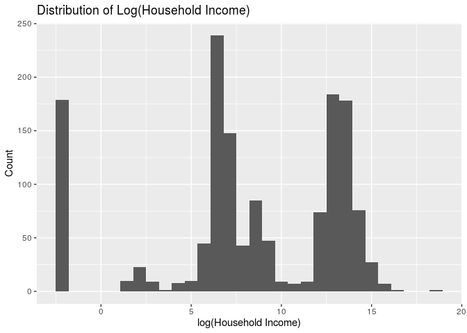
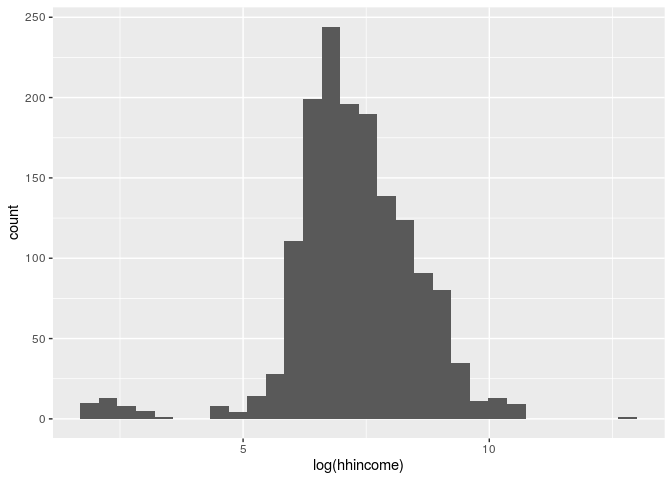

Characteristics of Recent Mexican Immigrants to the US
================
Ben 10
November 14, 2019

<<<<<<< HEAD
    ## ── Attaching packages ────────────────────────────────────────────────────────── tidyverse 1.2.1 ──
=======
    ## ── Attaching packages ────────────────────────────── tidyverse 1.2.1 ──
>>>>>>> 4c2400d11181673b8fcb6e063a4f2794fc1a6493

    ## ✔ ggplot2 3.2.1     ✔ purrr   0.3.2
    ## ✔ tibble  2.1.3     ✔ dplyr   0.8.3
    ## ✔ tidyr   0.8.3     ✔ stringr 1.4.0
    ## ✔ readr   1.3.1     ✔ forcats 0.4.0

<<<<<<< HEAD
    ## ── Conflicts ───────────────────────────────────────────────────────────── tidyverse_conflicts() ──
=======
    ## ── Conflicts ───────────────────────────────── tidyverse_conflicts() ──
>>>>>>> 4c2400d11181673b8fcb6e063a4f2794fc1a6493
    ## ✖ dplyr::filter() masks stats::filter()
    ## ✖ dplyr::lag()    masks stats::lag()

    ## Parsed with column specification:
    ## cols(
    ##   X1 = col_double(),
    ##   sex = col_character(),
    ##   relhead = col_double(),
    ##   yrborn = col_double(),
    ##   age = col_double(),
    ##   statebrn = col_character(),
    ##   marstat = col_character(),
    ##   edyrs = col_double(),
    ##   occ = col_double(),
    ##   hhincome = col_double(),
    ##   usstate1 = col_character(),
    ##   usstatel = col_character(),
    ##   usplace1 = col_double(),
    ##   usplacel = col_double(),
    ##   usdur1 = col_double(),
    ##   usdurl = col_double(),
    ##   usdoc1 = col_character(),
    ##   occtype = col_character(),
    ##   uscity = col_character()
    ## )

    ## # A tibble: 2,805 x 19
    ##       X1 sex   relhead yrborn   age statebrn marstat edyrs   occ hhincome
    ##    <dbl> <chr>   <dbl>  <dbl> <dbl> <chr>    <chr>   <dbl> <dbl>    <dbl>
    ##  1     1 M           1   1938    49 Guanaju… Married     3   522   250000
    ##  2     2 M           1   1928    59 Guanaju… Married     3   522   200000
    ##  3     3 M           1   1950    37 Guanaju… Never …     6   410  1440000
    ##  4     4 M           1   1946    41 Guanaju… Married     6   522   300000
    ##  5     5 M           1   1956    31 Guanaju… Married     6   142   300000
    ##  6     6 M           1   1921    66 Jalisco  Married     0   529   200000
    ##  7     7 M           1   1914    73 Guanaju… Married     0   830   240000
    ##  8     8 M           1   1932    55 Guanaju… Married     6   719    90000
    ##  9     9 M           1   1945    42 Guanaju… Consen…     6   559   200000
    ## 10    10 M           1   1945    42 Guanaju… Married     6   819   300000
    ## # … with 2,795 more rows, and 9 more variables: usstate1 <chr>,
    ## #   usstatel <chr>, usplace1 <dbl>, usplacel <dbl>, usdur1 <dbl>,
    ## #   usdurl <dbl>, usdoc1 <chr>, occtype <chr>, uscity <chr>

#### Qintian

#### Thea

#### Rachel

<!-- --> These
immigrants to California arrived to the following cities: Los
Angeles-Long Beach, San Francisco, San Diego, Santa Cruz-Watsonville,
Bakersfield, Fresno, Merced, Orange County, Riverside-San Bernardino,
Sacramento, San Jose, Santa Barbara-Santa Maria-Lompoc,
Vallejo-Fairfield-Napa, and Ventura. Given the comparatively small
number of cases in which no city was reported, we deleted these
instances. This leaves 15 unique locations in California.

#### Lilly

    ## `stat_bin()` using `bins = 30`. Pick better value with `binwidth`.

<!-- -->

    ## `stat_bin()` using `bins = 30`. Pick better value with `binwidth`.

<!-- -->

Your regression analysis results go here. At a minimum, the regression
analysis should include the following:

  - Statement of the research question and modeling obejctive
    (prediction, inference, etc.)
  - Description of the response variable
  - Updated exploratory data analysis, incorporating any feedback from
    the proposal
  - Explanation of the modeling process and why you chose those metohds,
    incorporating any feedback from the proposal
  - Output of the final model
  - Discussion of the assumptions for the final model
  - Interpretations / interesting findings from the model coefficients
  - Additional work of other models or analylsis not included in the
    final model.

*Use proper headings as needed.*
