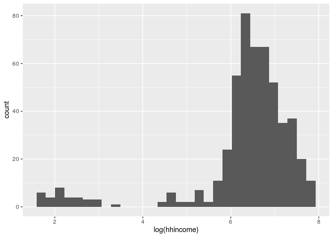

Characteristics of Recent Mexican Immigrants to the US
================
Ben 10
November 14, 2019

    ## ── Attaching packages ────────────────────────────── tidyverse 1.2.1 ──

    ## ✔ ggplot2 3.2.1     ✔ purrr   0.3.2
    ## ✔ tibble  2.1.3     ✔ dplyr   0.8.3
    ## ✔ tidyr   0.8.3     ✔ stringr 1.4.0
    ## ✔ readr   1.3.1     ✔ forcats 0.4.0

    ## ── Conflicts ───────────────────────────────── tidyverse_conflicts() ──
    ## ✖ dplyr::filter() masks stats::filter()
    ## ✖ dplyr::lag()    masks stats::lag()

    ## Parsed with column specification:
    ## cols(
    ##   X1 = col_double(),
    ##   sex = col_character(),
    ##   relhead = col_double(),
    ##   yrborn = col_double(),
    ##   age = col_double(),
    ##   statebrn = col_character(),
    ##   marstat = col_character(),
    ##   edyrs = col_double(),
    ##   occ = col_double(),
    ##   hhincome = col_double(),
    ##   usstate1 = col_character(),
    ##   usstatel = col_character(),
    ##   usplace1 = col_double(),
    ##   usplacel = col_double(),
    ##   usdur1 = col_double(),
    ##   usdurl = col_double(),
    ##   usdoc1 = col_character(),
    ##   occtype = col_character(),
    ##   uscity = col_character()
    ## )

    ## # A tibble: 2,805 x 19
    ##       X1 sex   relhead yrborn   age statebrn marstat edyrs   occ hhincome
    ##    <dbl> <chr>   <dbl>  <dbl> <dbl> <chr>    <chr>   <dbl> <dbl>    <dbl>
    ##  1     1 M           1   1938    49 Guanaju… Married     3   522   250000
    ##  2     2 M           1   1928    59 Guanaju… Married     3   522   200000
    ##  3     3 M           1   1950    37 Guanaju… Never …     6   410  1440000
    ##  4     4 M           1   1946    41 Guanaju… Married     6   522   300000
    ##  5     5 M           1   1956    31 Guanaju… Married     6   142   300000
    ##  6     6 M           1   1921    66 Jalisco  Married     0   529   200000
    ##  7     7 M           1   1914    73 Guanaju… Married     0   830   240000
    ##  8     8 M           1   1932    55 Guanaju… Married     6   719    90000
    ##  9     9 M           1   1945    42 Guanaju… Consen…     6   559   200000
    ## 10    10 M           1   1945    42 Guanaju… Married     6   819   300000
    ## # … with 2,795 more rows, and 9 more variables: usstate1 <chr>,
    ## #   usstatel <chr>, usplace1 <dbl>, usplacel <dbl>, usdur1 <dbl>,
    ## #   usdurl <dbl>, usdoc1 <chr>, occtype <chr>, uscity <chr>

## 1\. Introduction

We are aiming to discover what characteristics of Mexican immmigrants to
the United States, specifically California, influence their projected
household income. We will be building a multiple linear regression model
to predict household income considering the following variables: `sex`,
`relhead`, `age`, `statebrn`, `marstat`, `edyrs`, `occ`, `usdur1`,
`usdurl`, `usdoc1`, `uscity`.

Our response variable is household income: the total income for a single
household, reported in $USD.

## 2\. Exploratory Data Analysis

    ## # A tibble: 1,778 x 19
    ##       X1 sex   relhead yrborn   age statebrn marstat edyrs   occ hhincome
    ##    <dbl> <chr>   <dbl>  <dbl> <dbl> <chr>    <chr>   <dbl> <dbl>    <dbl>
    ##  1     2 M           1   1928    59 Guanaju… Married     3   522   10288.
    ##  2     5 M           1   1956    31 Guanaju… Married     6   142   15432.
    ##  3     6 M           1   1921    66 Jalisco  Married     0   529   10288.
    ##  4     9 M           1   1945    42 Guanaju… Consen…     6   559   10288.
    ##  5    10 M           1   1945    42 Guanaju… Married     6   819   15432.
    ##  6    11 M           1   1936    51 Guanaju… Widowed     3   522   12346.
    ##  7    12 M           1   1951    36 Guanaju… Married     2   529    9259.
    ##  8    13 M           1   1946    41 Guanaju… Married     6   419   12346.
    ##  9    18 M           1   1952    35 Guanaju… Married     6   559   20576.
    ## 10    19 M           1   1947    40 Guanaju… Married     3   410    9259.
    ## # … with 1,768 more rows, and 9 more variables: usstate1 <chr>,
    ## #   usstatel <chr>, usplace1 <dbl>, usplacel <dbl>, usdur1 <dbl>,
    ## #   usdurl <dbl>, usdoc1 <chr>, occtype <chr>, uscity <chr>

<!-- --> These
immigrants to California arrived to the following cities: Los
Angeles-Long Beach, San Francisco, San Diego, Santa Cruz-Watsonville,
Bakersfield, Fresno, Merced, Orange County, Riverside-San Bernardino,
Sacramento, San Jose, Santa Barbara-Santa Maria-Lompoc,
Vallejo-Fairfield-Napa, and Ventura. Given the comparatively small
number of cases in which no city was reported, we deleted these
instances. This leaves 15 unique locations in California. The majority
of immigrants went to LA-Long Beach area.

It turned out that all values from relhead in our cleaned data were “1”
or head. So we will remove this variable, as well as state variables
since we are only using California data. We will also remove place data
since we are using uscity

## 2\. Multiple Linear Regression Model

In an effort to determine which characteristics of candidates influence
their household income, we will be using a multiple linear regression
model. Since our response variable is numerical with mulitple potential
predictors, this is the best model at our disposal for us to use.

We will consider the potential interaction between principal occupation
and number of years of school completed, since those are generally
interconnected. We may also consider the interaction between
documentation type and occupation type, although the effect may be
insignificant.

We will select our model using AIC criteria, because since we’re dealing
with people, we want to build a model that accounts for volatile human
nature and the ever-changing socioeconomic and political climate that
could influence someone’s household income. AIC is used when we would
rather say a variable is a relevant predictor, when in reality it might
not be and so in this case, we would rather err on the side of a false
positive because we are dealing with a constantly fluctuating
    issue.

### 2.1 Full Model

### 2.2 Backward selection

### 2.3 Interactions

### 2.4 F-test

## 2\. Check Assumtpions

## 3\. Interpretations

## 4\. Additional Work

#### Qintian

#### Thea

#### Rachel

#### Lilly

    ## `stat_bin()` using `bins = 30`. Pick better value with `binwidth`.

<!-- -->

    ## `stat_bin()` using `bins = 30`. Pick better value with `binwidth`.

<!-- -->

    ## `stat_bin()` using `bins = 30`. Pick better value with `binwidth`.

<!-- -->

Your regression analysis results go here. At a minimum, the regression
analysis should include the following:

  - Statement of the research question and modeling obejctive
    (prediction, inference, etc.)

  - Description of the response variable

  - Updated exploratory data analysis, incorporating any feedback from
    the proposal

  - Explanation of the modeling process and why you chose those metohds,
    incorporating any feedback from the proposal

  - Output of the final model

  - Discussion of the assumptions for the final model

  - Interpretations / interesting findings from the model coefficients

  - Additional work of other models or analylsis not included in the
    final model.

*Use proper headings as needed.*
