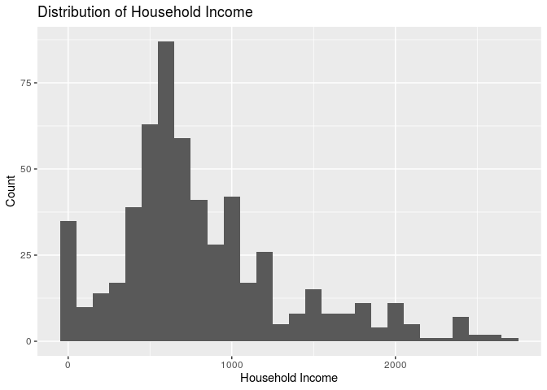
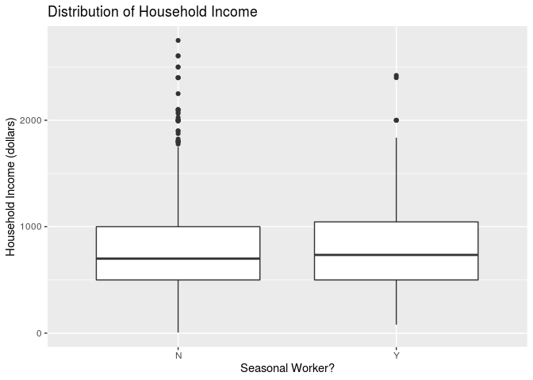
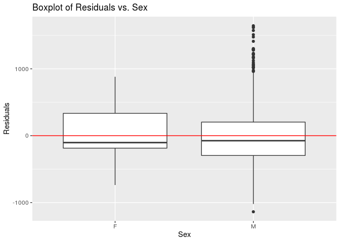

Characteristics of Recent Mexican Immigrants to the United States that
Influence Household Income
================
Ben 10
November 20, 2019

    ## ── Attaching packages ─────────────────────────────────────────────────────────── tidyverse 1.2.1 ──

    ## ✔ ggplot2 3.2.1     ✔ purrr   0.3.2
    ## ✔ tibble  2.1.3     ✔ dplyr   0.8.3
    ## ✔ tidyr   0.8.3     ✔ stringr 1.4.0
    ## ✔ readr   1.3.1     ✔ forcats 0.4.0

    ## ── Conflicts ────────────────────────────────────────────────────────────── tidyverse_conflicts() ──
    ## ✖ dplyr::filter() masks stats::filter()
    ## ✖ dplyr::lag()    masks stats::lag()

    ## Loading required package: Hmisc

    ## Loading required package: lattice

    ## Loading required package: survival

    ## Loading required package: Formula

    ## 
    ## Attaching package: 'Hmisc'

    ## The following objects are masked from 'package:dplyr':
    ## 
    ##     src, summarize

    ## The following objects are masked from 'package:base':
    ## 
    ##     format.pval, units

    ## Loading required package: SparseM

    ## 
    ## Attaching package: 'SparseM'

    ## The following object is masked from 'package:base':
    ## 
    ##     backsolve

    ## Parsed with column specification:
    ## cols(
    ##   X1 = col_double(),
    ##   sex = col_character(),
    ##   relhead = col_double(),
    ##   yrborn = col_double(),
    ##   age = col_double(),
    ##   statebrn = col_character(),
    ##   marstat = col_character(),
    ##   edyrs = col_double(),
    ##   occ = col_double(),
    ##   hhincome = col_double(),
    ##   usstate1 = col_character(),
    ##   usstatel = col_character(),
    ##   usplace1 = col_double(),
    ##   usplacel = col_double(),
    ##   usdur1 = col_double(),
    ##   usdurl = col_double(),
    ##   usdoc1 = col_character(),
    ##   occtype = col_character(),
    ##   uscity = col_character()
    ## )

## 1\. Introduction

### 1.1 Objective

We are aiming to build a model to determine which characteristics of
Mexican immmigrants to the United States, specifically California,
well-explain variation in household income.

### 1.2 Description of Dataset

The dataset is from The Mexican Migration Project (MMP, \*see References
below for confidentiality terms). It was created in 1982 by an
interdisciplinary team of researchers to further our understanding of
the complex process of Mexican migration to the United States. The
project is a binational research effort co-directed by Jorge Durand,
professor of Social Anthropology at the University of Guadalajara
(Mexico), and Douglas S. Massey, professor of Sociology and Public
Affairs, with a joint appointment in the Woodrow Wilson School, at
Princeton University (US).

Since its inception, the MMP’s main focus has been to gather social as
well as economic information on Mexican-US migration. The data collected
has been compiled in a comprehensive database that is available to the
public free of charge for research and educational purposes through its
web-site. The MMP uses the ethnosurvey approach to gather data: in
winter months, they randomly sample households in communities throughout
Mexico, surveying household heads and members about their first and last
trip to the US, as well as economic and demographic information. They
then conduct the same survey in destination areas in the US, sampling
migrants from the same communities they survey in Mexico but who have
not returned to Mexico. Thus, the sample of migrants includes residents
in both Mexico and the US.

The MMP170 Database contains an initial file with general demographic,
economic, and migratory information for each member of a surveyed
household (PERS). Pers170 has 132 variables and 176701 observations,and
hence it is very large. Therefore, we selected 17 meaningful variables
and filtered out rows that contain N/A’s to create a new dataset labeled
`data`.

### 1.3 Method

We will build a multiple linear regression model to predict household
income considering the following variables: `sex`, `relhead`, `age`,
`statebrn`, `marstat`, `edyrs`, `occtype`, `usdur1`, `usdurl`, `usdoc1`,
`uscity`, `yrborn`.

“X1”: Number of observation

“sex”: Sex

“relhead”: Relationship to household head

“yrborn”: Year of birth

“age”: Age

“statebrn”: State of birth

“marstat”: Marital status

“edyrs”: School years completed

“occ”: Principal occupation

“hhincome” : Household income

“usstate1”: First US mig: State of residence

“usstatel”: Latest US mig: State of residence

“usplace1”: First US mig: City of residence (in place codes)

“usplacel”: Latest US mig: City of residence (in place codes)

“usdur1”: First US mig: Duration (in months)

“usdurl”: Latest US mig: Duration (in months)

“usdoc1”: Type of documentation

“occtype”: Category of occupation

“uscity”: City of residence during first US migration

Our response variable is household income: the total income for a single
household, reported in $USD. We chose to use the multiple linear
regression because our response variable is numeric, and there are
multiple predictor variables.

## 2\. Exploratory Data Analysis

### 2.1 Data Cleaning

Due to the complexity of our original data, we did not include data
cleaning in the analysis. For more information, please see our proposal,
where all the data cleaning happens.

However, we did make some adjustment according to the feedback that
there is large imbalance of the amount of data between regions, and that
the distribution of the response variable is not normal. Below is the
update on our data cleaning:

### 2.2 Updated Data Exploration

#### 2.2.1 Filter Only Immigrants in California

Accoridng to our previous data exploration, we found that the
overwhelming majority of immigrants settled in California, as shown in
the graph below:

<!-- -->

Hence, we decided to concentrate on California alone. Since the
originial dataset is large, we have enough data left in California alone
to produce meaningful analysis.

#### 2.2.2 Cut Household Income Groups

Originally, the distribution of log(Household Income)- our response
variable- was bimodal and had a median of 412,647 dollars. It almost
looks like 3 separate
distributions:

<!-- -->

We determined that 412,647 dollars is an absurdly high median income for
a survey of largely undocumented immigrants in the US and believe that a
significant chunk of the high incomes were actually recorded in pesos.
However, since the data is taken across a period of 10 years, the
exchange rate between pesos and USD had increased significantly. Hence,
we cannot simply convert all the data that are larger into USD.

Therefore, we decided to filter out the incomes above 60,000 to remove
what appears to be a second distribution of incomes in pesos. We will
also remove incomes of zero from our dataset, because it will interfere
with our model accuracy. However, this compromises our model’s
predicative range: our model will only be able to predict the household
income of those who already have jobs
(income).

<!-- -->

Now the distribution of response variable (hhincome) looks like a right
skewed normal
distribution.

These immigrants to California arrived to the following cities: Los
Angeles-Long Beach, San Francisco, San Diego, Santa Cruz-Watsonville,
Bakersfield, Fresno, Merced, Orange County, Riverside-San Bernardino,
Sacramento, San Jose, Santa Barbara-Santa Maria-Lompoc,
Vallejo-Fairfield-Napa, and Ventura. Given the comparatively small
number of cases in which no city was reported, we deleted these
instances. This leaves 15 unique locations in California. The majority
of immigrants went to LA-Long Beach area.

#### 2.2.3 Remove Variable “relhead”

It turned out that all values from relhead in our cleaned data were “1”
or head. So we will remove this variable, as well as state variables
since we are only using California data. We will also remove place data
since we are using uscity, and occ since we are using occtype.

#### 2.2.4 Mean-center “age” , “usdur1” and “usdurl”

We must center age and usdurl in order to interpret them.

    ## [1] 39.42495

    ## [1] 60.27096

    ## [1] 43.98635

The mean age in the dataset is 39.43 years ; the mean duration of last
US migration is 60.27 months (about 5 years); and the mean duration of
first US migration is 43.99 months (less than 3.5 years).

## 3\. Multiple Linear Regression Model

In an effort to explain which characteristics of candidates influence
their household income, we will be using a multiple linear regression
model. Since our response variable is numerical with mulitple potential
predictors, this is the best model at our disposal for us to use.

We will consider the potential interaction between principal occupation
and number of years of school completed, since those are generally
interconnected. We may also consider the interaction between
documentation type and occupation type, although the effect may be
insignificant.

We will select our model using AIC criteria, because since we’re dealing
with people, we want to build a model that accounts for volatile human
nature and the ever-changing socioeconomic and political climate that
could influence someone’s household income. AIC is used when we would
rather say a variable is a relevant predictor, when in reality it might
not be and so in this case, we would rather err on the side of a false
positive because we are dealing with a constantly fluctuating
issue.

### 2.1 Full Model

`yrborn` and `age` provide the same information and are perfectly
linear, therefore we decided to remove `yrborn` from consideration in
the model.

<table>

<thead>

<tr>

<th style="text-align:left;">

term

</th>

<th style="text-align:right;">

estimate

</th>

<th style="text-align:right;">

std.error

</th>

<th style="text-align:right;">

statistic

</th>

<th style="text-align:right;">

p.value

</th>

</tr>

</thead>

<tbody>

<tr>

<td style="text-align:left;">

(Intercept)

</td>

<td style="text-align:right;">

545.964

</td>

<td style="text-align:right;">

564.845

</td>

<td style="text-align:right;">

0.967

</td>

<td style="text-align:right;">

0.334

</td>

</tr>

<tr>

<td style="text-align:left;">

sexM

</td>

<td style="text-align:right;">

376.588

</td>

<td style="text-align:right;">

187.385

</td>

<td style="text-align:right;">

2.010

</td>

<td style="text-align:right;">

0.045

</td>

</tr>

<tr>

<td style="text-align:left;">

age

</td>

<td style="text-align:right;">

6.675

</td>

<td style="text-align:right;">

2.904

</td>

<td style="text-align:right;">

2.298

</td>

<td style="text-align:right;">

0.022

</td>

</tr>

<tr>

<td style="text-align:left;">

statebrnChihuahua

</td>

<td style="text-align:right;">

134.111

</td>

<td style="text-align:right;">

631.661

</td>

<td style="text-align:right;">

0.212

</td>

<td style="text-align:right;">

0.832

</td>

</tr>

<tr>

<td style="text-align:left;">

statebrnCoahuila

</td>

<td style="text-align:right;">

1752.485

</td>

<td style="text-align:right;">

822.587

</td>

<td style="text-align:right;">

2.130

</td>

<td style="text-align:right;">

0.034

</td>

</tr>

<tr>

<td style="text-align:left;">

statebrnColima

</td>

<td style="text-align:right;">

1.565

</td>

<td style="text-align:right;">

380.356

</td>

<td style="text-align:right;">

0.004

</td>

<td style="text-align:right;">

0.997

</td>

</tr>

<tr>

<td style="text-align:left;">

statebrnGuanajuato

</td>

<td style="text-align:right;">

175.475

</td>

<td style="text-align:right;">

381.494

</td>

<td style="text-align:right;">

0.460

</td>

<td style="text-align:right;">

0.646

</td>

</tr>

<tr>

<td style="text-align:left;">

statebrnGuerrero

</td>

<td style="text-align:right;">

382.830

</td>

<td style="text-align:right;">

397.108

</td>

<td style="text-align:right;">

0.964

</td>

<td style="text-align:right;">

0.336

</td>

</tr>

<tr>

<td style="text-align:left;">

statebrnJalisco

</td>

<td style="text-align:right;">

206.635

</td>

<td style="text-align:right;">

378.413

</td>

<td style="text-align:right;">

0.546

</td>

<td style="text-align:right;">

0.585

</td>

</tr>

<tr>

<td style="text-align:left;">

statebrnMexico City

</td>

<td style="text-align:right;">

563.499

</td>

<td style="text-align:right;">

443.766

</td>

<td style="text-align:right;">

1.270

</td>

<td style="text-align:right;">

0.205

</td>

</tr>

<tr>

<td style="text-align:left;">

statebrnMichoacán

</td>

<td style="text-align:right;">

179.532

</td>

<td style="text-align:right;">

377.053

</td>

<td style="text-align:right;">

0.476

</td>

<td style="text-align:right;">

0.634

</td>

</tr>

<tr>

<td style="text-align:left;">

statebrnNayarit

</td>

<td style="text-align:right;">

361.040

</td>

<td style="text-align:right;">

381.550

</td>

<td style="text-align:right;">

0.946

</td>

<td style="text-align:right;">

0.345

</td>

</tr>

<tr>

<td style="text-align:left;">

statebrnOaxaca

</td>

<td style="text-align:right;">

383.588

</td>

<td style="text-align:right;">

390.390

</td>

<td style="text-align:right;">

0.983

</td>

<td style="text-align:right;">

0.326

</td>

</tr>

<tr>

<td style="text-align:left;">

statebrnPuebla

</td>

<td style="text-align:right;">

430.374

</td>

<td style="text-align:right;">

630.097

</td>

<td style="text-align:right;">

0.683

</td>

<td style="text-align:right;">

0.495

</td>

</tr>

<tr>

<td style="text-align:left;">

statebrnSan Luis Potosí

</td>

<td style="text-align:right;">

214.682

</td>

<td style="text-align:right;">

384.490

</td>

<td style="text-align:right;">

0.558

</td>

<td style="text-align:right;">

0.577

</td>

</tr>

<tr>

<td style="text-align:left;">

statebrnTamaulipas

</td>

<td style="text-align:right;">

\-161.674

</td>

<td style="text-align:right;">

629.901

</td>

<td style="text-align:right;">

\-0.257

</td>

<td style="text-align:right;">

0.798

</td>

</tr>

<tr>

<td style="text-align:left;">

statebrnVeracruz

</td>

<td style="text-align:right;">

411.163

</td>

<td style="text-align:right;">

531.769

</td>

<td style="text-align:right;">

0.773

</td>

<td style="text-align:right;">

0.440

</td>

</tr>

<tr>

<td style="text-align:left;">

statebrnZacatecas

</td>

<td style="text-align:right;">

348.941

</td>

<td style="text-align:right;">

375.679

</td>

<td style="text-align:right;">

0.929

</td>

<td style="text-align:right;">

0.353

</td>

</tr>

<tr>

<td style="text-align:left;">

marstatDivorced

</td>

<td style="text-align:right;">

171.792

</td>

<td style="text-align:right;">

219.802

</td>

<td style="text-align:right;">

0.782

</td>

<td style="text-align:right;">

0.435

</td>

</tr>

<tr>

<td style="text-align:left;">

marstatMarried

</td>

<td style="text-align:right;">

43.241

</td>

<td style="text-align:right;">

117.730

</td>

<td style="text-align:right;">

0.367

</td>

<td style="text-align:right;">

0.714

</td>

</tr>

<tr>

<td style="text-align:left;">

marstatNever married

</td>

<td style="text-align:right;">

\-151.650

</td>

<td style="text-align:right;">

164.118

</td>

<td style="text-align:right;">

\-0.924

</td>

<td style="text-align:right;">

0.356

</td>

</tr>

<tr>

<td style="text-align:left;">

marstatSeparated

</td>

<td style="text-align:right;">

97.680

</td>

<td style="text-align:right;">

234.443

</td>

<td style="text-align:right;">

0.417

</td>

<td style="text-align:right;">

0.677

</td>

</tr>

<tr>

<td style="text-align:left;">

marstatWidowed

</td>

<td style="text-align:right;">

117.059

</td>

<td style="text-align:right;">

245.574

</td>

<td style="text-align:right;">

0.477

</td>

<td style="text-align:right;">

0.634

</td>

</tr>

<tr>

<td style="text-align:left;">

edyrs

</td>

<td style="text-align:right;">

11.795

</td>

<td style="text-align:right;">

8.093

</td>

<td style="text-align:right;">

1.457

</td>

<td style="text-align:right;">

0.146

</td>

</tr>

<tr>

<td style="text-align:left;">

occtypeAdministrator

</td>

<td style="text-align:right;">

41.773

</td>

<td style="text-align:right;">

268.820

</td>

<td style="text-align:right;">

0.155

</td>

<td style="text-align:right;">

0.877

</td>

</tr>

<tr>

<td style="text-align:left;">

occtypeAgriculture

</td>

<td style="text-align:right;">

\-338.593

</td>

<td style="text-align:right;">

139.252

</td>

<td style="text-align:right;">

\-2.432

</td>

<td style="text-align:right;">

0.015

</td>

</tr>

<tr>

<td style="text-align:left;">

occtypeArts

</td>

<td style="text-align:right;">

\-734.762

</td>

<td style="text-align:right;">

526.443

</td>

<td style="text-align:right;">

\-1.396

</td>

<td style="text-align:right;">

0.163

</td>

</tr>

<tr>

<td style="text-align:left;">

occtypeEducator

</td>

<td style="text-align:right;">

330.280

</td>

<td style="text-align:right;">

331.637

</td>

<td style="text-align:right;">

0.996

</td>

<td style="text-align:right;">

0.320

</td>

</tr>

<tr>

<td style="text-align:left;">

occtypeHomemaker

</td>

<td style="text-align:right;">

\-293.640

</td>

<td style="text-align:right;">

562.972

</td>

<td style="text-align:right;">

\-0.522

</td>

<td style="text-align:right;">

0.602

</td>

</tr>

<tr>

<td style="text-align:left;">

occtypeManufacturing (skilled)

</td>

<td style="text-align:right;">

\-155.087

</td>

<td style="text-align:right;">

135.147

</td>

<td style="text-align:right;">

\-1.148

</td>

<td style="text-align:right;">

0.252

</td>

</tr>

<tr>

<td style="text-align:left;">

occtypeManufacturing (unskilled)

</td>

<td style="text-align:right;">

\-228.939

</td>

<td style="text-align:right;">

137.949

</td>

<td style="text-align:right;">

\-1.660

</td>

<td style="text-align:right;">

0.098

</td>

</tr>

<tr>

<td style="text-align:left;">

occtypeOther, unspecified (disabled, incarcerated, tourist and other)

</td>

<td style="text-align:right;">

\-842.711

</td>

<td style="text-align:right;">

434.370

</td>

<td style="text-align:right;">

\-1.940

</td>

<td style="text-align:right;">

0.053

</td>

</tr>

<tr>

<td style="text-align:left;">

occtypeProfessional

</td>

<td style="text-align:right;">

\-693.183

</td>

<td style="text-align:right;">

535.468

</td>

<td style="text-align:right;">

\-1.295

</td>

<td style="text-align:right;">

0.196

</td>

</tr>

<tr>

<td style="text-align:left;">

occtypeProtection

</td>

<td style="text-align:right;">

\-333.922

</td>

<td style="text-align:right;">

395.800

</td>

<td style="text-align:right;">

\-0.844

</td>

<td style="text-align:right;">

0.399

</td>

</tr>

<tr>

<td style="text-align:left;">

occtypeRetired

</td>

<td style="text-align:right;">

\-672.350

</td>

<td style="text-align:right;">

238.185

</td>

<td style="text-align:right;">

\-2.823

</td>

<td style="text-align:right;">

0.005

</td>

</tr>

<tr>

<td style="text-align:left;">

occtypeSales

</td>

<td style="text-align:right;">

\-147.089

</td>

<td style="text-align:right;">

146.366

</td>

<td style="text-align:right;">

\-1.005

</td>

<td style="text-align:right;">

0.315

</td>

</tr>

<tr>

<td style="text-align:left;">

occtypeServices

</td>

<td style="text-align:right;">

\-160.247

</td>

<td style="text-align:right;">

142.047

</td>

<td style="text-align:right;">

\-1.128

</td>

<td style="text-align:right;">

0.260

</td>

</tr>

<tr>

<td style="text-align:left;">

occtypeStudent

</td>

<td style="text-align:right;">

\-104.454

</td>

<td style="text-align:right;">

550.065

</td>

<td style="text-align:right;">

\-0.190

</td>

<td style="text-align:right;">

0.849

</td>

</tr>

<tr>

<td style="text-align:left;">

occtypeTechnical Worker

</td>

<td style="text-align:right;">

\-227.092

</td>

<td style="text-align:right;">

246.055

</td>

<td style="text-align:right;">

\-0.923

</td>

<td style="text-align:right;">

0.357

</td>

</tr>

<tr>

<td style="text-align:left;">

occtypeTransportation

</td>

<td style="text-align:right;">

\-173.407

</td>

<td style="text-align:right;">

164.617

</td>

<td style="text-align:right;">

\-1.053

</td>

<td style="text-align:right;">

0.293

</td>

</tr>

<tr>

<td style="text-align:left;">

occtypeUnemployed (seeking work)

</td>

<td style="text-align:right;">

\-584.815

</td>

<td style="text-align:right;">

333.223

</td>

<td style="text-align:right;">

\-1.755

</td>

<td style="text-align:right;">

0.080

</td>

</tr>

<tr>

<td style="text-align:left;">

usdur1

</td>

<td style="text-align:right;">

\-0.091

</td>

<td style="text-align:right;">

0.432

</td>

<td style="text-align:right;">

\-0.211

</td>

<td style="text-align:right;">

0.833

</td>

</tr>

<tr>

<td style="text-align:left;">

usdurl

</td>

<td style="text-align:right;">

0.552

</td>

<td style="text-align:right;">

0.377

</td>

<td style="text-align:right;">

1.464

</td>

<td style="text-align:right;">

0.144

</td>

</tr>

<tr>

<td style="text-align:left;">

usdoc1Legal resident

</td>

<td style="text-align:right;">

132.060

</td>

<td style="text-align:right;">

154.369

</td>

<td style="text-align:right;">

0.855

</td>

<td style="text-align:right;">

0.393

</td>

</tr>

<tr>

<td style="text-align:left;">

usdoc1Temporary: Tourist/visitor

</td>

<td style="text-align:right;">

\-29.045

</td>

<td style="text-align:right;">

158.039

</td>

<td style="text-align:right;">

\-0.184

</td>

<td style="text-align:right;">

0.854

</td>

</tr>

<tr>

<td style="text-align:left;">

usdoc1Undocumented

</td>

<td style="text-align:right;">

2.133

</td>

<td style="text-align:right;">

126.931

</td>

<td style="text-align:right;">

0.017

</td>

<td style="text-align:right;">

0.987

</td>

</tr>

<tr>

<td style="text-align:left;">

uscityFresno, CA

</td>

<td style="text-align:right;">

\-163.479

</td>

<td style="text-align:right;">

322.090

</td>

<td style="text-align:right;">

\-0.508

</td>

<td style="text-align:right;">

0.612

</td>

</tr>

<tr>

<td style="text-align:left;">

uscityLos Angeles-Long Beach, CA

</td>

<td style="text-align:right;">

\-259.508

</td>

<td style="text-align:right;">

308.021

</td>

<td style="text-align:right;">

\-0.843

</td>

<td style="text-align:right;">

0.400

</td>

</tr>

<tr>

<td style="text-align:left;">

uscityMerced, CA

</td>

<td style="text-align:right;">

\-287.166

</td>

<td style="text-align:right;">

326.559

</td>

<td style="text-align:right;">

\-0.879

</td>

<td style="text-align:right;">

0.380

</td>

</tr>

<tr>

<td style="text-align:left;">

uscityOrange County, CA

</td>

<td style="text-align:right;">

\-125.722

</td>

<td style="text-align:right;">

314.562

</td>

<td style="text-align:right;">

\-0.400

</td>

<td style="text-align:right;">

0.690

</td>

</tr>

<tr>

<td style="text-align:left;">

uscityRiverside-San Bernardino, CA

</td>

<td style="text-align:right;">

\-263.118

</td>

<td style="text-align:right;">

321.640

</td>

<td style="text-align:right;">

\-0.818

</td>

<td style="text-align:right;">

0.414

</td>

</tr>

<tr>

<td style="text-align:left;">

uscitySacramento, CA

</td>

<td style="text-align:right;">

\-200.982

</td>

<td style="text-align:right;">

367.300

</td>

<td style="text-align:right;">

\-0.547

</td>

<td style="text-align:right;">

0.585

</td>

</tr>

<tr>

<td style="text-align:left;">

uscitySan Diego, CA

</td>

<td style="text-align:right;">

\-125.923

</td>

<td style="text-align:right;">

318.718

</td>

<td style="text-align:right;">

\-0.395

</td>

<td style="text-align:right;">

0.693

</td>

</tr>

<tr>

<td style="text-align:left;">

uscitySan Francisco, CA

</td>

<td style="text-align:right;">

\-495.832

</td>

<td style="text-align:right;">

358.362

</td>

<td style="text-align:right;">

\-1.384

</td>

<td style="text-align:right;">

0.167

</td>

</tr>

<tr>

<td style="text-align:left;">

uscitySan Jose, CA

</td>

<td style="text-align:right;">

\-369.569

</td>

<td style="text-align:right;">

331.701

</td>

<td style="text-align:right;">

\-1.114

</td>

<td style="text-align:right;">

0.266

</td>

</tr>

<tr>

<td style="text-align:left;">

uscitySanta Barbara-Santa Maria-Lompoc, CA

</td>

<td style="text-align:right;">

\-252.569

</td>

<td style="text-align:right;">

341.026

</td>

<td style="text-align:right;">

\-0.741

</td>

<td style="text-align:right;">

0.459

</td>

</tr>

<tr>

<td style="text-align:left;">

uscitySanta Cruz-Watsonville, CA

</td>

<td style="text-align:right;">

\-372.233

</td>

<td style="text-align:right;">

361.301

</td>

<td style="text-align:right;">

\-1.030

</td>

<td style="text-align:right;">

0.303

</td>

</tr>

<tr>

<td style="text-align:left;">

uscityVallejo-Fairfield-Napa, CA

</td>

<td style="text-align:right;">

77.491

</td>

<td style="text-align:right;">

357.028

</td>

<td style="text-align:right;">

0.217

</td>

<td style="text-align:right;">

0.828

</td>

</tr>

<tr>

<td style="text-align:left;">

uscityVentura, CA

</td>

<td style="text-align:right;">

\-154.193

</td>

<td style="text-align:right;">

341.941

</td>

<td style="text-align:right;">

\-0.451

</td>

<td style="text-align:right;">

0.652

</td>

</tr>

</tbody>

</table>

### 2.2 Backward selection

    ## Start:  AIC=6442.92
    ## hhincome ~ sex + age + statebrn + marstat + edyrs + occtype + 
    ##     usdur1 + usdurl + usdoc1 + uscity
    ## 
    ##            Df Sum of Sq       RSS    AIC
    ## - uscity   13   3071711 119125190 6430.3
    ## - occtype  17   6282840 122336319 6436.0
    ## - marstat   5    831232 116884711 6436.6
    ## - usdoc1    3    505808 116559287 6439.2
    ## - statebrn 15   6094016 122147495 6439.2
    ## - usdur1    1     11365 116064844 6441.0
    ## <none>                  116053479 6442.9
    ## - edyrs     1    542908 116596387 6443.3
    ## - usdurl    1    547562 116601041 6443.3
    ## - sex       1   1032440 117085919 6445.5
    ## - age       1   1350282 117403761 6446.9
    ## 
    ## Step:  AIC=6430.33
    ## hhincome ~ sex + age + statebrn + marstat + edyrs + occtype + 
    ##     usdur1 + usdurl + usdoc1
    ## 
    ##            Df Sum of Sq       RSS    AIC
    ## - occtype  17   5845224 124970414 6420.9
    ## - marstat   5   1083209 120208399 6425.0
    ## - statebrn 15   6724549 125849739 6428.5
    ## - usdoc1    3    975015 120100205 6428.5
    ## - usdur1    1     81050 119206241 6428.7
    ## <none>                  119125190 6430.3
    ## - edyrs     1    471056 119596246 6430.3
    ## - usdurl    1    898034 120023224 6432.2
    ## - sex       1    900647 120025837 6432.2
    ## - age       1    931697 120056887 6432.3
    ## 
    ## Step:  AIC=6420.9
    ## hhincome ~ sex + age + statebrn + marstat + edyrs + usdur1 + 
    ##     usdurl + usdoc1
    ## 
    ##            Df Sum of Sq       RSS    AIC
    ## - marstat   5    777612 125748026 6414.1
    ## - statebrn 15   6347181 131317596 6416.3
    ## - usdoc1    3    830148 125800562 6418.3
    ## - usdur1    1    155180 125125594 6419.5
    ## <none>                  124970414 6420.9
    ## - sex       1    570931 125541345 6421.2
    ## - age       1    602177 125572591 6421.4
    ## - usdurl    1   1428461 126398876 6424.7
    ## - edyrs     1   1682731 126653145 6425.8
    ## 
    ## Step:  AIC=6414.08
    ## hhincome ~ sex + age + statebrn + edyrs + usdur1 + usdurl + usdoc1
    ## 
    ##            Df Sum of Sq       RSS    AIC
    ## - statebrn 15   6699887 132447914 6410.7
    ## - usdoc1    3    868576 126616602 6411.6
    ## - usdur1    1    147884 125895910 6412.7
    ## <none>                  125748026 6414.1
    ## - age       1    849920 126597946 6415.5
    ## - sex       1   1355291 127103317 6417.6
    ## - usdurl    1   1442401 127190427 6417.9
    ## - edyrs     1   1576632 127324658 6418.5
    ## 
    ## Step:  AIC=6410.71
    ## hhincome ~ sex + age + edyrs + usdur1 + usdurl + usdoc1
    ## 
    ##          Df Sum of Sq       RSS    AIC
    ## - usdur1  1    299052 132746966 6409.9
    ## <none>                132447914 6410.7
    ## - usdoc1  3   1634456 134082370 6411.0
    ## - sex     1    790805 133238718 6411.8
    ## - usdurl  1   1541739 133989652 6414.6
    ## - age     1   1835768 134283682 6415.8
    ## - edyrs   1   2538651 134986564 6418.5
    ## 
    ## Step:  AIC=6409.87
    ## hhincome ~ sex + age + edyrs + usdurl + usdoc1
    ## 
    ##          Df Sum of Sq       RSS    AIC
    ## - usdoc1  3   1494678 134241644 6409.6
    ## <none>                132746966 6409.9
    ## - sex     1   1016294 133763260 6411.8
    ## - usdurl  1   1375595 134122561 6413.2
    ## - age     1   1956939 134703904 6415.4
    ## - edyrs   1   2620424 135367390 6417.9
    ## 
    ## Step:  AIC=6409.61
    ## hhincome ~ sex + age + edyrs + usdurl
    ## 
    ##          Df Sum of Sq       RSS    AIC
    ## <none>                134241644 6409.6
    ## - sex     1   1249042 135490686 6412.4
    ## - usdurl  1   1733473 135975117 6414.2
    ## - age     1   2491615 136733260 6417.0
    ## - edyrs   1   3203237 137444881 6419.7

| term        | estimate | std.error | statistic | p.value | conf.low | conf.high |
| :---------- | -------: | --------: | --------: | ------: | -------: | --------: |
| (Intercept) |  435.912 |   120.504 |     3.617 |   0.000 |  199.164 |   672.660 |
| sexM        |  241.933 |   111.280 |     2.174 |   0.030 |   23.307 |   460.559 |
| age         |    6.725 |     2.190 |     3.071 |   0.002 |    2.422 |    11.028 |
| edyrs       |   23.641 |     6.790 |     3.482 |   0.001 |   10.301 |    36.982 |
| usdurl      |    0.662 |     0.258 |     2.561 |   0.011 |    0.154 |     1.169 |

### 2.3 Interactions

| Res.Df |       RSS | Df | Sum of Sq | Pr(\>Chi) |
| -----: | --------: | -: | --------: | --------: |
|    508 | 134241644 | NA |        NA |        NA |
|    507 | 134188199 |  1 |  53444.74 |     0.653 |

| Res.Df |       RSS | Df | Sum of Sq | Pr(\>Chi) |
| -----: | --------: | -: | --------: | --------: |
|    508 | 134241644 | NA |        NA |        NA |
|    507 | 133063129 |  1 |   1178515 |     0.034 |

| Res.Df |       RSS | Df | Sum of Sq | Pr(\>Chi) |
| -----: | --------: | -: | --------: | --------: |
|    508 | 134241644 | NA |        NA |        NA |
|    507 | 133809343 |  1 |  432301.3 |     0.201 |

| Res.Df |       RSS | Df | Sum of Sq | Pr(\>Chi) |
| -----: | --------: | -: | --------: | --------: |
|    508 | 134241644 | NA |        NA |        NA |
|    507 | 133986215 |  1 |  255429.1 |     0.326 |

| Res.Df |       RSS | Df | Sum of Sq | Pr(\>Chi) |
| -----: | --------: | -: | --------: | --------: |
|    508 | 134241644 | NA |        NA |        NA |
|    507 | 128320533 |  1 |   5921111 |         0 |

| Res.Df |       RSS | Df | Sum of Sq | Pr(\>Chi) |
| -----: | --------: | -: | --------: | --------: |
|    508 | 134241644 | NA |        NA |        NA |
|    507 | 134034469 |  1 |  207174.7 |     0.376 |

Through nested F-test, we observed significant interactions between age
& edyrs and between sex & usdurl, with respective p-values of 0 and
0.034.

### 2.4 Model with Interaction

<table>

<thead>

<tr>

<th style="text-align:left;">

term

</th>

<th style="text-align:right;">

estimate

</th>

<th style="text-align:right;">

std.error

</th>

<th style="text-align:right;">

statistic

</th>

<th style="text-align:right;">

p.value

</th>

</tr>

</thead>

<tbody>

<tr>

<td style="text-align:left;">

(Intercept)

</td>

<td style="text-align:right;">

435.625

</td>

<td style="text-align:right;">

118.863

</td>

<td style="text-align:right;">

3.665

</td>

<td style="text-align:right;">

0.000

</td>

</tr>

<tr>

<td style="text-align:left;">

sexM

</td>

<td style="text-align:right;">

279.468

</td>

<td style="text-align:right;">

109.513

</td>

<td style="text-align:right;">

2.552

</td>

<td style="text-align:right;">

0.011

</td>

</tr>

<tr>

<td style="text-align:left;">

age

</td>

<td style="text-align:right;">

\-6.969

</td>

<td style="text-align:right;">

3.614

</td>

<td style="text-align:right;">

\-1.928

</td>

<td style="text-align:right;">

0.054

</td>

</tr>

<tr>

<td style="text-align:left;">

edyrs

</td>

<td style="text-align:right;">

25.408

</td>

<td style="text-align:right;">

6.641

</td>

<td style="text-align:right;">

3.826

</td>

<td style="text-align:right;">

0.000

</td>

</tr>

<tr>

<td style="text-align:left;">

usdurl

</td>

<td style="text-align:right;">

1.881

</td>

<td style="text-align:right;">

0.795

</td>

<td style="text-align:right;">

2.366

</td>

<td style="text-align:right;">

0.018

</td>

</tr>

<tr>

<td style="text-align:left;">

age:edyrs

</td>

<td style="text-align:right;">

2.576

</td>

<td style="text-align:right;">

0.549

</td>

<td style="text-align:right;">

4.694

</td>

<td style="text-align:right;">

0.000

</td>

</tr>

<tr>

<td style="text-align:left;">

sexM:usdurl

</td>

<td style="text-align:right;">

\-1.493

</td>

<td style="text-align:right;">

0.833

</td>

<td style="text-align:right;">

\-1.793

</td>

<td style="text-align:right;">

0.074

</td>

</tr>

</tbody>

</table>

### 2.5 Backward Selection with Interaction

Since we observed 2 pairs of significant interactions, we will do the
backward selection again with the new interaction terms.

<table>

<thead>

<tr>

<th style="text-align:left;">

term

</th>

<th style="text-align:right;">

estimate

</th>

<th style="text-align:right;">

std.error

</th>

<th style="text-align:right;">

statistic

</th>

<th style="text-align:right;">

p.value

</th>

</tr>

</thead>

<tbody>

<tr>

<td style="text-align:left;">

(Intercept)

</td>

<td style="text-align:right;">

878.026

</td>

<td style="text-align:right;">

557.482

</td>

<td style="text-align:right;">

1.575

</td>

<td style="text-align:right;">

0.116

</td>

</tr>

<tr>

<td style="text-align:left;">

sexM

</td>

<td style="text-align:right;">

345.547

</td>

<td style="text-align:right;">

183.808

</td>

<td style="text-align:right;">

1.880

</td>

<td style="text-align:right;">

0.061

</td>

</tr>

<tr>

<td style="text-align:left;">

age

</td>

<td style="text-align:right;">

\-6.990

</td>

<td style="text-align:right;">

4.410

</td>

<td style="text-align:right;">

\-1.585

</td>

<td style="text-align:right;">

0.114

</td>

</tr>

<tr>

<td style="text-align:left;">

statebrnChihuahua

</td>

<td style="text-align:right;">

\-37.480

</td>

<td style="text-align:right;">

618.716

</td>

<td style="text-align:right;">

\-0.061

</td>

<td style="text-align:right;">

0.952

</td>

</tr>

<tr>

<td style="text-align:left;">

statebrnCoahuila

</td>

<td style="text-align:right;">

1789.955

</td>

<td style="text-align:right;">

804.966

</td>

<td style="text-align:right;">

2.224

</td>

<td style="text-align:right;">

0.027

</td>

</tr>

<tr>

<td style="text-align:left;">

statebrnColima

</td>

<td style="text-align:right;">

\-135.045

</td>

<td style="text-align:right;">

372.886

</td>

<td style="text-align:right;">

\-0.362

</td>

<td style="text-align:right;">

0.717

</td>

</tr>

<tr>

<td style="text-align:left;">

statebrnGuanajuato

</td>

<td style="text-align:right;">

2.438

</td>

<td style="text-align:right;">

374.644

</td>

<td style="text-align:right;">

0.007

</td>

<td style="text-align:right;">

0.995

</td>

</tr>

<tr>

<td style="text-align:left;">

statebrnGuerrero

</td>

<td style="text-align:right;">

169.066

</td>

<td style="text-align:right;">

390.712

</td>

<td style="text-align:right;">

0.433

</td>

<td style="text-align:right;">

0.665

</td>

</tr>

<tr>

<td style="text-align:left;">

statebrnJalisco

</td>

<td style="text-align:right;">

12.057

</td>

<td style="text-align:right;">

372.121

</td>

<td style="text-align:right;">

0.032

</td>

<td style="text-align:right;">

0.974

</td>

</tr>

<tr>

<td style="text-align:left;">

statebrnMexico City

</td>

<td style="text-align:right;">

358.293

</td>

<td style="text-align:right;">

435.944

</td>

<td style="text-align:right;">

0.822

</td>

<td style="text-align:right;">

0.412

</td>

</tr>

<tr>

<td style="text-align:left;">

statebrnMichoacán

</td>

<td style="text-align:right;">

\-2.203

</td>

<td style="text-align:right;">

370.502

</td>

<td style="text-align:right;">

\-0.006

</td>

<td style="text-align:right;">

0.995

</td>

</tr>

<tr>

<td style="text-align:left;">

statebrnNayarit

</td>

<td style="text-align:right;">

227.214

</td>

<td style="text-align:right;">

374.049

</td>

<td style="text-align:right;">

0.607

</td>

<td style="text-align:right;">

0.544

</td>

</tr>

<tr>

<td style="text-align:left;">

statebrnOaxaca

</td>

<td style="text-align:right;">

213.719

</td>

<td style="text-align:right;">

383.238

</td>

<td style="text-align:right;">

0.558

</td>

<td style="text-align:right;">

0.577

</td>

</tr>

<tr>

<td style="text-align:left;">

statebrnPuebla

</td>

<td style="text-align:right;">

181.620

</td>

<td style="text-align:right;">

618.085

</td>

<td style="text-align:right;">

0.294

</td>

<td style="text-align:right;">

0.769

</td>

</tr>

<tr>

<td style="text-align:left;">

statebrnSan Luis Potosí

</td>

<td style="text-align:right;">

43.097

</td>

<td style="text-align:right;">

377.536

</td>

<td style="text-align:right;">

0.114

</td>

<td style="text-align:right;">

0.909

</td>

</tr>

<tr>

<td style="text-align:left;">

statebrnTamaulipas

</td>

<td style="text-align:right;">

\-396.185

</td>

<td style="text-align:right;">

617.653

</td>

<td style="text-align:right;">

\-0.641

</td>

<td style="text-align:right;">

0.522

</td>

</tr>

<tr>

<td style="text-align:left;">

statebrnVeracruz

</td>

<td style="text-align:right;">

179.094

</td>

<td style="text-align:right;">

522.130

</td>

<td style="text-align:right;">

0.343

</td>

<td style="text-align:right;">

0.732

</td>

</tr>

<tr>

<td style="text-align:left;">

statebrnZacatecas

</td>

<td style="text-align:right;">

144.806

</td>

<td style="text-align:right;">

369.696

</td>

<td style="text-align:right;">

0.392

</td>

<td style="text-align:right;">

0.695

</td>

</tr>

<tr>

<td style="text-align:left;">

marstatDivorced

</td>

<td style="text-align:right;">

143.693

</td>

<td style="text-align:right;">

215.747

</td>

<td style="text-align:right;">

0.666

</td>

<td style="text-align:right;">

0.506

</td>

</tr>

<tr>

<td style="text-align:left;">

marstatMarried

</td>

<td style="text-align:right;">

38.471

</td>

<td style="text-align:right;">

115.088

</td>

<td style="text-align:right;">

0.334

</td>

<td style="text-align:right;">

0.738

</td>

</tr>

<tr>

<td style="text-align:left;">

marstatNever married

</td>

<td style="text-align:right;">

\-130.913

</td>

<td style="text-align:right;">

160.513

</td>

<td style="text-align:right;">

\-0.816

</td>

<td style="text-align:right;">

0.415

</td>

</tr>

<tr>

<td style="text-align:left;">

marstatSeparated

</td>

<td style="text-align:right;">

34.904

</td>

<td style="text-align:right;">

229.590

</td>

<td style="text-align:right;">

0.152

</td>

<td style="text-align:right;">

0.879

</td>

</tr>

<tr>

<td style="text-align:left;">

marstatWidowed

</td>

<td style="text-align:right;">

58.523

</td>

<td style="text-align:right;">

245.031

</td>

<td style="text-align:right;">

0.239

</td>

<td style="text-align:right;">

0.811

</td>

</tr>

<tr>

<td style="text-align:left;">

edyrs

</td>

<td style="text-align:right;">

11.676

</td>

<td style="text-align:right;">

7.924

</td>

<td style="text-align:right;">

1.473

</td>

<td style="text-align:right;">

0.141

</td>

</tr>

<tr>

<td style="text-align:left;">

occtypeAdministrator

</td>

<td style="text-align:right;">

31.642

</td>

<td style="text-align:right;">

263.031

</td>

<td style="text-align:right;">

0.120

</td>

<td style="text-align:right;">

0.904

</td>

</tr>

<tr>

<td style="text-align:left;">

occtypeAgriculture

</td>

<td style="text-align:right;">

\-335.870

</td>

<td style="text-align:right;">

136.246

</td>

<td style="text-align:right;">

\-2.465

</td>

<td style="text-align:right;">

0.014

</td>

</tr>

<tr>

<td style="text-align:left;">

occtypeArts

</td>

<td style="text-align:right;">

\-820.952

</td>

<td style="text-align:right;">

514.911

</td>

<td style="text-align:right;">

\-1.594

</td>

<td style="text-align:right;">

0.112

</td>

</tr>

<tr>

<td style="text-align:left;">

occtypeEducator

</td>

<td style="text-align:right;">

258.917

</td>

<td style="text-align:right;">

325.939

</td>

<td style="text-align:right;">

0.794

</td>

<td style="text-align:right;">

0.427

</td>

</tr>

<tr>

<td style="text-align:left;">

occtypeHomemaker

</td>

<td style="text-align:right;">

\-319.429

</td>

<td style="text-align:right;">

560.333

</td>

<td style="text-align:right;">

\-0.570

</td>

<td style="text-align:right;">

0.569

</td>

</tr>

<tr>

<td style="text-align:left;">

occtypeManufacturing (skilled)

</td>

<td style="text-align:right;">

\-152.566

</td>

<td style="text-align:right;">

132.116

</td>

<td style="text-align:right;">

\-1.155

</td>

<td style="text-align:right;">

0.249

</td>

</tr>

<tr>

<td style="text-align:left;">

occtypeManufacturing (unskilled)

</td>

<td style="text-align:right;">

\-236.765

</td>

<td style="text-align:right;">

134.855

</td>

<td style="text-align:right;">

\-1.756

</td>

<td style="text-align:right;">

0.080

</td>

</tr>

<tr>

<td style="text-align:left;">

occtypeOther, unspecified (disabled, incarcerated, tourist and other)

</td>

<td style="text-align:right;">

\-806.150

</td>

<td style="text-align:right;">

424.671

</td>

<td style="text-align:right;">

\-1.898

</td>

<td style="text-align:right;">

0.058

</td>

</tr>

<tr>

<td style="text-align:left;">

occtypeProfessional

</td>

<td style="text-align:right;">

\-767.634

</td>

<td style="text-align:right;">

523.651

</td>

<td style="text-align:right;">

\-1.466

</td>

<td style="text-align:right;">

0.143

</td>

</tr>

<tr>

<td style="text-align:left;">

occtypeProtection

</td>

<td style="text-align:right;">

\-353.514

</td>

<td style="text-align:right;">

386.923

</td>

<td style="text-align:right;">

\-0.914

</td>

<td style="text-align:right;">

0.361

</td>

</tr>

<tr>

<td style="text-align:left;">

occtypeRetired

</td>

<td style="text-align:right;">

\-659.988

</td>

<td style="text-align:right;">

232.957

</td>

<td style="text-align:right;">

\-2.833

</td>

<td style="text-align:right;">

0.005

</td>

</tr>

<tr>

<td style="text-align:left;">

occtypeSales

</td>

<td style="text-align:right;">

\-153.140

</td>

<td style="text-align:right;">

143.081

</td>

<td style="text-align:right;">

\-1.070

</td>

<td style="text-align:right;">

0.285

</td>

</tr>

<tr>

<td style="text-align:left;">

occtypeServices

</td>

<td style="text-align:right;">

\-159.350

</td>

<td style="text-align:right;">

138.956

</td>

<td style="text-align:right;">

\-1.147

</td>

<td style="text-align:right;">

0.252

</td>

</tr>

<tr>

<td style="text-align:left;">

occtypeStudent

</td>

<td style="text-align:right;">

61.907

</td>

<td style="text-align:right;">

539.262

</td>

<td style="text-align:right;">

0.115

</td>

<td style="text-align:right;">

0.909

</td>

</tr>

<tr>

<td style="text-align:left;">

occtypeTechnical Worker

</td>

<td style="text-align:right;">

\-242.646

</td>

<td style="text-align:right;">

240.648

</td>

<td style="text-align:right;">

\-1.008

</td>

<td style="text-align:right;">

0.314

</td>

</tr>

<tr>

<td style="text-align:left;">

occtypeTransportation

</td>

<td style="text-align:right;">

\-145.071

</td>

<td style="text-align:right;">

161.023

</td>

<td style="text-align:right;">

\-0.901

</td>

<td style="text-align:right;">

0.368

</td>

</tr>

<tr>

<td style="text-align:left;">

occtypeUnemployed (seeking work)

</td>

<td style="text-align:right;">

\-513.867

</td>

<td style="text-align:right;">

326.851

</td>

<td style="text-align:right;">

\-1.572

</td>

<td style="text-align:right;">

0.117

</td>

</tr>

<tr>

<td style="text-align:left;">

usdur1

</td>

<td style="text-align:right;">

\-0.325

</td>

<td style="text-align:right;">

0.433

</td>

<td style="text-align:right;">

\-0.750

</td>

<td style="text-align:right;">

0.453

</td>

</tr>

<tr>

<td style="text-align:left;">

usdurl

</td>

<td style="text-align:right;">

2.286

</td>

<td style="text-align:right;">

0.939

</td>

<td style="text-align:right;">

2.434

</td>

<td style="text-align:right;">

0.015

</td>

</tr>

<tr>

<td style="text-align:left;">

usdoc1Legal resident

</td>

<td style="text-align:right;">

88.871

</td>

<td style="text-align:right;">

152.265

</td>

<td style="text-align:right;">

0.584

</td>

<td style="text-align:right;">

0.560

</td>

</tr>

<tr>

<td style="text-align:left;">

usdoc1Temporary: Tourist/visitor

</td>

<td style="text-align:right;">

\-107.696

</td>

<td style="text-align:right;">

156.914

</td>

<td style="text-align:right;">

\-0.686

</td>

<td style="text-align:right;">

0.493

</td>

</tr>

<tr>

<td style="text-align:left;">

usdoc1Undocumented

</td>

<td style="text-align:right;">

\-70.188

</td>

<td style="text-align:right;">

125.321

</td>

<td style="text-align:right;">

\-0.560

</td>

<td style="text-align:right;">

0.576

</td>

</tr>

<tr>

<td style="text-align:left;">

uscityFresno, CA

</td>

<td style="text-align:right;">

\-204.506

</td>

<td style="text-align:right;">

315.081

</td>

<td style="text-align:right;">

\-0.649

</td>

<td style="text-align:right;">

0.517

</td>

</tr>

<tr>

<td style="text-align:left;">

uscityLos Angeles-Long Beach, CA

</td>

<td style="text-align:right;">

\-258.180

</td>

<td style="text-align:right;">

301.203

</td>

<td style="text-align:right;">

\-0.857

</td>

<td style="text-align:right;">

0.392

</td>

</tr>

<tr>

<td style="text-align:left;">

uscityMerced, CA

</td>

<td style="text-align:right;">

\-306.657

</td>

<td style="text-align:right;">

319.297

</td>

<td style="text-align:right;">

\-0.960

</td>

<td style="text-align:right;">

0.337

</td>

</tr>

<tr>

<td style="text-align:left;">

uscityOrange County, CA

</td>

<td style="text-align:right;">

\-144.857

</td>

<td style="text-align:right;">

307.558

</td>

<td style="text-align:right;">

\-0.471

</td>

<td style="text-align:right;">

0.638

</td>

</tr>

<tr>

<td style="text-align:left;">

uscityRiverside-San Bernardino, CA

</td>

<td style="text-align:right;">

\-221.638

</td>

<td style="text-align:right;">

314.530

</td>

<td style="text-align:right;">

\-0.705

</td>

<td style="text-align:right;">

0.481

</td>

</tr>

<tr>

<td style="text-align:left;">

uscitySacramento, CA

</td>

<td style="text-align:right;">

\-123.527

</td>

<td style="text-align:right;">

359.503

</td>

<td style="text-align:right;">

\-0.344

</td>

<td style="text-align:right;">

0.731

</td>

</tr>

<tr>

<td style="text-align:left;">

uscitySan Diego, CA

</td>

<td style="text-align:right;">

\-168.342

</td>

<td style="text-align:right;">

311.756

</td>

<td style="text-align:right;">

\-0.540

</td>

<td style="text-align:right;">

0.589

</td>

</tr>

<tr>

<td style="text-align:left;">

uscitySan Francisco, CA

</td>

<td style="text-align:right;">

\-462.249

</td>

<td style="text-align:right;">

350.417

</td>

<td style="text-align:right;">

\-1.319

</td>

<td style="text-align:right;">

0.188

</td>

</tr>

<tr>

<td style="text-align:left;">

uscitySan Jose, CA

</td>

<td style="text-align:right;">

\-388.575

</td>

<td style="text-align:right;">

324.286

</td>

<td style="text-align:right;">

\-1.198

</td>

<td style="text-align:right;">

0.231

</td>

</tr>

<tr>

<td style="text-align:left;">

uscitySanta Barbara-Santa Maria-Lompoc, CA

</td>

<td style="text-align:right;">

\-256.314

</td>

<td style="text-align:right;">

333.386

</td>

<td style="text-align:right;">

\-0.769

</td>

<td style="text-align:right;">

0.442

</td>

</tr>

<tr>

<td style="text-align:left;">

uscitySanta Cruz-Watsonville, CA

</td>

<td style="text-align:right;">

\-396.712

</td>

<td style="text-align:right;">

353.228

</td>

<td style="text-align:right;">

\-1.123

</td>

<td style="text-align:right;">

0.262

</td>

</tr>

<tr>

<td style="text-align:left;">

uscityVallejo-Fairfield-Napa, CA

</td>

<td style="text-align:right;">

88.063

</td>

<td style="text-align:right;">

349.028

</td>

<td style="text-align:right;">

0.252

</td>

<td style="text-align:right;">

0.801

</td>

</tr>

<tr>

<td style="text-align:left;">

uscityVentura, CA

</td>

<td style="text-align:right;">

\-142.597

</td>

<td style="text-align:right;">

334.260

</td>

<td style="text-align:right;">

\-0.427

</td>

<td style="text-align:right;">

0.670

</td>

</tr>

<tr>

<td style="text-align:left;">

sexM:usdurl

</td>

<td style="text-align:right;">

\-1.890

</td>

<td style="text-align:right;">

0.909

</td>

<td style="text-align:right;">

\-2.080

</td>

<td style="text-align:right;">

0.038

</td>

</tr>

<tr>

<td style="text-align:left;">

age:edyrs

</td>

<td style="text-align:right;">

2.387

</td>

<td style="text-align:right;">

0.594

</td>

<td style="text-align:right;">

4.016

</td>

<td style="text-align:right;">

0.000

</td>

</tr>

</tbody>

</table>

    ## Start:  AIC=6421.31
    ## hhincome ~ sex + age + statebrn + marstat + edyrs + occtype + 
    ##     usdur1 + usdurl + usdoc1 + uscity + sex * usdurl + age * 
    ##     edyrs
    ## 
    ##              Df Sum of Sq       RSS    AIC
    ## - uscity     13   2811402 113212079 6408.2
    ## - marstat     5    595990 110996667 6414.1
    ## - occtype    17   6064369 116465046 6414.7
    ## - statebrn   15   5341529 115742206 6415.5
    ## - usdoc1      3    810695 111211372 6419.1
    ## - usdur1      1    137529 110538206 6419.9
    ## <none>                    110400677 6421.3
    ## - sex:usdurl  1   1056743 111457420 6424.2
    ## - age:edyrs   1   3940159 114340836 6437.3
    ## 
    ## Step:  AIC=6408.21
    ## hhincome ~ sex + age + statebrn + marstat + edyrs + occtype + 
    ##     usdur1 + usdurl + usdoc1 + sex:usdurl + age:edyrs
    ## 
    ##              Df Sum of Sq       RSS    AIC
    ## - occtype    17   5650142 118862221 6399.2
    ## - marstat     5    847604 114059683 6402.0
    ## - statebrn   15   5661656 118873735 6403.2
    ## - usdur1      1    278739 113490818 6407.5
    ## - usdoc1      3   1265186 114477265 6407.9
    ## <none>                    113212079 6408.2
    ## - sex:usdurl  1   1190130 114402209 6411.6
    ## - age:edyrs   1   4007140 117219218 6424.1
    ## 
    ## Step:  AIC=6399.19
    ## hhincome ~ sex + age + statebrn + marstat + edyrs + usdur1 + 
    ##     usdurl + usdoc1 + sex:usdurl + age:edyrs
    ## 
    ##              Df Sum of Sq       RSS    AIC
    ## - marstat     5    597038 119459259 6391.8
    ## - statebrn   15   5434922 124297143 6392.1
    ## - usdoc1      3   1051184 119913405 6397.7
    ## - usdur1      1    344669 119206890 6398.7
    ## <none>                    118862221 6399.2
    ## - sex:usdurl  1    991064 119853285 6401.5
    ## - age:edyrs   1   4571040 123433261 6416.5
    ## 
    ## Step:  AIC=6391.76
    ## hhincome ~ sex + age + statebrn + edyrs + usdur1 + usdurl + usdoc1 + 
    ##     sex:usdurl + age:edyrs
    ## 
    ##              Df Sum of Sq       RSS    AIC
    ## - statebrn   15   5760216 125219475 6385.9
    ## - usdoc1      3   1106287 120565546 6390.5
    ## - usdur1      1    332383 119791642 6391.2
    ## <none>                    119459259 6391.8
    ## - sex:usdurl  1   1027427 120486685 6394.2
    ## - age:edyrs   1   4819288 124278547 6410.1
    ## 
    ## Step:  AIC=6385.92
    ## hhincome ~ sex + age + edyrs + usdur1 + usdurl + usdoc1 + sex:usdurl + 
    ##     age:edyrs
    ## 
    ##              Df Sum of Sq       RSS    AIC
    ## <none>                    125219475 6385.9
    ## - usdur1      1    555672 125775147 6386.2
    ## - usdoc1      3   1943461 127162936 6387.8
    ## - sex:usdurl  1   1177794 126397269 6388.7
    ## - age:edyrs   1   5566474 130785949 6406.2

| term                             |  estimate | std.error | statistic | p.value |  conf.low | conf.high |
| :------------------------------- | --------: | --------: | --------: | ------: | --------: | --------: |
| (Intercept)                      |   543.131 |   171.838 |     3.161 |   0.002 |   205.521 |   880.741 |
| sexM                             |   229.279 |   114.478 |     2.003 |   0.046 |     4.364 |   454.195 |
| age                              |   \-8.312 |     3.922 |   \-2.119 |   0.035 |  \-16.017 |   \-0.606 |
| edyrs                            |    22.975 |     6.806 |     3.376 |   0.001 |     9.604 |    36.345 |
| usdur1                           |   \-0.606 |     0.406 |   \-1.493 |   0.136 |   \-1.403 |     0.192 |
| usdurl                           |     2.508 |     0.881 |     2.846 |   0.005 |     0.777 |     4.240 |
| usdoc1Legal resident             |   165.170 |   137.421 |     1.202 |   0.230 | \-104.822 |   435.162 |
| usdoc1Temporary: Tourist/visitor | \-119.244 |   143.326 |   \-0.832 |   0.406 | \-400.836 |   162.349 |
| usdoc1Undocumented               |  \-60.146 |   113.928 |   \-0.528 |   0.598 | \-283.979 |   163.688 |
| sexM:usdurl                      |   \-1.850 |     0.852 |   \-2.173 |   0.030 |   \-3.523 |   \-0.177 |
| age:edyrs                        |     2.616 |     0.554 |     4.724 |   0.000 |     1.528 |     3.704 |

We observed that the variable selection changed. Specifically, usdur1
and usdoc1 are significant, besides the 4 variables identified
previously.

## 3\. Check Assumtpions

Before interpreting the model, it is essential to check the assumptions.

### 3.1 Linearity

### 3.1.1 Predicted vs. Factors

<!-- -->

<!-- -->

From the above plots, there seems to be a weak linear relationship
between the response and predictor variables.

We also observe that there is a distinct linear relationship between
usdurl and usdur1, which makes sense, because many people’s first
migration is their last migration. (they have only migrated to the US
once.)

Hence, it is worth looking at VIF of the
    variables:

#### 3.1.2 Multicollinearity

    ##                             sexM                              age 
    ##                         1.154209                         4.458762 
    ##                            edyrs                           usdur1 
    ##                         1.333972                         1.978052 
    ##                           usdurl             usdoc1Legal resident 
    ##                        13.015955                         2.728140 
    ## usdoc1Temporary: Tourist/visitor               usdoc1Undocumented 
    ##                         2.398679                         4.092962 
    ##                      sexM:usdurl                        age:edyrs 
    ##                        10.946675                         3.695115

    ##        sexM         age       edyrs      usdurl   age:edyrs sexM:usdurl 
    ##    1.045536    3.748052    1.257423   10.481876    3.590084   10.364901

The VIF of usdurl and sex:usdurl are greater than 10, which is alarming.
The high VIF of usdurl is likely due to its collinearity with usdur1.
However, looking at the VIF for reduced\_int model, the VIF for usdurl
is still high, meaning that it actually have something to do with the
interaction term "sex\*usdurl".

### 3.2 Constant Variance

### 3.2.1 Residuals vs. Factors

Below is the plots of residuals against each quantitative
predictor:

<!-- -->

From the pairs plot above, there is a possibility that the constant
variance for ‘usdurl’ is violated, because the scatterplot shows a
reserved-fan shape. However, this could also be due to the fact that we
have more data points on the lower range as compared to the upper range.
Even though, the data looks sparser on the right, the spread is still
large.

We believe that this violation of constant variance may result from
certain migration patterns- seasonal workers which come to the US for a
short period of time would expect to see different household incomes
than long-term migrants. We can examine the distribution of duration of
last US
    migration.

    ## `stat_bin()` using `bins = 30`. Pick better value with `binwidth`.

<!-- -->

    ## # A tibble: 2 x 2
    ##   seasonal     n
    ##   <chr>    <int>
    ## 1 N          375
    ## 2 Y          138

<!-- --><!-- -->

We create a new categorical variable called `seasonal` to classify
migrants with a last US migration shorter than 6 months as seasonal
workers. Roughly a quarter of the migrants in the dataset fall into this
category.

Hence we fit our new full model:

<table>

<thead>

<tr>

<th style="text-align:left;">

term

</th>

<th style="text-align:right;">

estimate

</th>

<th style="text-align:right;">

std.error

</th>

<th style="text-align:right;">

statistic

</th>

<th style="text-align:right;">

p.value

</th>

</tr>

</thead>

<tbody>

<tr>

<td style="text-align:left;">

(Intercept)

</td>

<td style="text-align:right;">

903.008

</td>

<td style="text-align:right;">

559.654

</td>

<td style="text-align:right;">

1.614

</td>

<td style="text-align:right;">

0.107

</td>

</tr>

<tr>

<td style="text-align:left;">

sexM

</td>

<td style="text-align:right;">

342.692

</td>

<td style="text-align:right;">

184.016

</td>

<td style="text-align:right;">

1.862

</td>

<td style="text-align:right;">

0.063

</td>

</tr>

<tr>

<td style="text-align:left;">

age

</td>

<td style="text-align:right;">

\-6.892

</td>

<td style="text-align:right;">

4.416

</td>

<td style="text-align:right;">

\-1.560

</td>

<td style="text-align:right;">

0.119

</td>

</tr>

<tr>

<td style="text-align:left;">

statebrnChihuahua

</td>

<td style="text-align:right;">

\-49.145

</td>

<td style="text-align:right;">

619.527

</td>

<td style="text-align:right;">

\-0.079

</td>

<td style="text-align:right;">

0.937

</td>

</tr>

<tr>

<td style="text-align:left;">

statebrnCoahuila

</td>

<td style="text-align:right;">

1783.637

</td>

<td style="text-align:right;">

805.651

</td>

<td style="text-align:right;">

2.214

</td>

<td style="text-align:right;">

0.027

</td>

</tr>

<tr>

<td style="text-align:left;">

statebrnColima

</td>

<td style="text-align:right;">

\-149.029

</td>

<td style="text-align:right;">

373.988

</td>

<td style="text-align:right;">

\-0.398

</td>

<td style="text-align:right;">

0.690

</td>

</tr>

<tr>

<td style="text-align:left;">

statebrnGuanajuato

</td>

<td style="text-align:right;">

\-10.056

</td>

<td style="text-align:right;">

375.579

</td>

<td style="text-align:right;">

\-0.027

</td>

<td style="text-align:right;">

0.979

</td>

</tr>

<tr>

<td style="text-align:left;">

statebrnGuerrero

</td>

<td style="text-align:right;">

154.172

</td>

<td style="text-align:right;">

391.896

</td>

<td style="text-align:right;">

0.393

</td>

<td style="text-align:right;">

0.694

</td>

</tr>

<tr>

<td style="text-align:left;">

statebrnJalisco

</td>

<td style="text-align:right;">

0.780

</td>

<td style="text-align:right;">

372.937

</td>

<td style="text-align:right;">

0.002

</td>

<td style="text-align:right;">

0.998

</td>

</tr>

<tr>

<td style="text-align:left;">

statebrnMexico City

</td>

<td style="text-align:right;">

338.361

</td>

<td style="text-align:right;">

437.699

</td>

<td style="text-align:right;">

0.773

</td>

<td style="text-align:right;">

0.440

</td>

</tr>

<tr>

<td style="text-align:left;">

statebrnMichoacán

</td>

<td style="text-align:right;">

\-17.668

</td>

<td style="text-align:right;">

371.791

</td>

<td style="text-align:right;">

\-0.048

</td>

<td style="text-align:right;">

0.962

</td>

</tr>

<tr>

<td style="text-align:left;">

statebrnNayarit

</td>

<td style="text-align:right;">

211.892

</td>

<td style="text-align:right;">

375.313

</td>

<td style="text-align:right;">

0.565

</td>

<td style="text-align:right;">

0.573

</td>

</tr>

<tr>

<td style="text-align:left;">

statebrnOaxaca

</td>

<td style="text-align:right;">

197.208

</td>

<td style="text-align:right;">

384.640

</td>

<td style="text-align:right;">

0.513

</td>

<td style="text-align:right;">

0.608

</td>

</tr>

<tr>

<td style="text-align:left;">

statebrnPuebla

</td>

<td style="text-align:right;">

194.020

</td>

<td style="text-align:right;">

618.941

</td>

<td style="text-align:right;">

0.313

</td>

<td style="text-align:right;">

0.754

</td>

</tr>

<tr>

<td style="text-align:left;">

statebrnSan Luis Potosí

</td>

<td style="text-align:right;">

32.003

</td>

<td style="text-align:right;">

378.331

</td>

<td style="text-align:right;">

0.085

</td>

<td style="text-align:right;">

0.933

</td>

</tr>

<tr>

<td style="text-align:left;">

statebrnTamaulipas

</td>

<td style="text-align:right;">

\-385.225

</td>

<td style="text-align:right;">

618.423

</td>

<td style="text-align:right;">

\-0.623

</td>

<td style="text-align:right;">

0.534

</td>

</tr>

<tr>

<td style="text-align:left;">

statebrnVeracruz

</td>

<td style="text-align:right;">

184.555

</td>

<td style="text-align:right;">

522.614

</td>

<td style="text-align:right;">

0.353

</td>

<td style="text-align:right;">

0.724

</td>

</tr>

<tr>

<td style="text-align:left;">

statebrnZacatecas

</td>

<td style="text-align:right;">

131.441

</td>

<td style="text-align:right;">

370.731

</td>

<td style="text-align:right;">

0.355

</td>

<td style="text-align:right;">

0.723

</td>

</tr>

<tr>

<td style="text-align:left;">

marstatDivorced

</td>

<td style="text-align:right;">

156.095

</td>

<td style="text-align:right;">

217.024

</td>

<td style="text-align:right;">

0.719

</td>

<td style="text-align:right;">

0.472

</td>

</tr>

<tr>

<td style="text-align:left;">

marstatMarried

</td>

<td style="text-align:right;">

43.178

</td>

<td style="text-align:right;">

115.477

</td>

<td style="text-align:right;">

0.374

</td>

<td style="text-align:right;">

0.709

</td>

</tr>

<tr>

<td style="text-align:left;">

marstatNever married

</td>

<td style="text-align:right;">

\-125.183

</td>

<td style="text-align:right;">

160.955

</td>

<td style="text-align:right;">

\-0.778

</td>

<td style="text-align:right;">

0.437

</td>

</tr>

<tr>

<td style="text-align:left;">

marstatSeparated

</td>

<td style="text-align:right;">

36.506

</td>

<td style="text-align:right;">

229.780

</td>

<td style="text-align:right;">

0.159

</td>

<td style="text-align:right;">

0.874

</td>

</tr>

<tr>

<td style="text-align:left;">

marstatWidowed

</td>

<td style="text-align:right;">

62.158

</td>

<td style="text-align:right;">

245.301

</td>

<td style="text-align:right;">

0.253

</td>

<td style="text-align:right;">

0.800

</td>

</tr>

<tr>

<td style="text-align:left;">

edyrs

</td>

<td style="text-align:right;">

11.642

</td>

<td style="text-align:right;">

7.931

</td>

<td style="text-align:right;">

1.468

</td>

<td style="text-align:right;">

0.143

</td>

</tr>

<tr>

<td style="text-align:left;">

occtypeAdministrator

</td>

<td style="text-align:right;">

27.040

</td>

<td style="text-align:right;">

263.355

</td>

<td style="text-align:right;">

0.103

</td>

<td style="text-align:right;">

0.918

</td>

</tr>

<tr>

<td style="text-align:left;">

occtypeAgriculture

</td>

<td style="text-align:right;">

\-337.649

</td>

<td style="text-align:right;">

136.385

</td>

<td style="text-align:right;">

\-2.476

</td>

<td style="text-align:right;">

0.014

</td>

</tr>

<tr>

<td style="text-align:left;">

occtypeArts

</td>

<td style="text-align:right;">

\-801.486

</td>

<td style="text-align:right;">

516.452

</td>

<td style="text-align:right;">

\-1.552

</td>

<td style="text-align:right;">

0.121

</td>

</tr>

<tr>

<td style="text-align:left;">

occtypeEducator

</td>

<td style="text-align:right;">

263.667

</td>

<td style="text-align:right;">

326.294

</td>

<td style="text-align:right;">

0.808

</td>

<td style="text-align:right;">

0.419

</td>

</tr>

<tr>

<td style="text-align:left;">

occtypeHomemaker

</td>

<td style="text-align:right;">

\-343.086

</td>

<td style="text-align:right;">

562.319

</td>

<td style="text-align:right;">

\-0.610

</td>

<td style="text-align:right;">

0.542

</td>

</tr>

<tr>

<td style="text-align:left;">

occtypeManufacturing (skilled)

</td>

<td style="text-align:right;">

\-159.424

</td>

<td style="text-align:right;">

132.772

</td>

<td style="text-align:right;">

\-1.201

</td>

<td style="text-align:right;">

0.230

</td>

</tr>

<tr>

<td style="text-align:left;">

occtypeManufacturing (unskilled)

</td>

<td style="text-align:right;">

\-243.063

</td>

<td style="text-align:right;">

135.417

</td>

<td style="text-align:right;">

\-1.795

</td>

<td style="text-align:right;">

0.073

</td>

</tr>

<tr>

<td style="text-align:left;">

occtypeOther, unspecified (disabled, incarcerated, tourist and other)

</td>

<td style="text-align:right;">

\-816.413

</td>

<td style="text-align:right;">

425.380

</td>

<td style="text-align:right;">

\-1.919

</td>

<td style="text-align:right;">

0.056

</td>

</tr>

<tr>

<td style="text-align:left;">

occtypeProfessional

</td>

<td style="text-align:right;">

\-782.158

</td>

<td style="text-align:right;">

524.677

</td>

<td style="text-align:right;">

\-1.491

</td>

<td style="text-align:right;">

0.137

</td>

</tr>

<tr>

<td style="text-align:left;">

occtypeProtection

</td>

<td style="text-align:right;">

\-356.644

</td>

<td style="text-align:right;">

387.254

</td>

<td style="text-align:right;">

\-0.921

</td>

<td style="text-align:right;">

0.358

</td>

</tr>

<tr>

<td style="text-align:left;">

occtypeRetired

</td>

<td style="text-align:right;">

\-666.582

</td>

<td style="text-align:right;">

233.425

</td>

<td style="text-align:right;">

\-2.856

</td>

<td style="text-align:right;">

0.004

</td>

</tr>

<tr>

<td style="text-align:left;">

occtypeSales

</td>

<td style="text-align:right;">

\-155.286

</td>

<td style="text-align:right;">

143.239

</td>

<td style="text-align:right;">

\-1.084

</td>

<td style="text-align:right;">

0.279

</td>

</tr>

<tr>

<td style="text-align:left;">

occtypeServices

</td>

<td style="text-align:right;">

\-165.942

</td>

<td style="text-align:right;">

139.550

</td>

<td style="text-align:right;">

\-1.189

</td>

<td style="text-align:right;">

0.235

</td>

</tr>

<tr>

<td style="text-align:left;">

occtypeStudent

</td>

<td style="text-align:right;">

49.012

</td>

<td style="text-align:right;">

540.152

</td>

<td style="text-align:right;">

0.091

</td>

<td style="text-align:right;">

0.928

</td>

</tr>

<tr>

<td style="text-align:left;">

occtypeTechnical Worker

</td>

<td style="text-align:right;">

\-251.792

</td>

<td style="text-align:right;">

241.373

</td>

<td style="text-align:right;">

\-1.043

</td>

<td style="text-align:right;">

0.297

</td>

</tr>

<tr>

<td style="text-align:left;">

occtypeTransportation

</td>

<td style="text-align:right;">

\-149.138

</td>

<td style="text-align:right;">

161.305

</td>

<td style="text-align:right;">

\-0.925

</td>

<td style="text-align:right;">

0.356

</td>

</tr>

<tr>

<td style="text-align:left;">

occtypeUnemployed (seeking work)

</td>

<td style="text-align:right;">

\-518.322

</td>

<td style="text-align:right;">

327.192

</td>

<td style="text-align:right;">

\-1.584

</td>

<td style="text-align:right;">

0.114

</td>

</tr>

<tr>

<td style="text-align:left;">

usdur1

</td>

<td style="text-align:right;">

\-0.314

</td>

<td style="text-align:right;">

0.434

</td>

<td style="text-align:right;">

\-0.723

</td>

<td style="text-align:right;">

0.470

</td>

</tr>

<tr>

<td style="text-align:left;">

usdurl

</td>

<td style="text-align:right;">

2.216

</td>

<td style="text-align:right;">

0.948

</td>

<td style="text-align:right;">

2.338

</td>

<td style="text-align:right;">

0.020

</td>

</tr>

<tr>

<td style="text-align:left;">

usdoc1Legal resident

</td>

<td style="text-align:right;">

86.652

</td>

<td style="text-align:right;">

152.431

</td>

<td style="text-align:right;">

0.568

</td>

<td style="text-align:right;">

0.570

</td>

</tr>

<tr>

<td style="text-align:left;">

usdoc1Temporary: Tourist/visitor

</td>

<td style="text-align:right;">

\-104.578

</td>

<td style="text-align:right;">

157.129

</td>

<td style="text-align:right;">

\-0.666

</td>

<td style="text-align:right;">

0.506

</td>

</tr>

<tr>

<td style="text-align:left;">

usdoc1Undocumented

</td>

<td style="text-align:right;">

\-71.170

</td>

<td style="text-align:right;">

125.428

</td>

<td style="text-align:right;">

\-0.567

</td>

<td style="text-align:right;">

0.571

</td>

</tr>

<tr>

<td style="text-align:left;">

uscityFresno, CA

</td>

<td style="text-align:right;">

\-199.553

</td>

<td style="text-align:right;">

315.440

</td>

<td style="text-align:right;">

\-0.633

</td>

<td style="text-align:right;">

0.527

</td>

</tr>

<tr>

<td style="text-align:left;">

uscityLos Angeles-Long Beach, CA

</td>

<td style="text-align:right;">

\-257.802

</td>

<td style="text-align:right;">

301.431

</td>

<td style="text-align:right;">

\-0.855

</td>

<td style="text-align:right;">

0.393

</td>

</tr>

<tr>

<td style="text-align:left;">

uscityMerced, CA

</td>

<td style="text-align:right;">

\-303.491

</td>

<td style="text-align:right;">

319.587

</td>

<td style="text-align:right;">

\-0.950

</td>

<td style="text-align:right;">

0.343

</td>

</tr>

<tr>

<td style="text-align:left;">

uscityOrange County, CA

</td>

<td style="text-align:right;">

\-145.832

</td>

<td style="text-align:right;">

307.795

</td>

<td style="text-align:right;">

\-0.474

</td>

<td style="text-align:right;">

0.636

</td>

</tr>

<tr>

<td style="text-align:left;">

uscityRiverside-San Bernardino, CA

</td>

<td style="text-align:right;">

\-217.151

</td>

<td style="text-align:right;">

314.867

</td>

<td style="text-align:right;">

\-0.690

</td>

<td style="text-align:right;">

0.491

</td>

</tr>

<tr>

<td style="text-align:left;">

uscitySacramento, CA

</td>

<td style="text-align:right;">

\-119.301

</td>

<td style="text-align:right;">

359.852

</td>

<td style="text-align:right;">

\-0.332

</td>

<td style="text-align:right;">

0.740

</td>

</tr>

<tr>

<td style="text-align:left;">

uscitySan Diego, CA

</td>

<td style="text-align:right;">

\-163.961

</td>

<td style="text-align:right;">

312.087

</td>

<td style="text-align:right;">

\-0.525

</td>

<td style="text-align:right;">

0.600

</td>

</tr>

<tr>

<td style="text-align:left;">

uscitySan Francisco, CA

</td>

<td style="text-align:right;">

\-464.410

</td>

<td style="text-align:right;">

350.702

</td>

<td style="text-align:right;">

\-1.324

</td>

<td style="text-align:right;">

0.186

</td>

</tr>

<tr>

<td style="text-align:left;">

uscitySan Jose, CA

</td>

<td style="text-align:right;">

\-384.271

</td>

<td style="text-align:right;">

324.621

</td>

<td style="text-align:right;">

\-1.184

</td>

<td style="text-align:right;">

0.237

</td>

</tr>

<tr>

<td style="text-align:left;">

uscitySanta Barbara-Santa Maria-Lompoc, CA

</td>

<td style="text-align:right;">

\-247.492

</td>

<td style="text-align:right;">

334.003

</td>

<td style="text-align:right;">

\-0.741

</td>

<td style="text-align:right;">

0.459

</td>

</tr>

<tr>

<td style="text-align:left;">

uscitySanta Cruz-Watsonville, CA

</td>

<td style="text-align:right;">

\-392.661

</td>

<td style="text-align:right;">

353.568

</td>

<td style="text-align:right;">

\-1.111

</td>

<td style="text-align:right;">

0.267

</td>

</tr>

<tr>

<td style="text-align:left;">

uscityVallejo-Fairfield-Napa, CA

</td>

<td style="text-align:right;">

95.097

</td>

<td style="text-align:right;">

349.514

</td>

<td style="text-align:right;">

0.272

</td>

<td style="text-align:right;">

0.786

</td>

</tr>

<tr>

<td style="text-align:left;">

uscityVentura, CA

</td>

<td style="text-align:right;">

\-134.267

</td>

<td style="text-align:right;">

334.837

</td>

<td style="text-align:right;">

\-0.401

</td>

<td style="text-align:right;">

0.689

</td>

</tr>

<tr>

<td style="text-align:left;">

seasonalY

</td>

<td style="text-align:right;">

\-34.325

</td>

<td style="text-align:right;">

60.789

</td>

<td style="text-align:right;">

\-0.565

</td>

<td style="text-align:right;">

0.573

</td>

</tr>

<tr>

<td style="text-align:left;">

sexM:usdurl

</td>

<td style="text-align:right;">

\-1.891

</td>

<td style="text-align:right;">

0.909

</td>

<td style="text-align:right;">

\-2.080

</td>

<td style="text-align:right;">

0.038

</td>

</tr>

<tr>

<td style="text-align:left;">

age:edyrs

</td>

<td style="text-align:right;">

2.425

</td>

<td style="text-align:right;">

0.599

</td>

<td style="text-align:right;">

4.051

</td>

<td style="text-align:right;">

0.000

</td>

</tr>

</tbody>

</table>

backward selection:

    ## Start:  AIC=6422.94
    ## hhincome ~ sex + age + statebrn + marstat + edyrs + occtype + 
    ##     usdur1 + usdurl + usdoc1 + uscity + sex * usdurl + age * 
    ##     edyrs + seasonal
    ## 
    ##              Df Sum of Sq       RSS    AIC
    ## - uscity     13   2851125 113173810 6410.0
    ## - marstat     5    609315 110931999 6415.8
    ## - occtype    17   6056063 116378748 6416.4
    ## - statebrn   15   5310619 115633304 6417.1
    ## - usdoc1      3    790567 111113251 6420.6
    ## - seasonal    1     77993 110400677 6421.3
    ## - usdur1      1    127823 110450507 6421.5
    ## <none>                    110322684 6422.9
    ## - sex:usdurl  1   1057947 111380631 6425.8
    ## - age:edyrs   1   4015142 114337826 6439.3
    ## 
    ## Step:  AIC=6410.03
    ## hhincome ~ sex + age + statebrn + marstat + edyrs + occtype + 
    ##     usdur1 + usdurl + usdoc1 + seasonal + sex:usdurl + age:edyrs
    ## 
    ##              Df Sum of Sq       RSS    AIC
    ## - occtype    17   5620632 118794441 6400.9
    ## - marstat     5    861663 114035473 6403.9
    ## - statebrn   15   5642828 118816638 6405.0
    ## - seasonal    1     38269 113212079 6408.2
    ## - usdur1      1    274259 113448069 6409.3
    ## - usdoc1      3   1261464 114435274 6409.7
    ## <none>                    113173810 6410.0
    ## - sex:usdurl  1   1195168 114368978 6413.4
    ## - age:edyrs   1   4044805 117218615 6426.0
    ## 
    ## Step:  AIC=6400.9
    ## hhincome ~ sex + age + statebrn + marstat + edyrs + usdur1 + 
    ##     usdurl + usdoc1 + seasonal + sex:usdurl + age:edyrs
    ## 
    ##              Df Sum of Sq       RSS    AIC
    ## - marstat     5    598249 119392691 6393.5
    ## - statebrn   15   5412100 124206541 6393.8
    ## - seasonal    1     67779 118862221 6399.2
    ## - usdoc1      3   1046629 119841070 6399.4
    ## - usdur1      1    337809 119132250 6400.4
    ## <none>                    118794441 6400.9
    ## - sex:usdurl  1   1008013 119802455 6403.2
    ## - age:edyrs   1   4636488 123430930 6418.5
    ## 
    ## Step:  AIC=6393.48
    ## hhincome ~ sex + age + statebrn + edyrs + usdur1 + usdurl + usdoc1 + 
    ##     seasonal + sex:usdurl + age:edyrs
    ## 
    ##              Df Sum of Sq       RSS    AIC
    ## - statebrn   15   5746299 125138990 6387.6
    ## - seasonal    1     66568 119459259 6391.8
    ## - usdoc1      3   1106660 120499351 6392.2
    ## - usdur1      1    322831 119715522 6392.9
    ## <none>                    119392691 6393.5
    ## - sex:usdurl  1   1036991 120429681 6395.9
    ## - age:edyrs   1   4885096 124277786 6412.0
    ## 
    ## Step:  AIC=6387.59
    ## hhincome ~ sex + age + edyrs + usdur1 + usdurl + usdoc1 + seasonal + 
    ##     sex:usdurl + age:edyrs
    ## 
    ##              Df Sum of Sq       RSS    AIC
    ## - seasonal    1     80485 125219475 6385.9
    ## <none>                    125138990 6387.6
    ## - usdur1      1    533800 125672790 6387.8
    ## - usdoc1      3   1923687 127062677 6389.4
    ## - sex:usdurl  1   1181649 126320639 6390.4
    ## - age:edyrs   1   5646893 130785883 6408.2
    ## 
    ## Step:  AIC=6385.92
    ## hhincome ~ sex + age + edyrs + usdur1 + usdurl + usdoc1 + sex:usdurl + 
    ##     age:edyrs
    ## 
    ##              Df Sum of Sq       RSS    AIC
    ## <none>                    125219475 6385.9
    ## - usdur1      1    555672 125775147 6386.2
    ## - usdoc1      3   1943461 127162936 6387.8
    ## - sex:usdurl  1   1177794 126397269 6388.7
    ## - age:edyrs   1   5566474 130785949 6406.2

| term                             |  estimate | std.error | statistic | p.value |  conf.low | conf.high |
| :------------------------------- | --------: | --------: | --------: | ------: | --------: | --------: |
| (Intercept)                      |   543.131 |   171.838 |     3.161 |   0.002 |   205.521 |   880.741 |
| sexM                             |   229.279 |   114.478 |     2.003 |   0.046 |     4.364 |   454.195 |
| age                              |   \-8.312 |     3.922 |   \-2.119 |   0.035 |  \-16.017 |   \-0.606 |
| edyrs                            |    22.975 |     6.806 |     3.376 |   0.001 |     9.604 |    36.345 |
| usdur1                           |   \-0.606 |     0.406 |   \-1.493 |   0.136 |   \-1.403 |     0.192 |
| usdurl                           |     2.508 |     0.881 |     2.846 |   0.005 |     0.777 |     4.240 |
| usdoc1Legal resident             |   165.170 |   137.421 |     1.202 |   0.230 | \-104.822 |   435.162 |
| usdoc1Temporary: Tourist/visitor | \-119.244 |   143.326 |   \-0.832 |   0.406 | \-400.836 |   162.349 |
| usdoc1Undocumented               |  \-60.146 |   113.928 |   \-0.528 |   0.598 | \-283.979 |   163.688 |
| sexM:usdurl                      |   \-1.850 |     0.852 |   \-2.173 |   0.030 |   \-3.523 |   \-0.177 |
| age:edyrs                        |     2.616 |     0.554 |     4.724 |   0.000 |     1.528 |     3.704 |

The backward selection gave the same output as before, indicating that
the indicator “seasonal” is not significant enough for us to include it
in the final model.

Hence, we proceed with the rest of our assumption checking.

Below is the graph of residuals against categorical
predictor:

<!-- -->

From the pairs scatterplot, we cannot observe any clear patterns; and
from the boxplot, the median of each category seems to be slightly less
than 0. While the plot of male is relatively symmetrical, that of female
is right
skewed.

#### 3.2.2 Residual vs. Predicted

<!-- -->

The residual vs. predicted values scatterplot shows no discernible
patterns. There is a clustering of predictions between $500 and $1000,
which makes sense because our input data does not have a lot of rich
households.

Overall, the graphs confirm the constant variance assumption is
satisfied.

### 3.3 Normality

#### 3.3.1 Histogram of Residuals

    ## `stat_bin()` using `bins = 30`. Pick better value with `binwidth`.

<!-- -->

#### 3.3.2 Normal-QQ Plot of Residuals

<!-- -->

From the histogram, the shape of distribution of residuals has a right
skew. The Normal-QQ plot supports this finding, as the left half of the
line follows closely the theoretical diagonal, yet the right half
deviates from diagonal, showing that the right tail is skewed. Since we
have 513 observations, the model is robust enough to tolerate deviation
from normal.

### 3.4 Independence

Since we only included observations of heads of household, there will
not be dependence caused by similar demographics between family members.
However, some interdependence may arise since all observations are
geographically close to each other.

## 4\. Interpretations

Our final model is
hhincome=435.9118185+279.468261sexM-6.969323age+25.408001edyrs+1.880793usdurl+2.575527age:edyrs-1.492899sexM:usdurl

interpretation of coefficient: All else constant, as compared to a
female, a male’s household income increases by $279.468261; All else
constant, with each year of increase in age, the household income
decrease by $6.969323; All else constant, with each year of increase in
years of education, the household income increases by $25.408001; All
else constant, with each month of increase in duration in the US, the
household income increases by $2.575527.

Our model expects an average household income of $435.63 for female
Mexican migrants at age 39 with no years of education and a duration of
60.27 months for last US migration, all else held constant.

For every increase of one year in age above 39.4, all else held
constant, we expect to see a decrease of 6.97 dollars in average
household income.

For every increase of one year in education, all else held constant, we
expect to see an increase of 25.41 dollars in average household income.

For male immigrants as compared to female immigrants, we expect to see
an increase of 279.47 dollars in average household income, all else held
constant.

Interpret age:edyrs interaction???

For every increase of one month in duration of last US migration above
60.27 months, we expect to see an increase of around 1.88 dollars in
income for women and a (lesser) increase of 0.34 dollars in income for
men.

Our baseline is an average aged women with no education who has spent an
average amount of time in the US.

We note that being male increases expected income. This may have to do
with the gender wage gap, but more likely has to do with the type of
labour immigrants tend to do: often, this is physical labour that men,
who on average are larger, are more capable of performing. Similarly, we
would expect elderly immigrants to struggle with hard labour, and we
note that income falls as age increases.

As anticipated, more years of education increased income significantly.

The more time an immigrant had been in the US, the more income they
could expect to earn – this may have to do with the advantages of having
networks and stability, as well as overcoming language and cultural
barriers.

## 5\. Additional Work
