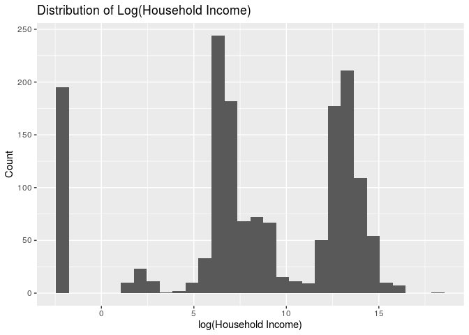
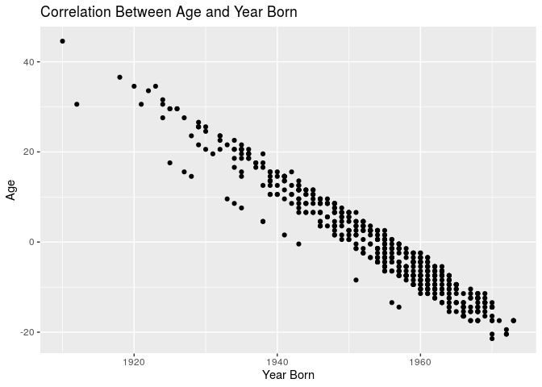
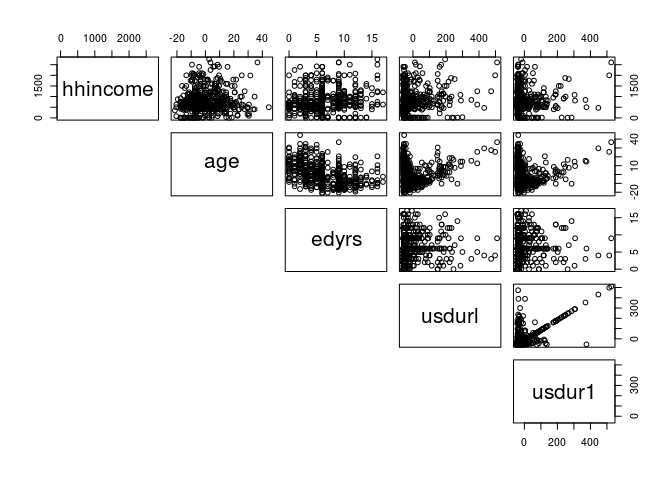

Characteristics of Recent Mexican Immigrants to the United States that
Influence Household Income
================
Ben 10
November 20, 2019

    ## ── Attaching packages ────────────────────────────── tidyverse 1.2.1 ──

    ## ✔ ggplot2 3.2.1     ✔ purrr   0.3.2
    ## ✔ tibble  2.1.3     ✔ dplyr   0.8.3
    ## ✔ tidyr   0.8.3     ✔ stringr 1.4.0
    ## ✔ readr   1.3.1     ✔ forcats 0.4.0

    ## ── Conflicts ───────────────────────────────── tidyverse_conflicts() ──
    ## ✖ dplyr::filter() masks stats::filter()
    ## ✖ dplyr::lag()    masks stats::lag()

    ## Parsed with column specification:
    ## cols(
    ##   X1 = col_double(),
    ##   sex = col_character(),
    ##   relhead = col_double(),
    ##   yrborn = col_double(),
    ##   age = col_double(),
    ##   statebrn = col_character(),
    ##   marstat = col_character(),
    ##   edyrs = col_double(),
    ##   occ = col_double(),
    ##   hhincome = col_double(),
    ##   usstate1 = col_character(),
    ##   usstatel = col_character(),
    ##   usplace1 = col_double(),
    ##   usplacel = col_double(),
    ##   usdur1 = col_double(),
    ##   usdurl = col_double(),
    ##   usdoc1 = col_character(),
    ##   occtype = col_character(),
    ##   uscity = col_character()
    ## )

## 1\. Introduction

We are aiming to discover what characteristics of Mexican immmigrants to
the United States, specifically California, influence their projected
household income. We will be building a multiple linear regression model
to predict household income considering the following variables: `sex`,
`relhead`, `age`, `statebrn`, `marstat`, `edyrs`, `occtype`, `usdur1`,
`usdurl`, `usdoc1`, `uscity`, `yrborn`.

Our response variable is household income: the total income for a single
household, reported in
    $USD.

## 2\. Exploratory Data Analysis

    ## `stat_bin()` using `bins = 30`. Pick better value with `binwidth`.

<!-- -->

Originally, the distribution of log(Household Income)- our response
variable- was bimodal and had a mean of 412,647 dollars. We determined
that this is an absurdly high median income for a survey of largely
undocumented immigrants in the US and believe that a significant chunk
of the high incomes were actually recorded in pesos. We will filter out
the incomes above 60,000 to remove what appears to be a second
distribution of incomes in pesos. We will also remove incomes of zero
from our
    dataset.

    ## `stat_bin()` using `bins = 30`. Pick better value with `binwidth`.

<!-- -->

These immigrants to California arrived to the following cities: Los
Angeles-Long Beach, San Francisco, San Diego, Santa Cruz-Watsonville,
Bakersfield, Fresno, Merced, Orange County, Riverside-San Bernardino,
Sacramento, San Jose, Santa Barbara-Santa Maria-Lompoc,
Vallejo-Fairfield-Napa, and Ventura. Given the comparatively small
number of cases in which no city was reported, we deleted these
instances. This leaves 15 unique locations in California. The majority
of immigrants went to LA-Long Beach area.

It turned out that all values from relhead in our cleaned data were “1”
or head. So we will remove this variable, as well as state variables
since we are only using California data. We will also remove place data
since we are using uscity, and occ since we are using occtype.

## 2\. Multiple Linear Regression Model

In an effort to determine which characteristics of candidates influence
their household income, we will be using a multiple linear regression
model. Since our response variable is numerical with mulitple potential
predictors, this is the best model at our disposal for us to use.

We will consider the potential interaction between principal occupation
and number of years of school completed, since those are generally
interconnected. We may also consider the interaction between
documentation type and occupation type, although the effect may be
insignificant.

We will select our model using AIC criteria, because since we’re dealing
with people, we want to build a model that accounts for volatile human
nature and the ever-changing socioeconomic and political climate that
could influence someone’s household income. AIC is used when we would
rather say a variable is a relevant predictor, when in reality it might
not be and so in this case, we would rather err on the side of a false
positive because we are dealing with a constantly fluctuating issue.

### 2.1 Full Model

<!-- -->
`yrborn` and `age` provide the same information and are perfectly
linear, therefore we decided to remove `yrborn` from consideration in
the model.

<table>

<thead>

<tr>

<th style="text-align:left;">

term

</th>

<th style="text-align:right;">

estimate

</th>

<th style="text-align:right;">

std.error

</th>

<th style="text-align:right;">

statistic

</th>

<th style="text-align:right;">

p.value

</th>

</tr>

</thead>

<tbody>

<tr>

<td style="text-align:left;">

(Intercept)

</td>

<td style="text-align:right;">

253.553

</td>

<td style="text-align:right;">

593.848

</td>

<td style="text-align:right;">

0.427

</td>

<td style="text-align:right;">

0.670

</td>

</tr>

<tr>

<td style="text-align:left;">

sexM

</td>

<td style="text-align:right;">

376.588

</td>

<td style="text-align:right;">

187.385

</td>

<td style="text-align:right;">

2.010

</td>

<td style="text-align:right;">

0.045

</td>

</tr>

<tr>

<td style="text-align:left;">

age

</td>

<td style="text-align:right;">

6.675

</td>

<td style="text-align:right;">

2.904

</td>

<td style="text-align:right;">

2.298

</td>

<td style="text-align:right;">

0.022

</td>

</tr>

<tr>

<td style="text-align:left;">

statebrnChihuahua

</td>

<td style="text-align:right;">

134.111

</td>

<td style="text-align:right;">

631.661

</td>

<td style="text-align:right;">

0.212

</td>

<td style="text-align:right;">

0.832

</td>

</tr>

<tr>

<td style="text-align:left;">

statebrnCoahuila

</td>

<td style="text-align:right;">

1752.485

</td>

<td style="text-align:right;">

822.587

</td>

<td style="text-align:right;">

2.130

</td>

<td style="text-align:right;">

0.034

</td>

</tr>

<tr>

<td style="text-align:left;">

statebrnColima

</td>

<td style="text-align:right;">

1.565

</td>

<td style="text-align:right;">

380.356

</td>

<td style="text-align:right;">

0.004

</td>

<td style="text-align:right;">

0.997

</td>

</tr>

<tr>

<td style="text-align:left;">

statebrnGuanajuato

</td>

<td style="text-align:right;">

175.475

</td>

<td style="text-align:right;">

381.494

</td>

<td style="text-align:right;">

0.460

</td>

<td style="text-align:right;">

0.646

</td>

</tr>

<tr>

<td style="text-align:left;">

statebrnGuerrero

</td>

<td style="text-align:right;">

382.830

</td>

<td style="text-align:right;">

397.108

</td>

<td style="text-align:right;">

0.964

</td>

<td style="text-align:right;">

0.336

</td>

</tr>

<tr>

<td style="text-align:left;">

statebrnJalisco

</td>

<td style="text-align:right;">

206.635

</td>

<td style="text-align:right;">

378.413

</td>

<td style="text-align:right;">

0.546

</td>

<td style="text-align:right;">

0.585

</td>

</tr>

<tr>

<td style="text-align:left;">

statebrnMexico City

</td>

<td style="text-align:right;">

563.499

</td>

<td style="text-align:right;">

443.766

</td>

<td style="text-align:right;">

1.270

</td>

<td style="text-align:right;">

0.205

</td>

</tr>

<tr>

<td style="text-align:left;">

statebrnMichoacán

</td>

<td style="text-align:right;">

179.532

</td>

<td style="text-align:right;">

377.053

</td>

<td style="text-align:right;">

0.476

</td>

<td style="text-align:right;">

0.634

</td>

</tr>

<tr>

<td style="text-align:left;">

statebrnNayarit

</td>

<td style="text-align:right;">

361.040

</td>

<td style="text-align:right;">

381.550

</td>

<td style="text-align:right;">

0.946

</td>

<td style="text-align:right;">

0.345

</td>

</tr>

<tr>

<td style="text-align:left;">

statebrnOaxaca

</td>

<td style="text-align:right;">

383.588

</td>

<td style="text-align:right;">

390.390

</td>

<td style="text-align:right;">

0.983

</td>

<td style="text-align:right;">

0.326

</td>

</tr>

<tr>

<td style="text-align:left;">

statebrnPuebla

</td>

<td style="text-align:right;">

430.374

</td>

<td style="text-align:right;">

630.097

</td>

<td style="text-align:right;">

0.683

</td>

<td style="text-align:right;">

0.495

</td>

</tr>

<tr>

<td style="text-align:left;">

statebrnSan Luis Potosí

</td>

<td style="text-align:right;">

214.682

</td>

<td style="text-align:right;">

384.490

</td>

<td style="text-align:right;">

0.558

</td>

<td style="text-align:right;">

0.577

</td>

</tr>

<tr>

<td style="text-align:left;">

statebrnTamaulipas

</td>

<td style="text-align:right;">

\-161.674

</td>

<td style="text-align:right;">

629.901

</td>

<td style="text-align:right;">

\-0.257

</td>

<td style="text-align:right;">

0.798

</td>

</tr>

<tr>

<td style="text-align:left;">

statebrnVeracruz

</td>

<td style="text-align:right;">

411.163

</td>

<td style="text-align:right;">

531.769

</td>

<td style="text-align:right;">

0.773

</td>

<td style="text-align:right;">

0.440

</td>

</tr>

<tr>

<td style="text-align:left;">

statebrnZacatecas

</td>

<td style="text-align:right;">

348.941

</td>

<td style="text-align:right;">

375.679

</td>

<td style="text-align:right;">

0.929

</td>

<td style="text-align:right;">

0.353

</td>

</tr>

<tr>

<td style="text-align:left;">

marstatDivorced

</td>

<td style="text-align:right;">

171.792

</td>

<td style="text-align:right;">

219.802

</td>

<td style="text-align:right;">

0.782

</td>

<td style="text-align:right;">

0.435

</td>

</tr>

<tr>

<td style="text-align:left;">

marstatMarried

</td>

<td style="text-align:right;">

43.241

</td>

<td style="text-align:right;">

117.730

</td>

<td style="text-align:right;">

0.367

</td>

<td style="text-align:right;">

0.714

</td>

</tr>

<tr>

<td style="text-align:left;">

marstatNever married

</td>

<td style="text-align:right;">

\-151.650

</td>

<td style="text-align:right;">

164.118

</td>

<td style="text-align:right;">

\-0.924

</td>

<td style="text-align:right;">

0.356

</td>

</tr>

<tr>

<td style="text-align:left;">

marstatSeparated

</td>

<td style="text-align:right;">

97.680

</td>

<td style="text-align:right;">

234.443

</td>

<td style="text-align:right;">

0.417

</td>

<td style="text-align:right;">

0.677

</td>

</tr>

<tr>

<td style="text-align:left;">

marstatWidowed

</td>

<td style="text-align:right;">

117.059

</td>

<td style="text-align:right;">

245.574

</td>

<td style="text-align:right;">

0.477

</td>

<td style="text-align:right;">

0.634

</td>

</tr>

<tr>

<td style="text-align:left;">

edyrs

</td>

<td style="text-align:right;">

11.795

</td>

<td style="text-align:right;">

8.093

</td>

<td style="text-align:right;">

1.457

</td>

<td style="text-align:right;">

0.146

</td>

</tr>

<tr>

<td style="text-align:left;">

occtypeAdministrator

</td>

<td style="text-align:right;">

41.773

</td>

<td style="text-align:right;">

268.820

</td>

<td style="text-align:right;">

0.155

</td>

<td style="text-align:right;">

0.877

</td>

</tr>

<tr>

<td style="text-align:left;">

occtypeAgriculture

</td>

<td style="text-align:right;">

\-338.593

</td>

<td style="text-align:right;">

139.252

</td>

<td style="text-align:right;">

\-2.432

</td>

<td style="text-align:right;">

0.015

</td>

</tr>

<tr>

<td style="text-align:left;">

occtypeArts

</td>

<td style="text-align:right;">

\-734.762

</td>

<td style="text-align:right;">

526.443

</td>

<td style="text-align:right;">

\-1.396

</td>

<td style="text-align:right;">

0.163

</td>

</tr>

<tr>

<td style="text-align:left;">

occtypeEducator

</td>

<td style="text-align:right;">

330.280

</td>

<td style="text-align:right;">

331.637

</td>

<td style="text-align:right;">

0.996

</td>

<td style="text-align:right;">

0.320

</td>

</tr>

<tr>

<td style="text-align:left;">

occtypeHomemaker

</td>

<td style="text-align:right;">

\-293.640

</td>

<td style="text-align:right;">

562.972

</td>

<td style="text-align:right;">

\-0.522

</td>

<td style="text-align:right;">

0.602

</td>

</tr>

<tr>

<td style="text-align:left;">

occtypeManufacturing (skilled)

</td>

<td style="text-align:right;">

\-155.087

</td>

<td style="text-align:right;">

135.147

</td>

<td style="text-align:right;">

\-1.148

</td>

<td style="text-align:right;">

0.252

</td>

</tr>

<tr>

<td style="text-align:left;">

occtypeManufacturing (unskilled)

</td>

<td style="text-align:right;">

\-228.939

</td>

<td style="text-align:right;">

137.949

</td>

<td style="text-align:right;">

\-1.660

</td>

<td style="text-align:right;">

0.098

</td>

</tr>

<tr>

<td style="text-align:left;">

occtypeOther, unspecified (disabled, incarcerated, tourist and other)

</td>

<td style="text-align:right;">

\-842.711

</td>

<td style="text-align:right;">

434.370

</td>

<td style="text-align:right;">

\-1.940

</td>

<td style="text-align:right;">

0.053

</td>

</tr>

<tr>

<td style="text-align:left;">

occtypeProfessional

</td>

<td style="text-align:right;">

\-693.183

</td>

<td style="text-align:right;">

535.468

</td>

<td style="text-align:right;">

\-1.295

</td>

<td style="text-align:right;">

0.196

</td>

</tr>

<tr>

<td style="text-align:left;">

occtypeProtection

</td>

<td style="text-align:right;">

\-333.922

</td>

<td style="text-align:right;">

395.800

</td>

<td style="text-align:right;">

\-0.844

</td>

<td style="text-align:right;">

0.399

</td>

</tr>

<tr>

<td style="text-align:left;">

occtypeRetired

</td>

<td style="text-align:right;">

\-672.350

</td>

<td style="text-align:right;">

238.185

</td>

<td style="text-align:right;">

\-2.823

</td>

<td style="text-align:right;">

0.005

</td>

</tr>

<tr>

<td style="text-align:left;">

occtypeSales

</td>

<td style="text-align:right;">

\-147.089

</td>

<td style="text-align:right;">

146.366

</td>

<td style="text-align:right;">

\-1.005

</td>

<td style="text-align:right;">

0.315

</td>

</tr>

<tr>

<td style="text-align:left;">

occtypeServices

</td>

<td style="text-align:right;">

\-160.247

</td>

<td style="text-align:right;">

142.047

</td>

<td style="text-align:right;">

\-1.128

</td>

<td style="text-align:right;">

0.260

</td>

</tr>

<tr>

<td style="text-align:left;">

occtypeStudent

</td>

<td style="text-align:right;">

\-104.454

</td>

<td style="text-align:right;">

550.065

</td>

<td style="text-align:right;">

\-0.190

</td>

<td style="text-align:right;">

0.849

</td>

</tr>

<tr>

<td style="text-align:left;">

occtypeTechnical Worker

</td>

<td style="text-align:right;">

\-227.092

</td>

<td style="text-align:right;">

246.055

</td>

<td style="text-align:right;">

\-0.923

</td>

<td style="text-align:right;">

0.357

</td>

</tr>

<tr>

<td style="text-align:left;">

occtypeTransportation

</td>

<td style="text-align:right;">

\-173.407

</td>

<td style="text-align:right;">

164.617

</td>

<td style="text-align:right;">

\-1.053

</td>

<td style="text-align:right;">

0.293

</td>

</tr>

<tr>

<td style="text-align:left;">

occtypeUnemployed (seeking work)

</td>

<td style="text-align:right;">

\-584.815

</td>

<td style="text-align:right;">

333.223

</td>

<td style="text-align:right;">

\-1.755

</td>

<td style="text-align:right;">

0.080

</td>

</tr>

<tr>

<td style="text-align:left;">

usdur1

</td>

<td style="text-align:right;">

\-0.091

</td>

<td style="text-align:right;">

0.432

</td>

<td style="text-align:right;">

\-0.211

</td>

<td style="text-align:right;">

0.833

</td>

</tr>

<tr>

<td style="text-align:left;">

usdurl

</td>

<td style="text-align:right;">

0.552

</td>

<td style="text-align:right;">

0.377

</td>

<td style="text-align:right;">

1.464

</td>

<td style="text-align:right;">

0.144

</td>

</tr>

<tr>

<td style="text-align:left;">

usdoc1Legal resident

</td>

<td style="text-align:right;">

132.060

</td>

<td style="text-align:right;">

154.369

</td>

<td style="text-align:right;">

0.855

</td>

<td style="text-align:right;">

0.393

</td>

</tr>

<tr>

<td style="text-align:left;">

usdoc1Temporary: Tourist/visitor

</td>

<td style="text-align:right;">

\-29.045

</td>

<td style="text-align:right;">

158.039

</td>

<td style="text-align:right;">

\-0.184

</td>

<td style="text-align:right;">

0.854

</td>

</tr>

<tr>

<td style="text-align:left;">

usdoc1Undocumented

</td>

<td style="text-align:right;">

2.133

</td>

<td style="text-align:right;">

126.931

</td>

<td style="text-align:right;">

0.017

</td>

<td style="text-align:right;">

0.987

</td>

</tr>

<tr>

<td style="text-align:left;">

uscityFresno, CA

</td>

<td style="text-align:right;">

\-163.479

</td>

<td style="text-align:right;">

322.090

</td>

<td style="text-align:right;">

\-0.508

</td>

<td style="text-align:right;">

0.612

</td>

</tr>

<tr>

<td style="text-align:left;">

uscityLos Angeles-Long Beach, CA

</td>

<td style="text-align:right;">

\-259.508

</td>

<td style="text-align:right;">

308.021

</td>

<td style="text-align:right;">

\-0.843

</td>

<td style="text-align:right;">

0.400

</td>

</tr>

<tr>

<td style="text-align:left;">

uscityMerced, CA

</td>

<td style="text-align:right;">

\-287.166

</td>

<td style="text-align:right;">

326.559

</td>

<td style="text-align:right;">

\-0.879

</td>

<td style="text-align:right;">

0.380

</td>

</tr>

<tr>

<td style="text-align:left;">

uscityOrange County, CA

</td>

<td style="text-align:right;">

\-125.722

</td>

<td style="text-align:right;">

314.562

</td>

<td style="text-align:right;">

\-0.400

</td>

<td style="text-align:right;">

0.690

</td>

</tr>

<tr>

<td style="text-align:left;">

uscityRiverside-San Bernardino, CA

</td>

<td style="text-align:right;">

\-263.118

</td>

<td style="text-align:right;">

321.640

</td>

<td style="text-align:right;">

\-0.818

</td>

<td style="text-align:right;">

0.414

</td>

</tr>

<tr>

<td style="text-align:left;">

uscitySacramento, CA

</td>

<td style="text-align:right;">

\-200.982

</td>

<td style="text-align:right;">

367.300

</td>

<td style="text-align:right;">

\-0.547

</td>

<td style="text-align:right;">

0.585

</td>

</tr>

<tr>

<td style="text-align:left;">

uscitySan Diego, CA

</td>

<td style="text-align:right;">

\-125.923

</td>

<td style="text-align:right;">

318.718

</td>

<td style="text-align:right;">

\-0.395

</td>

<td style="text-align:right;">

0.693

</td>

</tr>

<tr>

<td style="text-align:left;">

uscitySan Francisco, CA

</td>

<td style="text-align:right;">

\-495.832

</td>

<td style="text-align:right;">

358.362

</td>

<td style="text-align:right;">

\-1.384

</td>

<td style="text-align:right;">

0.167

</td>

</tr>

<tr>

<td style="text-align:left;">

uscitySan Jose, CA

</td>

<td style="text-align:right;">

\-369.569

</td>

<td style="text-align:right;">

331.701

</td>

<td style="text-align:right;">

\-1.114

</td>

<td style="text-align:right;">

0.266

</td>

</tr>

<tr>

<td style="text-align:left;">

uscitySanta Barbara-Santa Maria-Lompoc, CA

</td>

<td style="text-align:right;">

\-252.569

</td>

<td style="text-align:right;">

341.026

</td>

<td style="text-align:right;">

\-0.741

</td>

<td style="text-align:right;">

0.459

</td>

</tr>

<tr>

<td style="text-align:left;">

uscitySanta Cruz-Watsonville, CA

</td>

<td style="text-align:right;">

\-372.233

</td>

<td style="text-align:right;">

361.301

</td>

<td style="text-align:right;">

\-1.030

</td>

<td style="text-align:right;">

0.303

</td>

</tr>

<tr>

<td style="text-align:left;">

uscityVallejo-Fairfield-Napa, CA

</td>

<td style="text-align:right;">

77.491

</td>

<td style="text-align:right;">

357.028

</td>

<td style="text-align:right;">

0.217

</td>

<td style="text-align:right;">

0.828

</td>

</tr>

<tr>

<td style="text-align:left;">

uscityVentura, CA

</td>

<td style="text-align:right;">

\-154.193

</td>

<td style="text-align:right;">

341.941

</td>

<td style="text-align:right;">

\-0.451

</td>

<td style="text-align:right;">

0.652

</td>

</tr>

</tbody>

</table>

### 2.2 Backward selection

    ## Start:  AIC=6442.92
    ## hhincome ~ sex + age + statebrn + marstat + edyrs + occtype + 
    ##     usdur1 + usdurl + usdoc1 + uscity
    ## 
    ##            Df Sum of Sq       RSS    AIC
    ## - uscity   13   3071711 119125190 6430.3
    ## - occtype  17   6282840 122336319 6436.0
    ## - marstat   5    831232 116884711 6436.6
    ## - usdoc1    3    505808 116559287 6439.2
    ## - statebrn 15   6094016 122147495 6439.2
    ## - usdur1    1     11365 116064844 6441.0
    ## <none>                  116053479 6442.9
    ## - edyrs     1    542908 116596387 6443.3
    ## - usdurl    1    547562 116601041 6443.3
    ## - sex       1   1032440 117085919 6445.5
    ## - age       1   1350282 117403761 6446.9
    ## 
    ## Step:  AIC=6430.33
    ## hhincome ~ sex + age + statebrn + marstat + edyrs + occtype + 
    ##     usdur1 + usdurl + usdoc1
    ## 
    ##            Df Sum of Sq       RSS    AIC
    ## - occtype  17   5845224 124970414 6420.9
    ## - marstat   5   1083209 120208399 6425.0
    ## - statebrn 15   6724549 125849739 6428.5
    ## - usdoc1    3    975015 120100205 6428.5
    ## - usdur1    1     81050 119206241 6428.7
    ## <none>                  119125190 6430.3
    ## - edyrs     1    471056 119596246 6430.3
    ## - usdurl    1    898034 120023224 6432.2
    ## - sex       1    900647 120025837 6432.2
    ## - age       1    931697 120056887 6432.3
    ## 
    ## Step:  AIC=6420.9
    ## hhincome ~ sex + age + statebrn + marstat + edyrs + usdur1 + 
    ##     usdurl + usdoc1
    ## 
    ##            Df Sum of Sq       RSS    AIC
    ## - marstat   5    777612 125748026 6414.1
    ## - statebrn 15   6347181 131317596 6416.3
    ## - usdoc1    3    830148 125800562 6418.3
    ## - usdur1    1    155180 125125594 6419.5
    ## <none>                  124970414 6420.9
    ## - sex       1    570931 125541345 6421.2
    ## - age       1    602177 125572591 6421.4
    ## - usdurl    1   1428461 126398876 6424.7
    ## - edyrs     1   1682731 126653145 6425.8
    ## 
    ## Step:  AIC=6414.08
    ## hhincome ~ sex + age + statebrn + edyrs + usdur1 + usdurl + usdoc1
    ## 
    ##            Df Sum of Sq       RSS    AIC
    ## - statebrn 15   6699887 132447914 6410.7
    ## - usdoc1    3    868576 126616602 6411.6
    ## - usdur1    1    147884 125895910 6412.7
    ## <none>                  125748026 6414.1
    ## - age       1    849920 126597946 6415.5
    ## - sex       1   1355291 127103317 6417.6
    ## - usdurl    1   1442401 127190427 6417.9
    ## - edyrs     1   1576632 127324658 6418.5
    ## 
    ## Step:  AIC=6410.71
    ## hhincome ~ sex + age + edyrs + usdur1 + usdurl + usdoc1
    ## 
    ##          Df Sum of Sq       RSS    AIC
    ## - usdur1  1    299052 132746966 6409.9
    ## <none>                132447914 6410.7
    ## - usdoc1  3   1634456 134082370 6411.0
    ## - sex     1    790805 133238718 6411.8
    ## - usdurl  1   1541739 133989652 6414.6
    ## - age     1   1835768 134283682 6415.8
    ## - edyrs   1   2538651 134986564 6418.5
    ## 
    ## Step:  AIC=6409.87
    ## hhincome ~ sex + age + edyrs + usdurl + usdoc1
    ## 
    ##          Df Sum of Sq       RSS    AIC
    ## - usdoc1  3   1494678 134241644 6409.6
    ## <none>                132746966 6409.9
    ## - sex     1   1016294 133763260 6411.8
    ## - usdurl  1   1375595 134122561 6413.2
    ## - age     1   1956939 134703904 6415.4
    ## - edyrs   1   2620424 135367390 6417.9
    ## 
    ## Step:  AIC=6409.61
    ## hhincome ~ sex + age + edyrs + usdurl
    ## 
    ##          Df Sum of Sq       RSS    AIC
    ## <none>                134241644 6409.6
    ## - sex     1   1249042 135490686 6412.4
    ## - usdurl  1   1733473 135975117 6414.2
    ## - age     1   2491615 136733260 6417.0
    ## - edyrs   1   3203237 137444881 6419.7

| term        | estimate | std.error | statistic | p.value |  conf.low | conf.high |
| :---------- | -------: | --------: | --------: | ------: | --------: | --------: |
| (Intercept) |  130.900 |   166.753 |     0.785 |   0.433 | \-196.710 |   458.511 |
| sexM        |  241.933 |   111.280 |     2.174 |   0.030 |    23.307 |   460.559 |
| age         |    6.725 |     2.190 |     3.071 |   0.002 |     2.422 |    11.028 |
| edyrs       |   23.641 |     6.790 |     3.482 |   0.001 |    10.301 |    36.982 |
| usdurl      |    0.662 |     0.258 |     2.561 |   0.011 |     0.154 |     1.169 |

### 2.3 Interactions

| Res.Df |       RSS | Df | Sum of Sq | Pr(\>Chi) |
| -----: | --------: | -: | --------: | --------: |
|    508 | 134241644 | NA |        NA |        NA |
|    502 | 130461779 |  6 |   3779865 |     0.024 |

We also wanted to consider the interaction between documentation status
and number of years of education, because it is well known that people
who have had higher education are more likely to be documented
immigrants in the United States.

The p-value for this test is 0.024 \< 0.05, therefore we should keep the
interaction term for `edyrs` and `usdoc1` in the model.

### 2.4 F-test

## 3\. Check Assumtpions

Before interpreting the model, it is essential to check the assumptions.

### 3.1 Linearity

### 3.1.1 Predicted vs. Factors

<!-- -->

From the data exploratory section, observed a perfect negative linear
correlation between year-born and age, which makes sense. There is also
a linear correlation between usdur1 and usdurl.

Hence, we decide to drop either yrborn or age, and either usdur1 or
usdurl.

### 3.2 Constant Variance

### 3.2.1 Residuals vs. Factors

Below is the plots of residuals against each quantitative predictor:

Below is the graph of residuals against categorical predictor:

From the pairs scatterplot, I cannot observe any clear patterns; and
from the boxplot, the median of each category seems to be close to 0,
expect for a slight positive deviation in the 1.5 Floor category, and
all categories are relatively symmetrical.

#### 3.2.2 Residual vs. Predicted

The residual vs. predicted values scatterplot shows a large
concentration of data points in the 12 to 14 units range of the x-axis.
However, there are alarming outliers around 17 units. There are no
discernible patterns.

Overall, the graphs confirm the constant variance assumption is
satisfied.

### 3.3 Normality

#### 3.3.1 Histogram of Residuals

#### 3.3.2 Normal-QQ Plot of Residuals

From the histogram, the shape of distribution of residuals resembles a
normal distribution. The Normal-QQ plot supports this finding as the
sample line adheres closely to the theoretical line.So the normality
assumption is met.

### 3.4 Independence

There might be some interdependence between family members who came to
the US at the same time, and were from the same country of origin, etc.
We can possibly create interaction terms between them.

## 4\. Interpretations

## 5\. Additional Work

Your regression analysis results go here. At a minimum, the regression
analysis should include the following:

  - Statement of the research question and modeling obejctive
    (prediction, inference, etc.)

  - Description of the response variable

  - Updated exploratory data analysis, incorporating any feedback from
    the proposal

  - Explanation of the modeling process and why you chose those metohds,
    incorporating any feedback from the proposal

  - Output of the final model

  - Discussion of the assumptions for the final model

  - Interpretations / interesting findings from the model coefficients

  - Additional work of other models or analylsis not included in the
    final model.

*Use proper headings as needed.*
