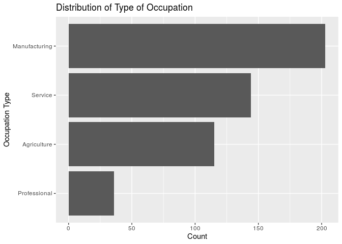

<<<<<<< HEAD
Your project goes here! Before you submit, make sure your chunks are turned off with `echo = FALSE`. 

You can add sections as you see fit. At a minimum, you should have the following sections: 

=======
>>>>>>> a76ba95fa37e84fd7730a7d833d877bf04ef7777
## Section 1: Introduction (includes introduction and exploratory data analysis)
## 1. Introduction

### 1.1 Objective

We are aiming to build a model to determine which characteristics of Mexican immmigrants to the United States, specifically California, well-explain variation in household income. 

### 1.2 Description of Dataset

The dataset is from The Mexican Migration Project (MMP, *see References below for confidentiality terms). It was created in 1982 by an interdisciplinary team of researchers to further our understanding of the complex process of Mexican migration to the United States. The project is a binational research effort co-directed by Jorge Durand, professor of Social Anthropology at the University of Guadalajara (Mexico), and Douglas S. Massey, professor of Sociology and Public Affairs, with a joint appointment in the Woodrow Wilson School, at Princeton University (US).

Since its inception, the MMP's main focus has been to gather social as well as economic information on Mexican-US migration. The data collected has been compiled in a comprehensive database that is available to the public free of charge for research and educational purposes through its web-site. The MMP uses the ethnosurvey approach to gather data: in winter months, they randomly sample households in communities throughout Mexico, surveying household heads and members about their first and last trip to the US, as well as economic and demographic information. They then conduct the same survey in destination areas in the US, sampling migrants from the same communities they survey in Mexico but who have not returned to Mexico. Thus, the sample of migrants includes residents in both Mexico and the US.

The MMP170 Database contains an initial file with general demographic, economic, and migratory information for each member of a surveyed household (PERS). Pers170 has 132 variables and 176701 observations,and hence it is very large. Therefore, we selected 17 meaningful variables and filtered out rows that contain N/A's to create a new dataset labeled `data`.

### 1.3 Method

We will build a multiple linear regression model to predict household income considering the following variables: `sex`, `relhead`, `age`, `statebrn`, `marstat`, `edyrs`, `occtype`, `usdur1`, `usdurl`, `usdoc1`, `uscity`, `yrborn`. 

"X1": Number of observation

"sex": Sex
  
"relhead": Relationship to household head

"yrborn": Year of birth

"age": Age

"statebrn": State of birth

"marstat": Marital status

"edyrs": School years completed

"occ": Principal occupation

"hhincome" : Household income

"usstate1": First US migration: State of residence

"usstatel": Latest US migration: State of residence

"usplace1": First US migration: City of residence (in place codes)

"usplacel": Latest US migration: City of residence (in place codes)

"usdur1": First US migration: Duration (in months)

"usdurl": Latest US migration: Duration (in months)

"usdoc1": Type of documentation 

"occtype": Category of occupation

"uscity": City of residence during first US migration

Our response variable is household income: the total income for a single household, reported in $USD. We chose to use the multiple linear regression because our response variable is numeric, and there are multiple predictor variables.

## 2. Exploratory Data Analysis

### 2.1 Data Cleaning

Due to the complexity of our original data, we did not include data cleaning in the analysis. For more information, please see our proposal, where all the data cleaning happens.

However, we did make some adjustment according to the feedback that there is large imbalance of the amount of data between regions, and that the distribution of the response variable is not normal. Below is the update on our data cleaning:

### 2.2 Updated Data Exploration

#### 2.2.1 Filter Only Immigrants in California

Accoridng to our previous data exploration, we found that the overwhelming majority of immigrants settled in California, as shown in the graph below:

<!-- -->

Hence, we decided to concentrate on California alone. Since the originial dataset is large, we have enough data left in California alone to produce meaningful analysis.


#### 2.2.2 Cut Household Income Groups

Originally, the distribution of log(Household Income)- our response variable- was bimodal and had a median of 412,647 dollars. It almost looks like 3 separate distributions:

<!-- -->

We determined that 412,647 dollars is an absurdly high median income for a survey of largely undocumented immigrants in the US and believe that a significant chunk of the high incomes were actually recorded in pesos. The documentation for the data from the Mexican Migration Project does not specify unit of hhincome; however, the project site details that researchers surveyed communities in Mexico, then traveled to the US to survey communities there. It seems likely that the communities surveyed in Mexico would report income in pesos and those surveyed in the US would report income in USD. However, the data was collected over a period of 10 years, during which the exchange rate between pesos and USD changed significantly. Hence, we cannot simply convert all the incomes that appear to be recorded in pesos into USD. 

Therefore, we decided to filter out the incomes above 60,000 to remove what appears to be a second distribution of incomes in pesos. We will also remove incomes of zero from our dataset, because it will interfere with our model accuracy. However, this compromises our model's predicative range: our model will only be able to predict the household income of those who already have jobs (income).


<!-- -->

Now the distribution of response variable (hhincome) looks like a right skewed normal distribution.

#### 2.2.2 Group cities by region


These immigrants to California arrived to the following cities: 

Bay Area: Vallejo-Fairfield-Napa, San Francisco, San Jose, Santa Cruz-Watsonville

Central California: Sacramento, Merced, Fresno, Bakersfield

Southern California: Santa Barbara-Santa Maria-Lompoc, Ventura, Los Angeles-Long Beach, Orange County, Riverside-San Bernardino, and San Diego.

We decided to simplify these cities into 3 regional categories: Bay Area, Southern California and Central California. 

Given the comparatively small number of cases in which no city was reported, we deleted these instances. The majority of immigrants went to LA-Long Beach area in Southern California.

#### 2.2.4 Remove Variable "relhead"

It turned out that all values from relhead (relationship to head of household) in our cleaned data were "1" or head. So we will remove this variable, as well as state variables since we are only using California data. We will also remove place data since we are using uscity, and occ since we are using occtype.


#### 2.2.5 Mean-center "age" , "usdur1" and "usdurl"

We must center age and usdurl in order to have a useful model intercept interpretation.


```
## [1] 39.42495
```

```
## [1] 60.27096
```

```
## [1] 43.98635
```

```
## [1] 6.440546
```

The mean age in the dataset is 39.43 years ; the mean duration of last US migration is 60.27 months (about 5 years); and the mean duration of first US migration is 43.99 months (less than 3.5 years).


#### 2.2.6 Remove El Salvador Data and regionalize state born variable


## Section 2: Regression Analysis (includes the final model and discussion of assumptions)
## 2. Multiple Linear Regression Model

In an effort to explain which characteristics of migrants influence their household income, we will use a multiple linear regression model. Since our response variable is numerical with mulitple potential predictors, this is the best model at our disposal.

We will consider the potential interaction between principal occupation and number of years of school completed, since those are generally interconnected. We may also consider the interaction between documentation type and occupation type, although the effect may be insignificant. However, if the variables occtype, edyrs, or usdoc1 don't make it through the process of inital model selection, we will not include these interactions in the model as that would not be prudent.

We will select our model using AIC criteria, because since we're dealing with people, we want to build a model that accounts for volatile human nature and the ever-changing socioeconomic and political climate that could influence someone's household income. AIC is used when we would rather say a variable is a relevant predictor, when in reality it might not be and so in this case, we would rather err on the side of a false positive because we are dealing with a constantly fluctuating issue.

### 2.1 Full Model

#### 2.2.5 Remove Obvious Collinear Variable


`yrborn` and `age` provide the same information and are perfectly linear, therefore we decided to remove `yrborn` from consideration in the model.


## 3. Multiple Linear Regression Model

In an effort to explain which characteristics of candidates influence their household income, we will be using a multiple linear regression model. Since our response variable is numerical with mulitple potential predictors, this is the best model at our disposal for us to use.

We will consider the potential interaction between principal occupation and number of years of school completed, since those are generally interconnected. We may also consider the interaction between documentation type and occupation type, although the effect may be insignificant.

We will select our model using AIC criteria, because since we're dealing with people, we want to build a model that accounts for volatile human nature and the ever-changing socioeconomic and political climate that could influence someone's household income. AIC is used when we would rather say a variable is a relevant predictor, when in reality it might not be and so in this case, we would rather err on the side of a false positive because we are dealing with a constantly fluctuating issue.

### 3.1 Full Model

<table>
 <thead>
  <tr>
   <th style="text-align:left;"> term </th>
   <th style="text-align:right;"> estimate </th>
   <th style="text-align:right;"> std.error </th>
   <th style="text-align:right;"> statistic </th>
   <th style="text-align:right;"> p.value </th>
  </tr>
 </thead>
<tbody>
  <tr>
   <td style="text-align:left;"> (Intercept) </td>
   <td style="text-align:right;"> 208.976 </td>
   <td style="text-align:right;"> 451.356 </td>
   <td style="text-align:right;"> 0.463 </td>
   <td style="text-align:right;"> 0.644 </td>
  </tr>
  <tr>
   <td style="text-align:left;"> sexM </td>
   <td style="text-align:right;"> 349.896 </td>
   <td style="text-align:right;"> 184.966 </td>
   <td style="text-align:right;"> 1.892 </td>
   <td style="text-align:right;"> 0.059 </td>
  </tr>
  <tr>
   <td style="text-align:left;"> age </td>
   <td style="text-align:right;"> 5.431 </td>
   <td style="text-align:right;"> 2.833 </td>
   <td style="text-align:right;"> 1.917 </td>
   <td style="text-align:right;"> 0.056 </td>
  </tr>
  <tr>
   <td style="text-align:left;"> statebrnChihuahua </td>
   <td style="text-align:right;"> 146.951 </td>
   <td style="text-align:right;"> 628.830 </td>
   <td style="text-align:right;"> 0.234 </td>
   <td style="text-align:right;"> 0.815 </td>
  </tr>
  <tr>
   <td style="text-align:left;"> statebrnCoahuila </td>
   <td style="text-align:right;"> 1685.503 </td>
   <td style="text-align:right;"> 821.668 </td>
   <td style="text-align:right;"> 2.051 </td>
   <td style="text-align:right;"> 0.041 </td>
  </tr>
  <tr>
   <td style="text-align:left;"> statebrnColima </td>
   <td style="text-align:right;"> 9.949 </td>
   <td style="text-align:right;"> 376.251 </td>
   <td style="text-align:right;"> 0.026 </td>
   <td style="text-align:right;"> 0.979 </td>
  </tr>
  <tr>
   <td style="text-align:left;"> statebrnGuanajuato </td>
   <td style="text-align:right;"> 206.215 </td>
   <td style="text-align:right;"> 377.658 </td>
   <td style="text-align:right;"> 0.546 </td>
   <td style="text-align:right;"> 0.585 </td>
  </tr>
  <tr>
   <td style="text-align:left;"> statebrnGuerrero </td>
   <td style="text-align:right;"> 425.842 </td>
   <td style="text-align:right;"> 391.861 </td>
   <td style="text-align:right;"> 1.087 </td>
   <td style="text-align:right;"> 0.278 </td>
  </tr>
  <tr>
   <td style="text-align:left;"> statebrnJalisco </td>
   <td style="text-align:right;"> 233.304 </td>
   <td style="text-align:right;"> 374.722 </td>
   <td style="text-align:right;"> 0.623 </td>
   <td style="text-align:right;"> 0.534 </td>
  </tr>
  <tr>
   <td style="text-align:left;"> statebrnMexico City </td>
   <td style="text-align:right;"> 592.347 </td>
   <td style="text-align:right;"> 440.004 </td>
   <td style="text-align:right;"> 1.346 </td>
   <td style="text-align:right;"> 0.179 </td>
  </tr>
  <tr>
   <td style="text-align:left;"> statebrnMichoacán </td>
   <td style="text-align:right;"> 189.001 </td>
   <td style="text-align:right;"> 373.777 </td>
   <td style="text-align:right;"> 0.506 </td>
   <td style="text-align:right;"> 0.613 </td>
  </tr>
  <tr>
   <td style="text-align:left;"> statebrnNayarit </td>
   <td style="text-align:right;"> 343.349 </td>
   <td style="text-align:right;"> 380.891 </td>
   <td style="text-align:right;"> 0.901 </td>
   <td style="text-align:right;"> 0.368 </td>
  </tr>
  <tr>
   <td style="text-align:left;"> statebrnOaxaca </td>
   <td style="text-align:right;"> 407.202 </td>
   <td style="text-align:right;"> 386.583 </td>
   <td style="text-align:right;"> 1.053 </td>
   <td style="text-align:right;"> 0.293 </td>
  </tr>
  <tr>
   <td style="text-align:left;"> statebrnPuebla </td>
   <td style="text-align:right;"> 425.273 </td>
   <td style="text-align:right;"> 627.723 </td>
   <td style="text-align:right;"> 0.677 </td>
   <td style="text-align:right;"> 0.498 </td>
  </tr>
  <tr>
   <td style="text-align:left;"> statebrnSan Luis Potosí </td>
   <td style="text-align:right;"> 262.740 </td>
   <td style="text-align:right;"> 376.540 </td>
   <td style="text-align:right;"> 0.698 </td>
   <td style="text-align:right;"> 0.486 </td>
  </tr>
  <tr>
   <td style="text-align:left;"> statebrnTamaulipas </td>
   <td style="text-align:right;"> -158.665 </td>
   <td style="text-align:right;"> 627.538 </td>
   <td style="text-align:right;"> -0.253 </td>
   <td style="text-align:right;"> 0.801 </td>
  </tr>
  <tr>
   <td style="text-align:left;"> statebrnVeracruz </td>
   <td style="text-align:right;"> 427.002 </td>
   <td style="text-align:right;"> 513.478 </td>
   <td style="text-align:right;"> 0.832 </td>
   <td style="text-align:right;"> 0.406 </td>
  </tr>
  <tr>
   <td style="text-align:left;"> statebrnZacatecas </td>
   <td style="text-align:right;"> 392.390 </td>
   <td style="text-align:right;"> 371.607 </td>
   <td style="text-align:right;"> 1.056 </td>
   <td style="text-align:right;"> 0.292 </td>
  </tr>
  <tr>
   <td style="text-align:left;"> marstatDivorced </td>
   <td style="text-align:right;"> 211.455 </td>
   <td style="text-align:right;"> 213.498 </td>
   <td style="text-align:right;"> 0.990 </td>
   <td style="text-align:right;"> 0.322 </td>
  </tr>
  <tr>
   <td style="text-align:left;"> marstatMarried </td>
   <td style="text-align:right;"> 53.094 </td>
   <td style="text-align:right;"> 116.554 </td>
   <td style="text-align:right;"> 0.456 </td>
   <td style="text-align:right;"> 0.649 </td>
  </tr>
  <tr>
   <td style="text-align:left;"> marstatNever married </td>
   <td style="text-align:right;"> -156.986 </td>
   <td style="text-align:right;"> 163.298 </td>
   <td style="text-align:right;"> -0.961 </td>
   <td style="text-align:right;"> 0.337 </td>
  </tr>
  <tr>
   <td style="text-align:left;"> marstatSeparated </td>
   <td style="text-align:right;"> 72.403 </td>
   <td style="text-align:right;"> 230.158 </td>
   <td style="text-align:right;"> 0.315 </td>
   <td style="text-align:right;"> 0.753 </td>
  </tr>
  <tr>
   <td style="text-align:left;"> marstatWidowed </td>
   <td style="text-align:right;"> 107.144 </td>
   <td style="text-align:right;"> 241.827 </td>
   <td style="text-align:right;"> 0.443 </td>
   <td style="text-align:right;"> 0.658 </td>
  </tr>
  <tr>
   <td style="text-align:left;"> edyrs </td>
   <td style="text-align:right;"> 10.883 </td>
   <td style="text-align:right;"> 7.929 </td>
   <td style="text-align:right;"> 1.373 </td>
   <td style="text-align:right;"> 0.171 </td>
  </tr>
  <tr>
   <td style="text-align:left;"> occtypeAdministrator </td>
   <td style="text-align:right;"> 53.479 </td>
   <td style="text-align:right;"> 266.478 </td>
   <td style="text-align:right;"> 0.201 </td>
   <td style="text-align:right;"> 0.841 </td>
  </tr>
  <tr>
   <td style="text-align:left;"> occtypeAgriculture </td>
   <td style="text-align:right;"> -311.327 </td>
   <td style="text-align:right;"> 137.278 </td>
   <td style="text-align:right;"> -2.268 </td>
   <td style="text-align:right;"> 0.024 </td>
  </tr>
  <tr>
   <td style="text-align:left;"> occtypeArts </td>
   <td style="text-align:right;"> -784.370 </td>
   <td style="text-align:right;"> 525.986 </td>
   <td style="text-align:right;"> -1.491 </td>
   <td style="text-align:right;"> 0.137 </td>
  </tr>
  <tr>
   <td style="text-align:left;"> occtypeEducator </td>
   <td style="text-align:right;"> 356.659 </td>
   <td style="text-align:right;"> 330.195 </td>
   <td style="text-align:right;"> 1.080 </td>
   <td style="text-align:right;"> 0.281 </td>
  </tr>
  <tr>
   <td style="text-align:left;"> occtypeHomemaker </td>
   <td style="text-align:right;"> -301.400 </td>
   <td style="text-align:right;"> 562.114 </td>
   <td style="text-align:right;"> -0.536 </td>
   <td style="text-align:right;"> 0.592 </td>
  </tr>
  <tr>
   <td style="text-align:left;"> occtypeManufacturing (skilled) </td>
   <td style="text-align:right;"> -149.151 </td>
   <td style="text-align:right;"> 134.444 </td>
   <td style="text-align:right;"> -1.109 </td>
   <td style="text-align:right;"> 0.268 </td>
  </tr>
  <tr>
   <td style="text-align:left;"> occtypeManufacturing (unskilled) </td>
   <td style="text-align:right;"> -211.373 </td>
   <td style="text-align:right;"> 136.795 </td>
   <td style="text-align:right;"> -1.545 </td>
   <td style="text-align:right;"> 0.123 </td>
  </tr>
  <tr>
   <td style="text-align:left;"> occtypeOther, unspecified (disabled, incarcerated, tourist and other) </td>
   <td style="text-align:right;"> -807.707 </td>
   <td style="text-align:right;"> 428.766 </td>
   <td style="text-align:right;"> -1.884 </td>
   <td style="text-align:right;"> 0.060 </td>
  </tr>
  <tr>
   <td style="text-align:left;"> occtypeProfessional </td>
   <td style="text-align:right;"> -669.731 </td>
   <td style="text-align:right;"> 534.184 </td>
   <td style="text-align:right;"> -1.254 </td>
   <td style="text-align:right;"> 0.211 </td>
  </tr>
  <tr>
   <td style="text-align:left;"> occtypeProtection </td>
   <td style="text-align:right;"> -315.331 </td>
   <td style="text-align:right;"> 385.881 </td>
   <td style="text-align:right;"> -0.817 </td>
   <td style="text-align:right;"> 0.414 </td>
  </tr>
  <tr>
   <td style="text-align:left;"> occtypeRetired </td>
   <td style="text-align:right;"> -653.596 </td>
   <td style="text-align:right;"> 231.718 </td>
   <td style="text-align:right;"> -2.821 </td>
   <td style="text-align:right;"> 0.005 </td>
  </tr>
  <tr>
   <td style="text-align:left;"> occtypeSales </td>
   <td style="text-align:right;"> -163.784 </td>
   <td style="text-align:right;"> 145.112 </td>
   <td style="text-align:right;"> -1.129 </td>
   <td style="text-align:right;"> 0.260 </td>
  </tr>
  <tr>
   <td style="text-align:left;"> occtypeServices </td>
   <td style="text-align:right;"> -164.090 </td>
   <td style="text-align:right;"> 140.411 </td>
   <td style="text-align:right;"> -1.169 </td>
   <td style="text-align:right;"> 0.243 </td>
  </tr>
  <tr>
   <td style="text-align:left;"> occtypeStudent </td>
   <td style="text-align:right;"> -81.982 </td>
   <td style="text-align:right;"> 544.864 </td>
   <td style="text-align:right;"> -0.150 </td>
   <td style="text-align:right;"> 0.880 </td>
  </tr>
  <tr>
   <td style="text-align:left;"> occtypeTechnical Worker </td>
   <td style="text-align:right;"> -175.654 </td>
   <td style="text-align:right;"> 243.527 </td>
   <td style="text-align:right;"> -0.721 </td>
   <td style="text-align:right;"> 0.471 </td>
  </tr>
  <tr>
   <td style="text-align:left;"> occtypeTransportation </td>
   <td style="text-align:right;"> -175.569 </td>
   <td style="text-align:right;"> 164.027 </td>
   <td style="text-align:right;"> -1.070 </td>
   <td style="text-align:right;"> 0.285 </td>
  </tr>
  <tr>
   <td style="text-align:left;"> occtypeUnemployed (seeking work) </td>
   <td style="text-align:right;"> -548.517 </td>
   <td style="text-align:right;"> 329.909 </td>
   <td style="text-align:right;"> -1.663 </td>
   <td style="text-align:right;"> 0.097 </td>
  </tr>
  <tr>
   <td style="text-align:left;"> usdur1 </td>
   <td style="text-align:right;"> -0.282 </td>
   <td style="text-align:right;"> 0.422 </td>
   <td style="text-align:right;"> -0.669 </td>
   <td style="text-align:right;"> 0.504 </td>
  </tr>
  <tr>
   <td style="text-align:left;"> usdurl </td>
   <td style="text-align:right;"> 0.710 </td>
   <td style="text-align:right;"> 0.369 </td>
   <td style="text-align:right;"> 1.923 </td>
   <td style="text-align:right;"> 0.055 </td>
  </tr>
  <tr>
   <td style="text-align:left;"> usdoc1Legal resident </td>
   <td style="text-align:right;"> 194.816 </td>
   <td style="text-align:right;"> 147.808 </td>
   <td style="text-align:right;"> 1.318 </td>
   <td style="text-align:right;"> 0.188 </td>
  </tr>
  <tr>
   <td style="text-align:left;"> usdoc1Temporary: Tourist/visitor </td>
   <td style="text-align:right;"> -42.770 </td>
   <td style="text-align:right;"> 154.544 </td>
   <td style="text-align:right;"> -0.277 </td>
   <td style="text-align:right;"> 0.782 </td>
  </tr>
  <tr>
   <td style="text-align:left;"> usdoc1Undocumented </td>
   <td style="text-align:right;"> 19.567 </td>
   <td style="text-align:right;"> 122.443 </td>
   <td style="text-align:right;"> 0.160 </td>
   <td style="text-align:right;"> 0.873 </td>
  </tr>
  <tr>
   <td style="text-align:left;"> uscitycentcal </td>
   <td style="text-align:right;"> 93.579 </td>
   <td style="text-align:right;"> 104.455 </td>
   <td style="text-align:right;"> 0.896 </td>
   <td style="text-align:right;"> 0.371 </td>
  </tr>
  <tr>
   <td style="text-align:left;"> uscitysocal </td>
   <td style="text-align:right;"> 78.896 </td>
   <td style="text-align:right;"> 86.675 </td>
   <td style="text-align:right;"> 0.910 </td>
   <td style="text-align:right;"> 0.363 </td>
  </tr>
</tbody>
</table>

### 3.2 Backward selection


```
## Start:  AIC=6433.28
## hhincome ~ sex + age + statebrn + marstat + edyrs + occtype + 
##     usdur1 + usdurl + usdoc1 + uscity
## 
##            Df Sum of Sq       RSS    AIC
## - occtype  17   5846963 124729462 6423.9
## - marstat   5   1045819 119928318 6427.8
## - uscity    2    242691 119125190 6430.3
## - usdur1    1    114286 118996785 6431.8
## - usdoc1    3   1072776 119955275 6431.9
## - statebrn 15   6878007 125760506 6432.1
## <none>                  118882499 6433.3
## - edyrs     1    481661 119364159 6433.4
## - sex       1    914866 119797365 6435.2
## - age       1    939839 119822337 6435.3
## - usdurl    1    945338 119827837 6435.3
## 
## Step:  AIC=6423.91
## hhincome ~ sex + age + statebrn + marstat + edyrs + usdur1 + 
##     usdurl + usdoc1 + uscity
## 
##            Df Sum of Sq       RSS    AIC
## - marstat   5    698393 125427855 6416.8
## - statebrn 15   6413821 131143283 6419.6
## - uscity    2    240952 124970414 6420.9
## - usdoc1    3    916069 125645531 6421.7
## - usdur1    1    210010 124939472 6422.8
## <none>                  124729462 6423.9
## - age       1    604321 125333783 6424.4
## - sex       1    617323 125346785 6424.4
## - usdurl    1   1505177 126234639 6428.1
## - edyrs     1   1628800 126358262 6428.6
## 
## Step:  AIC=6416.77
## hhincome ~ sex + age + statebrn + edyrs + usdur1 + usdurl + usdoc1 + 
##     uscity
## 
##            Df Sum of Sq       RSS    AIC
## - statebrn 15   6767535 132195389 6413.7
## - uscity    2    320172 125748026 6414.1
## - usdoc1    3    964243 126392098 6414.7
## - usdur1    1    208938 125636793 6415.6
## <none>                  125427855 6416.8
## - age       1    844308 126272163 6418.2
## - sex       1   1406620 126834475 6420.5
## - edyrs     1   1525883 126953738 6421.0
## - usdurl    1   1528044 126955898 6421.0
## 
## Step:  AIC=6413.73
## hhincome ~ sex + age + edyrs + usdur1 + usdurl + usdoc1 + uscity
## 
##          Df Sum of Sq       RSS    AIC
## - uscity  2    252524 132447914 6410.7
## - usdur1  1    364745 132560134 6413.1
## <none>                132195389 6413.7
## - usdoc1  3   1699586 133894975 6414.3
## - sex     1    846021 133041410 6415.0
## - usdurl  1   1594139 133789528 6417.9
## - age     1   1857529 134052919 6418.9
## - edyrs   1   2467843 134663232 6421.2
## 
## Step:  AIC=6410.71
## hhincome ~ sex + age + edyrs + usdur1 + usdurl + usdoc1
## 
##          Df Sum of Sq       RSS    AIC
## - usdur1  1    299052 132746966 6409.9
## <none>                132447914 6410.7
## - usdoc1  3   1634456 134082370 6411.0
## - sex     1    790805 133238718 6411.8
## - usdurl  1   1541739 133989652 6414.6
## - age     1   1835768 134283682 6415.8
## - edyrs   1   2538651 134986564 6418.5
## 
## Step:  AIC=6409.87
## hhincome ~ sex + age + edyrs + usdurl + usdoc1
## 
##          Df Sum of Sq       RSS    AIC
## - usdoc1  3   1494678 134241644 6409.6
## <none>                132746966 6409.9
## - sex     1   1016294 133763260 6411.8
## - usdurl  1   1375595 134122561 6413.2
## - age     1   1956939 134703904 6415.4
## - edyrs   1   2620424 135367390 6417.9
## 
## Step:  AIC=6409.61
## hhincome ~ sex + age + edyrs + usdurl
## 
##          Df Sum of Sq       RSS    AIC
## <none>                134241644 6409.6
## - sex     1   1249042 135490686 6412.4
## - usdurl  1   1733473 135975117 6414.2
## - age     1   2491615 136733260 6417.0
## - edyrs   1   3203237 137444881 6419.7
```


|term        | estimate| std.error| statistic| p.value| conf.low| conf.high|
|:-----------|--------:|---------:|---------:|-------:|--------:|---------:|
|(Intercept) |  435.912|   120.504|     3.617|   0.000|  199.164|   672.660|
|sexM        |  241.933|   111.280|     2.174|   0.030|   23.307|   460.559|
|age         |    6.725|     2.190|     3.071|   0.002|    2.422|    11.028|
|edyrs       |   23.641|     6.790|     3.482|   0.001|   10.301|    36.982|
|usdurl      |    0.662|     0.258|     2.561|   0.011|    0.154|     1.169|

Using backward selection based on AIC, we narrowed down to 4 variables: sex, edyrs, usdurl and age.


### 3.3 Interactions

To find potential interactions between the 4 variables, we used nested-F test for each of the possible interactions:

After inital backwards selection, we will explore the possible interactions between remaining variables: `edyrs`, `usdurl`, `sex`, and `age`, to determine if any are significant.


| Res.Df|       RSS| Df| Sum of Sq| Pr(>Chi)|
|------:|---------:|--:|---------:|--------:|
|    508| 134241644| NA|        NA|       NA|
|    507| 134188199|  1|  53444.74|    0.653|
First, we tested the interaction between `edyrs` and `usdurl`. The p-value for this test was 0.653 > 0.05, therefore we will not include it in the model.


| Res.Df|       RSS| Df| Sum of Sq| Pr(>Chi)|
|------:|---------:|--:|---------:|--------:|
|    508| 134241644| NA|        NA|       NA|
|    507| 133063129|  1|   1178515|    0.034|
Then, we tested the interaction between `sex` and `usdurl`. The p-value for this test was 0.034 < 0.05, therefore we will include it in the model.


| Res.Df|       RSS| Df| Sum of Sq| Pr(>Chi)|
|------:|---------:|--:|---------:|--------:|
|    508| 134241644| NA|        NA|       NA|
|    507| 133809343|  1|  432301.3|    0.201|
Then, we tested the interaction between `age` and `usdurl`. The p-value for this test was 0.201 > 0.05, therefore we will not include it in the model.


| Res.Df|       RSS| Df| Sum of Sq| Pr(>Chi)|
|------:|---------:|--:|---------:|--------:|
|    508| 134241644| NA|        NA|       NA|
|    507| 133986215|  1|  255429.1|    0.326|
Then, we tested the interaction between `sex` and `edyrs`. The p-value for this test was 0.326 > 0.05, therefore we will not include it in the model.


| Res.Df|       RSS| Df| Sum of Sq| Pr(>Chi)|
|------:|---------:|--:|---------:|--------:|
|    508| 134241644| NA|        NA|       NA|
|    507| 128320533|  1|   5921111|        0|
Then, we tested the interaction between `age` and `edyrs`. The p-value for this test was 0 < 0.05, therefore we will include it in the model.


| Res.Df|       RSS| Df| Sum of Sq| Pr(>Chi)|
|------:|---------:|--:|---------:|--------:|
|    508| 134241644| NA|        NA|       NA|
|    507| 134034469|  1|  207174.7|    0.376|
Then, we tested the interaction between `age` and `sex`. The p-value for this test was 0.376 > 0.05, therefore we will not include it in the model.

Through nested F-test, we observed significant interactions between age & edyrs and between sex & usdurl, with respective p-values of 0 and 0.034 and will be including them in our model.

### 3.4 Model with Interaction

<table>
 <thead>
  <tr>
   <th style="text-align:left;"> term </th>
   <th style="text-align:right;"> estimate </th>
   <th style="text-align:right;"> std.error </th>
   <th style="text-align:right;"> statistic </th>
   <th style="text-align:right;"> p.value </th>
  </tr>
 </thead>
<tbody>
  <tr>
   <td style="text-align:left;"> (Intercept) </td>
   <td style="text-align:right;"> 435.625 </td>
   <td style="text-align:right;"> 118.863 </td>
   <td style="text-align:right;"> 3.665 </td>
   <td style="text-align:right;"> 0.000 </td>
  </tr>
  <tr>
   <td style="text-align:left;"> sexM </td>
   <td style="text-align:right;"> 279.468 </td>
   <td style="text-align:right;"> 109.513 </td>
   <td style="text-align:right;"> 2.552 </td>
   <td style="text-align:right;"> 0.011 </td>
  </tr>
  <tr>
   <td style="text-align:left;"> age </td>
   <td style="text-align:right;"> -6.969 </td>
   <td style="text-align:right;"> 3.614 </td>
   <td style="text-align:right;"> -1.928 </td>
   <td style="text-align:right;"> 0.054 </td>
  </tr>
  <tr>
   <td style="text-align:left;"> edyrs </td>
   <td style="text-align:right;"> 25.408 </td>
   <td style="text-align:right;"> 6.641 </td>
   <td style="text-align:right;"> 3.826 </td>
   <td style="text-align:right;"> 0.000 </td>
  </tr>
  <tr>
   <td style="text-align:left;"> usdurl </td>
   <td style="text-align:right;"> 1.881 </td>
   <td style="text-align:right;"> 0.795 </td>
   <td style="text-align:right;"> 2.366 </td>
   <td style="text-align:right;"> 0.018 </td>
  </tr>
  <tr>
   <td style="text-align:left;"> age:edyrs </td>
   <td style="text-align:right;"> 2.576 </td>
   <td style="text-align:right;"> 0.549 </td>
   <td style="text-align:right;"> 4.694 </td>
   <td style="text-align:right;"> 0.000 </td>
  </tr>
  <tr>
   <td style="text-align:left;"> sexM:usdurl </td>
   <td style="text-align:right;"> -1.493 </td>
   <td style="text-align:right;"> 0.833 </td>
   <td style="text-align:right;"> -1.793 </td>
   <td style="text-align:right;"> 0.074 </td>
  </tr>
</tbody>
</table>

### 3.5 Backward Selection with Interaction

Since we observed 2 pairs of significant interactions, we will do the backward selection again with the new interaction terms.

<table>
 <thead>
  <tr>
   <th style="text-align:left;"> term </th>
   <th style="text-align:right;"> estimate </th>
   <th style="text-align:right;"> std.error </th>
   <th style="text-align:right;"> statistic </th>
   <th style="text-align:right;"> p.value </th>
  </tr>
 </thead>
<tbody>
  <tr>
   <td style="text-align:left;"> (Intercept) </td>
   <td style="text-align:right;"> 532.561 </td>
   <td style="text-align:right;"> 447.010 </td>
   <td style="text-align:right;"> 1.191 </td>
   <td style="text-align:right;"> 0.234 </td>
  </tr>
  <tr>
   <td style="text-align:left;"> sexM </td>
   <td style="text-align:right;"> 330.920 </td>
   <td style="text-align:right;"> 181.263 </td>
   <td style="text-align:right;"> 1.826 </td>
   <td style="text-align:right;"> 0.069 </td>
  </tr>
  <tr>
   <td style="text-align:left;"> age </td>
   <td style="text-align:right;"> -7.819 </td>
   <td style="text-align:right;"> 4.276 </td>
   <td style="text-align:right;"> -1.829 </td>
   <td style="text-align:right;"> 0.068 </td>
  </tr>
  <tr>
   <td style="text-align:left;"> statebrnChihuahua </td>
   <td style="text-align:right;"> -14.945 </td>
   <td style="text-align:right;"> 615.489 </td>
   <td style="text-align:right;"> -0.024 </td>
   <td style="text-align:right;"> 0.981 </td>
  </tr>
  <tr>
   <td style="text-align:left;"> statebrnCoahuila </td>
   <td style="text-align:right;"> 1728.256 </td>
   <td style="text-align:right;"> 803.527 </td>
   <td style="text-align:right;"> 2.151 </td>
   <td style="text-align:right;"> 0.032 </td>
  </tr>
  <tr>
   <td style="text-align:left;"> statebrnColima </td>
   <td style="text-align:right;"> -121.679 </td>
   <td style="text-align:right;"> 368.531 </td>
   <td style="text-align:right;"> -0.330 </td>
   <td style="text-align:right;"> 0.741 </td>
  </tr>
  <tr>
   <td style="text-align:left;"> statebrnGuanajuato </td>
   <td style="text-align:right;"> 44.075 </td>
   <td style="text-align:right;"> 370.407 </td>
   <td style="text-align:right;"> 0.119 </td>
   <td style="text-align:right;"> 0.905 </td>
  </tr>
  <tr>
   <td style="text-align:left;"> statebrnGuerrero </td>
   <td style="text-align:right;"> 209.005 </td>
   <td style="text-align:right;"> 385.335 </td>
   <td style="text-align:right;"> 0.542 </td>
   <td style="text-align:right;"> 0.588 </td>
  </tr>
  <tr>
   <td style="text-align:left;"> statebrnJalisco </td>
   <td style="text-align:right;"> 37.611 </td>
   <td style="text-align:right;"> 368.262 </td>
   <td style="text-align:right;"> 0.102 </td>
   <td style="text-align:right;"> 0.919 </td>
  </tr>
  <tr>
   <td style="text-align:left;"> statebrnMexico City </td>
   <td style="text-align:right;"> 393.815 </td>
   <td style="text-align:right;"> 431.796 </td>
   <td style="text-align:right;"> 0.912 </td>
   <td style="text-align:right;"> 0.362 </td>
  </tr>
  <tr>
   <td style="text-align:left;"> statebrnMichoacán </td>
   <td style="text-align:right;"> 16.477 </td>
   <td style="text-align:right;"> 366.822 </td>
   <td style="text-align:right;"> 0.045 </td>
   <td style="text-align:right;"> 0.964 </td>
  </tr>
  <tr>
   <td style="text-align:left;"> statebrnNayarit </td>
   <td style="text-align:right;"> 211.406 </td>
   <td style="text-align:right;"> 373.085 </td>
   <td style="text-align:right;"> 0.567 </td>
   <td style="text-align:right;"> 0.571 </td>
  </tr>
  <tr>
   <td style="text-align:left;"> statebrnOaxaca </td>
   <td style="text-align:right;"> 237.556 </td>
   <td style="text-align:right;"> 379.223 </td>
   <td style="text-align:right;"> 0.626 </td>
   <td style="text-align:right;"> 0.531 </td>
  </tr>
  <tr>
   <td style="text-align:left;"> statebrnPuebla </td>
   <td style="text-align:right;"> 188.681 </td>
   <td style="text-align:right;"> 615.108 </td>
   <td style="text-align:right;"> 0.307 </td>
   <td style="text-align:right;"> 0.759 </td>
  </tr>
  <tr>
   <td style="text-align:left;"> statebrnSan Luis Potosí </td>
   <td style="text-align:right;"> 77.436 </td>
   <td style="text-align:right;"> 369.791 </td>
   <td style="text-align:right;"> 0.209 </td>
   <td style="text-align:right;"> 0.834 </td>
  </tr>
  <tr>
   <td style="text-align:left;"> statebrnTamaulipas </td>
   <td style="text-align:right;"> -382.542 </td>
   <td style="text-align:right;"> 614.733 </td>
   <td style="text-align:right;"> -0.622 </td>
   <td style="text-align:right;"> 0.534 </td>
  </tr>
  <tr>
   <td style="text-align:left;"> statebrnVeracruz </td>
   <td style="text-align:right;"> 202.678 </td>
   <td style="text-align:right;"> 503.722 </td>
   <td style="text-align:right;"> 0.402 </td>
   <td style="text-align:right;"> 0.688 </td>
  </tr>
  <tr>
   <td style="text-align:left;"> statebrnZacatecas </td>
   <td style="text-align:right;"> 197.955 </td>
   <td style="text-align:right;"> 365.218 </td>
   <td style="text-align:right;"> 0.542 </td>
   <td style="text-align:right;"> 0.588 </td>
  </tr>
  <tr>
   <td style="text-align:left;"> marstatDivorced </td>
   <td style="text-align:right;"> 193.365 </td>
   <td style="text-align:right;"> 209.443 </td>
   <td style="text-align:right;"> 0.923 </td>
   <td style="text-align:right;"> 0.356 </td>
  </tr>
  <tr>
   <td style="text-align:left;"> marstatMarried </td>
   <td style="text-align:right;"> 49.506 </td>
   <td style="text-align:right;"> 113.866 </td>
   <td style="text-align:right;"> 0.435 </td>
   <td style="text-align:right;"> 0.664 </td>
  </tr>
  <tr>
   <td style="text-align:left;"> marstatNever married </td>
   <td style="text-align:right;"> -132.481 </td>
   <td style="text-align:right;"> 159.629 </td>
   <td style="text-align:right;"> -0.830 </td>
   <td style="text-align:right;"> 0.407 </td>
  </tr>
  <tr>
   <td style="text-align:left;"> marstatSeparated </td>
   <td style="text-align:right;"> 28.008 </td>
   <td style="text-align:right;"> 225.077 </td>
   <td style="text-align:right;"> 0.124 </td>
   <td style="text-align:right;"> 0.901 </td>
  </tr>
  <tr>
   <td style="text-align:left;"> marstatWidowed </td>
   <td style="text-align:right;"> 45.436 </td>
   <td style="text-align:right;"> 240.912 </td>
   <td style="text-align:right;"> 0.189 </td>
   <td style="text-align:right;"> 0.850 </td>
  </tr>
  <tr>
   <td style="text-align:left;"> edyrs </td>
   <td style="text-align:right;"> 10.678 </td>
   <td style="text-align:right;"> 7.756 </td>
   <td style="text-align:right;"> 1.377 </td>
   <td style="text-align:right;"> 0.169 </td>
  </tr>
  <tr>
   <td style="text-align:left;"> occtypeAdministrator </td>
   <td style="text-align:right;"> 54.444 </td>
   <td style="text-align:right;"> 260.585 </td>
   <td style="text-align:right;"> 0.209 </td>
   <td style="text-align:right;"> 0.835 </td>
  </tr>
  <tr>
   <td style="text-align:left;"> occtypeAgriculture </td>
   <td style="text-align:right;"> -313.485 </td>
   <td style="text-align:right;"> 134.273 </td>
   <td style="text-align:right;"> -2.335 </td>
   <td style="text-align:right;"> 0.020 </td>
  </tr>
  <tr>
   <td style="text-align:left;"> occtypeArts </td>
   <td style="text-align:right;"> -870.811 </td>
   <td style="text-align:right;"> 514.143 </td>
   <td style="text-align:right;"> -1.694 </td>
   <td style="text-align:right;"> 0.091 </td>
  </tr>
  <tr>
   <td style="text-align:left;"> occtypeEducator </td>
   <td style="text-align:right;"> 294.255 </td>
   <td style="text-align:right;"> 324.178 </td>
   <td style="text-align:right;"> 0.908 </td>
   <td style="text-align:right;"> 0.365 </td>
  </tr>
  <tr>
   <td style="text-align:left;"> occtypeHomemaker </td>
   <td style="text-align:right;"> -298.901 </td>
   <td style="text-align:right;"> 558.743 </td>
   <td style="text-align:right;"> -0.535 </td>
   <td style="text-align:right;"> 0.593 </td>
  </tr>
  <tr>
   <td style="text-align:left;"> occtypeManufacturing (skilled) </td>
   <td style="text-align:right;"> -150.792 </td>
   <td style="text-align:right;"> 131.347 </td>
   <td style="text-align:right;"> -1.148 </td>
   <td style="text-align:right;"> 0.252 </td>
  </tr>
  <tr>
   <td style="text-align:left;"> occtypeManufacturing (unskilled) </td>
   <td style="text-align:right;"> -222.023 </td>
   <td style="text-align:right;"> 133.654 </td>
   <td style="text-align:right;"> -1.661 </td>
   <td style="text-align:right;"> 0.097 </td>
  </tr>
  <tr>
   <td style="text-align:left;"> occtypeOther, unspecified (disabled, incarcerated, tourist and other) </td>
   <td style="text-align:right;"> -786.454 </td>
   <td style="text-align:right;"> 418.888 </td>
   <td style="text-align:right;"> -1.877 </td>
   <td style="text-align:right;"> 0.061 </td>
  </tr>
  <tr>
   <td style="text-align:left;"> occtypeProfessional </td>
   <td style="text-align:right;"> -740.135 </td>
   <td style="text-align:right;"> 522.050 </td>
   <td style="text-align:right;"> -1.418 </td>
   <td style="text-align:right;"> 0.157 </td>
  </tr>
  <tr>
   <td style="text-align:left;"> occtypeProtection </td>
   <td style="text-align:right;"> -291.780 </td>
   <td style="text-align:right;"> 377.110 </td>
   <td style="text-align:right;"> -0.774 </td>
   <td style="text-align:right;"> 0.439 </td>
  </tr>
  <tr>
   <td style="text-align:left;"> occtypeRetired </td>
   <td style="text-align:right;"> -625.433 </td>
   <td style="text-align:right;"> 226.455 </td>
   <td style="text-align:right;"> -2.762 </td>
   <td style="text-align:right;"> 0.006 </td>
  </tr>
  <tr>
   <td style="text-align:left;"> occtypeSales </td>
   <td style="text-align:right;"> -170.429 </td>
   <td style="text-align:right;"> 141.771 </td>
   <td style="text-align:right;"> -1.202 </td>
   <td style="text-align:right;"> 0.230 </td>
  </tr>
  <tr>
   <td style="text-align:left;"> occtypeServices </td>
   <td style="text-align:right;"> -163.198 </td>
   <td style="text-align:right;"> 137.244 </td>
   <td style="text-align:right;"> -1.189 </td>
   <td style="text-align:right;"> 0.235 </td>
  </tr>
  <tr>
   <td style="text-align:left;"> occtypeStudent </td>
   <td style="text-align:right;"> 61.040 </td>
   <td style="text-align:right;"> 533.622 </td>
   <td style="text-align:right;"> 0.114 </td>
   <td style="text-align:right;"> 0.909 </td>
  </tr>
  <tr>
   <td style="text-align:left;"> occtypeTechnical Worker </td>
   <td style="text-align:right;"> -191.775 </td>
   <td style="text-align:right;"> 238.017 </td>
   <td style="text-align:right;"> -0.806 </td>
   <td style="text-align:right;"> 0.421 </td>
  </tr>
  <tr>
   <td style="text-align:left;"> occtypeTransportation </td>
   <td style="text-align:right;"> -146.381 </td>
   <td style="text-align:right;"> 160.348 </td>
   <td style="text-align:right;"> -0.913 </td>
   <td style="text-align:right;"> 0.362 </td>
  </tr>
  <tr>
   <td style="text-align:left;"> occtypeUnemployed (seeking work) </td>
   <td style="text-align:right;"> -494.930 </td>
   <td style="text-align:right;"> 323.308 </td>
   <td style="text-align:right;"> -1.531 </td>
   <td style="text-align:right;"> 0.126 </td>
  </tr>
  <tr>
   <td style="text-align:left;"> usdur1 </td>
   <td style="text-align:right;"> -0.500 </td>
   <td style="text-align:right;"> 0.422 </td>
   <td style="text-align:right;"> -1.185 </td>
   <td style="text-align:right;"> 0.237 </td>
  </tr>
  <tr>
   <td style="text-align:left;"> usdurl </td>
   <td style="text-align:right;"> 2.543 </td>
   <td style="text-align:right;"> 0.930 </td>
   <td style="text-align:right;"> 2.733 </td>
   <td style="text-align:right;"> 0.007 </td>
  </tr>
  <tr>
   <td style="text-align:left;"> usdoc1Legal resident </td>
   <td style="text-align:right;"> 134.402 </td>
   <td style="text-align:right;"> 146.186 </td>
   <td style="text-align:right;"> 0.919 </td>
   <td style="text-align:right;"> 0.358 </td>
  </tr>
  <tr>
   <td style="text-align:left;"> usdoc1Temporary: Tourist/visitor </td>
   <td style="text-align:right;"> -123.803 </td>
   <td style="text-align:right;"> 153.690 </td>
   <td style="text-align:right;"> -0.806 </td>
   <td style="text-align:right;"> 0.421 </td>
  </tr>
  <tr>
   <td style="text-align:left;"> usdoc1Undocumented </td>
   <td style="text-align:right;"> -68.210 </td>
   <td style="text-align:right;"> 121.474 </td>
   <td style="text-align:right;"> -0.562 </td>
   <td style="text-align:right;"> 0.575 </td>
  </tr>
  <tr>
   <td style="text-align:left;"> uscitycentcal </td>
   <td style="text-align:right;"> 86.953 </td>
   <td style="text-align:right;"> 102.056 </td>
   <td style="text-align:right;"> 0.852 </td>
   <td style="text-align:right;"> 0.395 </td>
  </tr>
  <tr>
   <td style="text-align:left;"> uscitysocal </td>
   <td style="text-align:right;"> 83.127 </td>
   <td style="text-align:right;"> 84.708 </td>
   <td style="text-align:right;"> 0.981 </td>
   <td style="text-align:right;"> 0.327 </td>
  </tr>
  <tr>
   <td style="text-align:left;"> sexM:usdurl </td>
   <td style="text-align:right;"> -2.017 </td>
   <td style="text-align:right;"> 0.904 </td>
   <td style="text-align:right;"> -2.230 </td>
   <td style="text-align:right;"> 0.026 </td>
  </tr>
  <tr>
   <td style="text-align:left;"> age:edyrs </td>
   <td style="text-align:right;"> 2.356 </td>
   <td style="text-align:right;"> 0.583 </td>
   <td style="text-align:right;"> 4.042 </td>
   <td style="text-align:right;"> 0.000 </td>
  </tr>
</tbody>
</table>


```
## Start:  AIC=6411.09
## hhincome ~ sex + age + statebrn + marstat + edyrs + occtype + 
##     usdur1 + usdurl + usdoc1 + uscity + sex * usdurl + age * 
##     edyrs
## 
##              Df Sum of Sq       RSS    AIC
## - occtype    17   5620188 118586430 6402.0
## - marstat     5    807649 113773890 6404.7
## - statebrn   15   5847802 118814043 6407.0
## - uscity      2    245837 113212079 6408.2
## - usdur1      1    342587 113308828 6410.6
## <none>                    112966242 6411.1
## - usdoc1      3   1395623 114361864 6411.4
## - sex:usdurl  1   1212928 114179169 6414.6
## - age:edyrs   1   3985372 116951614 6426.9
## 
## Step:  AIC=6402
## hhincome ~ sex + age + statebrn + marstat + edyrs + usdur1 + 
##     usdurl + usdoc1 + uscity + sex:usdurl + age:edyrs
## 
##              Df Sum of Sq       RSS    AIC
## - marstat     5    517721 119104151 6394.2
## - statebrn   15   5546734 124133164 6395.5
## - uscity      2    275791 118862221 6399.2
## - usdoc1      3   1184440 119770870 6401.1
## - usdur1      1    431204 119017634 6401.9
## <none>                    118586430 6402.0
## - sex:usdurl  1   1036144 119622574 6404.5
## - age:edyrs   1   4550732 123137162 6419.3
## 
## Step:  AIC=6394.23
## hhincome ~ sex + age + statebrn + edyrs + usdur1 + usdurl + usdoc1 + 
##     uscity + sex:usdurl + age:edyrs
## 
##              Df Sum of Sq       RSS    AIC
## - statebrn   15   5886188 124990339 6389.0
## - uscity      2    355108 119459259 6391.8
## - usdoc1      3   1258568 120362718 6393.6
## - usdur1      1    426919 119531070 6394.1
## <none>                    119104151 6394.2
## - sex:usdurl  1   1076505 120180655 6396.9
## - age:edyrs   1   4795479 123899630 6412.5
## 
## Step:  AIC=6388.98
## hhincome ~ sex + age + edyrs + usdur1 + usdurl + usdoc1 + uscity + 
##     sex:usdurl + age:edyrs
## 
##              Df Sum of Sq       RSS    AIC
## - uscity      2    229137 125219475 6385.9
## <none>                    124990339 6389.0
## - usdur1      1    632806 125623145 6389.6
## - usdoc1      3   2018999 127009338 6391.2
## - sex:usdurl  1   1214098 126204437 6391.9
## - age:edyrs   1   5496605 130486943 6409.1
## 
## Step:  AIC=6385.92
## hhincome ~ sex + age + edyrs + usdur1 + usdurl + usdoc1 + sex:usdurl + 
##     age:edyrs
## 
##              Df Sum of Sq       RSS    AIC
## <none>                    125219475 6385.9
## - usdur1      1    555672 125775147 6386.2
## - usdoc1      3   1943461 127162936 6387.8
## - sex:usdurl  1   1177794 126397269 6388.7
## - age:edyrs   1   5566474 130785949 6406.2
```


|term                             | estimate| std.error| statistic| p.value| conf.low| conf.high|
|:--------------------------------|--------:|---------:|---------:|-------:|--------:|---------:|
|(Intercept)                      |  543.131|   171.838|     3.161|   0.002|  205.521|   880.741|
|sexM                             |  229.279|   114.478|     2.003|   0.046|    4.364|   454.195|
|age                              |   -8.312|     3.922|    -2.119|   0.035|  -16.017|    -0.606|
|edyrs                            |   22.975|     6.806|     3.376|   0.001|    9.604|    36.345|
|usdur1                           |   -0.606|     0.406|    -1.493|   0.136|   -1.403|     0.192|
|usdurl                           |    2.508|     0.881|     2.846|   0.005|    0.777|     4.240|
|usdoc1Legal resident             |  165.170|   137.421|     1.202|   0.230| -104.822|   435.162|
|usdoc1Temporary: Tourist/visitor | -119.244|   143.326|    -0.832|   0.406| -400.836|   162.349|
|usdoc1Undocumented               |  -60.146|   113.928|    -0.528|   0.598| -283.979|   163.688|
|sexM:usdurl                      |   -1.850|     0.852|    -2.173|   0.030|   -3.523|    -0.177|
|age:edyrs                        |    2.616|     0.554|     4.724|   0.000|    1.528|     3.704|

We observed that the variable selection changed. Specifically, usdur1 and usdoc1 are significant, besides the 4 variables and the 2 interaction terms identified previously.

### 3.6 Final model

<table>
 <thead>
  <tr>
   <th style="text-align:left;"> term </th>
   <th style="text-align:right;"> estimate </th>
   <th style="text-align:right;"> std.error </th>
   <th style="text-align:right;"> statistic </th>
   <th style="text-align:right;"> p.value </th>
  </tr>
 </thead>
<tbody>
  <tr>
   <td style="text-align:left;"> (Intercept) </td>
   <td style="text-align:right;"> 446.058 </td>
   <td style="text-align:right;"> 448.854 </td>
   <td style="text-align:right;"> 0.994 </td>
   <td style="text-align:right;"> 0.321 </td>
  </tr>
  <tr>
   <td style="text-align:left;"> sexM </td>
   <td style="text-align:right;"> 400.641 </td>
   <td style="text-align:right;"> 184.684 </td>
   <td style="text-align:right;"> 2.169 </td>
   <td style="text-align:right;"> 0.031 </td>
  </tr>
  <tr>
   <td style="text-align:left;"> age </td>
   <td style="text-align:right;"> -7.054 </td>
   <td style="text-align:right;"> 4.248 </td>
   <td style="text-align:right;"> -1.661 </td>
   <td style="text-align:right;"> 0.097 </td>
  </tr>
  <tr>
   <td style="text-align:left;"> statebrnChihuahua </td>
   <td style="text-align:right;"> -9.137 </td>
   <td style="text-align:right;"> 617.621 </td>
   <td style="text-align:right;"> -0.015 </td>
   <td style="text-align:right;"> 0.988 </td>
  </tr>
  <tr>
   <td style="text-align:left;"> statebrnCoahuila </td>
   <td style="text-align:right;"> 1754.434 </td>
   <td style="text-align:right;"> 806.202 </td>
   <td style="text-align:right;"> 2.176 </td>
   <td style="text-align:right;"> 0.030 </td>
  </tr>
  <tr>
   <td style="text-align:left;"> statebrnColima </td>
   <td style="text-align:right;"> -124.948 </td>
   <td style="text-align:right;"> 369.877 </td>
   <td style="text-align:right;"> -0.338 </td>
   <td style="text-align:right;"> 0.736 </td>
  </tr>
  <tr>
   <td style="text-align:left;"> statebrnGuanajuato </td>
   <td style="text-align:right;"> 68.230 </td>
   <td style="text-align:right;"> 371.509 </td>
   <td style="text-align:right;"> 0.184 </td>
   <td style="text-align:right;"> 0.854 </td>
  </tr>
  <tr>
   <td style="text-align:left;"> statebrnGuerrero </td>
   <td style="text-align:right;"> 207.073 </td>
   <td style="text-align:right;"> 386.688 </td>
   <td style="text-align:right;"> 0.536 </td>
   <td style="text-align:right;"> 0.593 </td>
  </tr>
  <tr>
   <td style="text-align:left;"> statebrnJalisco </td>
   <td style="text-align:right;"> 48.324 </td>
   <td style="text-align:right;"> 369.546 </td>
   <td style="text-align:right;"> 0.131 </td>
   <td style="text-align:right;"> 0.896 </td>
  </tr>
  <tr>
   <td style="text-align:left;"> statebrnMexico City </td>
   <td style="text-align:right;"> 437.928 </td>
   <td style="text-align:right;"> 432.722 </td>
   <td style="text-align:right;"> 1.012 </td>
   <td style="text-align:right;"> 0.312 </td>
  </tr>
  <tr>
   <td style="text-align:left;"> statebrnMichoacán </td>
   <td style="text-align:right;"> 29.306 </td>
   <td style="text-align:right;"> 368.076 </td>
   <td style="text-align:right;"> 0.080 </td>
   <td style="text-align:right;"> 0.937 </td>
  </tr>
  <tr>
   <td style="text-align:left;"> statebrnNayarit </td>
   <td style="text-align:right;"> 223.779 </td>
   <td style="text-align:right;"> 374.418 </td>
   <td style="text-align:right;"> 0.598 </td>
   <td style="text-align:right;"> 0.550 </td>
  </tr>
  <tr>
   <td style="text-align:left;"> statebrnOaxaca </td>
   <td style="text-align:right;"> 230.528 </td>
   <td style="text-align:right;"> 380.486 </td>
   <td style="text-align:right;"> 0.606 </td>
   <td style="text-align:right;"> 0.545 </td>
  </tr>
  <tr>
   <td style="text-align:left;"> statebrnPuebla </td>
   <td style="text-align:right;"> 181.071 </td>
   <td style="text-align:right;"> 617.220 </td>
   <td style="text-align:right;"> 0.293 </td>
   <td style="text-align:right;"> 0.769 </td>
  </tr>
  <tr>
   <td style="text-align:left;"> statebrnSan Luis Potosí </td>
   <td style="text-align:right;"> 72.170 </td>
   <td style="text-align:right;"> 371.129 </td>
   <td style="text-align:right;"> 0.194 </td>
   <td style="text-align:right;"> 0.846 </td>
  </tr>
  <tr>
   <td style="text-align:left;"> statebrnTamaulipas </td>
   <td style="text-align:right;"> -402.553 </td>
   <td style="text-align:right;"> 616.616 </td>
   <td style="text-align:right;"> -0.653 </td>
   <td style="text-align:right;"> 0.514 </td>
  </tr>
  <tr>
   <td style="text-align:left;"> statebrnVeracruz </td>
   <td style="text-align:right;"> 197.543 </td>
   <td style="text-align:right;"> 505.513 </td>
   <td style="text-align:right;"> 0.391 </td>
   <td style="text-align:right;"> 0.696 </td>
  </tr>
  <tr>
   <td style="text-align:left;"> statebrnZacatecas </td>
   <td style="text-align:right;"> 205.280 </td>
   <td style="text-align:right;"> 366.576 </td>
   <td style="text-align:right;"> 0.560 </td>
   <td style="text-align:right;"> 0.576 </td>
  </tr>
  <tr>
   <td style="text-align:left;"> marstatDivorced </td>
   <td style="text-align:right;"> 135.625 </td>
   <td style="text-align:right;"> 209.307 </td>
   <td style="text-align:right;"> 0.648 </td>
   <td style="text-align:right;"> 0.517 </td>
  </tr>
  <tr>
   <td style="text-align:left;"> marstatMarried </td>
   <td style="text-align:right;"> 49.394 </td>
   <td style="text-align:right;"> 114.238 </td>
   <td style="text-align:right;"> 0.432 </td>
   <td style="text-align:right;"> 0.666 </td>
  </tr>
  <tr>
   <td style="text-align:left;"> marstatNever married </td>
   <td style="text-align:right;"> -139.046 </td>
   <td style="text-align:right;"> 160.088 </td>
   <td style="text-align:right;"> -0.869 </td>
   <td style="text-align:right;"> 0.386 </td>
  </tr>
  <tr>
   <td style="text-align:left;"> marstatSeparated </td>
   <td style="text-align:right;"> 48.035 </td>
   <td style="text-align:right;"> 226.266 </td>
   <td style="text-align:right;"> 0.212 </td>
   <td style="text-align:right;"> 0.832 </td>
  </tr>
  <tr>
   <td style="text-align:left;"> marstatWidowed </td>
   <td style="text-align:right;"> 85.547 </td>
   <td style="text-align:right;"> 239.709 </td>
   <td style="text-align:right;"> 0.357 </td>
   <td style="text-align:right;"> 0.721 </td>
  </tr>
  <tr>
   <td style="text-align:left;"> edyrs </td>
   <td style="text-align:right;"> 12.703 </td>
   <td style="text-align:right;"> 7.712 </td>
   <td style="text-align:right;"> 1.647 </td>
   <td style="text-align:right;"> 0.100 </td>
  </tr>
  <tr>
   <td style="text-align:left;"> occtypeAdministrator </td>
   <td style="text-align:right;"> 87.372 </td>
   <td style="text-align:right;"> 261.362 </td>
   <td style="text-align:right;"> 0.334 </td>
   <td style="text-align:right;"> 0.738 </td>
  </tr>
  <tr>
   <td style="text-align:left;"> occtypeAgriculture </td>
   <td style="text-align:right;"> -324.096 </td>
   <td style="text-align:right;"> 134.424 </td>
   <td style="text-align:right;"> -2.411 </td>
   <td style="text-align:right;"> 0.016 </td>
  </tr>
  <tr>
   <td style="text-align:left;"> occtypeArts </td>
   <td style="text-align:right;"> -876.829 </td>
   <td style="text-align:right;"> 515.845 </td>
   <td style="text-align:right;"> -1.700 </td>
   <td style="text-align:right;"> 0.090 </td>
  </tr>
  <tr>
   <td style="text-align:left;"> occtypeEducator </td>
   <td style="text-align:right;"> 268.761 </td>
   <td style="text-align:right;"> 325.183 </td>
   <td style="text-align:right;"> 0.826 </td>
   <td style="text-align:right;"> 0.409 </td>
  </tr>
  <tr>
   <td style="text-align:left;"> occtypeHomemaker </td>
   <td style="text-align:right;"> -397.103 </td>
   <td style="text-align:right;"> 557.517 </td>
   <td style="text-align:right;"> -0.712 </td>
   <td style="text-align:right;"> 0.477 </td>
  </tr>
  <tr>
   <td style="text-align:left;"> occtypeManufacturing (skilled) </td>
   <td style="text-align:right;"> -147.770 </td>
   <td style="text-align:right;"> 131.784 </td>
   <td style="text-align:right;"> -1.121 </td>
   <td style="text-align:right;"> 0.263 </td>
  </tr>
  <tr>
   <td style="text-align:left;"> occtypeManufacturing (unskilled) </td>
   <td style="text-align:right;"> -222.480 </td>
   <td style="text-align:right;"> 134.117 </td>
   <td style="text-align:right;"> -1.659 </td>
   <td style="text-align:right;"> 0.098 </td>
  </tr>
  <tr>
   <td style="text-align:left;"> occtypeOther, unspecified (disabled, incarcerated, tourist and other) </td>
   <td style="text-align:right;"> -725.166 </td>
   <td style="text-align:right;"> 420.758 </td>
   <td style="text-align:right;"> -1.723 </td>
   <td style="text-align:right;"> 0.085 </td>
  </tr>
  <tr>
   <td style="text-align:left;"> occtypeProfessional </td>
   <td style="text-align:right;"> -756.193 </td>
   <td style="text-align:right;"> 523.716 </td>
   <td style="text-align:right;"> -1.444 </td>
   <td style="text-align:right;"> 0.149 </td>
  </tr>
  <tr>
   <td style="text-align:left;"> occtypeProtection </td>
   <td style="text-align:right;"> -319.832 </td>
   <td style="text-align:right;"> 378.054 </td>
   <td style="text-align:right;"> -0.846 </td>
   <td style="text-align:right;"> 0.398 </td>
  </tr>
  <tr>
   <td style="text-align:left;"> occtypeRetired </td>
   <td style="text-align:right;"> -632.620 </td>
   <td style="text-align:right;"> 227.219 </td>
   <td style="text-align:right;"> -2.784 </td>
   <td style="text-align:right;"> 0.006 </td>
  </tr>
  <tr>
   <td style="text-align:left;"> occtypeSales </td>
   <td style="text-align:right;"> -181.722 </td>
   <td style="text-align:right;"> 141.880 </td>
   <td style="text-align:right;"> -1.281 </td>
   <td style="text-align:right;"> 0.201 </td>
  </tr>
  <tr>
   <td style="text-align:left;"> occtypeServices </td>
   <td style="text-align:right;"> -151.106 </td>
   <td style="text-align:right;"> 137.508 </td>
   <td style="text-align:right;"> -1.099 </td>
   <td style="text-align:right;"> 0.272 </td>
  </tr>
  <tr>
   <td style="text-align:left;"> occtypeStudent </td>
   <td style="text-align:right;"> 14.165 </td>
   <td style="text-align:right;"> 534.828 </td>
   <td style="text-align:right;"> 0.026 </td>
   <td style="text-align:right;"> 0.979 </td>
  </tr>
  <tr>
   <td style="text-align:left;"> occtypeTechnical Worker </td>
   <td style="text-align:right;"> -174.848 </td>
   <td style="text-align:right;"> 238.727 </td>
   <td style="text-align:right;"> -0.732 </td>
   <td style="text-align:right;"> 0.464 </td>
  </tr>
  <tr>
   <td style="text-align:left;"> occtypeTransportation </td>
   <td style="text-align:right;"> -146.086 </td>
   <td style="text-align:right;"> 160.923 </td>
   <td style="text-align:right;"> -0.908 </td>
   <td style="text-align:right;"> 0.364 </td>
  </tr>
  <tr>
   <td style="text-align:left;"> occtypeUnemployed (seeking work) </td>
   <td style="text-align:right;"> -728.362 </td>
   <td style="text-align:right;"> 331.647 </td>
   <td style="text-align:right;"> -2.196 </td>
   <td style="text-align:right;"> 0.029 </td>
  </tr>
  <tr>
   <td style="text-align:left;"> usdur1 </td>
   <td style="text-align:right;"> 1.512 </td>
   <td style="text-align:right;"> 0.763 </td>
   <td style="text-align:right;"> 1.982 </td>
   <td style="text-align:right;"> 0.048 </td>
  </tr>
  <tr>
   <td style="text-align:left;"> usdoc1Legal resident </td>
   <td style="text-align:right;"> 128.487 </td>
   <td style="text-align:right;"> 146.292 </td>
   <td style="text-align:right;"> 0.878 </td>
   <td style="text-align:right;"> 0.380 </td>
  </tr>
  <tr>
   <td style="text-align:left;"> usdoc1Temporary: Tourist/visitor </td>
   <td style="text-align:right;"> -100.509 </td>
   <td style="text-align:right;"> 154.102 </td>
   <td style="text-align:right;"> -0.652 </td>
   <td style="text-align:right;"> 0.515 </td>
  </tr>
  <tr>
   <td style="text-align:left;"> usdoc1Undocumented </td>
   <td style="text-align:right;"> -54.831 </td>
   <td style="text-align:right;"> 121.695 </td>
   <td style="text-align:right;"> -0.451 </td>
   <td style="text-align:right;"> 0.653 </td>
  </tr>
  <tr>
   <td style="text-align:left;"> uscitycentcal </td>
   <td style="text-align:right;"> 83.133 </td>
   <td style="text-align:right;"> 102.368 </td>
   <td style="text-align:right;"> 0.812 </td>
   <td style="text-align:right;"> 0.417 </td>
  </tr>
  <tr>
   <td style="text-align:left;"> uscitysocal </td>
   <td style="text-align:right;"> 69.892 </td>
   <td style="text-align:right;"> 84.763 </td>
   <td style="text-align:right;"> 0.825 </td>
   <td style="text-align:right;"> 0.410 </td>
  </tr>
  <tr>
   <td style="text-align:left;"> age:edyrs </td>
   <td style="text-align:right;"> 2.430 </td>
   <td style="text-align:right;"> 0.584 </td>
   <td style="text-align:right;"> 4.161 </td>
   <td style="text-align:right;"> 0.000 </td>
  </tr>
  <tr>
   <td style="text-align:left;"> sexM:usdur1 </td>
   <td style="text-align:right;"> -1.628 </td>
   <td style="text-align:right;"> 0.838 </td>
   <td style="text-align:right;"> -1.942 </td>
   <td style="text-align:right;"> 0.053 </td>
  </tr>
</tbody>
</table>

```
## Start:  AIC=6413.76
## hhincome ~ sex + age + statebrn + marstat + edyrs + occtype + 
##     usdur1 + usdoc1 + uscity + age * edyrs + sex * usdur1
## 
##              Df Sum of Sq       RSS    AIC
## - marstat     5    721607 114720477 6407.0
## - occtype    17   6343459 120342329 6407.5
## - statebrn   15   5984726 119983596 6410.0
## - uscity      2    191505 114190375 6410.6
## - usdoc1      3   1124078 115122948 6412.8
## <none>                    113998870 6413.8
## - sex:usdur1  1    926494 114925365 6415.9
## - age:edyrs   1   4253860 118252730 6430.6
## 
## Step:  AIC=6407
## hhincome ~ sex + age + statebrn + edyrs + occtype + usdur1 + 
##     usdoc1 + uscity + age:edyrs + sex:usdur1
## 
##              Df Sum of Sq       RSS    AIC
## - occtype    17   6147767 120868245 6399.8
## - uscity      2    225651 114946128 6404.0
## - statebrn   15   6403399 121123877 6404.9
## - usdoc1      3   1197754 115918231 6406.3
## <none>                    114720477 6407.0
## - sex:usdur1  1   1004173 115724650 6409.5
## - age:edyrs   1   4564519 119284996 6425.0
## 
## Step:  AIC=6399.78
## hhincome ~ sex + age + statebrn + edyrs + usdur1 + usdoc1 + uscity + 
##     age:edyrs + sex:usdur1
## 
##              Df Sum of Sq       RSS    AIC
## - statebrn   15   5952707 126820951 6394.4
## - uscity      2    259222 121127466 6396.9
## - usdoc1      3    968459 121836704 6397.9
## <none>                    120868245 6399.8
## - sex:usdur1  1    510836 121379080 6399.9
## - age:edyrs   1   5208654 126076898 6419.4
## 
## Step:  AIC=6394.44
## hhincome ~ sex + age + edyrs + usdur1 + usdoc1 + uscity + age:edyrs + 
##     sex:usdur1
## 
##              Df Sum of Sq       RSS    AIC
## - uscity      2    185104 127006055 6391.2
## <none>                    126820951 6394.4
## - sex:usdur1  1    597548 127418499 6394.9
## - usdoc1      3   1674263 128495215 6395.2
## - age:edyrs   1   5941860 132762811 6415.9
## 
## Step:  AIC=6391.19
## hhincome ~ sex + age + edyrs + usdur1 + usdoc1 + age:edyrs + 
##     sex:usdur1
## 
##              Df Sum of Sq       RSS    AIC
## <none>                    127006055 6391.2
## - sex:usdur1  1    574028 127580083 6391.5
## - usdoc1      3   1640814 128646869 6391.8
## - age:edyrs   1   5990044 132996099 6412.8
```


|term                             | estimate| std.error| statistic| p.value| conf.low| conf.high|
|:--------------------------------|--------:|---------:|---------:|-------:|--------:|---------:|
|(Intercept)                      |  456.946|   174.409|     2.620|   0.009|  114.286|   799.606|
|sexM                             |  289.409|   118.992|     2.432|   0.015|   55.627|   523.191|
|age                              |   -7.630|     3.927|    -1.943|   0.053|  -15.345|     0.085|
|edyrs                            |   24.947|     6.785|     3.677|   0.000|   11.616|    38.277|
|usdur1                           |    1.122|     0.718|     1.563|   0.119|   -0.289|     2.533|
|usdoc1Legal resident             |  166.464|   137.544|     1.210|   0.227| -103.767|   436.695|
|usdoc1Temporary: Tourist/visitor |  -94.505|   143.726|    -0.658|   0.511| -376.882|   187.871|
|usdoc1Undocumented               |  -41.715|   114.287|    -0.365|   0.715| -266.252|   182.823|
|age:edyrs                        |    2.712|     0.557|     4.871|   0.000|    1.618|     3.805|
|sexM:usdur1                      |   -1.184|     0.785|    -1.508|   0.132|   -2.727|     0.359|


### 3.6 High Leverage Points 


.hat: leverage
.cooksd: Cook's distance
.std.resid: standardized residuals

<!-- -->

```
## # A tibble: 133 x 14
##    hhincome sex      age edyrs usdur1 usdoc1 .fitted .se.fit .resid   .hat
##       <dbl> <chr>  <dbl> <dbl>  <dbl> <chr>    <dbl>   <dbl>  <dbl>  <dbl>
##  1     1050 M     -15.4     12 -14.0  Legal…    829.    99.1  221.  0.0389
##  2      475 F      10.6      9   4.01 Undoc…    822.   125.  -347.  0.0620
##  3     1500 M      -1.42     3 220.   Legal…    973.   111.   527.  0.0485
##  4      900 M      -4.42     5 -40.0  Legal…   1014.    89.2 -114.  0.0315
##  5     2500 M       8.58    11 -36.0  Tempo…   1119.   105.  1381.  0.0434
##  6      500 F      -8.42     9  28.0  Undoc…    530.   116.   -29.9 0.0534
##  7     1750 M     -10.4      8  28.0  Legal…    964.    85.1  786.  0.0287
##  8     1250 M       6.58    16   4.01 Tempo…   1286.   120.   -35.8 0.0567
##  9      630 M      10.6      0 -38.0  Tempo…    574.   112.    56.5 0.0496
## 10      700 M     -10.4      9 -38.0  Legal…    965.    87.3 -265.  0.0302
## # … with 123 more rows, and 4 more variables: .sigma <dbl>, .cooksd <dbl>,
## #   .std.resid <dbl>, obs_num <int>
```

```
## [1] 0.2826511
```

<!-- -->

```
## # A tibble: 34 x 14
##    hhincome sex     age edyrs usdur1 usdoc1 .fitted .se.fit .resid    .hat
##       <dbl> <chr> <dbl> <dbl>  <dbl> <chr>    <dbl>   <dbl>  <dbl>   <dbl>
##  1     1900 M     -5.42     6 -26.0  Undoc…    809.    28.6  1091. 0.00323
##  2     2500 M      8.58    11 -36.0  Tempo…   1119.   105.   1381. 0.0434 
##  3     1777 M     -9.42     4   4.01 Undoc…    774.    41.6  1003. 0.00684
##  4     2100 M     -4.42     5  52.0  Undoc…    800.    35.4  1300. 0.00495
##  5     2025 M     -7.42    11   4.01 Undoc…    814.    39.6  1211. 0.00622
##  6     2250 M      3.58     1   4.01 Undoc…    712.    41.4  1538. 0.00677
##  7     2421 M      6.58     5 -41.0  Undoc…    871.    34.6  1550. 0.00474
##  8     2063 M     -1.42     9 -38.0  Undoc…    908.    34.4  1155. 0.00469
##  9     2500 M     -9.42    16 -38.0  Legal…    977.   105.   1523. 0.0440 
## 10     2000 M     25.6      4 514.   Undoc…    855.   179.   1145. 0.127  
## # … with 24 more rows, and 4 more variables: .sigma <dbl>, .cooksd <dbl>,
## #   .std.resid <dbl>, obs_num <int>
```
  
Standardized residuals vs. predictors!!! make plots

  
Estimate of regression standard deviation, σ̂,  using all observations


```
## [1] 502.4909
```

```
## # A tibble: 1 x 1
##   sigma_est
##       <dbl>
## 1      395.
```

Estimate of σ̂ without points with large magnitude standardized residuals

tips_output %>%
  filter(abs(.std.resid) <= 2) %>%
  summarise(sigma_est = sqrt(sum(.resid^2)/(n() - 5 - 1)))
  
Recall that we use σ̂ to calculate the standard errors for all confidence intervals and p-values, so outliers can affect conclusions drawn from model

<!-- -->


```
## # A tibble: 9 x 2
##   names                                x
##   <chr>                            <dbl>
## 1 sexM                              1.23
## 2 age                               4.42
## 3 edyrs                             1.31
## 4 usdur1                            6.12
## 5 usdoc1Legal resident              2.70
## 6 usdoc1Temporary: Tourist/visitor  2.38
## 7 usdoc1Undocumented                4.07
## 8 age:edyrs                         3.69
## 9 sexM:usdur1                       5.92
```


## Section 3: Discussion and Limitations 


### 3.1 Limitations

In order to complete an effective analysis in the time given, we greatly simplified our raw data to predict our response variable, household income. We ended up only analyzing a subgroup of the immigrants and focused on those who migrated to California because they made up a large majority of our dataset, anyway. If we were given more time, we would’ve analyzed the entirety of the set. Additionally, we cut a chunk of the data out because it appeared that some of the income was reported in pesos and USD, though we are not definitely sure. Further analysis could investigate why it appeared that some income was reported in a potentially different currency and adjust for it so we can include all observations in our analysis.

If we could continue to work on the project, we would operate under the assumption that the household income that is unusual was reported in pesos and potentially recorded in the Mexico and split the data set into two and investigate that. I think our model could be stronger if we were able to include this very valuable data and inform our predictions with this information.  

### 3.2 Prediction

### 3.2.1 Effect of "Gender" on Wage 


```
##        fit      lwr      upr
## 1 854.3208 801.2458 907.3959
```
For a male who is 39 years old (average age), has 6 years of education (average edyrs), first immigrated to the US for 5 years (average duration), and last immigrated to the US for 3 years and 7 months (average duration), and has a documentation type of "undocumented", his predicted wage is $854.32 We are 95% confident that the actual salary falls in the interval of [801.25, 907.40].


```
##        fit      lwr      upr
## 1 564.9119 331.6745 798.1493
```
For a female who is 39 years old (average age), has 6 years of education (average edyrs), first immigrated to the US for 5 years (average duration), and last immigrated to the US for 3 years and 7 months (average duration), and has a documentation type of "undocumented", his predicted salary is $564.91 We are 95% confident that the actual salary falls in the interval of [331.67, 798.15].


We can see from the prediction that there is a large gender wage gap, since a male's predicted wage is much higher than a female of the same average demographics.

### 3.2.2 Effect of "Type of Documentation" on Wage


```
##      fit      lwr      upr
## 1 801.53 609.8778 993.1821
```
For a male who is 39 years old (average age), has 6 years of education (average edyrs), first immigrated to the US for 5 years (average duration), and last immigrated to the US for 3 years and 7 months (average duration), and has a documentation type of "Temporary: Tourist/visitor", his predicted wage is $801.53 We are 95% confident that the actual salary falls in the interval of [609.88, 993.18].


```
##        fit      lwr      upr
## 1 896.0355 676.5237 1115.547
```
For a male who is 39 years old (average age), has 6 years of education (average edyrs), first immigrated to the US for 5 years (average duration), and last immigrated to the US for 3 years and 7 months (average duration), and has a documentation type of "Contract - Bracero", his predicted salary is $896.04 We are 95% confident that the actual salary falls in the interval of [676.52, 1115.55].


```
##        fit      lwr      upr
## 1 1062.499 898.5196 1226.479
```
For a male who is 39 years old (average age), has 6 years of education (average edyrs), first immigrated to the US for 5 years (average duration), and last immigrated to the US for 3 years and 7 months (average duration), and has a documentation type of "Legal resident", his predicted salary is $1062.50 We are 95% confident that the actual salary falls in the interval of [898.52, 1226.48].


The prediction suggest a hierarchy in wage discrimination based on documentation: temporary visa holders  males makes the least wage, followed by undocumented people, followed by contract visa holders, and legal residents earn the most wage.


## Section 4: Conclusion
## Section 5: Additional Work


