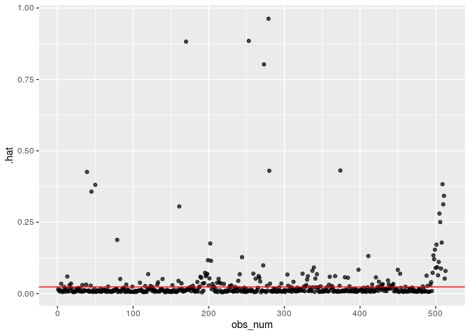

Characteristics of Recent Mexican Immigrants to the United States that
Influence Household Income
================
Ben 10
12/05/2019

\<\<\<\<\<\<\< HEAD Your project goes here\! Before you submit, make
sure your chunks are turned off with `echo = FALSE`.

You can add sections as you see fit. At a minimum, you should have the
following sections:

\======= \>\>\>\>\>\>\> a76ba95fa37e84fd7730a7d833d877bf04ef7777 \#\#
Section 1: Introduction (includes introduction and exploratory data
analysis) \#\# 1. Introduction

### 1.1 Objective

We are aiming to build a model to determine which characteristics of
Mexican immmigrants to the United States, specifically California,
well-explain variation in household income.

### 1.2 Description of Dataset

The dataset is from The Mexican Migration Project (MMP, \*see References
below for confidentiality terms). It was created in 1982 by an
interdisciplinary team of researchers to further our understanding of
the complex process of Mexican migration to the United States. The
project is a binational research effort co-directed by Jorge Durand,
professor of Social Anthropology at the University of Guadalajara
(Mexico), and Douglas S. Massey, professor of Sociology and Public
Affairs, with a joint appointment in the Woodrow Wilson School, at
Princeton University (US).

Since its inception, the MMP’s main focus has been to gather social as
well as economic information on Mexican-US migration. The data collected
has been compiled in a comprehensive database that is available to the
public free of charge for research and educational purposes through its
web-site. The MMP uses the ethnosurvey approach to gather data: in
winter months, they randomly sample households in communities throughout
Mexico, surveying household heads and members about their first and last
trip to the US, as well as economic and demographic information. They
then conduct the same survey in destination areas in the US, sampling
migrants from the same communities they survey in Mexico but who have
not returned to Mexico. Thus, the sample of migrants includes residents
in both Mexico and the US.

The MMP170 Database contains an initial file with general demographic,
economic, and migratory information for each member of a surveyed
household (PERS). Pers170 has 132 variables and 176701 observations,and
hence it is very large. Therefore, we selected 17 meaningful variables
and filtered out rows that contain N/A’s to create a new dataset labeled
`data`.

### 1.3 Method

We will build a multiple linear regression model to predict household
income considering the following variables: `sex`, `relhead`, `age`,
`statebrn`, `marstat`, `edyrs`, `occtype`, `usdur1`, `usdurl`, `usdoc1`,
`uscity`, `yrborn`.

“X1”: Number of observation

“sex”: Sex

“relhead”: Relationship to household head

“yrborn”: Year of birth

“age”: Age

“statebrn”: State of birth

“marstat”: Marital status

“edyrs”: School years completed

“occ”: Principal occupation

“hhincome” : Household income

“usstate1”: First US migration: State of residence

“usstatel”: Latest US migration: State of residence

“usplace1”: First US migration: City of residence (in place codes)

“usplacel”: Latest US migration: City of residence (in place codes)

“usdur1”: First US migration: Duration (in months)

“usdurl”: Latest US migration: Duration (in months)

“usdoc1”: Type of documentation

“occtype”: Category of occupation

“uscity”: City of residence during first US migration

Our response variable is household income: the total income for a single
household, reported in $USD. We chose to use the multiple linear
regression because our response variable is numeric, and there are
multiple predictor variables.

## 2\. Exploratory Data Analysis

### 2.1 Data Cleaning

Due to the complexity of our original data, we did not include data
cleaning in the analysis. For more information, please see our proposal,
where all the data cleaning happens.

However, we did make some adjustment according to the feedback that
there is large imbalance of the amount of data between regions, and that
the distribution of the response variable is not normal. Below is the
update on our data cleaning:

### 2.2 Updated Data Exploration

#### 2.2.1 Filter Only Immigrants in California

Accoridng to our previous data exploration, we found that the
overwhelming majority of immigrants settled in California, as shown in
the graph below:

<!-- -->

Hence, we decided to concentrate on California alone. Since the
originial dataset is large, we have enough data left in California alone
to produce meaningful analysis.

#### 2.2.2 Cut Household Income Groups

Originally, the distribution of log(Household Income)- our response
variable- was bimodal and had a median of 412,647 dollars. It almost
looks like 3 separate distributions:

<!-- -->

We determined that 412,647 dollars is an absurdly high median income for
a survey of largely undocumented immigrants in the US and believe that a
significant chunk of the high incomes were actually recorded in pesos.
The documentation for the data from the Mexican Migration Project does
not specify unit of hhincome; however, the project site details that
researchers surveyed communities in Mexico, then traveled to the US to
survey communities there. It seems likely that the communities surveyed
in Mexico would report income in pesos and those surveyed in the US
would report income in USD. However, the data was collected over a
period of 10 years, during which the exchange rate between pesos and USD
changed significantly. Hence, we cannot simply convert all the incomes
that appear to be recorded in pesos into USD.

Therefore, we decided to filter out the incomes above 60,000 to remove
what appears to be a second distribution of incomes in pesos. We will
also remove incomes of zero from our dataset, because it will interfere
with our model accuracy. However, this compromises our model’s
predicative range: our model will only be able to predict the household
income of those who already have jobs (income).

<!-- -->

Now the distribution of response variable (hhincome) looks like a right
skewed normal
distribution.

#### 2.2.2 Group cities by region

These immigrants to California arrived to the following cities:

Bay Area: Vallejo-Fairfield-Napa, San Francisco, San Jose, Santa
Cruz-Watsonville

Central California: Sacramento, Merced, Fresno, Bakersfield

Southern California: Santa Barbara-Santa Maria-Lompoc, Ventura, Los
Angeles-Long Beach, Orange County, Riverside-San Bernardino, and San
Diego.

We decided to simplify these cities into 3 regional categories: Bay
Area, Southern California and Central California.

Given the comparatively small number of cases in which no city was
reported, we deleted these instances. The majority of immigrants went to
LA-Long Beach area in Southern California.

#### 2.2.4 Remove Variable “relhead”

It turned out that all values from relhead (relationship to head of
household) in our cleaned data were “1” or head. So we will remove this
variable, as well as state variables since we are only using California
data. We will also remove place data since we are using uscity, and occ
since we are using occtype.

#### 2.2.5 Mean-center “age” , “usdur1” and “usdurl”

We must center age and usdurl in order to have a useful model intercept
interpretation.

    ## [1] 39.42495

    ## [1] 60.27096

    ## [1] 43.98635

    ## [1] 6.440546

The mean age in the dataset is 39.43 years ; the mean duration of last
US migration is 60.27 months (about 5 years); and the mean duration of
first US migration is 43.99 months (less than 3.5
years).

#### 2.2.6 Remove El Salvador Data and regionalize state born variable

We do not have any data from seven states: Baja California Sur, Chiapas,
Hidalgo, Quintana Roo, Sinaloa, Tlaxcala, and Yucatán.

We divided the remaining states into the following regions:

Baja California:

South East Mexico: Tabasco, Oaxaca, Campeche

Northern Mexico: Coahuila, Chihuahua, Durango, Nuevo Leon, Sonora,
Tamaulipas

Bajío: Aguascalientes, Guanajuato, Querétaro, San Luis Potosí, Zacatecas

Central Mexico: Mexico City, México, Morelos, Puebla

Pacific Coast:Colima, Guerrero, Jalisco, Michoacán, Nayarit

Veracruz:
Veracruz

## Section 2: Regression Analysis (includes the final model and discussion of assumptions)

## 2\. Multiple Linear Regression Model

In an effort to explain which characteristics of migrants influence
their household income, we will use a multiple linear regression model.
Since our response variable is numerical with mulitple potential
predictors, this is the best model at our disposal.

We will consider the potential interaction between principal occupation
and number of years of school completed, since those are generally
interconnected. We may also consider the interaction between
documentation type and occupation type, although the effect may be
insignificant. However, if the variables occtype, edyrs, or usdoc1 don’t
make it through the process of inital model selection, we will not
include these interactions in the model as that would not be prudent.

We will select our model using AIC criteria, because since we’re dealing
with people, we want to build a model that accounts for volatile human
nature and the ever-changing socioeconomic and political climate that
could influence someone’s household income. AIC is used when we would
rather say a variable is a relevant predictor, when in reality it might
not be and so in this case, we would rather err on the side of a false
positive because we are dealing with a constantly fluctuating
issue.

### 2.1 Full Model

#### 2.2.5 Remove Obvious Collinear Variable

`yrborn` and `age` provide the same information and are perfectly
linear, therefore we decided to remove `yrborn` from consideration in
the model.

## 3\. Multiple Linear Regression Model

In an effort to explain which characteristics of candidates influence
their household income, we will be using a multiple linear regression
model. Since our response variable is numerical with mulitple potential
predictors, this is the best model at our disposal for us to use.

We will consider the potential interaction between principal occupation
and number of years of school completed, since those are generally
interconnected. We may also consider the interaction between
documentation type and occupation type, although the effect may be
insignificant.

We will select our model using AIC criteria, because since we’re dealing
with people, we want to build a model that accounts for volatile human
nature and the ever-changing socioeconomic and political climate that
could influence someone’s household income. AIC is used when we would
rather say a variable is a relevant predictor, when in reality it might
not be and so in this case, we would rather err on the side of a false
positive because we are dealing with a constantly fluctuating issue.

### 3.1 Full Model

<table>

<thead>

<tr>

<th style="text-align:left;">

term

</th>

<th style="text-align:right;">

estimate

</th>

<th style="text-align:right;">

std.error

</th>

<th style="text-align:right;">

statistic

</th>

<th style="text-align:right;">

p.value

</th>

</tr>

</thead>

<tbody>

<tr>

<td style="text-align:left;">

(Intercept)

</td>

<td style="text-align:right;">

267.621

</td>

<td style="text-align:right;">

453.963

</td>

<td style="text-align:right;">

0.590

</td>

<td style="text-align:right;">

0.556

</td>

</tr>

<tr>

<td style="text-align:left;">

sexM

</td>

<td style="text-align:right;">

350.823

</td>

<td style="text-align:right;">

185.224

</td>

<td style="text-align:right;">

1.894

</td>

<td style="text-align:right;">

0.059

</td>

</tr>

<tr>

<td style="text-align:left;">

age

</td>

<td style="text-align:right;">

6.060

</td>

<td style="text-align:right;">

2.802

</td>

<td style="text-align:right;">

2.162

</td>

<td style="text-align:right;">

0.031

</td>

</tr>

<tr>

<td style="text-align:left;">

statebrnBajío

</td>

<td style="text-align:right;">

306.062

</td>

<td style="text-align:right;">

373.582

</td>

<td style="text-align:right;">

0.819

</td>

<td style="text-align:right;">

0.413

</td>

</tr>

<tr>

<td style="text-align:left;">

statebrnCentral Mexico

</td>

<td style="text-align:right;">

545.273

</td>

<td style="text-align:right;">

431.845

</td>

<td style="text-align:right;">

1.263

</td>

<td style="text-align:right;">

0.207

</td>

</tr>

<tr>

<td style="text-align:left;">

statebrnNorthern Mexico

</td>

<td style="text-align:right;">

302.960

</td>

<td style="text-align:right;">

492.875

</td>

<td style="text-align:right;">

0.615

</td>

<td style="text-align:right;">

0.539

</td>

</tr>

<tr>

<td style="text-align:left;">

statebrnPacific Coast

</td>

<td style="text-align:right;">

204.214

</td>

<td style="text-align:right;">

373.477

</td>

<td style="text-align:right;">

0.547

</td>

<td style="text-align:right;">

0.585

</td>

</tr>

<tr>

<td style="text-align:left;">

statebrnSouth East Mexico

</td>

<td style="text-align:right;">

412.272

</td>

<td style="text-align:right;">

389.942

</td>

<td style="text-align:right;">

1.057

</td>

<td style="text-align:right;">

0.291

</td>

</tr>

<tr>

<td style="text-align:left;">

statebrnVeracruz

</td>

<td style="text-align:right;">

424.901

</td>

<td style="text-align:right;">

518.258

</td>

<td style="text-align:right;">

0.820

</td>

<td style="text-align:right;">

0.413

</td>

</tr>

<tr>

<td style="text-align:left;">

marstatDivorced

</td>

<td style="text-align:right;">

230.185

</td>

<td style="text-align:right;">

214.257

</td>

<td style="text-align:right;">

1.074

</td>

<td style="text-align:right;">

0.283

</td>

</tr>

<tr>

<td style="text-align:left;">

marstatMarried

</td>

<td style="text-align:right;">

37.163

</td>

<td style="text-align:right;">

116.815

</td>

<td style="text-align:right;">

0.318

</td>

<td style="text-align:right;">

0.751

</td>

</tr>

<tr>

<td style="text-align:left;">

marstatNever married

</td>

<td style="text-align:right;">

\-172.109

</td>

<td style="text-align:right;">

163.702

</td>

<td style="text-align:right;">

\-1.051

</td>

<td style="text-align:right;">

0.294

</td>

</tr>

<tr>

<td style="text-align:left;">

marstatSeparated

</td>

<td style="text-align:right;">

127.210

</td>

<td style="text-align:right;">

230.677

</td>

<td style="text-align:right;">

0.551

</td>

<td style="text-align:right;">

0.582

</td>

</tr>

<tr>

<td style="text-align:left;">

marstatWidowed

</td>

<td style="text-align:right;">

117.055

</td>

<td style="text-align:right;">

243.454

</td>

<td style="text-align:right;">

0.481

</td>

<td style="text-align:right;">

0.631

</td>

</tr>

<tr>

<td style="text-align:left;">

edyrs

</td>

<td style="text-align:right;">

14.603

</td>

<td style="text-align:right;">

7.702

</td>

<td style="text-align:right;">

1.896

</td>

<td style="text-align:right;">

0.059

</td>

</tr>

<tr>

<td style="text-align:left;">

occtypeAdministrator

</td>

<td style="text-align:right;">

31.277

</td>

<td style="text-align:right;">

267.633

</td>

<td style="text-align:right;">

0.117

</td>

<td style="text-align:right;">

0.907

</td>

</tr>

<tr>

<td style="text-align:left;">

occtypeAgriculture

</td>

<td style="text-align:right;">

\-271.064

</td>

<td style="text-align:right;">

137.151

</td>

<td style="text-align:right;">

\-1.976

</td>

<td style="text-align:right;">

0.049

</td>

</tr>

<tr>

<td style="text-align:left;">

occtypeArts

</td>

<td style="text-align:right;">

\-632.718

</td>

<td style="text-align:right;">

529.078

</td>

<td style="text-align:right;">

\-1.196

</td>

<td style="text-align:right;">

0.232

</td>

</tr>

<tr>

<td style="text-align:left;">

occtypeEducator

</td>

<td style="text-align:right;">

367.527

</td>

<td style="text-align:right;">

329.979

</td>

<td style="text-align:right;">

1.114

</td>

<td style="text-align:right;">

0.266

</td>

</tr>

<tr>

<td style="text-align:left;">

occtypeHomemaker

</td>

<td style="text-align:right;">

\-264.271

</td>

<td style="text-align:right;">

561.590

</td>

<td style="text-align:right;">

\-0.471

</td>

<td style="text-align:right;">

0.638

</td>

</tr>

<tr>

<td style="text-align:left;">

occtypeManufacturing (skilled)

</td>

<td style="text-align:right;">

\-117.143

</td>

<td style="text-align:right;">

134.321

</td>

<td style="text-align:right;">

\-0.872

</td>

<td style="text-align:right;">

0.384

</td>

</tr>

<tr>

<td style="text-align:left;">

occtypeManufacturing (unskilled)

</td>

<td style="text-align:right;">

\-180.623

</td>

<td style="text-align:right;">

135.350

</td>

<td style="text-align:right;">

\-1.334

</td>

<td style="text-align:right;">

0.183

</td>

</tr>

<tr>

<td style="text-align:left;">

occtypeOther, unspecified (disabled, incarcerated, tourist and other)

</td>

<td style="text-align:right;">

\-769.333

</td>

<td style="text-align:right;">

428.448

</td>

<td style="text-align:right;">

\-1.796

</td>

<td style="text-align:right;">

0.073

</td>

</tr>

<tr>

<td style="text-align:left;">

occtypeProfessional

</td>

<td style="text-align:right;">

114.958

</td>

<td style="text-align:right;">

416.931

</td>

<td style="text-align:right;">

0.276

</td>

<td style="text-align:right;">

0.783

</td>

</tr>

<tr>

<td style="text-align:left;">

occtypeProtection

</td>

<td style="text-align:right;">

\-249.559

</td>

<td style="text-align:right;">

387.649

</td>

<td style="text-align:right;">

\-0.644

</td>

<td style="text-align:right;">

0.520

</td>

</tr>

<tr>

<td style="text-align:left;">

occtypeRetired

</td>

<td style="text-align:right;">

\-548.095

</td>

<td style="text-align:right;">

230.226

</td>

<td style="text-align:right;">

\-2.381

</td>

<td style="text-align:right;">

0.018

</td>

</tr>

<tr>

<td style="text-align:left;">

occtypeSales

</td>

<td style="text-align:right;">

\-98.639

</td>

<td style="text-align:right;">

144.922

</td>

<td style="text-align:right;">

\-0.681

</td>

<td style="text-align:right;">

0.496

</td>

</tr>

<tr>

<td style="text-align:left;">

occtypeServices

</td>

<td style="text-align:right;">

\-116.772

</td>

<td style="text-align:right;">

139.963

</td>

<td style="text-align:right;">

\-0.834

</td>

<td style="text-align:right;">

0.405

</td>

</tr>

<tr>

<td style="text-align:left;">

occtypeStudent

</td>

<td style="text-align:right;">

50.884

</td>

<td style="text-align:right;">

543.219

</td>

<td style="text-align:right;">

0.094

</td>

<td style="text-align:right;">

0.925

</td>

</tr>

<tr>

<td style="text-align:left;">

occtypeTechnical Worker

</td>

<td style="text-align:right;">

\-132.215

</td>

<td style="text-align:right;">

244.261

</td>

<td style="text-align:right;">

\-0.541

</td>

<td style="text-align:right;">

0.589

</td>

</tr>

<tr>

<td style="text-align:left;">

occtypeTransportation

</td>

<td style="text-align:right;">

\-132.103

</td>

<td style="text-align:right;">

164.721

</td>

<td style="text-align:right;">

\-0.802

</td>

<td style="text-align:right;">

0.423

</td>

</tr>

<tr>

<td style="text-align:left;">

occtypeUnemployed (seeking work)

</td>

<td style="text-align:right;">

\-531.707

</td>

<td style="text-align:right;">

330.972

</td>

<td style="text-align:right;">

\-1.607

</td>

<td style="text-align:right;">

0.109

</td>

</tr>

<tr>

<td style="text-align:left;">

usdur1

</td>

<td style="text-align:right;">

\-0.345

</td>

<td style="text-align:right;">

0.423

</td>

<td style="text-align:right;">

\-0.816

</td>

<td style="text-align:right;">

0.415

</td>

</tr>

<tr>

<td style="text-align:left;">

usdurl

</td>

<td style="text-align:right;">

0.766

</td>

<td style="text-align:right;">

0.367

</td>

<td style="text-align:right;">

2.087

</td>

<td style="text-align:right;">

0.037

</td>

</tr>

<tr>

<td style="text-align:left;">

usdoc1Legal resident

</td>

<td style="text-align:right;">

155.505

</td>

<td style="text-align:right;">

142.052

</td>

<td style="text-align:right;">

1.095

</td>

<td style="text-align:right;">

0.274

</td>

</tr>

<tr>

<td style="text-align:left;">

usdoc1Temporary: Tourist/visitor

</td>

<td style="text-align:right;">

\-122.266

</td>

<td style="text-align:right;">

151.262

</td>

<td style="text-align:right;">

\-0.808

</td>

<td style="text-align:right;">

0.419

</td>

</tr>

<tr>

<td style="text-align:left;">

usdoc1Undocumented

</td>

<td style="text-align:right;">

\-51.569

</td>

<td style="text-align:right;">

118.027

</td>

<td style="text-align:right;">

\-0.437

</td>

<td style="text-align:right;">

0.662

</td>

</tr>

<tr>

<td style="text-align:left;">

uscitycentcal

</td>

<td style="text-align:right;">

42.587

</td>

<td style="text-align:right;">

102.053

</td>

<td style="text-align:right;">

0.417

</td>

<td style="text-align:right;">

0.677

</td>

</tr>

<tr>

<td style="text-align:left;">

uscitysocal

</td>

<td style="text-align:right;">

35.589

</td>

<td style="text-align:right;">

83.092

</td>

<td style="text-align:right;">

0.428

</td>

<td style="text-align:right;">

0.669

</td>

</tr>

</tbody>

</table>

### 3.2 Backward selection

    ## Start:  AIC=6435.23
    ## hhincome ~ sex + age + statebrn + marstat + edyrs + occtype + 
    ##     usdur1 + usdurl + usdoc1 + uscity
    ## 
    ##            Df Sum of Sq       RSS    AIC
    ## - occtype  17   5145317 128741575 6422.2
    ## - marstat   5   1167949 124764207 6430.1
    ## - uscity    2     54436 123650694 6431.5
    ## - statebrn  6   2164248 125760506 6432.1
    ## - usdur1    1    173436 123769694 6433.9
    ## <none>                  123596258 6435.2
    ## - usdoc1    3   1556298 125152557 6435.6
    ## - sex       1    935427 124531685 6437.1
    ## - edyrs     1    937392 124533650 6437.1
    ## - usdurl    1   1135516 124731774 6437.9
    ## - age       1   1219328 124815586 6438.3
    ## 
    ## Step:  AIC=6422.15
    ## hhincome ~ sex + age + statebrn + marstat + edyrs + usdur1 + 
    ##     usdurl + usdoc1 + uscity
    ## 
    ##            Df Sum of Sq       RSS    AIC
    ## - marstat   5    722692 129464267 6415.0
    ## - uscity    2    109334 128850909 6418.6
    ## - statebrn  6   2401708 131143283 6419.6
    ## - usdur1    1    277349 129018925 6421.3
    ## - usdoc1    3   1344250 130085825 6421.5
    ## <none>                  128741575 6422.2
    ## - sex       1    627460 129369036 6422.6
    ## - age       1    965303 129706878 6424.0
    ## - usdurl    1   1634957 130376532 6426.6
    ## - edyrs     1   2289870 131031445 6429.2
    ## 
    ## Step:  AIC=6415.02
    ## hhincome ~ sex + age + statebrn + edyrs + usdur1 + usdurl + usdoc1 + 
    ##     uscity
    ## 
    ##            Df Sum of Sq       RSS    AIC
    ## - uscity    2    160495 129624762 6411.7
    ## - statebrn  6   2731122 132195389 6413.7
    ## - usdur1    1    286204 129750471 6414.2
    ## - usdoc1    3   1437832 130902099 6414.7
    ## <none>                  129464267 6415.0
    ## - sex       1   1074621 130538888 6417.3
    ## - age       1   1284372 130748639 6418.1
    ## - usdurl    1   1674735 131139002 6419.6
    ## - edyrs     1   2203470 131667737 6421.7
    ## 
    ## Step:  AIC=6411.66
    ## hhincome ~ sex + age + statebrn + edyrs + usdur1 + usdurl + usdoc1
    ## 
    ##            Df Sum of Sq       RSS    AIC
    ## - usdur1    1    240205 129864967 6410.6
    ## - statebrn  6   2823152 132447914 6410.7
    ## - usdoc1    3   1385152 131009914 6411.1
    ## <none>                  129624762 6411.7
    ## - sex       1   1031903 130656664 6413.7
    ## - age       1   1268506 130893268 6414.7
    ## - usdurl    1   1639661 131264422 6416.1
    ## - edyrs     1   2265119 131889880 6418.5
    ## 
    ## Step:  AIC=6410.61
    ## hhincome ~ sex + age + statebrn + edyrs + usdurl + usdoc1
    ## 
    ##            Df Sum of Sq       RSS    AIC
    ## - usdoc1    3   1277579 131142546 6409.6
    ## - statebrn  6   2881999 132746966 6409.9
    ## <none>                  129864967 6410.6
    ## - sex       1   1281641 131146608 6413.6
    ## - age       1   1364456 131229423 6414.0
    ## - usdurl    1   1616610 131481577 6415.0
    ## - edyrs     1   2341786 132206753 6417.8
    ## 
    ## Step:  AIC=6409.63
    ## hhincome ~ sex + age + statebrn + edyrs + usdurl
    ## 
    ##            Df Sum of Sq       RSS    AIC
    ## - statebrn  6   3099098 134241644 6409.6
    ## <none>                  131142546 6409.6
    ## - sex       1   1513927 132656473 6413.5
    ## - usdurl    1   1913698 133056244 6415.1
    ## - age       1   2007822 133150368 6415.4
    ## - edyrs     1   2987926 134130472 6419.2
    ## 
    ## Step:  AIC=6409.61
    ## hhincome ~ sex + age + edyrs + usdurl
    ## 
    ##          Df Sum of Sq       RSS    AIC
    ## <none>                134241644 6409.6
    ## - sex     1   1249042 135490686 6412.4
    ## - usdurl  1   1733473 135975117 6414.2
    ## - age     1   2491615 136733260 6417.0
    ## - edyrs   1   3203237 137444881 6419.7

| term        | estimate | std.error | statistic | p.value | conf.low | conf.high |
| :---------- | -------: | --------: | --------: | ------: | -------: | --------: |
| (Intercept) |  435.912 |   120.504 |     3.617 |   0.000 |  199.164 |   672.660 |
| sexM        |  241.933 |   111.280 |     2.174 |   0.030 |   23.307 |   460.559 |
| age         |    6.725 |     2.190 |     3.071 |   0.002 |    2.422 |    11.028 |
| edyrs       |   23.641 |     6.790 |     3.482 |   0.001 |   10.301 |    36.982 |
| usdurl      |    0.662 |     0.258 |     2.561 |   0.011 |    0.154 |     1.169 |

Using backward selection based on AIC, we narrowed down to 4 variables:
sex, edyrs, usdurl and age.

### 3.3 Interactions

To find potential interactions between the 4 variables, we used nested-F
test for each of the possible interactions:

After inital backwards selection, we will explore the possible
interactions between remaining variables: `edyrs`, `usdurl`, `sex`, and
`age`, to determine if any are significant.

| Res.Df |       RSS | Df | Sum of Sq | Pr(\>Chi) |
| -----: | --------: | -: | --------: | --------: |
|    508 | 134241644 | NA |        NA |        NA |
|    507 | 134188199 |  1 |  53444.74 |     0.653 |

First, we tested the interaction between `edyrs` and `usdurl`. The
p-value for this test was 0.653 \> 0.05, therefore we will not include
it in the model.

| Res.Df |       RSS | Df | Sum of Sq | Pr(\>Chi) |
| -----: | --------: | -: | --------: | --------: |
|    508 | 134241644 | NA |        NA |        NA |
|    507 | 133063129 |  1 |   1178515 |     0.034 |

Then, we tested the interaction between `sex` and `usdurl`. The p-value
for this test was 0.034 \< 0.05, therefore we will include it in the
model.

| Res.Df |       RSS | Df | Sum of Sq | Pr(\>Chi) |
| -----: | --------: | -: | --------: | --------: |
|    508 | 134241644 | NA |        NA |        NA |
|    507 | 133809343 |  1 |  432301.3 |     0.201 |

Then, we tested the interaction between `age` and `usdurl`. The p-value
for this test was 0.201 \> 0.05, therefore we will not include it in the
model.

| Res.Df |       RSS | Df | Sum of Sq | Pr(\>Chi) |
| -----: | --------: | -: | --------: | --------: |
|    508 | 134241644 | NA |        NA |        NA |
|    507 | 133986215 |  1 |  255429.1 |     0.326 |

Then, we tested the interaction between `sex` and `edyrs`. The p-value
for this test was 0.326 \> 0.05, therefore we will not include it in the
model.

| Res.Df |       RSS | Df | Sum of Sq | Pr(\>Chi) |
| -----: | --------: | -: | --------: | --------: |
|    508 | 134241644 | NA |        NA |        NA |
|    507 | 128320533 |  1 |   5921111 |         0 |

Then, we tested the interaction between `age` and `edyrs`. The p-value
for this test was 0 \< 0.05, therefore we will include it in the model.

| Res.Df |       RSS | Df | Sum of Sq | Pr(\>Chi) |
| -----: | --------: | -: | --------: | --------: |
|    508 | 134241644 | NA |        NA |        NA |
|    507 | 134034469 |  1 |  207174.7 |     0.376 |

Then, we tested the interaction between `age` and `sex`. The p-value for
this test was 0.376 \> 0.05, therefore we will not include it in the
model.

Through nested F-test, we observed significant interactions between age
& edyrs and between sex & usdurl, with respective p-values of 0 and
0.034 and will be including them in our model.

### 3.4 Model with Interaction

<table>

<thead>

<tr>

<th style="text-align:left;">

term

</th>

<th style="text-align:right;">

estimate

</th>

<th style="text-align:right;">

std.error

</th>

<th style="text-align:right;">

statistic

</th>

<th style="text-align:right;">

p.value

</th>

</tr>

</thead>

<tbody>

<tr>

<td style="text-align:left;">

(Intercept)

</td>

<td style="text-align:right;">

435.625

</td>

<td style="text-align:right;">

118.863

</td>

<td style="text-align:right;">

3.665

</td>

<td style="text-align:right;">

0.000

</td>

</tr>

<tr>

<td style="text-align:left;">

sexM

</td>

<td style="text-align:right;">

279.468

</td>

<td style="text-align:right;">

109.513

</td>

<td style="text-align:right;">

2.552

</td>

<td style="text-align:right;">

0.011

</td>

</tr>

<tr>

<td style="text-align:left;">

age

</td>

<td style="text-align:right;">

\-6.969

</td>

<td style="text-align:right;">

3.614

</td>

<td style="text-align:right;">

\-1.928

</td>

<td style="text-align:right;">

0.054

</td>

</tr>

<tr>

<td style="text-align:left;">

edyrs

</td>

<td style="text-align:right;">

25.408

</td>

<td style="text-align:right;">

6.641

</td>

<td style="text-align:right;">

3.826

</td>

<td style="text-align:right;">

0.000

</td>

</tr>

<tr>

<td style="text-align:left;">

usdurl

</td>

<td style="text-align:right;">

1.881

</td>

<td style="text-align:right;">

0.795

</td>

<td style="text-align:right;">

2.366

</td>

<td style="text-align:right;">

0.018

</td>

</tr>

<tr>

<td style="text-align:left;">

age:edyrs

</td>

<td style="text-align:right;">

2.576

</td>

<td style="text-align:right;">

0.549

</td>

<td style="text-align:right;">

4.694

</td>

<td style="text-align:right;">

0.000

</td>

</tr>

<tr>

<td style="text-align:left;">

sexM:usdurl

</td>

<td style="text-align:right;">

\-1.493

</td>

<td style="text-align:right;">

0.833

</td>

<td style="text-align:right;">

\-1.793

</td>

<td style="text-align:right;">

0.074

</td>

</tr>

</tbody>

</table>

### 3.5 Backward Selection with Interaction

Since we observed 2 pairs of significant interactions, we will do the
backward selection again with the new interaction terms.

<table>

<thead>

<tr>

<th style="text-align:left;">

term

</th>

<th style="text-align:right;">

estimate

</th>

<th style="text-align:right;">

std.error

</th>

<th style="text-align:right;">

statistic

</th>

<th style="text-align:right;">

p.value

</th>

</tr>

</thead>

<tbody>

<tr>

<td style="text-align:left;">

(Intercept)

</td>

<td style="text-align:right;">

589.627

</td>

<td style="text-align:right;">

448.455

</td>

<td style="text-align:right;">

1.315

</td>

<td style="text-align:right;">

0.189

</td>

</tr>

<tr>

<td style="text-align:left;">

sexM

</td>

<td style="text-align:right;">

330.086

</td>

<td style="text-align:right;">

181.336

</td>

<td style="text-align:right;">

1.820

</td>

<td style="text-align:right;">

0.069

</td>

</tr>

<tr>

<td style="text-align:left;">

age

</td>

<td style="text-align:right;">

\-7.549

</td>

<td style="text-align:right;">

4.230

</td>

<td style="text-align:right;">

\-1.785

</td>

<td style="text-align:right;">

0.075

</td>

</tr>

<tr>

<td style="text-align:left;">

statebrnBajío

</td>

<td style="text-align:right;">

126.469

</td>

<td style="text-align:right;">

366.058

</td>

<td style="text-align:right;">

0.345

</td>

<td style="text-align:right;">

0.730

</td>

</tr>

<tr>

<td style="text-align:left;">

statebrnCentral Mexico

</td>

<td style="text-align:right;">

342.778

</td>

<td style="text-align:right;">

423.068

</td>

<td style="text-align:right;">

0.810

</td>

<td style="text-align:right;">

0.418

</td>

</tr>

<tr>

<td style="text-align:left;">

statebrnNorthern Mexico

</td>

<td style="text-align:right;">

153.623

</td>

<td style="text-align:right;">

481.585

</td>

<td style="text-align:right;">

0.319

</td>

<td style="text-align:right;">

0.750

</td>

</tr>

<tr>

<td style="text-align:left;">

statebrnPacific Coast

</td>

<td style="text-align:right;">

35.138

</td>

<td style="text-align:right;">

365.739

</td>

<td style="text-align:right;">

0.096

</td>

<td style="text-align:right;">

0.924

</td>

</tr>

<tr>

<td style="text-align:left;">

statebrnSouth East Mexico

</td>

<td style="text-align:right;">

245.664

</td>

<td style="text-align:right;">

381.693

</td>

<td style="text-align:right;">

0.644

</td>

<td style="text-align:right;">

0.520

</td>

</tr>

<tr>

<td style="text-align:left;">

statebrnVeracruz

</td>

<td style="text-align:right;">

199.363

</td>

<td style="text-align:right;">

507.405

</td>

<td style="text-align:right;">

0.393

</td>

<td style="text-align:right;">

0.695

</td>

</tr>

<tr>

<td style="text-align:left;">

marstatDivorced

</td>

<td style="text-align:right;">

206.390

</td>

<td style="text-align:right;">

210.025

</td>

<td style="text-align:right;">

0.983

</td>

<td style="text-align:right;">

0.326

</td>

</tr>

<tr>

<td style="text-align:left;">

marstatMarried

</td>

<td style="text-align:right;">

31.444

</td>

<td style="text-align:right;">

113.934

</td>

<td style="text-align:right;">

0.276

</td>

<td style="text-align:right;">

0.783

</td>

</tr>

<tr>

<td style="text-align:left;">

marstatNever married

</td>

<td style="text-align:right;">

\-153.766

</td>

<td style="text-align:right;">

159.700

</td>

<td style="text-align:right;">

\-0.963

</td>

<td style="text-align:right;">

0.336

</td>

</tr>

<tr>

<td style="text-align:left;">

marstatSeparated

</td>

<td style="text-align:right;">

72.602

</td>

<td style="text-align:right;">

225.338

</td>

<td style="text-align:right;">

0.322

</td>

<td style="text-align:right;">

0.747

</td>

</tr>

<tr>

<td style="text-align:left;">

marstatWidowed

</td>

<td style="text-align:right;">

47.316

</td>

<td style="text-align:right;">

242.123

</td>

<td style="text-align:right;">

0.195

</td>

<td style="text-align:right;">

0.845

</td>

</tr>

<tr>

<td style="text-align:left;">

edyrs

</td>

<td style="text-align:right;">

15.080

</td>

<td style="text-align:right;">

7.532

</td>

<td style="text-align:right;">

2.002

</td>

<td style="text-align:right;">

0.046

</td>

</tr>

<tr>

<td style="text-align:left;">

occtypeAdministrator

</td>

<td style="text-align:right;">

24.460

</td>

<td style="text-align:right;">

261.288

</td>

<td style="text-align:right;">

0.094

</td>

<td style="text-align:right;">

0.925

</td>

</tr>

<tr>

<td style="text-align:left;">

occtypeAgriculture

</td>

<td style="text-align:right;">

\-284.379

</td>

<td style="text-align:right;">

133.957

</td>

<td style="text-align:right;">

\-2.123

</td>

<td style="text-align:right;">

0.034

</td>

</tr>

<tr>

<td style="text-align:left;">

occtypeArts

</td>

<td style="text-align:right;">

\-739.995

</td>

<td style="text-align:right;">

516.441

</td>

<td style="text-align:right;">

\-1.433

</td>

<td style="text-align:right;">

0.153

</td>

</tr>

<tr>

<td style="text-align:left;">

occtypeEducator

</td>

<td style="text-align:right;">

283.858

</td>

<td style="text-align:right;">

323.777

</td>

<td style="text-align:right;">

0.877

</td>

<td style="text-align:right;">

0.381

</td>

</tr>

<tr>

<td style="text-align:left;">

occtypeHomemaker

</td>

<td style="text-align:right;">

\-288.364

</td>

<td style="text-align:right;">

558.623

</td>

<td style="text-align:right;">

\-0.516

</td>

<td style="text-align:right;">

0.606

</td>

</tr>

<tr>

<td style="text-align:left;">

occtypeManufacturing (skilled)

</td>

<td style="text-align:right;">

\-125.817

</td>

<td style="text-align:right;">

131.017

</td>

<td style="text-align:right;">

\-0.960

</td>

<td style="text-align:right;">

0.337

</td>

</tr>

<tr>

<td style="text-align:left;">

occtypeManufacturing (unskilled)

</td>

<td style="text-align:right;">

\-199.920

</td>

<td style="text-align:right;">

132.063

</td>

<td style="text-align:right;">

\-1.514

</td>

<td style="text-align:right;">

0.131

</td>

</tr>

<tr>

<td style="text-align:left;">

occtypeOther, unspecified (disabled, incarcerated, tourist and other)

</td>

<td style="text-align:right;">

\-718.653

</td>

<td style="text-align:right;">

418.004

</td>

<td style="text-align:right;">

\-1.719

</td>

<td style="text-align:right;">

0.086

</td>

</tr>

<tr>

<td style="text-align:left;">

occtypeProfessional

</td>

<td style="text-align:right;">

154.280

</td>

<td style="text-align:right;">

407.123

</td>

<td style="text-align:right;">

0.379

</td>

<td style="text-align:right;">

0.705

</td>

</tr>

<tr>

<td style="text-align:left;">

occtypeProtection

</td>

<td style="text-align:right;">

\-245.636

</td>

<td style="text-align:right;">

378.160

</td>

<td style="text-align:right;">

\-0.650

</td>

<td style="text-align:right;">

0.516

</td>

</tr>

<tr>

<td style="text-align:left;">

occtypeRetired

</td>

<td style="text-align:right;">

\-533.439

</td>

<td style="text-align:right;">

224.567

</td>

<td style="text-align:right;">

\-2.375

</td>

<td style="text-align:right;">

0.018

</td>

</tr>

<tr>

<td style="text-align:left;">

occtypeSales

</td>

<td style="text-align:right;">

\-117.625

</td>

<td style="text-align:right;">

141.393

</td>

<td style="text-align:right;">

\-0.832

</td>

<td style="text-align:right;">

0.406

</td>

</tr>

<tr>

<td style="text-align:left;">

occtypeServices

</td>

<td style="text-align:right;">

\-125.831

</td>

<td style="text-align:right;">

136.613

</td>

<td style="text-align:right;">

\-0.921

</td>

<td style="text-align:right;">

0.357

</td>

</tr>

<tr>

<td style="text-align:left;">

occtypeStudent

</td>

<td style="text-align:right;">

219.259

</td>

<td style="text-align:right;">

531.599

</td>

<td style="text-align:right;">

0.412

</td>

<td style="text-align:right;">

0.680

</td>

</tr>

<tr>

<td style="text-align:left;">

occtypeTechnical Worker

</td>

<td style="text-align:right;">

\-164.213

</td>

<td style="text-align:right;">

238.416

</td>

<td style="text-align:right;">

\-0.689

</td>

<td style="text-align:right;">

0.491

</td>

</tr>

<tr>

<td style="text-align:left;">

occtypeTransportation

</td>

<td style="text-align:right;">

\-105.344

</td>

<td style="text-align:right;">

160.738

</td>

<td style="text-align:right;">

\-0.655

</td>

<td style="text-align:right;">

0.513

</td>

</tr>

<tr>

<td style="text-align:left;">

occtypeUnemployed (seeking work)

</td>

<td style="text-align:right;">

\-478.821

</td>

<td style="text-align:right;">

323.710

</td>

<td style="text-align:right;">

\-1.479

</td>

<td style="text-align:right;">

0.140

</td>

</tr>

<tr>

<td style="text-align:left;">

usdur1

</td>

<td style="text-align:right;">

\-0.587

</td>

<td style="text-align:right;">

0.422

</td>

<td style="text-align:right;">

\-1.390

</td>

<td style="text-align:right;">

0.165

</td>

</tr>

<tr>

<td style="text-align:left;">

usdurl

</td>

<td style="text-align:right;">

2.717

</td>

<td style="text-align:right;">

0.934

</td>

<td style="text-align:right;">

2.911

</td>

<td style="text-align:right;">

0.004

</td>

</tr>

<tr>

<td style="text-align:left;">

usdoc1Legal resident

</td>

<td style="text-align:right;">

107.476

</td>

<td style="text-align:right;">

140.095

</td>

<td style="text-align:right;">

0.767

</td>

<td style="text-align:right;">

0.443

</td>

</tr>

<tr>

<td style="text-align:left;">

usdoc1Temporary: Tourist/visitor

</td>

<td style="text-align:right;">

\-191.001

</td>

<td style="text-align:right;">

150.055

</td>

<td style="text-align:right;">

\-1.273

</td>

<td style="text-align:right;">

0.204

</td>

</tr>

<tr>

<td style="text-align:left;">

usdoc1Undocumented

</td>

<td style="text-align:right;">

\-124.989

</td>

<td style="text-align:right;">

116.525

</td>

<td style="text-align:right;">

\-1.073

</td>

<td style="text-align:right;">

0.284

</td>

</tr>

<tr>

<td style="text-align:left;">

uscitycentcal

</td>

<td style="text-align:right;">

33.783

</td>

<td style="text-align:right;">

99.551

</td>

<td style="text-align:right;">

0.339

</td>

<td style="text-align:right;">

0.734

</td>

</tr>

<tr>

<td style="text-align:left;">

uscitysocal

</td>

<td style="text-align:right;">

32.241

</td>

<td style="text-align:right;">

81.098

</td>

<td style="text-align:right;">

0.398

</td>

<td style="text-align:right;">

0.691

</td>

</tr>

<tr>

<td style="text-align:left;">

sexM:usdurl

</td>

<td style="text-align:right;">

\-2.140

</td>

<td style="text-align:right;">

0.909

</td>

<td style="text-align:right;">

\-2.353

</td>

<td style="text-align:right;">

0.019

</td>

</tr>

<tr>

<td style="text-align:left;">

age:edyrs

</td>

<td style="text-align:right;">

2.407

</td>

<td style="text-align:right;">

0.574

</td>

<td style="text-align:right;">

4.190

</td>

<td style="text-align:right;">

0.000

</td>

</tr>

</tbody>

</table>

    ## Start:  AIC=6411.39
    ## hhincome ~ sex + age + statebrn + marstat + edyrs + occtype + 
    ##     usdur1 + usdurl + usdoc1 + uscity + sex * usdurl + age * 
    ##     edyrs
    ## 
    ##              Df Sum of Sq       RSS    AIC
    ## - occtype    17   4981945 122050653 6398.8
    ## - marstat     5    899295 117968003 6405.3
    ## - statebrn    6   1745335 118814043 6407.0
    ## - uscity      2     40755 117109463 6407.6
    ## <none>                    117068708 6411.4
    ## - usdur1      1    479217 117547925 6411.5
    ## - usdoc1      3   2069260 119137968 6414.4
    ## - sex:usdurl  1   1373689 118442397 6415.4
    ## - age:edyrs   1   4353874 121422582 6428.1
    ## 
    ## Step:  AIC=6398.77
    ## hhincome ~ sex + age + statebrn + marstat + edyrs + usdur1 + 
    ##     usdurl + usdoc1 + uscity + sex:usdurl + age:edyrs
    ## 
    ##              Df Sum of Sq       RSS    AIC
    ## - marstat     5    550220 122600873 6391.1
    ## - uscity      2    110698 122161351 6395.2
    ## - statebrn    6   2082511 124133164 6395.5
    ## <none>                    122050653 6398.8
    ## - usdur1      1    565227 122615880 6399.1
    ## - usdoc1      3   1750733 123801386 6400.1
    ## - sex:usdurl  1   1208136 123258789 6401.8
    ## - age:edyrs   1   4889253 126939906 6416.9
    ## 
    ## Step:  AIC=6391.08
    ## hhincome ~ sex + age + statebrn + edyrs + usdur1 + usdurl + usdoc1 + 
    ##     uscity + sex:usdurl + age:edyrs
    ## 
    ##              Df Sum of Sq       RSS    AIC
    ## - uscity      2    157008 122757880 6387.7
    ## - statebrn    6   2389466 124990339 6389.0
    ## <none>                    122600873 6391.1
    ## - usdur1      1    571421 123172294 6391.5
    ## - usdoc1      3   1869558 124470431 6392.8
    ## - sex:usdurl  1   1255107 123855979 6394.3
    ## - age:edyrs   1   5133018 127733890 6410.1
    ## 
    ## Step:  AIC=6387.74
    ## hhincome ~ sex + age + statebrn + edyrs + usdur1 + usdurl + usdoc1 + 
    ##     sex:usdurl + age:edyrs
    ## 
    ##              Df Sum of Sq       RSS    AIC
    ## - statebrn    6   2461595 125219475 6385.9
    ## <none>                    122757880 6387.7
    ## - usdur1      1    512923 123270803 6387.9
    ## - usdoc1      3   1810334 124568214 6389.2
    ## - sex:usdurl  1   1223859 123981740 6390.8
    ## - age:edyrs   1   5177062 127934943 6406.9
    ## 
    ## Step:  AIC=6385.92
    ## hhincome ~ sex + age + edyrs + usdur1 + usdurl + usdoc1 + sex:usdurl + 
    ##     age:edyrs
    ## 
    ##              Df Sum of Sq       RSS    AIC
    ## <none>                    125219475 6385.9
    ## - usdur1      1    555672 125775147 6386.2
    ## - usdoc1      3   1943461 127162936 6387.8
    ## - sex:usdurl  1   1177794 126397269 6388.7
    ## - age:edyrs   1   5566474 130785949 6406.2

| term                             |  estimate | std.error | statistic | p.value |  conf.low | conf.high |
| :------------------------------- | --------: | --------: | --------: | ------: | --------: | --------: |
| (Intercept)                      |   543.131 |   171.838 |     3.161 |   0.002 |   205.521 |   880.741 |
| sexM                             |   229.279 |   114.478 |     2.003 |   0.046 |     4.364 |   454.195 |
| age                              |   \-8.312 |     3.922 |   \-2.119 |   0.035 |  \-16.017 |   \-0.606 |
| edyrs                            |    22.975 |     6.806 |     3.376 |   0.001 |     9.604 |    36.345 |
| usdur1                           |   \-0.606 |     0.406 |   \-1.493 |   0.136 |   \-1.403 |     0.192 |
| usdurl                           |     2.508 |     0.881 |     2.846 |   0.005 |     0.777 |     4.240 |
| usdoc1Legal resident             |   165.170 |   137.421 |     1.202 |   0.230 | \-104.822 |   435.162 |
| usdoc1Temporary: Tourist/visitor | \-119.244 |   143.326 |   \-0.832 |   0.406 | \-400.836 |   162.349 |
| usdoc1Undocumented               |  \-60.146 |   113.928 |   \-0.528 |   0.598 | \-283.979 |   163.688 |
| sexM:usdurl                      |   \-1.850 |     0.852 |   \-2.173 |   0.030 |   \-3.523 |   \-0.177 |
| age:edyrs                        |     2.616 |     0.554 |     4.724 |   0.000 |     1.528 |     3.704 |

We observed that the variable selection changed. Specifically, usdur1
and usdoc1 are significant, besides the 4 variables and the 2
interaction terms identified previously.

### 3.6 Final model

<table>

<thead>

<tr>

<th style="text-align:left;">

term

</th>

<th style="text-align:right;">

estimate

</th>

<th style="text-align:right;">

std.error

</th>

<th style="text-align:right;">

statistic

</th>

<th style="text-align:right;">

p.value

</th>

</tr>

</thead>

<tbody>

<tr>

<td style="text-align:left;">

(Intercept)

</td>

<td style="text-align:right;">

490.362

</td>

<td style="text-align:right;">

450.411

</td>

<td style="text-align:right;">

1.089

</td>

<td style="text-align:right;">

0.277

</td>

</tr>

<tr>

<td style="text-align:left;">

sexM

</td>

<td style="text-align:right;">

411.748

</td>

<td style="text-align:right;">

184.789

</td>

<td style="text-align:right;">

2.228

</td>

<td style="text-align:right;">

0.026

</td>

</tr>

<tr>

<td style="text-align:left;">

age

</td>

<td style="text-align:right;">

\-6.778

</td>

<td style="text-align:right;">

4.208

</td>

<td style="text-align:right;">

\-1.611

</td>

<td style="text-align:right;">

0.108

</td>

</tr>

<tr>

<td style="text-align:left;">

statebrnBajío

</td>

<td style="text-align:right;">

132.694

</td>

<td style="text-align:right;">

367.549

</td>

<td style="text-align:right;">

0.361

</td>

<td style="text-align:right;">

0.718

</td>

</tr>

<tr>

<td style="text-align:left;">

statebrnCentral Mexico

</td>

<td style="text-align:right;">

376.448

</td>

<td style="text-align:right;">

424.325

</td>

<td style="text-align:right;">

0.887

</td>

<td style="text-align:right;">

0.375

</td>

</tr>

<tr>

<td style="text-align:left;">

statebrnNorthern Mexico

</td>

<td style="text-align:right;">

147.839

</td>

<td style="text-align:right;">

483.413

</td>

<td style="text-align:right;">

0.306

</td>

<td style="text-align:right;">

0.760

</td>

</tr>

<tr>

<td style="text-align:left;">

statebrnPacific Coast

</td>

<td style="text-align:right;">

41.140

</td>

<td style="text-align:right;">

367.218

</td>

<td style="text-align:right;">

0.112

</td>

<td style="text-align:right;">

0.911

</td>

</tr>

<tr>

<td style="text-align:left;">

statebrnSouth East Mexico

</td>

<td style="text-align:right;">

236.876

</td>

<td style="text-align:right;">

383.153

</td>

<td style="text-align:right;">

0.618

</td>

<td style="text-align:right;">

0.537

</td>

</tr>

<tr>

<td style="text-align:left;">

statebrnVeracruz

</td>

<td style="text-align:right;">

191.245

</td>

<td style="text-align:right;">

509.426

</td>

<td style="text-align:right;">

0.375

</td>

<td style="text-align:right;">

0.708

</td>

</tr>

<tr>

<td style="text-align:left;">

marstatDivorced

</td>

<td style="text-align:right;">

147.190

</td>

<td style="text-align:right;">

210.001

</td>

<td style="text-align:right;">

0.701

</td>

<td style="text-align:right;">

0.484

</td>

</tr>

<tr>

<td style="text-align:left;">

marstatMarried

</td>

<td style="text-align:right;">

28.532

</td>

<td style="text-align:right;">

114.332

</td>

<td style="text-align:right;">

0.250

</td>

<td style="text-align:right;">

0.803

</td>

</tr>

<tr>

<td style="text-align:left;">

marstatNever married

</td>

<td style="text-align:right;">

\-164.813

</td>

<td style="text-align:right;">

160.180

</td>

<td style="text-align:right;">

\-1.029

</td>

<td style="text-align:right;">

0.304

</td>

</tr>

<tr>

<td style="text-align:left;">

marstatSeparated

</td>

<td style="text-align:right;">

93.806

</td>

<td style="text-align:right;">

226.638

</td>

<td style="text-align:right;">

0.414

</td>

<td style="text-align:right;">

0.679

</td>

</tr>

<tr>

<td style="text-align:left;">

marstatWidowed

</td>

<td style="text-align:right;">

88.950

</td>

<td style="text-align:right;">

241.038

</td>

<td style="text-align:right;">

0.369

</td>

<td style="text-align:right;">

0.712

</td>

</tr>

<tr>

<td style="text-align:left;">

edyrs

</td>

<td style="text-align:right;">

17.080

</td>

<td style="text-align:right;">

7.499

</td>

<td style="text-align:right;">

2.278

</td>

<td style="text-align:right;">

0.023

</td>

</tr>

<tr>

<td style="text-align:left;">

occtypeAdministrator

</td>

<td style="text-align:right;">

61.349

</td>

<td style="text-align:right;">

262.212

</td>

<td style="text-align:right;">

0.234

</td>

<td style="text-align:right;">

0.815

</td>

</tr>

<tr>

<td style="text-align:left;">

occtypeAgriculture

</td>

<td style="text-align:right;">

\-296.109

</td>

<td style="text-align:right;">

134.125

</td>

<td style="text-align:right;">

\-2.208

</td>

<td style="text-align:right;">

0.028

</td>

</tr>

<tr>

<td style="text-align:left;">

occtypeArts

</td>

<td style="text-align:right;">

\-746.292

</td>

<td style="text-align:right;">

518.391

</td>

<td style="text-align:right;">

\-1.440

</td>

<td style="text-align:right;">

0.151

</td>

</tr>

<tr>

<td style="text-align:left;">

occtypeEducator

</td>

<td style="text-align:right;">

262.008

</td>

<td style="text-align:right;">

325.035

</td>

<td style="text-align:right;">

0.806

</td>

<td style="text-align:right;">

0.421

</td>

</tr>

<tr>

<td style="text-align:left;">

occtypeHomemaker

</td>

<td style="text-align:right;">

\-380.042

</td>

<td style="text-align:right;">

557.699

</td>

<td style="text-align:right;">

\-0.681

</td>

<td style="text-align:right;">

0.496

</td>

</tr>

<tr>

<td style="text-align:left;">

occtypeManufacturing (skilled)

</td>

<td style="text-align:right;">

\-118.860

</td>

<td style="text-align:right;">

131.482

</td>

<td style="text-align:right;">

\-0.904

</td>

<td style="text-align:right;">

0.366

</td>

</tr>

<tr>

<td style="text-align:left;">

occtypeManufacturing (unskilled)

</td>

<td style="text-align:right;">

\-193.581

</td>

<td style="text-align:right;">

132.546

</td>

<td style="text-align:right;">

\-1.460

</td>

<td style="text-align:right;">

0.145

</td>

</tr>

<tr>

<td style="text-align:left;">

occtypeOther, unspecified (disabled, incarcerated, tourist and other)

</td>

<td style="text-align:right;">

\-644.149

</td>

<td style="text-align:right;">

419.896

</td>

<td style="text-align:right;">

\-1.534

</td>

<td style="text-align:right;">

0.126

</td>

</tr>

<tr>

<td style="text-align:left;">

occtypeProfessional

</td>

<td style="text-align:right;">

155.235

</td>

<td style="text-align:right;">

408.622

</td>

<td style="text-align:right;">

0.380

</td>

<td style="text-align:right;">

0.704

</td>

</tr>

<tr>

<td style="text-align:left;">

occtypeProtection

</td>

<td style="text-align:right;">

\-267.668

</td>

<td style="text-align:right;">

379.399

</td>

<td style="text-align:right;">

\-0.706

</td>

<td style="text-align:right;">

0.481

</td>

</tr>

<tr>

<td style="text-align:left;">

occtypeRetired

</td>

<td style="text-align:right;">

\-533.506

</td>

<td style="text-align:right;">

225.448

</td>

<td style="text-align:right;">

\-2.366

</td>

<td style="text-align:right;">

0.018

</td>

</tr>

<tr>

<td style="text-align:left;">

occtypeSales

</td>

<td style="text-align:right;">

\-128.495

</td>

<td style="text-align:right;">

141.593

</td>

<td style="text-align:right;">

\-0.907

</td>

<td style="text-align:right;">

0.365

</td>

</tr>

<tr>

<td style="text-align:left;">

occtypeServices

</td>

<td style="text-align:right;">

\-108.146

</td>

<td style="text-align:right;">

136.848

</td>

<td style="text-align:right;">

\-0.790

</td>

<td style="text-align:right;">

0.430

</td>

</tr>

<tr>

<td style="text-align:left;">

occtypeStudent

</td>

<td style="text-align:right;">

174.966

</td>

<td style="text-align:right;">

533.190

</td>

<td style="text-align:right;">

0.328

</td>

<td style="text-align:right;">

0.743

</td>

</tr>

<tr>

<td style="text-align:left;">

occtypeTechnical Worker

</td>

<td style="text-align:right;">

\-141.902

</td>

<td style="text-align:right;">

239.158

</td>

<td style="text-align:right;">

\-0.593

</td>

<td style="text-align:right;">

0.553

</td>

</tr>

<tr>

<td style="text-align:left;">

occtypeTransportation

</td>

<td style="text-align:right;">

\-101.790

</td>

<td style="text-align:right;">

161.377

</td>

<td style="text-align:right;">

\-0.631

</td>

<td style="text-align:right;">

0.529

</td>

</tr>

<tr>

<td style="text-align:left;">

occtypeUnemployed (seeking work)

</td>

<td style="text-align:right;">

\-723.327

</td>

<td style="text-align:right;">

332.636

</td>

<td style="text-align:right;">

\-2.175

</td>

<td style="text-align:right;">

0.030

</td>

</tr>

<tr>

<td style="text-align:left;">

usdur1

</td>

<td style="text-align:right;">

1.621

</td>

<td style="text-align:right;">

0.769

</td>

<td style="text-align:right;">

2.109

</td>

<td style="text-align:right;">

0.035

</td>

</tr>

<tr>

<td style="text-align:left;">

usdoc1Legal resident

</td>

<td style="text-align:right;">

107.001

</td>

<td style="text-align:right;">

140.048

</td>

<td style="text-align:right;">

0.764

</td>

<td style="text-align:right;">

0.445

</td>

</tr>

<tr>

<td style="text-align:left;">

usdoc1Temporary: Tourist/visitor

</td>

<td style="text-align:right;">

\-162.703

</td>

<td style="text-align:right;">

150.365

</td>

<td style="text-align:right;">

\-1.082

</td>

<td style="text-align:right;">

0.280

</td>

</tr>

<tr>

<td style="text-align:left;">

usdoc1Undocumented

</td>

<td style="text-align:right;">

\-108.134

</td>

<td style="text-align:right;">

116.651

</td>

<td style="text-align:right;">

\-0.927

</td>

<td style="text-align:right;">

0.354

</td>

</tr>

<tr>

<td style="text-align:left;">

uscitycentcal

</td>

<td style="text-align:right;">

27.576

</td>

<td style="text-align:right;">

99.817

</td>

<td style="text-align:right;">

0.276

</td>

<td style="text-align:right;">

0.782

</td>

</tr>

<tr>

<td style="text-align:left;">

uscitysocal

</td>

<td style="text-align:right;">

18.655

</td>

<td style="text-align:right;">

81.138

</td>

<td style="text-align:right;">

0.230

</td>

<td style="text-align:right;">

0.818

</td>

</tr>

<tr>

<td style="text-align:left;">

age:edyrs

</td>

<td style="text-align:right;">

2.475

</td>

<td style="text-align:right;">

0.576

</td>

<td style="text-align:right;">

4.295

</td>

<td style="text-align:right;">

0.000

</td>

</tr>

<tr>

<td style="text-align:left;">

sexM:usdur1

</td>

<td style="text-align:right;">

\-1.792

</td>

<td style="text-align:right;">

0.843

</td>

<td style="text-align:right;">

\-2.126

</td>

<td style="text-align:right;">

0.034

</td>

</tr>

</tbody>

</table>

    ## Start:  AIC=6414.45
    ## hhincome ~ sex + age + statebrn + marstat + edyrs + occtype + 
    ##     usdur1 + usdoc1 + uscity + age * edyrs + sex * usdur1
    ## 
    ##              Df Sum of Sq       RSS    AIC
    ## - occtype    17   5731492 123960716 6404.7
    ## - marstat     5    829082 119058306 6408.0
    ## - statebrn    6   1754372 119983596 6410.0
    ## - uscity      2     19625 118248849 6410.5
    ## <none>                    118229224 6414.5
    ## - usdoc1      3   1726489 119955713 6415.9
    ## - sex:usdur1  1   1129345 119358569 6417.3
    ## - age:edyrs   1   4611852 122841076 6432.1
    ## 
    ## Step:  AIC=6404.74
    ## hhincome ~ sex + age + statebrn + marstat + edyrs + usdur1 + 
    ##     usdoc1 + uscity + age:edyrs + sex:usdur1
    ## 
    ##              Df Sum of Sq       RSS    AIC
    ## - marstat     5    570370 124531086 6397.1
    ## - uscity      2     74952 124035668 6401.0
    ## - statebrn    6   2082322 126043038 6401.3
    ## - usdoc1      3   1425801 125386517 6404.6
    ## <none>                    123960716 6404.7
    ## - sex:usdur1  1    574497 124535213 6405.1
    ## - age:edyrs   1   5403898 129364614 6424.6
    ## 
    ## Step:  AIC=6397.09
    ## hhincome ~ sex + age + statebrn + edyrs + usdur1 + usdoc1 + uscity + 
    ##     age:edyrs + sex:usdur1
    ## 
    ##              Df Sum of Sq       RSS    AIC
    ## - uscity      2    125831 124656917 6393.6
    ## - statebrn    6   2289865 126820951 6394.4
    ## <none>                    124531086 6397.1
    ## - usdoc1      3   1505386 126036473 6397.3
    ## - sex:usdur1  1    636412 125167499 6397.7
    ## - age:edyrs   1   5568467 130099554 6417.5
    ## 
    ## Step:  AIC=6393.61
    ## hhincome ~ sex + age + statebrn + edyrs + usdur1 + usdoc1 + age:edyrs + 
    ##     sex:usdur1
    ## 
    ##              Df Sum of Sq       RSS    AIC
    ## - statebrn    6   2349138 127006055 6391.2
    ## <none>                    124656917 6393.6
    ## - usdoc1      3   1488665 126145582 6393.7
    ## - sex:usdur1  1    617356 125274273 6394.1
    ## - age:edyrs   1   5595019 130251935 6414.1
    ## 
    ## Step:  AIC=6391.19
    ## hhincome ~ sex + age + edyrs + usdur1 + usdoc1 + age:edyrs + 
    ##     sex:usdur1
    ## 
    ##              Df Sum of Sq       RSS    AIC
    ## <none>                    127006055 6391.2
    ## - sex:usdur1  1    574028 127580083 6391.5
    ## - usdoc1      3   1640814 128646869 6391.8
    ## - age:edyrs   1   5990044 132996099 6412.8

| term                             | estimate | std.error | statistic | p.value |  conf.low | conf.high |
| :------------------------------- | -------: | --------: | --------: | ------: | --------: | --------: |
| (Intercept)                      |  456.946 |   174.409 |     2.620 |   0.009 |   114.286 |   799.606 |
| sexM                             |  289.409 |   118.992 |     2.432 |   0.015 |    55.627 |   523.191 |
| age                              |  \-7.630 |     3.927 |   \-1.943 |   0.053 |  \-15.345 |     0.085 |
| edyrs                            |   24.947 |     6.785 |     3.677 |   0.000 |    11.616 |    38.277 |
| usdur1                           |    1.122 |     0.718 |     1.563 |   0.119 |   \-0.289 |     2.533 |
| usdoc1Legal resident             |  166.464 |   137.544 |     1.210 |   0.227 | \-103.767 |   436.695 |
| usdoc1Temporary: Tourist/visitor | \-94.505 |   143.726 |   \-0.658 |   0.511 | \-376.882 |   187.871 |
| usdoc1Undocumented               | \-41.715 |   114.287 |   \-0.365 |   0.715 | \-266.252 |   182.823 |
| age:edyrs                        |    2.712 |     0.557 |     4.871 |   0.000 |     1.618 |     3.805 |
| sexM:usdur1                      |  \-1.184 |     0.785 |   \-1.508 |   0.132 |   \-2.727 |     0.359 |

### 3.6 High Leverage Points

.hat: leverage .cooksd: Cook’s distance .std.resid: standardized
residuals

<!-- -->

    ## # A tibble: 133 x 14
    ##    hhincome sex      age edyrs usdur1 usdoc1 .fitted .se.fit .resid   .hat
    ##       <dbl> <chr>  <dbl> <dbl>  <dbl> <chr>    <dbl>   <dbl>  <dbl>  <dbl>
    ##  1     1050 M     -15.4     12 -14.0  Legal…    829.    99.1  221.  0.0389
    ##  2      475 F      10.6      9   4.01 Undoc…    822.   125.  -347.  0.0620
    ##  3     1500 M      -1.42     3 220.   Legal…    973.   111.   527.  0.0485
    ##  4      900 M      -4.42     5 -40.0  Legal…   1014.    89.2 -114.  0.0315
    ##  5     2500 M       8.58    11 -36.0  Tempo…   1119.   105.  1381.  0.0434
    ##  6      500 F      -8.42     9  28.0  Undoc…    530.   116.   -29.9 0.0534
    ##  7     1750 M     -10.4      8  28.0  Legal…    964.    85.1  786.  0.0287
    ##  8     1250 M       6.58    16   4.01 Tempo…   1286.   120.   -35.8 0.0567
    ##  9      630 M      10.6      0 -38.0  Tempo…    574.   112.    56.5 0.0496
    ## 10      700 M     -10.4      9 -38.0  Legal…    965.    87.3 -265.  0.0302
    ## # … with 123 more rows, and 4 more variables: .sigma <dbl>, .cooksd <dbl>,
    ## #   .std.resid <dbl>, obs_num <int>

    ## [1] 0.2826511

<!-- -->

    ## # A tibble: 34 x 14
    ##    hhincome sex     age edyrs usdur1 usdoc1 .fitted .se.fit .resid    .hat
    ##       <dbl> <chr> <dbl> <dbl>  <dbl> <chr>    <dbl>   <dbl>  <dbl>   <dbl>
    ##  1     1900 M     -5.42     6 -26.0  Undoc…    809.    28.6  1091. 0.00323
    ##  2     2500 M      8.58    11 -36.0  Tempo…   1119.   105.   1381. 0.0434 
    ##  3     1777 M     -9.42     4   4.01 Undoc…    774.    41.6  1003. 0.00684
    ##  4     2100 M     -4.42     5  52.0  Undoc…    800.    35.4  1300. 0.00495
    ##  5     2025 M     -7.42    11   4.01 Undoc…    814.    39.6  1211. 0.00622
    ##  6     2250 M      3.58     1   4.01 Undoc…    712.    41.4  1538. 0.00677
    ##  7     2421 M      6.58     5 -41.0  Undoc…    871.    34.6  1550. 0.00474
    ##  8     2063 M     -1.42     9 -38.0  Undoc…    908.    34.4  1155. 0.00469
    ##  9     2500 M     -9.42    16 -38.0  Legal…    977.   105.   1523. 0.0440 
    ## 10     2000 M     25.6      4 514.   Undoc…    855.   179.   1145. 0.127  
    ## # … with 24 more rows, and 4 more variables: .sigma <dbl>, .cooksd <dbl>,
    ## #   .std.resid <dbl>, obs_num <int>

Standardized residuals vs. predictors\!\!\! make plots

Estimate of regression standard deviation, σ̂, using all observations

    ## [1] 502.4909

    ## # A tibble: 1 x 1
    ##   sigma_est
    ##       <dbl>
    ## 1      395.

Estimate of σ̂ without points with large magnitude standardized
residuals

tips\_output %\>% filter(abs(.std.resid) \<= 2) %\>%
summarise(sigma\_est = sqrt(sum(.resid^2)/(n() - 5 - 1)))

Recall that we use σ̂ to calculate the standard errors for all
confidence intervals and p-values, so outliers can affect conclusions
drawn from model

<!-- -->

    ## # A tibble: 9 x 2
    ##   names                                x
    ##   <chr>                            <dbl>
    ## 1 sexM                              1.23
    ## 2 age                               4.42
    ## 3 edyrs                             1.31
    ## 4 usdur1                            6.12
    ## 5 usdoc1Legal resident              2.70
    ## 6 usdoc1Temporary: Tourist/visitor  2.38
    ## 7 usdoc1Undocumented                4.07
    ## 8 age:edyrs                         3.69
    ## 9 sexM:usdur1                       5.92

## Section 3: Discussion and Limitations

### 3.1 Limitations

In order to complete an effective analysis in the time given, we greatly
simplified our raw data to predict our response variable, household
income. We ended up only analyzing a subgroup of the immigrants and
focused on those who migrated to California because they made up a large
majority of our dataset, anyway. If we were given more time, we would’ve
analyzed the entirety of the set. Additionally, we cut a chunk of the
data out because it appeared that some of the income was reported in
pesos and USD, though we are not definitely sure. Further analysis could
investigate why it appeared that some income was reported in a
potentially different currency and adjust for it so we can include all
observations in our analysis.

If we could continue to work on the project, we would operate under the
assumption that the household income that is unusual was reported in
pesos and potentially recorded in the Mexico and split the data set into
two and investigate that. I think our model could be stronger if we were
able to include this very valuable data and inform our predictions with
this information.

### 3.2 Prediction

### 3.2.1 Effect of “Gender” on Wage

    ##        fit      lwr      upr
    ## 1 854.3208 801.2458 907.3959

For a male who is 39 years old (average age), has 6 years of education
(average edyrs), first immigrated to the US for 5 years (average
duration), and last immigrated to the US for 3 years and 7 months
(average duration), and has a documentation type of “undocumented”, his
predicted wage is $854.32 We are 95% confident that the actual salary
falls in the interval of \[801.25, 907.40\].

    ##        fit      lwr      upr
    ## 1 564.9119 331.6745 798.1493

For a female who is 39 years old (average age), has 6 years of education
(average edyrs), first immigrated to the US for 5 years (average
duration), and last immigrated to the US for 3 years and 7 months
(average duration), and has a documentation type of “undocumented”, his
predicted salary is $564.91 We are 95% confident that the actual salary
falls in the interval of \[331.67, 798.15\].

We can see from the prediction that there is a large gender wage gap,
since a male’s predicted wage is much higher than a female of the same
average demographics.

### 3.2.2 Effect of “Type of Documentation” on Wage

    ##      fit      lwr      upr
    ## 1 801.53 609.8778 993.1821

For a male who is 39 years old (average age), has 6 years of education
(average edyrs), first immigrated to the US for 5 years (average
duration), and last immigrated to the US for 3 years and 7 months
(average duration), and has a documentation type of “Temporary:
Tourist/visitor”, his predicted wage is $801.53 We are 95% confident
that the actual salary falls in the interval of \[609.88, 993.18\].

    ##        fit      lwr      upr
    ## 1 896.0355 676.5237 1115.547

For a male who is 39 years old (average age), has 6 years of education
(average edyrs), first immigrated to the US for 5 years (average
duration), and last immigrated to the US for 3 years and 7 months
(average duration), and has a documentation type of “Contract -
Bracero”, his predicted salary is $896.04 We are 95% confident that
the actual salary falls in the interval of \[676.52, 1115.55\].

    ##        fit      lwr      upr
    ## 1 1062.499 898.5196 1226.479

For a male who is 39 years old (average age), has 6 years of education
(average edyrs), first immigrated to the US for 5 years (average
duration), and last immigrated to the US for 3 years and 7 months
(average duration), and has a documentation type of “Legal resident”,
his predicted salary is $1062.50 We are 95% confident that the actual
salary falls in the interval of \[898.52, 1226.48\].

The prediction suggest a hierarchy in wage discrimination based on
documentation: temporary visa holders males makes the least wage,
followed by undocumented people, followed by contract visa holders, and
legal residents earn the most wage.

## Section 4: Conclusion

## Section 5: Additional Work
