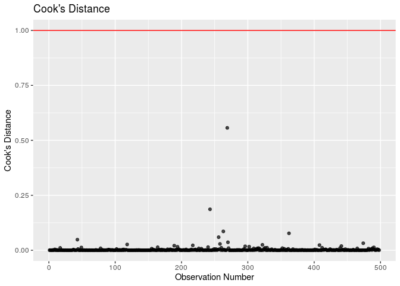

Characteristics of Recent Mexican Immigrants to the United States that
Influence Household Income
================
Ben 10
12/05/2019

## Section 1: Introduction (includes introduction and exploratory data analysis)

## 1\. Introduction

### 1.1 Objective

We are aiming to build a model to determine which characteristics of
Mexican immmigrants to the United States, specifically California,
well-explain variation in household income.

### 1.2 Description of Dataset

The dataset is from The Mexican Migration Project (MMP, \*see References
below for confidentiality terms). It was created in 1982 by an
interdisciplinary team of researchers to further our understanding of
the complex process of Mexican migration to the United States. The
project is a binational research effort co-directed by Jorge Durand,
professor of Social Anthropology at the University of Guadalajara
(Mexico), and Douglas S. Massey, professor of Sociology and Public
Affairs, with a joint appointment in the Woodrow Wilson School, at
Princeton University (US).

Since its inception, the MMP’s main focus has been to gather social as
well as economic information on Mexican-US migration. The data collected
has been compiled in a comprehensive database that is available to the
public free of charge for research and educational purposes through its
web-site. The MMP uses the ethnosurvey approach to gather data: in
winter months, they randomly sample households in communities throughout
Mexico, surveying household heads and members about their first and last
trip to the US, as well as economic and demographic information. They
then conduct the same survey in destination areas in the US, sampling
migrants from the same communities they survey in Mexico but who have
not returned to Mexico. Thus, the sample of migrants includes residents
in both Mexico and the US.

The MMP170 Database contains an initial file with general demographic,
economic, and migratory information for each member of a surveyed
household (PERS). Pers170 has 132 variables and 176701 observations,and
hence it is very large. Therefore, we selected 17 meaningful variables
and filtered out rows that contain N/A’s to create a new dataset labeled
`data`.

### 1.3 Method

We will build a multiple linear regression model to predict household
income considering the following variables: `sex`, `relhead`, `age`,
`statebrn`, `marstat`, `edyrs`, `occtype`, `usdur1`, `usdurl`, `usdoc1`,
`uscity`, `yrborn`.

“X1”: Number of observation

“sex”: Sex

“relhead”: Relationship to household head

“yrborn”: Year of birth

“age”: Age

“statebrn”: State of birth

“marstat”: Marital status

“edyrs”: School years completed

“occ”: Principal occupation

“hhincome” : Household income

“usstate1”: First US migration: State of residence

“usstatel”: Latest US migration: State of residence

“usplace1”: First US migration: City of residence (in place codes)

“usplacel”: Latest US migration: City of residence (in place codes)

“usdur1”: First US migration: Duration (in months)

“usdurl”: Latest US migration: Duration (in months)

“usdoc1”: Type of documentation

“occtype”: Category of occupation

“uscity”: City of residence during first US migration

Our response variable is household income: the total income for a single
household. We chose to use the multiple linear regression because our
response variable is numeric, and there are multiple predictor
variables.

## 2\. Exploratory Data Analysis

### 2.1 Data Cleaning

Due to the complexity of our original data, we did not include data
cleaning in the analysis. For more information, please see our proposal,
where all the data cleaning happens.

However, we did make some adjustment according to the feedback that
there is large imbalance of the amount of data between regions, and that
the distribution of the response variable is not normal. Below is the
update on our data cleaning:

### 2.2 Updated Data Exploration

#### 2.2.1 Filter Only Immigrants in California

Accoridng to our previous data exploration, we found that the
overwhelming majority of immigrants settled in California, as shown in
the graph below:

<!-- -->

Hence, we decided to concentrate on California alone. Since the
originial dataset is large, we have enough data left in California alone
to produce meaningful analysis.

#### 2.2.2 Cut Household Income Groups

Originally, the distribution of log(Household Income)- our response
variable- was bimodal and had a median of 412,647 dollars. It almost
looks like 3 separate distributions:

<!-- -->

We determined that 412,647 dollars is an absurdly high median income for
a survey of largely undocumented immigrants in the US and believe that a
significant chunk of the high incomes were actually recorded in pesos.
The documentation for the data from the Mexican Migration Project does
not specify unit of hhincome; however, the project site details that
researchers surveyed communities in Mexico, then traveled to the US to
survey communities there. It seems likely that the communities surveyed
in Mexico would report income in pesos and those surveyed in the US
would report income in USD. However, the data was collected over a
period of 10 years, during which the exchange rate between pesos and USD
changed significantly. Hence, we cannot simply convert all the incomes
that appear to be recorded in pesos into USD.

Therefore, we decided to filter out the incomes above 60,000 to remove
what appears to be a second distribution of incomes in pesos. We will
also remove incomes of zero from our dataset, because it will interfere
with our model accuracy. However, this compromises our model’s
predicative range: our model will only be able to predict the household
income of those who already have jobs (income).

<!-- -->

Now the distribution of response variable (hhincome) looks like a right
skewed normal
distribution.

#### 2.2.2 Group cities by region

These immigrants to California arrived to the following cities:

Bay Area: Vallejo-Fairfield-Napa, San Francisco, San Jose, Santa
Cruz-Watsonville

Central California: Sacramento, Merced, Fresno, Bakersfield

Southern California: Santa Barbara-Santa Maria-Lompoc, Ventura, Los
Angeles-Long Beach, Orange County, Riverside-San Bernardino, and San
Diego.

We decided to simplify these cities into 3 regional categories: Bay
Area, Southern California and Central California.

Given the comparatively small number of cases in which no city was
reported, we deleted these instances. The majority of immigrants went to
LA-Long Beach area in Southern California.

#### 2.2.4 Remove Variable “relhead”

It turned out that all values from relhead (relationship to head of
household) in our cleaned data were “1” or head. So we will remove this
variable, as well as state variables since we are only using California
data. We will also remove place data since we are using uscity, and occ
since we are using occtype.

#### 2.2.5 Mean-center “age” , “usdur1” and “usdurl”

We must center age and usdurl in order to have a useful model intercept
interpretation.

    ## [1] 39.42495

    ## [1] 60.27096

    ## [1] 43.98635

    ## [1] 6.440546

The mean age in the dataset is 39.43 years ; the mean duration of last
US migration is 60.27 months (about 5 years); and the mean duration of
first US migration is 43.99 months (less than 3.5
years).

### 2.2.6 Remove El Salvador Data and regionalize state born variable

We do not have any data from seven states: Baja California Sur, Chiapas,
Hidalgo, Quintana Roo, Sinaloa, Tlaxcala, and Yucatán. We had a small
amount of non-Mexican data, which we omitted.

We divided the remaining states into the following regions:

South East Mexico: Tabasco, Oaxaca, Campeche, Veracruz

Northern Mexico: Coahuila, Chihuahua, Durango, Nuevo Leon, Sonora,
Tamaulipas, Baja California del Norte

Bajío: Aguascalientes, Guanajuato, Querétaro, San Luis Potosí, Zacatecas

Central Mexico: Mexico City, México, Morelos, Puebla

Pacific Coast: Colima, Guerrero, Jalisco, Michoacán,
Nayarit

#### 2.2.7 Remove Obvious Collinear Variable

`yrborn` and `age` provide the same information and are perfectly
linear, therefore we decided to remove `yrborn` from consideration in
the
model.

## Section 2: Regression Analysis (includes the final model and discussion of assumptions)

## 2\. Multiple Linear Regression Model

In an effort to explain which characteristics of migrants influence
their household income, we will use a multiple linear regression model.
Since our response variable is numerical with mulitple potential
predictors, this is the best model at our disposal.

We will consider the potential interaction between principal occupation
and number of years of school completed, since those are generally
interconnected. We may also consider the interaction between
documentation type and occupation type, although the effect may be
insignificant. However, if the variables occtype, edyrs, or usdoc1 don’t
make it through the process of inital model selection, we will not
include these interactions in the model as that would not be prudent.

We will select our model using AIC criteria, because since we’re dealing
with people, we want to build a model that accounts for volatile human
nature and the ever-changing socioeconomic and political climate that
could influence someone’s household income. AIC is used when we would
rather say a variable is a relevant predictor, when in reality it might
not be and so in this case, we would rather err on the side of a false
positive because we are dealing with a constantly fluctuating issue.

### 2.1 Full Model

<table>

<thead>

<tr>

<th style="text-align:left;">

term

</th>

<th style="text-align:right;">

estimate

</th>

<th style="text-align:right;">

std.error

</th>

<th style="text-align:right;">

statistic

</th>

<th style="text-align:right;">

p.value

</th>

</tr>

</thead>

<tbody>

<tr>

<td style="text-align:left;">

(Intercept)

</td>

<td style="text-align:right;">

561.032

</td>

<td style="text-align:right;">

291.735

</td>

<td style="text-align:right;">

1.923

</td>

<td style="text-align:right;">

0.055

</td>

</tr>

<tr>

<td style="text-align:left;">

sexM

</td>

<td style="text-align:right;">

351.983

</td>

<td style="text-align:right;">

184.897

</td>

<td style="text-align:right;">

1.904

</td>

<td style="text-align:right;">

0.058

</td>

</tr>

<tr>

<td style="text-align:left;">

age

</td>

<td style="text-align:right;">

5.984

</td>

<td style="text-align:right;">

2.788

</td>

<td style="text-align:right;">

2.146

</td>

<td style="text-align:right;">

0.032

</td>

</tr>

<tr>

<td style="text-align:left;">

statebrnCentral Mexico

</td>

<td style="text-align:right;">

237.427

</td>

<td style="text-align:right;">

219.057

</td>

<td style="text-align:right;">

1.084

</td>

<td style="text-align:right;">

0.279

</td>

</tr>

<tr>

<td style="text-align:left;">

statebrnNorthern Mexico

</td>

<td style="text-align:right;">

\-134.376

</td>

<td style="text-align:right;">

247.638

</td>

<td style="text-align:right;">

\-0.543

</td>

<td style="text-align:right;">

0.588

</td>

</tr>

<tr>

<td style="text-align:left;">

statebrnPacific Coast

</td>

<td style="text-align:right;">

\-102.287

</td>

<td style="text-align:right;">

49.209

</td>

<td style="text-align:right;">

\-2.079

</td>

<td style="text-align:right;">

0.038

</td>

</tr>

<tr>

<td style="text-align:left;">

statebrnSouth East Mexico

</td>

<td style="text-align:right;">

109.686

</td>

<td style="text-align:right;">

126.407

</td>

<td style="text-align:right;">

0.868

</td>

<td style="text-align:right;">

0.386

</td>

</tr>

<tr>

<td style="text-align:left;">

marstatDivorced

</td>

<td style="text-align:right;">

229.780

</td>

<td style="text-align:right;">

213.883

</td>

<td style="text-align:right;">

1.074

</td>

<td style="text-align:right;">

0.283

</td>

</tr>

<tr>

<td style="text-align:left;">

marstatMarried

</td>

<td style="text-align:right;">

36.470

</td>

<td style="text-align:right;">

116.594

</td>

<td style="text-align:right;">

0.313

</td>

<td style="text-align:right;">

0.755

</td>

</tr>

<tr>

<td style="text-align:left;">

marstatNever married

</td>

<td style="text-align:right;">

\-173.118

</td>

<td style="text-align:right;">

163.413

</td>

<td style="text-align:right;">

\-1.059

</td>

<td style="text-align:right;">

0.290

</td>

</tr>

<tr>

<td style="text-align:left;">

marstatSeparated

</td>

<td style="text-align:right;">

127.430

</td>

<td style="text-align:right;">

230.245

</td>

<td style="text-align:right;">

0.553

</td>

<td style="text-align:right;">

0.580

</td>

</tr>

<tr>

<td style="text-align:left;">

marstatWidowed

</td>

<td style="text-align:right;">

118.958

</td>

<td style="text-align:right;">

242.970

</td>

<td style="text-align:right;">

0.490

</td>

<td style="text-align:right;">

0.625

</td>

</tr>

<tr>

<td style="text-align:left;">

edyrs

</td>

<td style="text-align:right;">

14.540

</td>

<td style="text-align:right;">

7.685

</td>

<td style="text-align:right;">

1.892

</td>

<td style="text-align:right;">

0.059

</td>

</tr>

<tr>

<td style="text-align:left;">

occtypeAdministrator

</td>

<td style="text-align:right;">

42.915

</td>

<td style="text-align:right;">

266.438

</td>

<td style="text-align:right;">

0.161

</td>

<td style="text-align:right;">

0.872

</td>

</tr>

<tr>

<td style="text-align:left;">

occtypeAgriculture

</td>

<td style="text-align:right;">

\-261.294

</td>

<td style="text-align:right;">

135.654

</td>

<td style="text-align:right;">

\-1.926

</td>

<td style="text-align:right;">

0.055

</td>

</tr>

<tr>

<td style="text-align:left;">

occtypeArts

</td>

<td style="text-align:right;">

\-624.353

</td>

<td style="text-align:right;">

527.969

</td>

<td style="text-align:right;">

\-1.183

</td>

<td style="text-align:right;">

0.238

</td>

</tr>

<tr>

<td style="text-align:left;">

occtypeEducator

</td>

<td style="text-align:right;">

378.022

</td>

<td style="text-align:right;">

328.781

</td>

<td style="text-align:right;">

1.150

</td>

<td style="text-align:right;">

0.251

</td>

</tr>

<tr>

<td style="text-align:left;">

occtypeHomemaker

</td>

<td style="text-align:right;">

\-254.743

</td>

<td style="text-align:right;">

560.351

</td>

<td style="text-align:right;">

\-0.455

</td>

<td style="text-align:right;">

0.650

</td>

</tr>

<tr>

<td style="text-align:left;">

occtypeManufacturing (skilled)

</td>

<td style="text-align:right;">

\-107.692

</td>

<td style="text-align:right;">

132.882

</td>

<td style="text-align:right;">

\-0.810

</td>

<td style="text-align:right;">

0.418

</td>

</tr>

<tr>

<td style="text-align:left;">

occtypeManufacturing (unskilled)

</td>

<td style="text-align:right;">

\-170.819

</td>

<td style="text-align:right;">

134.054

</td>

<td style="text-align:right;">

\-1.274

</td>

<td style="text-align:right;">

0.203

</td>

</tr>

<tr>

<td style="text-align:left;">

occtypeOther, unspecified (disabled, incarcerated, tourist and other)

</td>

<td style="text-align:right;">

\-758.748

</td>

<td style="text-align:right;">

427.270

</td>

<td style="text-align:right;">

\-1.776

</td>

<td style="text-align:right;">

0.076

</td>

</tr>

<tr>

<td style="text-align:left;">

occtypeProfessional

</td>

<td style="text-align:right;">

188.405

</td>

<td style="text-align:right;">

398.793

</td>

<td style="text-align:right;">

0.472

</td>

<td style="text-align:right;">

0.637

</td>

</tr>

<tr>

<td style="text-align:left;">

occtypeProtection

</td>

<td style="text-align:right;">

\-238.960

</td>

<td style="text-align:right;">

386.465

</td>

<td style="text-align:right;">

\-0.618

</td>

<td style="text-align:right;">

0.537

</td>

</tr>

<tr>

<td style="text-align:left;">

occtypeRetired

</td>

<td style="text-align:right;">

\-535.959

</td>

<td style="text-align:right;">

228.666

</td>

<td style="text-align:right;">

\-2.344

</td>

<td style="text-align:right;">

0.019

</td>

</tr>

<tr>

<td style="text-align:left;">

occtypeSales

</td>

<td style="text-align:right;">

\-88.713

</td>

<td style="text-align:right;">

143.649

</td>

<td style="text-align:right;">

\-0.618

</td>

<td style="text-align:right;">

0.537

</td>

</tr>

<tr>

<td style="text-align:left;">

occtypeServices

</td>

<td style="text-align:right;">

\-104.787

</td>

<td style="text-align:right;">

138.210

</td>

<td style="text-align:right;">

\-0.758

</td>

<td style="text-align:right;">

0.449

</td>

</tr>

<tr>

<td style="text-align:left;">

occtypeStudent

</td>

<td style="text-align:right;">

64.804

</td>

<td style="text-align:right;">

541.821

</td>

<td style="text-align:right;">

0.120

</td>

<td style="text-align:right;">

0.905

</td>

</tr>

<tr>

<td style="text-align:left;">

occtypeTechnical Worker

</td>

<td style="text-align:right;">

\-122.925

</td>

<td style="text-align:right;">

243.378

</td>

<td style="text-align:right;">

\-0.505

</td>

<td style="text-align:right;">

0.614

</td>

</tr>

<tr>

<td style="text-align:left;">

occtypeTransportation

</td>

<td style="text-align:right;">

\-122.315

</td>

<td style="text-align:right;">

163.496

</td>

<td style="text-align:right;">

\-0.748

</td>

<td style="text-align:right;">

0.455

</td>

</tr>

<tr>

<td style="text-align:left;">

occtypeUnemployed (seeking work)

</td>

<td style="text-align:right;">

\-520.791

</td>

<td style="text-align:right;">

329.770

</td>

<td style="text-align:right;">

\-1.579

</td>

<td style="text-align:right;">

0.115

</td>

</tr>

<tr>

<td style="text-align:left;">

usdur1

</td>

<td style="text-align:right;">

\-0.354

</td>

<td style="text-align:right;">

0.422

</td>

<td style="text-align:right;">

\-0.840

</td>

<td style="text-align:right;">

0.401

</td>

</tr>

<tr>

<td style="text-align:left;">

usdurl

</td>

<td style="text-align:right;">

0.764

</td>

<td style="text-align:right;">

0.366

</td>

<td style="text-align:right;">

2.086

</td>

<td style="text-align:right;">

0.038

</td>

</tr>

<tr>

<td style="text-align:left;">

usdoc1Legal resident

</td>

<td style="text-align:right;">

156.769

</td>

<td style="text-align:right;">

141.794

</td>

<td style="text-align:right;">

1.106

</td>

<td style="text-align:right;">

0.269

</td>

</tr>

<tr>

<td style="text-align:left;">

usdoc1Temporary: Tourist/visitor

</td>

<td style="text-align:right;">

\-123.315

</td>

<td style="text-align:right;">

150.994

</td>

<td style="text-align:right;">

\-0.817

</td>

<td style="text-align:right;">

0.415

</td>

</tr>

<tr>

<td style="text-align:left;">

usdoc1Undocumented

</td>

<td style="text-align:right;">

\-53.363

</td>

<td style="text-align:right;">

117.789

</td>

<td style="text-align:right;">

\-0.453

</td>

<td style="text-align:right;">

0.651

</td>

</tr>

<tr>

<td style="text-align:left;">

uscitycentcal

</td>

<td style="text-align:right;">

46.508

</td>

<td style="text-align:right;">

101.246

</td>

<td style="text-align:right;">

0.459

</td>

<td style="text-align:right;">

0.646

</td>

</tr>

<tr>

<td style="text-align:left;">

uscitysocal

</td>

<td style="text-align:right;">

40.399

</td>

<td style="text-align:right;">

82.173

</td>

<td style="text-align:right;">

0.492

</td>

<td style="text-align:right;">

0.623

</td>

</tr>

</tbody>

</table>

### 2.2 Backward selection

    ## Start:  AIC=6431.64
    ## hhincome ~ sex + age + statebrn + marstat + edyrs + occtype + 
    ##     usdur1 + usdurl + usdoc1 + uscity
    ## 
    ##            Df Sum of Sq       RSS    AIC
    ## - occtype  17   5172599 128867632 6418.7
    ## - marstat   5   1172083 124867115 6426.5
    ## - uscity    2     69171 123764203 6427.9
    ## - usdur1    1    183322 123878354 6430.4
    ## <none>                  123695033 6431.6
    ## - statebrn  4   2065473 125760506 6432.1
    ## - usdoc1    3   1600365 125295398 6432.2
    ## - edyrs     1    930265 124625298 6433.5
    ## - sex       1    941740 124636773 6433.5
    ## - usdurl    1   1130669 124825702 6434.3
    ## - age       1   1197263 124892296 6434.6
    ## 
    ## Step:  AIC=6418.65
    ## hhincome ~ sex + age + statebrn + marstat + edyrs + usdur1 + 
    ##     usdurl + usdoc1 + uscity
    ## 
    ##            Df Sum of Sq       RSS    AIC
    ## - marstat   5    719661 129587293 6411.5
    ## - uscity    2    132572 129000204 6415.2
    ## - usdur1    1    298326 129165958 6417.8
    ## - usdoc1    3   1423135 130290767 6418.3
    ## <none>                  128867632 6418.7
    ## - sex       1    629067 129496699 6419.2
    ## - statebrn  4   2275652 131143283 6419.6
    ## - age       1    952824 129820455 6420.4
    ## - usdurl    1   1630703 130498335 6423.1
    ## - edyrs     1   2282745 131150377 6425.7
    ## 
    ## Step:  AIC=6411.51
    ## hhincome ~ sex + age + statebrn + edyrs + usdur1 + usdurl + usdoc1 + 
    ##     uscity
    ## 
    ##            Df Sum of Sq       RSS    AIC
    ## - uscity    2    185573 129772866 6408.2
    ## - usdur1    1    306981 129894274 6410.7
    ## - usdoc1    3   1519128 131106421 6411.5
    ## <none>                  129587293 6411.5
    ## - sex       1   1065971 130653264 6413.7
    ## - statebrn  4   2608097 132195389 6413.7
    ## - age       1   1266393 130853686 6414.5
    ## - usdurl    1   1670900 131258192 6416.1
    ## - edyrs     1   2194240 131781533 6418.1
    ## 
    ## Step:  AIC=6408.24
    ## hhincome ~ sex + age + statebrn + edyrs + usdur1 + usdurl + usdoc1
    ## 
    ##            Df Sum of Sq       RSS    AIC
    ## - usdur1    1    254694 130027560 6407.2
    ## - usdoc1    3   1456150 131229016 6408.0
    ## <none>                  129772866 6408.2
    ## - sex       1   1021060 130793926 6410.3
    ## - statebrn  4   2675048 132447914 6410.7
    ## - age       1   1249477 131022343 6411.2
    ## - usdurl    1   1626356 131399222 6412.6
    ## - edyrs     1   2251557 132024423 6415.1
    ## 
    ## Step:  AIC=6407.25
    ## hhincome ~ sex + age + statebrn + edyrs + usdurl + usdoc1
    ## 
    ##            Df Sum of Sq       RSS    AIC
    ## - usdoc1    3   1345308 131372868 6406.5
    ## <none>                  130027560 6407.2
    ## - statebrn  4   2719406 132746966 6409.9
    ## - sex       1   1275224 131302784 6410.3
    ## - age       1   1345174 131372734 6410.5
    ## - usdurl    1   1569109 131596669 6411.4
    ## - edyrs     1   2328216 132355775 6414.4
    ## 
    ## Step:  AIC=6406.53
    ## hhincome ~ sex + age + statebrn + edyrs + usdurl
    ## 
    ##            Df Sum of Sq       RSS    AIC
    ## <none>                  131372868 6406.5
    ## - statebrn  4   2868777 134241644 6409.6
    ## - sex       1   1504609 132877476 6410.4
    ## - usdurl    1   1855160 133228028 6411.7
    ## - age       1   1990047 133362914 6412.2
    ## - edyrs     1   2985840 134358708 6416.1

| term                      |  estimate | std.error | statistic | p.value |  conf.low | conf.high |
| :------------------------ | --------: | --------: | --------: | ------: | --------: | --------: |
| (Intercept)               |   464.194 |   124.677 |     3.723 |   0.000 |   219.242 |   709.145 |
| sexM                      |   269.037 |   111.979 |     2.403 |   0.017 |    49.033 |   489.040 |
| age                       |     6.078 |     2.200 |     2.763 |   0.006 |     1.756 |    10.400 |
| statebrnCentral Mexico    |   326.269 |   214.381 |     1.522 |   0.129 |  \-94.921 |   747.459 |
| statebrnNorthern Mexico   |  \-14.495 |   231.625 |   \-0.063 |   0.950 | \-469.564 |   440.575 |
| statebrnPacific Coast     | \-109.370 |    47.251 |   \-2.315 |   0.021 | \-202.203 |  \-16.536 |
| statebrnSouth East Mexico |   124.058 |   123.170 |     1.007 |   0.314 | \-117.933 |   366.049 |
| edyrs                     |    22.884 |     6.761 |     3.385 |   0.001 |     9.600 |    36.168 |
| usdurl                    |     0.690 |     0.259 |     2.668 |   0.008 |     0.182 |     1.198 |

Using backward selection based on AIC, we narrowed down to 5 variables:
sex, edyrs, usdurl, statebrn and age.

### 2.3 Interactions

To find potential interactions between the 5 variables, we used nested-F
test for each of the possible interactions:

After inital backwards selection, we will explore the possible
interactions between remaining variables: `edyrs`, `usdurl`, `sex`,
`statebrn` and `age`, to determine if any are significant.

| Res.Df |       RSS | Df | Sum of Sq | Pr(\>Chi) |
| -----: | --------: | -: | --------: | --------: |
|    504 | 131372868 | NA |        NA |        NA |
|    503 | 131343347 |  1 |  29520.93 |     0.737 |

First, we tested the interaction between `edyrs` and `usdurl`. The
p-value for this test was 0.7366925 \> 0.05, therefore we will not
include it in the model.

| Res.Df |       RSS | Df | Sum of Sq | Pr(\>Chi) |
| -----: | --------: | -: | --------: | --------: |
|    504 | 131372868 | NA |        NA |        NA |
|    503 | 130158750 |  1 |   1214117 |      0.03 |

Then, we tested the interaction between `sex` and `usdurl`. The p-value
for this test was 0.0303039 \< 0.05, therefore we will include it in the
model.

| Res.Df |       RSS | Df | Sum of Sq | Pr(\>Chi) |
| -----: | --------: | -: | --------: | --------: |
|    504 | 131372868 | NA |        NA |        NA |
|    503 | 130933022 |  1 |  439845.2 |     0.194 |

Then, we tested the interaction between `age` and `usdurl`. The p-value
for this test was 0.1936359 \> 0.05, therefore we will not include it in
the model.

| Res.Df |       RSS | Df | Sum of Sq | Pr(\>Chi) |
| -----: | --------: | -: | --------: | --------: |
|    504 | 131372868 | NA |        NA |        NA |
|    503 | 131298093 |  1 |  74774.17 |     0.592 |

Then, we tested the interaction between `sex` and `edyrs`. The p-value
for this test was 0.5024992 \> 0.05, therefore we will not include it in
the model.

| Res.Df |       RSS | Df | Sum of Sq | Pr(\>Chi) |
| -----: | --------: | -: | --------: | --------: |
|    504 | 131372868 | NA |        NA |        NA |
|    503 | 125887088 |  1 |   5485780 |         0 |

Then, we tested the interaction between `age` and `edyrs`. The p-value
for this test was 0 \< 0.05, therefore we will include it in the model.

| Res.Df |       RSS | Df | Sum of Sq | Pr(\>Chi) |
| -----: | --------: | -: | --------: | --------: |
|    504 | 131372868 | NA |        NA |        NA |
|    503 | 130958968 |  1 |  413899.7 |     0.207 |

Then, we tested the interaction between `age` and `sex`. The p-value for
this test was 0.2073624 \> 0.05, therefore we will not include it in the
model.

| Res.Df |       RSS | Df | Sum of Sq | Pr(\>Chi) |
| -----: | --------: | -: | --------: | --------: |
|    504 | 131372868 | NA |        NA |        NA |
|    501 | 130570425 |  3 |  802442.4 |      0.38 |

Then, we tested the interaction between `statebrn` and `sex`. The
p-value for this test was 0.3796077\> 0.05, therefore we will not
include it in the model.

| Res.Df |       RSS | Df | Sum of Sq | Pr(\>Chi) |
| -----: | --------: | -: | --------: | --------: |
|    504 | 131372868 | NA |        NA |        NA |
|    500 | 129862386 |  4 |   1510482 |     0.213 |

Then, we tested the interaction between `statebrn` and `age`. The
p-value for this test was 0.213341\> 0.05, therefore we will not include
it in the model.

| Res.Df |       RSS | Df | Sum of Sq | Pr(\>Chi) |
| -----: | --------: | -: | --------: | --------: |
|    504 | 131372868 | NA |        NA |        NA |
|    500 | 125945407 |  4 |   5427461 |         0 |

Then, we tested the interaction between `statebrn` and `edyrs`. The
p-value for this test was 0.0002466\< 0.05, therefore we will include it
in the model.

| Res.Df |       RSS | Df | Sum of Sq | Pr(\>Chi) |
| -----: | --------: | -: | --------: | --------: |
|    504 | 131372868 | NA |        NA |        NA |
|    500 | 126792566 |  4 |   4580302 |     0.001 |

Then, we tested the interaction between `statebrn` and `usdurl`. The
p-value for this test was 0.0012 \< 0.05, therefore we will include it
in the model.

Through nested F-test, we observed significant interactions between age
& edyrs, statebrn & edyrs, statebrn & usdurl, and between sex & usdurl,
with respective p-values of 0, 0.0002466, 0.0012 and 0.034 and will be
including them in our model.

### 2.4 Model with Interaction

<table>

<thead>

<tr>

<th style="text-align:left;">

term

</th>

<th style="text-align:right;">

estimate

</th>

<th style="text-align:right;">

std.error

</th>

<th style="text-align:right;">

statistic

</th>

<th style="text-align:right;">

p.value

</th>

</tr>

</thead>

<tbody>

<tr>

<td style="text-align:left;">

(Intercept)

</td>

<td style="text-align:right;">

295.234

</td>

<td style="text-align:right;">

138.478

</td>

<td style="text-align:right;">

2.132

</td>

<td style="text-align:right;">

0.034

</td>

</tr>

<tr>

<td style="text-align:left;">

sexM

</td>

<td style="text-align:right;">

324.501

</td>

<td style="text-align:right;">

110.422

</td>

<td style="text-align:right;">

2.939

</td>

<td style="text-align:right;">

0.003

</td>

</tr>

<tr>

<td style="text-align:left;">

age

</td>

<td style="text-align:right;">

\-4.873

</td>

<td style="text-align:right;">

3.602

</td>

<td style="text-align:right;">

\-1.353

</td>

<td style="text-align:right;">

0.177

</td>

</tr>

<tr>

<td style="text-align:left;">

edyrs

</td>

<td style="text-align:right;">

45.585

</td>

<td style="text-align:right;">

10.498

</td>

<td style="text-align:right;">

4.342

</td>

<td style="text-align:right;">

0.000

</td>

</tr>

<tr>

<td style="text-align:left;">

usdurl

</td>

<td style="text-align:right;">

2.364

</td>

<td style="text-align:right;">

0.788

</td>

<td style="text-align:right;">

3.001

</td>

<td style="text-align:right;">

0.003

</td>

</tr>

<tr>

<td style="text-align:left;">

statebrnCentral Mexico

</td>

<td style="text-align:right;">

2521.957

</td>

<td style="text-align:right;">

872.419

</td>

<td style="text-align:right;">

2.891

</td>

<td style="text-align:right;">

0.004

</td>

</tr>

<tr>

<td style="text-align:left;">

statebrnNorthern Mexico

</td>

<td style="text-align:right;">

\-95.839

</td>

<td style="text-align:right;">

406.104

</td>

<td style="text-align:right;">

\-0.236

</td>

<td style="text-align:right;">

0.814

</td>

</tr>

<tr>

<td style="text-align:left;">

statebrnPacific Coast

</td>

<td style="text-align:right;">

139.998

</td>

<td style="text-align:right;">

91.666

</td>

<td style="text-align:right;">

1.527

</td>

<td style="text-align:right;">

0.127

</td>

</tr>

<tr>

<td style="text-align:left;">

statebrnSouth East Mexico

</td>

<td style="text-align:right;">

\-277.749

</td>

<td style="text-align:right;">

659.015

</td>

<td style="text-align:right;">

\-0.421

</td>

<td style="text-align:right;">

0.674

</td>

</tr>

<tr>

<td style="text-align:left;">

age:edyrs

</td>

<td style="text-align:right;">

2.040

</td>

<td style="text-align:right;">

0.551

</td>

<td style="text-align:right;">

3.704

</td>

<td style="text-align:right;">

0.000

</td>

</tr>

<tr>

<td style="text-align:left;">

sexM:usdurl

</td>

<td style="text-align:right;">

\-1.328

</td>

<td style="text-align:right;">

0.810

</td>

<td style="text-align:right;">

\-1.639

</td>

<td style="text-align:right;">

0.102

</td>

</tr>

<tr>

<td style="text-align:left;">

edyrs:statebrnCentral Mexico

</td>

<td style="text-align:right;">

\-300.949

</td>

<td style="text-align:right;">

114.448

</td>

<td style="text-align:right;">

\-2.630

</td>

<td style="text-align:right;">

0.009

</td>

</tr>

<tr>

<td style="text-align:left;">

edyrs:statebrnNorthern Mexico

</td>

<td style="text-align:right;">

42.849

</td>

<td style="text-align:right;">

44.285

</td>

<td style="text-align:right;">

0.968

</td>

<td style="text-align:right;">

0.334

</td>

</tr>

<tr>

<td style="text-align:left;">

edyrs:statebrnPacific Coast

</td>

<td style="text-align:right;">

\-36.810

</td>

<td style="text-align:right;">

12.720

</td>

<td style="text-align:right;">

\-2.894

</td>

<td style="text-align:right;">

0.004

</td>

</tr>

<tr>

<td style="text-align:left;">

edyrs:statebrnSouth East Mexico

</td>

<td style="text-align:right;">

24.355

</td>

<td style="text-align:right;">

34.922

</td>

<td style="text-align:right;">

0.697

</td>

<td style="text-align:right;">

0.486

</td>

</tr>

<tr>

<td style="text-align:left;">

usdurl:statebrnCentral Mexico

</td>

<td style="text-align:right;">

11.405

</td>

<td style="text-align:right;">

6.385

</td>

<td style="text-align:right;">

1.786

</td>

<td style="text-align:right;">

0.075

</td>

</tr>

<tr>

<td style="text-align:left;">

usdurl:statebrnNorthern Mexico

</td>

<td style="text-align:right;">

\-5.831

</td>

<td style="text-align:right;">

1.839

</td>

<td style="text-align:right;">

\-3.171

</td>

<td style="text-align:right;">

0.002

</td>

</tr>

<tr>

<td style="text-align:left;">

usdurl:statebrnPacific Coast

</td>

<td style="text-align:right;">

\-1.318

</td>

<td style="text-align:right;">

0.496

</td>

<td style="text-align:right;">

\-2.655

</td>

<td style="text-align:right;">

0.008

</td>

</tr>

<tr>

<td style="text-align:left;">

usdurl:statebrnSouth East Mexico

</td>

<td style="text-align:right;">

\-5.562

</td>

<td style="text-align:right;">

11.370

</td>

<td style="text-align:right;">

\-0.489

</td>

<td style="text-align:right;">

0.625

</td>

</tr>

</tbody>

</table>

### 2.5 Backward Selection with Interaction

Since we observed 4 pairs of significant interactions, we will do the
backward selection again with the new interaction terms.

<table>

<thead>

<tr>

<th style="text-align:left;">

term

</th>

<th style="text-align:right;">

estimate

</th>

<th style="text-align:right;">

std.error

</th>

<th style="text-align:right;">

statistic

</th>

<th style="text-align:right;">

p.value

</th>

</tr>

</thead>

<tbody>

<tr>

<td style="text-align:left;">

(Intercept)

</td>

<td style="text-align:right;">

515.561

</td>

<td style="text-align:right;">

295.320

</td>

<td style="text-align:right;">

1.746

</td>

<td style="text-align:right;">

0.082

</td>

</tr>

<tr>

<td style="text-align:left;">

sexM

</td>

<td style="text-align:right;">

373.781

</td>

<td style="text-align:right;">

179.624

</td>

<td style="text-align:right;">

2.081

</td>

<td style="text-align:right;">

0.038

</td>

</tr>

<tr>

<td style="text-align:left;">

age

</td>

<td style="text-align:right;">

\-4.791

</td>

<td style="text-align:right;">

4.253

</td>

<td style="text-align:right;">

\-1.126

</td>

<td style="text-align:right;">

0.261

</td>

</tr>

<tr>

<td style="text-align:left;">

statebrnCentral Mexico

</td>

<td style="text-align:right;">

2544.681

</td>

<td style="text-align:right;">

884.959

</td>

<td style="text-align:right;">

2.875

</td>

<td style="text-align:right;">

0.004

</td>

</tr>

<tr>

<td style="text-align:left;">

statebrnNorthern Mexico

</td>

<td style="text-align:right;">

\-206.891

</td>

<td style="text-align:right;">

435.217

</td>

<td style="text-align:right;">

\-0.475

</td>

<td style="text-align:right;">

0.635

</td>

</tr>

<tr>

<td style="text-align:left;">

statebrnPacific Coast

</td>

<td style="text-align:right;">

144.913

</td>

<td style="text-align:right;">

96.076

</td>

<td style="text-align:right;">

1.508

</td>

<td style="text-align:right;">

0.132

</td>

</tr>

<tr>

<td style="text-align:left;">

statebrnSouth East Mexico

</td>

<td style="text-align:right;">

\-393.757

</td>

<td style="text-align:right;">

669.122

</td>

<td style="text-align:right;">

\-0.588

</td>

<td style="text-align:right;">

0.557

</td>

</tr>

<tr>

<td style="text-align:left;">

marstatDivorced

</td>

<td style="text-align:right;">

186.999

</td>

<td style="text-align:right;">

206.133

</td>

<td style="text-align:right;">

0.907

</td>

<td style="text-align:right;">

0.365

</td>

</tr>

<tr>

<td style="text-align:left;">

marstatMarried

</td>

<td style="text-align:right;">

30.421

</td>

<td style="text-align:right;">

111.587

</td>

<td style="text-align:right;">

0.273

</td>

<td style="text-align:right;">

0.785

</td>

</tr>

<tr>

<td style="text-align:left;">

marstatNever married

</td>

<td style="text-align:right;">

\-183.713

</td>

<td style="text-align:right;">

156.496

</td>

<td style="text-align:right;">

\-1.174

</td>

<td style="text-align:right;">

0.241

</td>

</tr>

<tr>

<td style="text-align:left;">

marstatSeparated

</td>

<td style="text-align:right;">

110.457

</td>

<td style="text-align:right;">

220.540

</td>

<td style="text-align:right;">

0.501

</td>

<td style="text-align:right;">

0.617

</td>

</tr>

<tr>

<td style="text-align:left;">

marstatWidowed

</td>

<td style="text-align:right;">

\-54.714

</td>

<td style="text-align:right;">

238.776

</td>

<td style="text-align:right;">

\-0.229

</td>

<td style="text-align:right;">

0.819

</td>

</tr>

<tr>

<td style="text-align:left;">

edyrs

</td>

<td style="text-align:right;">

37.453

</td>

<td style="text-align:right;">

11.503

</td>

<td style="text-align:right;">

3.256

</td>

<td style="text-align:right;">

0.001

</td>

</tr>

<tr>

<td style="text-align:left;">

occtypeAdministrator

</td>

<td style="text-align:right;">

\-4.938

</td>

<td style="text-align:right;">

258.358

</td>

<td style="text-align:right;">

\-0.019

</td>

<td style="text-align:right;">

0.985

</td>

</tr>

<tr>

<td style="text-align:left;">

occtypeAgriculture

</td>

<td style="text-align:right;">

\-268.443

</td>

<td style="text-align:right;">

135.257

</td>

<td style="text-align:right;">

\-1.985

</td>

<td style="text-align:right;">

0.048

</td>

</tr>

<tr>

<td style="text-align:left;">

occtypeArts

</td>

<td style="text-align:right;">

\-611.321

</td>

<td style="text-align:right;">

506.939

</td>

<td style="text-align:right;">

\-1.206

</td>

<td style="text-align:right;">

0.228

</td>

</tr>

<tr>

<td style="text-align:left;">

occtypeEducator

</td>

<td style="text-align:right;">

338.940

</td>

<td style="text-align:right;">

319.628

</td>

<td style="text-align:right;">

1.060

</td>

<td style="text-align:right;">

0.290

</td>

</tr>

<tr>

<td style="text-align:left;">

occtypeHomemaker

</td>

<td style="text-align:right;">

\-111.573

</td>

<td style="text-align:right;">

550.622

</td>

<td style="text-align:right;">

\-0.203

</td>

<td style="text-align:right;">

0.840

</td>

</tr>

<tr>

<td style="text-align:left;">

occtypeManufacturing (skilled)

</td>

<td style="text-align:right;">

\-132.756

</td>

<td style="text-align:right;">

133.635

</td>

<td style="text-align:right;">

\-0.993

</td>

<td style="text-align:right;">

0.321

</td>

</tr>

<tr>

<td style="text-align:left;">

occtypeManufacturing (unskilled)

</td>

<td style="text-align:right;">

\-193.019

</td>

<td style="text-align:right;">

133.612

</td>

<td style="text-align:right;">

\-1.445

</td>

<td style="text-align:right;">

0.149

</td>

</tr>

<tr>

<td style="text-align:left;">

occtypeOther, unspecified (disabled, incarcerated, tourist and other)

</td>

<td style="text-align:right;">

\-694.808

</td>

<td style="text-align:right;">

412.435

</td>

<td style="text-align:right;">

\-1.685

</td>

<td style="text-align:right;">

0.093

</td>

</tr>

<tr>

<td style="text-align:left;">

occtypeProfessional

</td>

<td style="text-align:right;">

\-488.637

</td>

<td style="text-align:right;">

493.551

</td>

<td style="text-align:right;">

\-0.990

</td>

<td style="text-align:right;">

0.323

</td>

</tr>

<tr>

<td style="text-align:left;">

occtypeProtection

</td>

<td style="text-align:right;">

\-333.180

</td>

<td style="text-align:right;">

371.015

</td>

<td style="text-align:right;">

\-0.898

</td>

<td style="text-align:right;">

0.370

</td>

</tr>

<tr>

<td style="text-align:left;">

occtypeRetired

</td>

<td style="text-align:right;">

\-533.100

</td>

<td style="text-align:right;">

220.876

</td>

<td style="text-align:right;">

\-2.414

</td>

<td style="text-align:right;">

0.016

</td>

</tr>

<tr>

<td style="text-align:left;">

occtypeSales

</td>

<td style="text-align:right;">

\-87.356

</td>

<td style="text-align:right;">

143.114

</td>

<td style="text-align:right;">

\-0.610

</td>

<td style="text-align:right;">

0.542

</td>

</tr>

<tr>

<td style="text-align:left;">

occtypeServices

</td>

<td style="text-align:right;">

\-88.112

</td>

<td style="text-align:right;">

137.956

</td>

<td style="text-align:right;">

\-0.639

</td>

<td style="text-align:right;">

0.523

</td>

</tr>

<tr>

<td style="text-align:left;">

occtypeStudent

</td>

<td style="text-align:right;">

248.318

</td>

<td style="text-align:right;">

521.149

</td>

<td style="text-align:right;">

0.476

</td>

<td style="text-align:right;">

0.634

</td>

</tr>

<tr>

<td style="text-align:left;">

occtypeTechnical Worker

</td>

<td style="text-align:right;">

\-214.504

</td>

<td style="text-align:right;">

234.997

</td>

<td style="text-align:right;">

\-0.913

</td>

<td style="text-align:right;">

0.362

</td>

</tr>

<tr>

<td style="text-align:left;">

occtypeTransportation

</td>

<td style="text-align:right;">

\-108.618

</td>

<td style="text-align:right;">

161.342

</td>

<td style="text-align:right;">

\-0.673

</td>

<td style="text-align:right;">

0.501

</td>

</tr>

<tr>

<td style="text-align:left;">

occtypeUnemployed (seeking work)

</td>

<td style="text-align:right;">

\-423.519

</td>

<td style="text-align:right;">

320.414

</td>

<td style="text-align:right;">

\-1.322

</td>

<td style="text-align:right;">

0.187

</td>

</tr>

<tr>

<td style="text-align:left;">

usdur1

</td>

<td style="text-align:right;">

\-0.296

</td>

<td style="text-align:right;">

0.417

</td>

<td style="text-align:right;">

\-0.711

</td>

<td style="text-align:right;">

0.478

</td>

</tr>

<tr>

<td style="text-align:left;">

usdurl

</td>

<td style="text-align:right;">

2.920

</td>

<td style="text-align:right;">

0.930

</td>

<td style="text-align:right;">

3.141

</td>

<td style="text-align:right;">

0.002

</td>

</tr>

<tr>

<td style="text-align:left;">

usdoc1Legal resident

</td>

<td style="text-align:right;">

46.506

</td>

<td style="text-align:right;">

137.587

</td>

<td style="text-align:right;">

0.338

</td>

<td style="text-align:right;">

0.736

</td>

</tr>

<tr>

<td style="text-align:left;">

usdoc1Temporary: Tourist/visitor

</td>

<td style="text-align:right;">

\-164.019

</td>

<td style="text-align:right;">

147.384

</td>

<td style="text-align:right;">

\-1.113

</td>

<td style="text-align:right;">

0.266

</td>

</tr>

<tr>

<td style="text-align:left;">

usdoc1Undocumented

</td>

<td style="text-align:right;">

\-123.602

</td>

<td style="text-align:right;">

114.293

</td>

<td style="text-align:right;">

\-1.081

</td>

<td style="text-align:right;">

0.280

</td>

</tr>

<tr>

<td style="text-align:left;">

uscitycentcal

</td>

<td style="text-align:right;">

38.520

</td>

<td style="text-align:right;">

96.949

</td>

<td style="text-align:right;">

0.397

</td>

<td style="text-align:right;">

0.691

</td>

</tr>

<tr>

<td style="text-align:left;">

uscitysocal

</td>

<td style="text-align:right;">

34.734

</td>

<td style="text-align:right;">

78.766

</td>

<td style="text-align:right;">

0.441

</td>

<td style="text-align:right;">

0.659

</td>

</tr>

<tr>

<td style="text-align:left;">

sexM:usdurl

</td>

<td style="text-align:right;">

\-1.956

</td>

<td style="text-align:right;">

0.892

</td>

<td style="text-align:right;">

\-2.193

</td>

<td style="text-align:right;">

0.029

</td>

</tr>

<tr>

<td style="text-align:left;">

age:edyrs

</td>

<td style="text-align:right;">

1.914

</td>

<td style="text-align:right;">

0.578

</td>

<td style="text-align:right;">

3.309

</td>

<td style="text-align:right;">

0.001

</td>

</tr>

<tr>

<td style="text-align:left;">

statebrnCentral Mexico:edyrs

</td>

<td style="text-align:right;">

\-317.896

</td>

<td style="text-align:right;">

116.569

</td>

<td style="text-align:right;">

\-2.727

</td>

<td style="text-align:right;">

0.007

</td>

</tr>

<tr>

<td style="text-align:left;">

statebrnNorthern Mexico:edyrs

</td>

<td style="text-align:right;">

60.608

</td>

<td style="text-align:right;">

56.470

</td>

<td style="text-align:right;">

1.073

</td>

<td style="text-align:right;">

0.284

</td>

</tr>

<tr>

<td style="text-align:left;">

statebrnPacific Coast:edyrs

</td>

<td style="text-align:right;">

\-36.873

</td>

<td style="text-align:right;">

13.322

</td>

<td style="text-align:right;">

\-2.768

</td>

<td style="text-align:right;">

0.006

</td>

</tr>

<tr>

<td style="text-align:left;">

statebrnSouth East Mexico:edyrs

</td>

<td style="text-align:right;">

21.398

</td>

<td style="text-align:right;">

36.440

</td>

<td style="text-align:right;">

0.587

</td>

<td style="text-align:right;">

0.557

</td>

</tr>

<tr>

<td style="text-align:left;">

statebrnCentral Mexico:usdurl

</td>

<td style="text-align:right;">

11.171

</td>

<td style="text-align:right;">

6.416

</td>

<td style="text-align:right;">

1.741

</td>

<td style="text-align:right;">

0.082

</td>

</tr>

<tr>

<td style="text-align:left;">

statebrnNorthern Mexico:usdurl

</td>

<td style="text-align:right;">

\-6.298

</td>

<td style="text-align:right;">

2.194

</td>

<td style="text-align:right;">

\-2.871

</td>

<td style="text-align:right;">

0.004

</td>

</tr>

<tr>

<td style="text-align:left;">

statebrnPacific Coast:usdurl

</td>

<td style="text-align:right;">

\-1.105

</td>

<td style="text-align:right;">

0.514

</td>

<td style="text-align:right;">

\-2.149

</td>

<td style="text-align:right;">

0.032

</td>

</tr>

<tr>

<td style="text-align:left;">

statebrnSouth East Mexico:usdurl

</td>

<td style="text-align:right;">

\-7.951

</td>

<td style="text-align:right;">

11.521

</td>

<td style="text-align:right;">

\-0.690

</td>

<td style="text-align:right;">

0.490

</td>

</tr>

</tbody>

</table>

    ## Start:  AIC=6392.36
    ## hhincome ~ sex + age + statebrn + marstat + edyrs + occtype + 
    ##     usdur1 + usdurl + usdoc1 + uscity + sex * usdurl + age * 
    ##     edyrs + statebrn * edyrs + statebrn * usdurl
    ## 
    ##                   Df Sum of Sq       RSS    AIC
    ## - occtype         17   4753941 114951500 6380.0
    ## - marstat          5   1171616 111369174 6387.8
    ## - uscity           2     49340 110246898 6388.6
    ## - usdur1           1    119379 110316937 6390.9
    ## - usdoc1           3   1155007 111352565 6391.7
    ## <none>                         110197558 6392.4
    ## - sex:usdurl       1   1137328 111334886 6395.6
    ## - statebrn:usdurl  4   3589303 113786861 6400.8
    ## - age:edyrs        1   2589816 112787375 6402.3
    ## - statebrn:edyrs   4   4160932 114358490 6403.4
    ## 
    ## Step:  AIC=6380.03
    ## hhincome ~ sex + age + statebrn + marstat + edyrs + usdur1 + 
    ##     usdurl + usdoc1 + uscity + sex:usdurl + age:edyrs + statebrn:edyrs + 
    ##     statebrn:usdurl
    ## 
    ##                   Df Sum of Sq       RSS    AIC
    ## - marstat          5    709249 115660749 6373.2
    ## - uscity           2    101520 115053020 6376.5
    ## - usdoc1           3    872872 115824372 6377.9
    ## - usdur1           1    148600 115100099 6378.7
    ## <none>                         114951500 6380.0
    ## - sex:usdurl       1    887374 115838873 6382.0
    ## - statebrn:edyrs   4   3842118 118793618 6388.9
    ## - statebrn:usdurl  4   4039800 118991299 6389.7
    ## - age:edyrs        1   3160477 118111976 6391.9
    ## 
    ## Step:  AIC=6373.18
    ## hhincome ~ sex + age + statebrn + edyrs + usdur1 + usdurl + usdoc1 + 
    ##     uscity + sex:usdurl + age:edyrs + statebrn:edyrs + statebrn:usdurl
    ## 
    ##                   Df Sum of Sq       RSS    AIC
    ## - uscity           2    149345 115810094 6369.8
    ## - usdoc1           3   1003426 116664175 6371.6
    ## - usdur1           1    153961 115814709 6371.9
    ## <none>                         115660749 6373.2
    ## - sex:usdurl       1    841527 116502275 6374.9
    ## - statebrn:edyrs   4   3739485 119400234 6381.5
    ## - statebrn:usdurl  4   3956841 119617589 6382.4
    ## - age:edyrs        1   3442317 119103066 6386.2
    ## 
    ## Step:  AIC=6369.85
    ## hhincome ~ sex + age + statebrn + edyrs + usdur1 + usdurl + usdoc1 + 
    ##     sex:usdurl + age:edyrs + statebrn:edyrs + statebrn:usdurl
    ## 
    ##                   Df Sum of Sq       RSS    AIC
    ## - usdoc1           3    942883 116752977 6368.0
    ## - usdur1           1    121254 115931348 6368.4
    ## <none>                         115810094 6369.8
    ## - sex:usdurl       1    817358 116627452 6371.5
    ## - statebrn:edyrs   4   3832380 119642473 6378.5
    ## - statebrn:usdurl  4   3918323 119728416 6378.9
    ## - age:edyrs        1   3474628 119284721 6383.0
    ## 
    ## Step:  AIC=6368.01
    ## hhincome ~ sex + age + statebrn + edyrs + usdur1 + usdurl + sex:usdurl + 
    ##     age:edyrs + statebrn:edyrs + statebrn:usdurl
    ## 
    ##                   Df Sum of Sq       RSS    AIC
    ## - usdur1           1     58451 116811428 6366.3
    ## <none>                         116752977 6368.0
    ## - sex:usdurl       1    687955 117440932 6369.0
    ## - statebrn:edyrs   4   4349872 121102850 6378.8
    ## - statebrn:usdurl  4   4382426 121135403 6378.9
    ## - age:edyrs        1   3256508 120009485 6380.1
    ## 
    ## Step:  AIC=6366.26
    ## hhincome ~ sex + age + statebrn + edyrs + usdurl + sex:usdurl + 
    ##     age:edyrs + statebrn:edyrs + statebrn:usdurl
    ## 
    ##                   Df Sum of Sq       RSS    AIC
    ## <none>                         116811428 6366.3
    ## - sex:usdurl       1    635285 117446712 6367.0
    ## - statebrn:edyrs   4   4448240 121259668 6377.4
    ## - statebrn:usdurl  4   4527277 121338705 6377.8
    ## - age:edyrs        1   3244266 120055694 6378.3

| term                             |  estimate | std.error | statistic | p.value |   conf.low | conf.high |
| :------------------------------- | --------: | --------: | --------: | ------: | ---------: | --------: |
| (Intercept)                      |   295.234 |   138.478 |     2.132 |   0.034 |     23.155 |   567.313 |
| sexM                             |   324.501 |   110.422 |     2.939 |   0.003 |    107.546 |   541.456 |
| age                              |   \-4.873 |     3.602 |   \-1.353 |   0.177 |   \-11.951 |     2.205 |
| statebrnCentral Mexico           |  2521.957 |   872.419 |     2.891 |   0.004 |    807.848 |  4236.066 |
| statebrnNorthern Mexico          |  \-95.839 |   406.104 |   \-0.236 |   0.814 |  \-893.742 |   702.064 |
| statebrnPacific Coast            |   139.998 |    91.666 |     1.527 |   0.127 |   \-40.105 |   320.101 |
| statebrnSouth East Mexico        | \-277.749 |   659.015 |   \-0.421 |   0.674 | \-1572.568 |  1017.070 |
| edyrs                            |    45.585 |    10.498 |     4.342 |   0.000 |     24.958 |    66.212 |
| usdurl                           |     2.364 |     0.788 |     3.001 |   0.003 |      0.816 |     3.912 |
| sexM:usdurl                      |   \-1.328 |     0.810 |   \-1.639 |   0.102 |    \-2.920 |     0.264 |
| age:edyrs                        |     2.040 |     0.551 |     3.704 |   0.000 |      0.958 |     3.122 |
| statebrnCentral Mexico:edyrs     | \-300.949 |   114.448 |   \-2.630 |   0.009 |  \-525.815 |  \-76.083 |
| statebrnNorthern Mexico:edyrs    |    42.849 |    44.285 |     0.968 |   0.334 |   \-44.162 |   129.860 |
| statebrnPacific Coast:edyrs      |  \-36.810 |    12.720 |   \-2.894 |   0.004 |   \-61.802 |  \-11.818 |
| statebrnSouth East Mexico:edyrs  |    24.355 |    34.922 |     0.697 |   0.486 |   \-44.258 |    92.968 |
| statebrnCentral Mexico:usdurl    |    11.405 |     6.385 |     1.786 |   0.075 |    \-1.140 |    23.950 |
| statebrnNorthern Mexico:usdurl   |   \-5.831 |     1.839 |   \-3.171 |   0.002 |    \-9.444 |   \-2.218 |
| statebrnPacific Coast:usdurl     |   \-1.318 |     0.496 |   \-2.655 |   0.008 |    \-2.293 |   \-0.343 |
| statebrnSouth East Mexico:usdurl |   \-5.562 |    11.370 |   \-0.489 |   0.625 |   \-27.900 |    16.777 |

We observed that the variable selection changed. Specifically, usdur1 is
significant, besides the 4 variables and the 4 interaction terms
identified previously.

### 2.6 Final model

<table>

<thead>

<tr>

<th style="text-align:left;">

term

</th>

<th style="text-align:right;">

estimate

</th>

<th style="text-align:right;">

std.error

</th>

<th style="text-align:right;">

statistic

</th>

<th style="text-align:right;">

p.value

</th>

</tr>

</thead>

<tbody>

<tr>

<td style="text-align:left;">

(Intercept)

</td>

<td style="text-align:right;">

457.355

</td>

<td style="text-align:right;">

298.649

</td>

<td style="text-align:right;">

1.531

</td>

<td style="text-align:right;">

0.126

</td>

</tr>

<tr>

<td style="text-align:left;">

sexM

</td>

<td style="text-align:right;">

424.019

</td>

<td style="text-align:right;">

183.309

</td>

<td style="text-align:right;">

2.313

</td>

<td style="text-align:right;">

0.021

</td>

</tr>

<tr>

<td style="text-align:left;">

age

</td>

<td style="text-align:right;">

\-4.975

</td>

<td style="text-align:right;">

4.252

</td>

<td style="text-align:right;">

\-1.170

</td>

<td style="text-align:right;">

0.243

</td>

</tr>

<tr>

<td style="text-align:left;">

statebrnCentral Mexico

</td>

<td style="text-align:right;">

2504.734

</td>

<td style="text-align:right;">

885.789

</td>

<td style="text-align:right;">

2.828

</td>

<td style="text-align:right;">

0.005

</td>

</tr>

<tr>

<td style="text-align:left;">

statebrnNorthern Mexico

</td>

<td style="text-align:right;">

\-201.370

</td>

<td style="text-align:right;">

435.606

</td>

<td style="text-align:right;">

\-0.462

</td>

<td style="text-align:right;">

0.644

</td>

</tr>

<tr>

<td style="text-align:left;">

statebrnPacific Coast

</td>

<td style="text-align:right;">

150.271

</td>

<td style="text-align:right;">

96.132

</td>

<td style="text-align:right;">

1.563

</td>

<td style="text-align:right;">

0.119

</td>

</tr>

<tr>

<td style="text-align:left;">

statebrnSouth East Mexico

</td>

<td style="text-align:right;">

\-401.046

</td>

<td style="text-align:right;">

669.895

</td>

<td style="text-align:right;">

\-0.599

</td>

<td style="text-align:right;">

0.550

</td>

</tr>

<tr>

<td style="text-align:left;">

marstatDivorced

</td>

<td style="text-align:right;">

148.264

</td>

<td style="text-align:right;">

205.697

</td>

<td style="text-align:right;">

0.721

</td>

<td style="text-align:right;">

0.471

</td>

</tr>

<tr>

<td style="text-align:left;">

marstatMarried

</td>

<td style="text-align:right;">

33.421

</td>

<td style="text-align:right;">

111.683

</td>

<td style="text-align:right;">

0.299

</td>

<td style="text-align:right;">

0.765

</td>

</tr>

<tr>

<td style="text-align:left;">

marstatNever married

</td>

<td style="text-align:right;">

\-181.347

</td>

<td style="text-align:right;">

156.641

</td>

<td style="text-align:right;">

\-1.158

</td>

<td style="text-align:right;">

0.248

</td>

</tr>

<tr>

<td style="text-align:left;">

marstatSeparated

</td>

<td style="text-align:right;">

135.613

</td>

<td style="text-align:right;">

221.139

</td>

<td style="text-align:right;">

0.613

</td>

<td style="text-align:right;">

0.540

</td>

</tr>

<tr>

<td style="text-align:left;">

marstatWidowed

</td>

<td style="text-align:right;">

\-22.483

</td>

<td style="text-align:right;">

237.042

</td>

<td style="text-align:right;">

\-0.095

</td>

<td style="text-align:right;">

0.924

</td>

</tr>

<tr>

<td style="text-align:left;">

edyrs

</td>

<td style="text-align:right;">

37.846

</td>

<td style="text-align:right;">

11.508

</td>

<td style="text-align:right;">

3.289

</td>

<td style="text-align:right;">

0.001

</td>

</tr>

<tr>

<td style="text-align:left;">

occtypeAdministrator

</td>

<td style="text-align:right;">

4.692

</td>

<td style="text-align:right;">

258.933

</td>

<td style="text-align:right;">

0.018

</td>

<td style="text-align:right;">

0.986

</td>

</tr>

<tr>

<td style="text-align:left;">

occtypeAgriculture

</td>

<td style="text-align:right;">

\-263.703

</td>

<td style="text-align:right;">

135.315

</td>

<td style="text-align:right;">

\-1.949

</td>

<td style="text-align:right;">

0.052

</td>

</tr>

<tr>

<td style="text-align:left;">

occtypeArts

</td>

<td style="text-align:right;">

\-605.272

</td>

<td style="text-align:right;">

507.363

</td>

<td style="text-align:right;">

\-1.193

</td>

<td style="text-align:right;">

0.233

</td>

</tr>

<tr>

<td style="text-align:left;">

occtypeEducator

</td>

<td style="text-align:right;">

344.957

</td>

<td style="text-align:right;">

320.305

</td>

<td style="text-align:right;">

1.077

</td>

<td style="text-align:right;">

0.282

</td>

</tr>

<tr>

<td style="text-align:left;">

occtypeHomemaker

</td>

<td style="text-align:right;">

\-162.027

</td>

<td style="text-align:right;">

548.574

</td>

<td style="text-align:right;">

\-0.295

</td>

<td style="text-align:right;">

0.768

</td>

</tr>

<tr>

<td style="text-align:left;">

occtypeManufacturing (skilled)

</td>

<td style="text-align:right;">

\-131.631

</td>

<td style="text-align:right;">

133.768

</td>

<td style="text-align:right;">

\-0.984

</td>

<td style="text-align:right;">

0.326

</td>

</tr>

<tr>

<td style="text-align:left;">

occtypeManufacturing (unskilled)

</td>

<td style="text-align:right;">

\-190.272

</td>

<td style="text-align:right;">

133.730

</td>

<td style="text-align:right;">

\-1.423

</td>

<td style="text-align:right;">

0.155

</td>

</tr>

<tr>

<td style="text-align:left;">

occtypeOther, unspecified (disabled, incarcerated, tourist and other)

</td>

<td style="text-align:right;">

\-652.774

</td>

<td style="text-align:right;">

413.412

</td>

<td style="text-align:right;">

\-1.579

</td>

<td style="text-align:right;">

0.115

</td>

</tr>

<tr>

<td style="text-align:left;">

occtypeProfessional

</td>

<td style="text-align:right;">

\-485.175

</td>

<td style="text-align:right;">

493.974

</td>

<td style="text-align:right;">

\-0.982

</td>

<td style="text-align:right;">

0.327

</td>

</tr>

<tr>

<td style="text-align:left;">

occtypeProtection

</td>

<td style="text-align:right;">

\-331.159

</td>

<td style="text-align:right;">

371.333

</td>

<td style="text-align:right;">

\-0.892

</td>

<td style="text-align:right;">

0.373

</td>

</tr>

<tr>

<td style="text-align:left;">

occtypeRetired

</td>

<td style="text-align:right;">

\-532.860

</td>

<td style="text-align:right;">

221.082

</td>

<td style="text-align:right;">

\-2.410

</td>

<td style="text-align:right;">

0.016

</td>

</tr>

<tr>

<td style="text-align:left;">

occtypeSales

</td>

<td style="text-align:right;">

\-79.551

</td>

<td style="text-align:right;">

143.271

</td>

<td style="text-align:right;">

\-0.555

</td>

<td style="text-align:right;">

0.579

</td>

</tr>

<tr>

<td style="text-align:left;">

occtypeServices

</td>

<td style="text-align:right;">

\-88.099

</td>

<td style="text-align:right;">

138.102

</td>

<td style="text-align:right;">

\-0.638

</td>

<td style="text-align:right;">

0.524

</td>

</tr>

<tr>

<td style="text-align:left;">

occtypeStudent

</td>

<td style="text-align:right;">

249.596

</td>

<td style="text-align:right;">

521.607

</td>

<td style="text-align:right;">

0.479

</td>

<td style="text-align:right;">

0.633

</td>

</tr>

<tr>

<td style="text-align:left;">

occtypeTechnical Worker

</td>

<td style="text-align:right;">

\-212.307

</td>

<td style="text-align:right;">

235.237

</td>

<td style="text-align:right;">

\-0.903

</td>

<td style="text-align:right;">

0.367

</td>

</tr>

<tr>

<td style="text-align:left;">

occtypeTransportation

</td>

<td style="text-align:right;">

\-106.638

</td>

<td style="text-align:right;">

161.527

</td>

<td style="text-align:right;">

\-0.660

</td>

<td style="text-align:right;">

0.509

</td>

</tr>

<tr>

<td style="text-align:left;">

occtypeUnemployed (seeking work)

</td>

<td style="text-align:right;">

\-623.453

</td>

<td style="text-align:right;">

328.166

</td>

<td style="text-align:right;">

\-1.900

</td>

<td style="text-align:right;">

0.058

</td>

</tr>

<tr>

<td style="text-align:left;">

usdur1

</td>

<td style="text-align:right;">

1.261

</td>

<td style="text-align:right;">

0.793

</td>

<td style="text-align:right;">

1.589

</td>

<td style="text-align:right;">

0.113

</td>

</tr>

<tr>

<td style="text-align:left;">

usdoc1Legal resident

</td>

<td style="text-align:right;">

32.627

</td>

<td style="text-align:right;">

137.285

</td>

<td style="text-align:right;">

0.238

</td>

<td style="text-align:right;">

0.812

</td>

</tr>

<tr>

<td style="text-align:left;">

usdoc1Temporary: Tourist/visitor

</td>

<td style="text-align:right;">

\-160.803

</td>

<td style="text-align:right;">

147.840

</td>

<td style="text-align:right;">

\-1.088

</td>

<td style="text-align:right;">

0.277

</td>

</tr>

<tr>

<td style="text-align:left;">

usdoc1Undocumented

</td>

<td style="text-align:right;">

\-123.482

</td>

<td style="text-align:right;">

114.409

</td>

<td style="text-align:right;">

\-1.079

</td>

<td style="text-align:right;">

0.281

</td>

</tr>

<tr>

<td style="text-align:left;">

uscitycentcal

</td>

<td style="text-align:right;">

42.192

</td>

<td style="text-align:right;">

97.041

</td>

<td style="text-align:right;">

0.435

</td>

<td style="text-align:right;">

0.664

</td>

</tr>

<tr>

<td style="text-align:left;">

uscitysocal

</td>

<td style="text-align:right;">

34.119

</td>

<td style="text-align:right;">

78.832

</td>

<td style="text-align:right;">

0.433

</td>

<td style="text-align:right;">

0.665

</td>

</tr>

<tr>

<td style="text-align:left;">

usdurl

</td>

<td style="text-align:right;">

1.071

</td>

<td style="text-align:right;">

0.414

</td>

<td style="text-align:right;">

2.590

</td>

<td style="text-align:right;">

0.010

</td>

</tr>

<tr>

<td style="text-align:left;">

age:edyrs

</td>

<td style="text-align:right;">

1.923

</td>

<td style="text-align:right;">

0.579

</td>

<td style="text-align:right;">

3.321

</td>

<td style="text-align:right;">

0.001

</td>

</tr>

<tr>

<td style="text-align:left;">

sexM:usdur1

</td>

<td style="text-align:right;">

\-1.648

</td>

<td style="text-align:right;">

0.825

</td>

<td style="text-align:right;">

\-1.997

</td>

<td style="text-align:right;">

0.046

</td>

</tr>

<tr>

<td style="text-align:left;">

statebrnCentral Mexico:edyrs

</td>

<td style="text-align:right;">

\-309.860

</td>

<td style="text-align:right;">

116.651

</td>

<td style="text-align:right;">

\-2.656

</td>

<td style="text-align:right;">

0.008

</td>

</tr>

<tr>

<td style="text-align:left;">

statebrnNorthern Mexico:edyrs

</td>

<td style="text-align:right;">

60.832

</td>

<td style="text-align:right;">

56.519

</td>

<td style="text-align:right;">

1.076

</td>

<td style="text-align:right;">

0.282

</td>

</tr>

<tr>

<td style="text-align:left;">

statebrnPacific Coast:edyrs

</td>

<td style="text-align:right;">

\-37.330

</td>

<td style="text-align:right;">

13.336

</td>

<td style="text-align:right;">

\-2.799

</td>

<td style="text-align:right;">

0.005

</td>

</tr>

<tr>

<td style="text-align:left;">

statebrnSouth East Mexico:edyrs

</td>

<td style="text-align:right;">

21.733

</td>

<td style="text-align:right;">

36.479

</td>

<td style="text-align:right;">

0.596

</td>

<td style="text-align:right;">

0.552

</td>

</tr>

<tr>

<td style="text-align:left;">

statebrnCentral Mexico:usdurl

</td>

<td style="text-align:right;">

11.469

</td>

<td style="text-align:right;">

6.422

</td>

<td style="text-align:right;">

1.786

</td>

<td style="text-align:right;">

0.075

</td>

</tr>

<tr>

<td style="text-align:left;">

statebrnNorthern Mexico:usdurl

</td>

<td style="text-align:right;">

\-6.341

</td>

<td style="text-align:right;">

2.196

</td>

<td style="text-align:right;">

\-2.888

</td>

<td style="text-align:right;">

0.004

</td>

</tr>

<tr>

<td style="text-align:left;">

statebrnPacific Coast:usdurl

</td>

<td style="text-align:right;">

\-1.101

</td>

<td style="text-align:right;">

0.515

</td>

<td style="text-align:right;">

\-2.139

</td>

<td style="text-align:right;">

0.033

</td>

</tr>

<tr>

<td style="text-align:left;">

statebrnSouth East Mexico:usdurl

</td>

<td style="text-align:right;">

\-8.154

</td>

<td style="text-align:right;">

11.534

</td>

<td style="text-align:right;">

\-0.707

</td>

<td style="text-align:right;">

0.480

</td>

</tr>

</tbody>

</table>

    ## Start:  AIC=6393.26
    ## hhincome ~ sex + age + statebrn + marstat + edyrs + occtype + 
    ##     usdur1 + usdoc1 + uscity + age * edyrs + sex * usdur1 + statebrn * 
    ##     edyrs + statebrn * usdurl
    ## 
    ##                   Df Sum of Sq       RSS    AIC
    ## - occtype         17   4970301 115360932 6381.9
    ## - marstat          5   1079762 111470393 6388.3
    ## - uscity           2     52095 110442726 6389.5
    ## - usdoc1           3   1012809 111403440 6391.9
    ## <none>                         110390631 6393.3
    ## - sex:usdur1       1    944255 111334886 6395.6
    ## - statebrn:usdurl  4   3657567 114048198 6402.0
    ## - age:edyrs        1   2612133 113002764 6403.3
    ## - statebrn:edyrs   4   4134248 114524879 6404.1
    ## 
    ## Step:  AIC=6381.85
    ## hhincome ~ sex + age + statebrn + marstat + edyrs + usdur1 + 
    ##     usdoc1 + uscity + usdurl + age:edyrs + sex:usdur1 + statebrn:edyrs + 
    ##     statebrn:usdurl
    ## 
    ##                   Df Sum of Sq       RSS    AIC
    ## - marstat          5    676355 116037286 6374.9
    ## - uscity           2     91421 115452352 6378.3
    ## - usdoc1           3    752471 116113402 6379.2
    ## <none>                         115360932 6381.9
    ## - sex:usdur1       1    477941 115838873 6382.0
    ## - statebrn:edyrs   4   3807473 119168405 6390.5
    ## - statebrn:usdurl  4   4243189 119604120 6392.4
    ## - age:edyrs        1   3240213 118601145 6394.1
    ## 
    ## Step:  AIC=6374.85
    ## hhincome ~ sex + age + statebrn + edyrs + usdur1 + usdoc1 + uscity + 
    ##     usdurl + age:edyrs + sex:usdur1 + statebrn:edyrs + statebrn:usdurl
    ## 
    ##                   Df Sum of Sq       RSS    AIC
    ## - uscity           2    144340 116181626 6371.5
    ## - usdoc1           3    858947 116896234 6372.6
    ## <none>                         116037286 6374.9
    ## - sex:usdur1       1    464989 116502275 6374.9
    ## - statebrn:edyrs   4   3746809 119784095 6383.2
    ## - statebrn:usdurl  4   4115471 120152758 6384.7
    ## - age:edyrs        1   3465505 119502792 6387.9
    ## 
    ## Step:  AIC=6371.49
    ## hhincome ~ sex + age + statebrn + edyrs + usdur1 + usdoc1 + usdurl + 
    ##     age:edyrs + sex:usdur1 + statebrn:edyrs + statebrn:usdurl
    ## 
    ##                   Df Sum of Sq       RSS    AIC
    ## - usdoc1           3    803764 116985390 6369.0
    ## - sex:usdur1       1    445825 116627452 6371.5
    ## <none>                         116181626 6371.5
    ## - statebrn:edyrs   4   3839608 120021235 6380.2
    ## - statebrn:usdurl  4   4076429 120258055 6381.2
    ## - age:edyrs        1   3498300 119679926 6384.7
    ## 
    ## Step:  AIC=6369.03
    ## hhincome ~ sex + age + statebrn + edyrs + usdur1 + usdurl + age:edyrs + 
    ##     sex:usdur1 + statebrn:edyrs + statebrn:usdurl
    ## 
    ##                   Df Sum of Sq       RSS    AIC
    ## - sex:usdur1       1    455541 117440932 6369.0
    ## <none>                         116985390 6369.0
    ## - statebrn:edyrs   4   4317873 121303264 6379.6
    ## - statebrn:usdurl  4   4471000 121456390 6380.3
    ## - age:edyrs        1   3263657 120249048 6381.1
    ## 
    ## Step:  AIC=6369.02
    ## hhincome ~ sex + age + statebrn + edyrs + usdur1 + usdurl + age:edyrs + 
    ##     statebrn:edyrs + statebrn:usdurl
    ## 
    ##                   Df Sum of Sq       RSS    AIC
    ## - usdur1           1      5781 117446712 6367.0
    ## <none>                         117440932 6369.0
    ## - sex              1   1701794 119142726 6374.4
    ## - statebrn:edyrs   4   4370391 121811323 6379.8
    ## - statebrn:usdurl  4   4704863 122145795 6381.2
    ## - age:edyrs        1   3491165 120932097 6382.0
    ## 
    ## Step:  AIC=6367.05
    ## hhincome ~ sex + age + statebrn + edyrs + usdurl + age:edyrs + 
    ##     statebrn:edyrs + statebrn:usdurl
    ## 
    ##                   Df Sum of Sq       RSS    AIC
    ## <none>                         117446712 6367.0
    ## - sex              1   1807944 119254656 6372.9
    ## - statebrn:edyrs   4   4418165 121864877 6378.0
    ## - statebrn:usdurl  4   4766282 122212994 6379.5
    ## - age:edyrs        1   3485788 120932501 6380.0

| term                             |  estimate | std.error | statistic | p.value |   conf.low | conf.high |
| :------------------------------- | --------: | --------: | --------: | ------: | ---------: | --------: |
| (Intercept)                      |   318.943 |   137.955 |     2.312 |   0.021 |     47.893 |   589.993 |
| sexM                             |   303.210 |   109.842 |     2.760 |   0.006 |     87.396 |   519.024 |
| age                              |   \-5.218 |     3.602 |   \-1.448 |   0.148 |   \-12.295 |     1.860 |
| statebrnCentral Mexico           |  2510.513 |   873.876 |     2.873 |   0.004 |    793.550 |  4227.476 |
| statebrnNorthern Mexico          |  \-99.091 |   406.790 |   \-0.244 |   0.808 |  \-898.339 |   700.157 |
| statebrnPacific Coast            |   142.460 |    91.810 |     1.552 |   0.121 |   \-37.925 |   322.844 |
| statebrnSouth East Mexico        | \-242.945 |   659.794 |   \-0.368 |   0.713 | \-1539.288 |  1053.398 |
| edyrs                            |    45.195 |    10.514 |     4.299 |   0.000 |     24.538 |    65.852 |
| usdurl                           |     1.188 |     0.325 |     3.650 |   0.000 |      0.548 |     1.827 |
| age:edyrs                        |     2.108 |     0.550 |     3.833 |   0.000 |      1.028 |     3.189 |
| statebrnCentral Mexico:edyrs     | \-298.775 |   114.636 |   \-2.606 |   0.009 |  \-524.007 |  \-73.542 |
| statebrnNorthern Mexico:edyrs    |    43.749 |    44.357 |     0.986 |   0.324 |   \-43.402 |   130.901 |
| statebrnPacific Coast:edyrs      |  \-36.821 |    12.742 |   \-2.890 |   0.004 |   \-61.855 |  \-11.786 |
| statebrnSouth East Mexico:edyrs  |    22.990 |    34.971 |     0.657 |   0.511 |   \-45.720 |    91.700 |
| statebrnCentral Mexico:usdurl    |    11.304 |     6.396 |     1.767 |   0.078 |    \-1.262 |    23.870 |
| statebrnNorthern Mexico:usdurl   |   \-5.986 |     1.840 |   \-3.254 |   0.001 |    \-9.600 |   \-2.371 |
| statebrnPacific Coast:usdurl     |   \-1.371 |     0.496 |   \-2.764 |   0.006 |    \-2.346 |   \-0.396 |
| statebrnSouth East Mexico:usdurl |   \-5.108 |    11.386 |   \-0.449 |   0.654 |   \-27.478 |    17.262 |

### 2.7 Model Diagnostics

<!-- -->

    ## # A tibble: 131 x 14
    ##    hhincome sex      age statebrn edyrs usdurl .fitted .se.fit .resid
    ##       <dbl> <chr>  <dbl> <chr>    <dbl>  <dbl>   <dbl>   <dbl>  <dbl>
    ##  1     1050 M     -15.4  Bajío       12 -30.3     819.    90.2  231. 
    ##  2      475 F      10.6  Pacific…     9 -36.3     689.   119.  -214. 
    ##  3      425 M     -10.4  Bajío        1   5.73    707.    83.6 -282. 
    ##  4     1500 M      -1.42 Pacific…     3 204.      751.    90.9  749. 
    ##  5      567 M     -17.4  Bajío       11 -53.3     743.    84.4 -176. 
    ##  6      213 M      14.6  Bajío        1 162.      814.    86.3 -601. 
    ##  7      425 M     -15.4  Central…     9 -18.3     410.   318.    15.0
    ##  8     2500 M       8.58 Bajío       11 171.     1476.    81.0 1024. 
    ##  9      500 F      -8.42 Central…     9  29.7     803.   291.  -303. 
    ## 10      800 M      -1.42 Norther…     6 126.      443.   301.   357. 
    ## # … with 121 more rows, and 5 more variables: .hat <dbl>, .sigma <dbl>,
    ## #   .cooksd <dbl>, .std.resid <dbl>, obs_num <int>

    ## [1] 0.2826511

About 28% of our observations are high leverage points, meaning that
they have x-values which differ greatly from the

<!-- -->

    ## # A tibble: 29 x 14
    ##    hhincome sex     age statebrn edyrs usdurl .fitted .se.fit .resid
    ##       <dbl> <chr> <dbl> <chr>    <dbl>  <dbl>   <dbl>   <dbl>  <dbl>
    ##  1     1900 M     -5.42 Pacific…     6  29.7     769.    35.6  1131.
    ##  2     2500 M      8.58 Bajío       11 171.     1476.    81.0  1024.
    ##  3     1777 M     -9.42 Pacific…     4 -36.3     774.    46.2  1003.
    ##  4     2100 M     -4.42 Pacific…     5  57.7     772.    43.0  1328.
    ##  5     2025 M     -7.42 Pacific…    11   5.73    722.    45.0  1303.
    ##  6     2250 M      3.58 Pacific…     1 -54.3     772.    55.0  1478.
    ##  7     2500 M     -9.42 Bajío       16  17.7    1098.   120.   1402.
    ##  8     2400 M      9.58 Bajío        6 162.     1157.    60.9  1243.
    ##  9     1800 M     -9.42 Pacific…     6 -10.3     747.    35.7  1053.
    ## 10     2000 M      9.58 Pacific…     4 -22.3     833.    41.0  1167.
    ## # … with 19 more rows, and 5 more variables: .hat <dbl>, .sigma <dbl>,
    ## #   .cooksd <dbl>, .std.resid <dbl>, obs_num <int>

Standardized residuals vs. predictors\!\!\! make plots

Estimate of regression standard deviation, σ̂, using all observations

    ## [1] 487.0997

    ## # A tibble: 1 x 1
    ##   sigma_est
    ##       <dbl>
    ## 1      388.

Estimate of σ̂ without points with large magnitude standardized
residuals

tips\_output %\>% filter(abs(.std.resid) \<= 2) %\>%
summarise(sigma\_est = sqrt(sum(.resid^2)/(n() - 5 - 1)))

Recall that we use σ̂ to calculate the standard errors for all
confidence intervals and p-values, so outliers can affect conclusions
drawn from model

<!-- -->

    ## # A tibble: 17 x 2
    ##    names                                x
    ##    <chr>                            <dbl>
    ##  1 sexM                              1.12
    ##  2 age                               3.95
    ##  3 statebrnCentral Mexico           19.1 
    ##  4 statebrnNorthern Mexico           3.45
    ##  5 statebrnPacific Coast             4.54
    ##  6 statebrnSouth East Mexico        33.6 
    ##  7 edyrs                             3.35
    ##  8 usdurl                            1.87
    ##  9 age:edyrs                         3.83
    ## 10 statebrnCentral Mexico:edyrs     19.6 
    ## 11 statebrnNorthern Mexico:edyrs     4.17
    ## 12 statebrnPacific Coast:edyrs       6.68
    ## 13 statebrnSouth East Mexico:edyrs   5.39
    ## 14 statebrnCentral Mexico:usdurl     1.08
    ## 15 statebrnNorthern Mexico:usdurl    1.39
    ## 16 statebrnPacific Coast:usdurl      1.71
    ## 17 statebrnSouth East Mexico:usdurl 24.3

    ## [1] 0.1443861

## Section 3: Discussion and Limitations

### 3.1 Limitations

In order to complete an effective analysis in the time given, we greatly
simplified our raw data to predict our response variable, household
income. We ended up only analyzing a subgroup of the immigrants and
focused on those who migrated to California because they made up a large
majority of our dataset, anyway. If we were given more time, we would’ve
analyzed the entirety of the set. Additionally, we cut a chunk of the
data out because it appeared that some of the income was reported in
pesos and USD, though we are not definitely sure. Further analysis could
investigate why it appeared that some income was reported in a
potentially different currency and adjust for it so we can include all
observations in our analysis.

If we could continue to work on the project, we would operate under the
assumption that the household income that is unusual was reported in
pesos and potentially recorded in the Mexico and split the data set into
two and investigate that. I think our model could be stronger if we were
able to include this very valuable data and inform our predictions with
this information.

### 3.2 Prediction

### 3.2.1 Effect of “Gender” on Wage

    ##        fit      lwr     upr
    ## 1 893.3224 824.8808 961.764

For a male who is 39 years old (average age), was born on the Pacific
Coast of Mexico, has 6 years of education (average edyrs), first
immigrated to the US for 5 years (average duration), and last immigrated
to the US for 3 years and 7 months (average duration), and was born in
the region of “Bajío”, his predicted wage is $893.32 We are 95%
confident that the actual salary falls in the interval of \[824.88,
961.76\].

    ##        fit      lwr      upr
    ## 1 590.1126 370.6824 809.5429

For a female who is 39 years old (average age), was born on the Pacific
Coast of Mexico, has 6 years of education (average edyrs), first
immigrated to the US for 5 years (average duration), and last immigrated
to the US for 3 years and 7 months (average duration), and was born in
the region of “Bajío”, her predicted salary is $590.11 We are 95%
confident that the actual salary falls in the interval of \[370.68,
809.54\].

We can see from the prediction that there is a large gender wage gap,
since a male’s predicted wage is much higher than a female of the same
average demographics.

### 3.2.2 Effect of “State born” on Wage

    ##        fit      lwr      upr
    ## 1 814.8583 750.9734 878.7431

For a male who is 39 years old (average age), has 6 years of education
(average edyrs), first immigrated to the US for 5 years (average
duration), and last immigrated to the US for 3 years and 7 months
(average duration), and was born in the region of of “Pacific Coast”,
his predicted salary is $814.86 We are 95% confident that the actual
salary falls in the interval of \[750.97, 750.97\].

    ##        fit      lwr      upr
    ## 1 1611.188 1101.465 2120.911

For a male who is 39 years old (average age), has 6 years of education
(average edyrs), first immigrated to the US for 5 years (average
duration), and last immigrated to the US for 3 years and 7 months
(average duration), and was born in the region of of “Central Mexico”,
his predicted salary is $1611.19 We are 95% confident that the actual
salary falls in the interval of \[1101.47, 2120.91\].

    ##        fit      lwr      upr
    ## 1 1056.728 580.6308 1532.824

For a male who is 39 years old (average age), has 6 years of education
(average edyrs), first immigrated to the US for 5 years (average
duration), and last immigrated to the US for 3 years and 7 months
(average duration), and was born in the region of of “Northern Mexico”,
his predicted salary is $1056.73 We are 95% confident that the actual
salary falls in the interval of \[580.63, 1532.82\].

    ##        fit       lwr     upr
    ## 1 788.3172 -324.9458 1901.58

For a male who is 39 years old (average age), has 6 years of education
(average edyrs), first immigrated to the US for 5 years (average
duration), and last immigrated to the US for 3 years and 7 months
(average duration), and was born in the region of of “South East
Mexico”, his predicted salary is $788.32 We are 95% confident that the
actual salary falls in the interval of \[-324.9458, 961.76\].

    ##        fit      lwr     upr
    ## 1 893.3224 824.8808 961.764

For a male who is 39 years old (average age), has 6 years of education
(average edyrs), first immigrated to the US for 5 years (average
duration), and last immigrated to the US for 3 years and 7 months
(average duration), and was born in the region of of “Bajío”, his
predicted salary is $893.32 We are 95% confident that the actual salary
falls in the interval of \[824.88, 961.76\].

The prediction suggest a hierarchy in wage discrimination based on the
regions in Mexico that the immigrants are born in. Immigrants from the
region of Central Mexico has the highest predicted wage, followed by
Northern Mexico, Bajío, Pacific Coast, and South East Mexico has the
lowest average predicted wage. However, it is worth noting that the
confidence interval of South East Mexico is very large, including as low
as 0 and as high as $1901.58. This could be due to the small sample
size, as shown in the histogram below:

<!-- -->

## Section 4: Conclusion

Through our exploration and analysis, we found sex, age, years of
education, duration of last US immigration and region born to be
significant predictors of household income of Mexican immigrant living
in California. Among these, there are significant interactions between
region born and years of education, as well as between region born and
duration of last US stay.

From our predictions, we observe a large gender wage gap: the average
male has predicted wage of 893.32 USD, whereas the average female has
predicted wage of 590.11 USD. It is shocking that the average wage for
males in this sample is almost two times that of females in this sample.

We also observed regional differences in terms of where the immigrant
was born. Immigrants from the region of Central Mexico have the highest
predicted wage, followed by Northern Mexico, Bajío, Pacific Coast, and
South East Mexico has the lowest average predicted wage. However, since
there is a prominent imbalance in number of observations from various
regions, this conclusion should be taken with caution – for example, we
are notably missing data from two of the three states in the Yucatan
Peninsula in the South East of Mexico.

## Section 5: Additional Work
