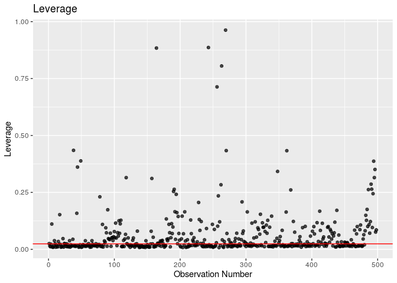

Characteristics of Recent Mexican Immigrants to California, USA, that
Influence Household Income
================
Ben 10
12/05/2019

## Section 1: Introduction (includes introduction and exploratory data analysis)

## 1\. Introduction

### 1.1 Objective

We are aiming to build a model to determine which characteristics of
Mexican immmigrants to the United States, specifically California,
well-explain variation in household income.

### 1.2 Description of Dataset

The dataset is from The Mexican Migration Project (MMP, \*see References
below for confidentiality terms). It was created in 1982 by an
interdisciplinary team of researchers to further our understanding of
the complex process of Mexican migration to the United States. The
project is a binational research effort co-directed by Jorge Durand,
professor of Social Anthropology at the University of Guadalajara
(Mexico), and Douglas S. Massey, professor of Sociology and Public
Affairs, with a joint appointment in the Woodrow Wilson School, at
Princeton University (US).

Since its inception, the MMP’s main focus has been to gather social as
well as economic information on Mexican-US migration. The data collected
has been compiled in a comprehensive database that is available to the
public free of charge for research and educational purposes through its
web-site. The MMP uses the ethnosurvey approach to gather data: in
winter months, they randomly sample households in communities throughout
Mexico, surveying household heads and members about their first and last
trip to the US, as well as economic and demographic information. They
then conduct the same survey in destination areas in the US, sampling
migrants from the same communities they surveyed in Mexico but who have
not returned to Mexico. Thus, the sample of migrants includes residents
in both Mexico and the US.

The MMP170 Database contains an initial file with general demographic,
economic, and migratory information for each member of a surveyed
household (PERS). Pers170 has 132 variables and 176701 observations,and
hence it is very large. Therefore, we selected 17 meaningful variables
and filtered out rows that contain N/A’s to create a new dataset labeled
`data`.

### 1.3 Method

We will build a multiple linear regression model to predict household
income considering the following variables: `sex`, `relhead`, `age`,
`statebrn`, `marstat`, `edyrs`, `occtype`, `usdur1`, `usdurl`, `usdoc1`,
`uscity`, `yrborn`.

“X1”: Number of observation

“sex”: Sex of immigrant

“relhead”: Relationship to household head

“yrborn”: Year of birth

“age”: Age

“statebrn”: State of birth

“marstat”: Marital status

“edyrs”: School years completed

“occ”: Principal occupation

“hhincome” : Household income

“usstate1”: First US migration: State of residence

“usstatel”: Latest US migration: State of residence

“usplace1”: First US migration: City of residence (in place codes)

“usplacel”: Latest US migration: City of residence (in place codes)

“usdur1”: First US migration: Duration (in months)

“usdurl”: Latest US migration: Duration (in months)

“usdoc1”: Type of documentation during first US migration

“occtype”: Category of occupation

“uscity”: City of residence during first US migration

Our response variable is household income: the total income for a single
household. We chose to use the multiple linear regression because our
response variable is numeric, and there are multiple predictor
variables.

## 2\. Exploratory Data Analysis

### 2.1 Data Cleaning

Due to the complexity of our original data, we did not include data
cleaning in the analysis. For more information, please see our proposal,
where all the data cleaning happens.

However, we did make some adjustment according to the feedback that
there is large imbalance of the amount of data between regions, and that
the distribution of the response variable is not normal. Below is the
update on our data cleaning:

### 1.4 Updated Data Exploration

#### 1.4.1 Filter Only Immigrants in California

According to our previous data exploration, we found that the
overwhelming majority of immigrants settled in California, as shown in
the graph
below:

<!-- -->

Hence, we decided to concentrate on California alone. Since the
originial dataset is large, we have enough data left in California alone
to produce meaningful analysis.

#### 1.4.2 Cut Household Income Groups

Originally, the distribution of Household Income- our response variable-
was bimodal and had a median of 412,647 dollars. A plot of household
income in natural units reveals very little information, due to a
scattering of very high incomes which blow up the range of the plot.
However, a logged plot reveals that household income almost looks like 3
separate distributions:

<!-- -->

We determined that 412,647 dollars is an absurdly high median income for
a survey of largely undocumented immigrants in the US and believe that a
significant chunk of the high incomes were actually recorded in pesos.
The documentation for the data from the Mexican Migration Project does
not specify unit of hhincome; however, the project site details that
researchers surveyed communities in Mexico, then traveled to the US to
survey communities there. It seems likely that the communities surveyed
in Mexico would report income in pesos and those surveyed in the US
would report income in USD. However, the data was collected over a
period of 10 years, during which the exchange rate between pesos and USD
changed significantly. Hence, we cannot simply convert all the incomes
that appear to be recorded in pesos into USD.

Therefore, we decided to filter out the incomes above 60,000 to remove
what appears to be a second distribution of incomes in pesos. We will
also remove incomes of zero from our dataset, because it will interfere
with our model accuracy. However, this compromises our model’s
predictive and explanatory range: our model will only be able to predict
or explain the household income of those who already have jobs with
income.

<!-- -->

Now the distribution of response variable (hhincome) looks like a right
skewed normal
distribution.

#### 1.4.3 Group cities by region

These immigrants to California arrived to the following cities:

Bay Area: Vallejo-Fairfield-Napa, San Francisco, San Jose, Santa
Cruz-Watsonville

Central California: Sacramento, Merced, Fresno, Bakersfield

Southern California: Santa Barbara-Santa Maria-Lompoc, Ventura, Los
Angeles-Long Beach, Orange County, Riverside-San Bernardino, and San
Diego.

We decided to simplify these cities into 3 regional categories: Bay
Area, Southern California and Central California.

Given the comparatively small number of cases in which no city was
reported, we deleted these instances. The majority of immigrants went to
LA-Long Beach area in Southern California.

#### 1.4.4 Remove Variable “relhead”

It turned out that all values from relhead (relationship to head of
household) in our cleaned data were “1” or head. So we will remove this
variable, as well as state variables since we are only using California
data. We will also remove place data since we are using uscity, and occ
since we are using occtype.

#### 1.4.5 Mean-center “age” , “usdur1” and “usdurl”

We must center age and usdurl in order to have a useful model intercept
interpretation.

    ## [1] 39.42495

    ## [1] 60.27096

    ## [1] 43.98635

    ## [1] 6.440546

The mean age in the dataset is 39.43 years ; the mean duration of last
US migration is 60.27 months (about 5 years); and the mean duration of
first US migration is 43.99 months (less than 3.5
years).

### 1.4.6 Remove El Salvador Data and regionalize state born variable

We do not have any data from seven states: Baja California Sur, Chiapas,
Hidalgo, Quintana Roo, Sinaloa, Tlaxcala, and Yucatán. We had a small
amount of non-Mexican data, which we omitted.

We divided the remaining states into the following regions:

South East Mexico: Tabasco, Oaxaca, Campeche, Veracruz

Northern Mexico: Coahuila, Chihuahua, Durango, Nuevo Leon, Sonora,
Tamaulipas, Baja California del Norte

Bajío: Aguascalientes, Guanajuato, Querétaro, San Luis Potosí, Zacatecas

Central Mexico: Mexico City, México, Morelos, Puebla

Pacific Coast: Colima, Guerrero, Jalisco, Michoacán,
Nayarit

#### 1.4.7 Remove Obvious Collinear Variable

`yrborn` and `age` provide the same information and are perfectly
linear, therefore we decided to remove `yrborn` from consideration in
the model.

#### 1.4.8 Simplify Occupation Type

    ## # A tibble: 13 x 2
    ## # Groups:   occtype [13]
    ##    occtype                       n
    ##    <chr>                     <int>
    ##  1 Administrative support       19
    ##  2 Administrator                 5
    ##  3 Agriculture                 115
    ##  4 Arts                          1
    ##  5 Educator                      3
    ##  6 Manufacturing (skilled)     101
    ##  7 Manufacturing (unskilled)   102
    ##  8 Professional                  2
    ##  9 Protection                    2
    ## 10 Sales                        49
    ## 11 Services                     71
    ## 12 Technical Worker              6
    ## 13 Transportation               22

<!-- -->

We first filter out migrants with occupations indicating lack of paid
employment, because our anaylsis focuses only on those
migrants

## Section 2: Regression Analysis (includes the final model and discussion of assumptions)

## 2\. Multiple Linear Regression Model

In an effort to explain which characteristics of migrants influence
their household income, we will use a multiple linear regression model.
Since our response variable is numerical with mulitple potential
predictors, this is the best model at our disposal.

We will consider the potential interaction between principal occupation
and number of years of school completed, since those are generally
interconnected. We may also consider the interaction between
documentation type and occupation type, although the effect may be
insignificant. However, if the variables occtype, edyrs, or usdoc1 don’t
make it through the process of inital model selection, we will not
include these interactions in the model as that would not be prudent.

We will select our model using AIC criteria, because since we’re dealing
with people, we want to build a model that accounts for volatile human
nature and the ever-changing socioeconomic and political climate that
could influence someone’s household income. AIC is used when we would
rather say a variable is a relevant predictor, when in reality it might
not be and so in this case, we would rather err on the side of a false
positive because we are dealing with a constantly fluctuating issue.

### 2.1 Description of Methods

In our first multiple linear regression model, we included all 19
variables. Then, we used backwards model selection to reduce the model
to 5 significant variables: edyrs, usdurl, sex, statebrn and age. We
used AIC as the criterion because immigration is a complex social issue,
hence we would prefer a model with many predictors and err on the side
of false-positive, rather than having a leaner model.

After inital backwards selection, we will explore the possible
interactions between remaining variables: edyrs, usdurl, sex, statebrn
and age, to determine if any are significant. The significant
interactions are:

age*edyrs: p = 0 \< 0.05  
(This interaction makes sense, because we expect older immigrants to be
more educated) sex*usdurl: p = 0.0303039 \< 0.05  
(This interaction is surprising, because it suggests that the change in
income with time in the US differs depending on the immigrant’s sex.
This potentially highlight the gender discrimination in workplace.)
statebrn*edyrs: p = 0.0002466 \< 0.05 (This interaction makes sense,
because we expect different region of Mexico have different level of
development and hence access to education.) statebrn*usdurl: p = 0.0012
\< 0.05 (This interaction makes sense, because immigrants from certain
regions in Mexico may have a easier time staying longer in California
because there is already a large community of immigrants from that
region there.)

Therefore, we included these interactions in our original full model,
and did backward selection again to get our final model. Our final model
dropped the interaction between sex\*usdurl, which is the one we found
that didn’t make sense immediately. Hence, we are confident about our
final model.

(Please see “Section 5 : Additional Work” for detailed coding process.)

### 2.2 Full Model after Evaluating Interactions

<table>

<thead>

<tr>

<th style="text-align:left;">

term

</th>

<th style="text-align:right;">

estimate

</th>

<th style="text-align:right;">

std.error

</th>

<th style="text-align:right;">

statistic

</th>

<th style="text-align:right;">

p.value

</th>

</tr>

</thead>

<tbody>

<tr>

<td style="text-align:left;">

(Intercept)

</td>

<td style="text-align:right;">

292.093

</td>

<td style="text-align:right;">

266.026

</td>

<td style="text-align:right;">

1.098

</td>

<td style="text-align:right;">

0.273

</td>

</tr>

<tr>

<td style="text-align:left;">

sexM

</td>

<td style="text-align:right;">

355.558

</td>

<td style="text-align:right;">

179.825

</td>

<td style="text-align:right;">

1.977

</td>

<td style="text-align:right;">

0.049

</td>

</tr>

<tr>

<td style="text-align:left;">

age

</td>

<td style="text-align:right;">

\-6.159

</td>

<td style="text-align:right;">

4.379

</td>

<td style="text-align:right;">

\-1.407

</td>

<td style="text-align:right;">

0.160

</td>

</tr>

<tr>

<td style="text-align:left;">

statebrnCentral Mexico

</td>

<td style="text-align:right;">

2592.408

</td>

<td style="text-align:right;">

883.726

</td>

<td style="text-align:right;">

2.933

</td>

<td style="text-align:right;">

0.004

</td>

</tr>

<tr>

<td style="text-align:left;">

statebrnNorthern Mexico

</td>

<td style="text-align:right;">

\-38.135

</td>

<td style="text-align:right;">

412.600

</td>

<td style="text-align:right;">

\-0.092

</td>

<td style="text-align:right;">

0.926

</td>

</tr>

<tr>

<td style="text-align:left;">

statebrnPacific Coast

</td>

<td style="text-align:right;">

145.301

</td>

<td style="text-align:right;">

96.510

</td>

<td style="text-align:right;">

1.506

</td>

<td style="text-align:right;">

0.133

</td>

</tr>

<tr>

<td style="text-align:left;">

statebrnSouth East Mexico

</td>

<td style="text-align:right;">

\-323.036

</td>

<td style="text-align:right;">

669.034

</td>

<td style="text-align:right;">

\-0.483

</td>

<td style="text-align:right;">

0.629

</td>

</tr>

<tr>

<td style="text-align:left;">

marstatDivorced

</td>

<td style="text-align:right;">

154.227

</td>

<td style="text-align:right;">

208.087

</td>

<td style="text-align:right;">

0.741

</td>

<td style="text-align:right;">

0.459

</td>

</tr>

<tr>

<td style="text-align:left;">

marstatMarried

</td>

<td style="text-align:right;">

26.483

</td>

<td style="text-align:right;">

111.742

</td>

<td style="text-align:right;">

0.237

</td>

<td style="text-align:right;">

0.813

</td>

</tr>

<tr>

<td style="text-align:left;">

marstatNever married

</td>

<td style="text-align:right;">

\-176.336

</td>

<td style="text-align:right;">

155.478

</td>

<td style="text-align:right;">

\-1.134

</td>

<td style="text-align:right;">

0.257

</td>

</tr>

<tr>

<td style="text-align:left;">

marstatSeparated

</td>

<td style="text-align:right;">

61.779

</td>

<td style="text-align:right;">

220.279

</td>

<td style="text-align:right;">

0.280

</td>

<td style="text-align:right;">

0.779

</td>

</tr>

<tr>

<td style="text-align:left;">

marstatWidowed

</td>

<td style="text-align:right;">

\-65.290

</td>

<td style="text-align:right;">

239.025

</td>

<td style="text-align:right;">

\-0.273

</td>

<td style="text-align:right;">

0.785

</td>

</tr>

<tr>

<td style="text-align:left;">

edyrs

</td>

<td style="text-align:right;">

40.619

</td>

<td style="text-align:right;">

11.654

</td>

<td style="text-align:right;">

3.486

</td>

<td style="text-align:right;">

0.001

</td>

</tr>

<tr>

<td style="text-align:left;">

occtypeManufacturing

</td>

<td style="text-align:right;">

96.781

</td>

<td style="text-align:right;">

62.687

</td>

<td style="text-align:right;">

1.544

</td>

<td style="text-align:right;">

0.123

</td>

</tr>

<tr>

<td style="text-align:left;">

occtypeProfessional

</td>

<td style="text-align:right;">

206.852

</td>

<td style="text-align:right;">

107.317

</td>

<td style="text-align:right;">

1.927

</td>

<td style="text-align:right;">

0.055

</td>

</tr>

<tr>

<td style="text-align:left;">

occtypeService

</td>

<td style="text-align:right;">

158.660

</td>

<td style="text-align:right;">

68.504

</td>

<td style="text-align:right;">

2.316

</td>

<td style="text-align:right;">

0.021

</td>

</tr>

<tr>

<td style="text-align:left;">

usdur1

</td>

<td style="text-align:right;">

1.382

</td>

<td style="text-align:right;">

0.902

</td>

<td style="text-align:right;">

1.532

</td>

<td style="text-align:right;">

0.126

</td>

</tr>

<tr>

<td style="text-align:left;">

usdoc1Legal resident

</td>

<td style="text-align:right;">

\-8.308

</td>

<td style="text-align:right;">

142.493

</td>

<td style="text-align:right;">

\-0.058

</td>

<td style="text-align:right;">

0.954

</td>

</tr>

<tr>

<td style="text-align:left;">

usdoc1Temporary: Tourist/visitor

</td>

<td style="text-align:right;">

\-190.813

</td>

<td style="text-align:right;">

152.086

</td>

<td style="text-align:right;">

\-1.255

</td>

<td style="text-align:right;">

0.210

</td>

</tr>

<tr>

<td style="text-align:left;">

usdoc1Undocumented

</td>

<td style="text-align:right;">

\-153.857

</td>

<td style="text-align:right;">

119.229

</td>

<td style="text-align:right;">

\-1.290

</td>

<td style="text-align:right;">

0.198

</td>

</tr>

<tr>

<td style="text-align:left;">

uscitycentcal

</td>

<td style="text-align:right;">

29.635

</td>

<td style="text-align:right;">

98.773

</td>

<td style="text-align:right;">

0.300

</td>

<td style="text-align:right;">

0.764

</td>

</tr>

<tr>

<td style="text-align:left;">

uscitysocal

</td>

<td style="text-align:right;">

31.966

</td>

<td style="text-align:right;">

79.040

</td>

<td style="text-align:right;">

0.404

</td>

<td style="text-align:right;">

0.686

</td>

</tr>

<tr>

<td style="text-align:left;">

usdurl

</td>

<td style="text-align:right;">

1.125

</td>

<td style="text-align:right;">

0.444

</td>

<td style="text-align:right;">

2.531

</td>

<td style="text-align:right;">

0.012

</td>

</tr>

<tr>

<td style="text-align:left;">

age:edyrs

</td>

<td style="text-align:right;">

2.182

</td>

<td style="text-align:right;">

0.609

</td>

<td style="text-align:right;">

3.584

</td>

<td style="text-align:right;">

0.000

</td>

</tr>

<tr>

<td style="text-align:left;">

sexM:usdur1

</td>

<td style="text-align:right;">

\-1.754

</td>

<td style="text-align:right;">

0.904

</td>

<td style="text-align:right;">

\-1.940

</td>

<td style="text-align:right;">

0.053

</td>

</tr>

<tr>

<td style="text-align:left;">

statebrnCentral Mexico:edyrs

</td>

<td style="text-align:right;">

\-321.323

</td>

<td style="text-align:right;">

116.354

</td>

<td style="text-align:right;">

\-2.762

</td>

<td style="text-align:right;">

0.006

</td>

</tr>

<tr>

<td style="text-align:left;">

statebrnNorthern Mexico:edyrs

</td>

<td style="text-align:right;">

28.718

</td>

<td style="text-align:right;">

45.291

</td>

<td style="text-align:right;">

0.634

</td>

<td style="text-align:right;">

0.526

</td>

</tr>

<tr>

<td style="text-align:left;">

statebrnPacific Coast:edyrs

</td>

<td style="text-align:right;">

\-35.998

</td>

<td style="text-align:right;">

13.430

</td>

<td style="text-align:right;">

\-2.680

</td>

<td style="text-align:right;">

0.008

</td>

</tr>

<tr>

<td style="text-align:left;">

statebrnSouth East Mexico:edyrs

</td>

<td style="text-align:right;">

19.019

</td>

<td style="text-align:right;">

36.078

</td>

<td style="text-align:right;">

0.527

</td>

<td style="text-align:right;">

0.598

</td>

</tr>

<tr>

<td style="text-align:left;">

statebrnCentral Mexico:usdurl

</td>

<td style="text-align:right;">

11.046

</td>

<td style="text-align:right;">

6.441

</td>

<td style="text-align:right;">

1.715

</td>

<td style="text-align:right;">

0.087

</td>

</tr>

<tr>

<td style="text-align:left;">

statebrnNorthern Mexico:usdurl

</td>

<td style="text-align:right;">

\-5.348

</td>

<td style="text-align:right;">

1.882

</td>

<td style="text-align:right;">

\-2.841

</td>

<td style="text-align:right;">

0.005

</td>

</tr>

<tr>

<td style="text-align:left;">

statebrnPacific Coast:usdurl

</td>

<td style="text-align:right;">

\-1.232

</td>

<td style="text-align:right;">

0.550

</td>

<td style="text-align:right;">

\-2.240

</td>

<td style="text-align:right;">

0.026

</td>

</tr>

<tr>

<td style="text-align:left;">

statebrnSouth East Mexico:usdurl

</td>

<td style="text-align:right;">

\-7.038

</td>

<td style="text-align:right;">

11.520

</td>

<td style="text-align:right;">

\-0.611

</td>

<td style="text-align:right;">

0.542

</td>

</tr>

</tbody>

</table>

### 2.3 Final model

    ## Start:  AIC=6197.51
    ## hhincome ~ sex + age + statebrn + marstat + edyrs + occtype + 
    ##     usdur1 + usdoc1 + uscity + age * edyrs + sex * usdur1 + statebrn * 
    ##     edyrs + statebrn * usdurl
    ## 
    ##                   Df Sum of Sq       RSS    AIC
    ## - marstat          5    990853 111749117 6191.9
    ## - uscity           2     39047 110797311 6193.7
    ## - usdoc1           3   1023232 111781496 6196.1
    ## <none>                         110758264 6197.5
    ## - occtype          3   1530017 112288281 6198.3
    ## - sex:usdur1       1    896476 111654740 6199.5
    ## - statebrn:usdurl  4   3624483 114382748 6205.5
    ## - statebrn:edyrs   4   3908846 114667110 6206.8
    ## - age:edyrs        1   3059507 113817771 6209.1
    ## 
    ## Step:  AIC=6191.94
    ## hhincome ~ sex + age + statebrn + edyrs + occtype + usdur1 + 
    ##     usdoc1 + uscity + usdurl + age:edyrs + sex:usdur1 + statebrn:edyrs + 
    ##     statebrn:usdurl
    ## 
    ##                   Df Sum of Sq       RSS    AIC
    ## - uscity           2     57689 111806806 6188.2
    ## - usdoc1           3   1130901 112880018 6191.0
    ## - occtype          3   1351608 113100725 6191.9
    ## <none>                         111749117 6191.9
    ## - sex:usdur1       1    791780 112540897 6193.5
    ## - statebrn:usdurl  4   3623158 115372275 6199.8
    ## - statebrn:edyrs   4   3765065 115514181 6200.4
    ## - age:edyrs        1   3518342 115267459 6205.4
    ## 
    ## Step:  AIC=6188.2
    ## hhincome ~ sex + age + statebrn + edyrs + occtype + usdur1 + 
    ##     usdoc1 + usdurl + age:edyrs + sex:usdur1 + statebrn:edyrs + 
    ##     statebrn:usdurl
    ## 
    ##                   Df Sum of Sq       RSS    AIC
    ## - usdoc1           3   1082077 112888883 6187.0
    ## <none>                         111806806 6188.2
    ## - occtype          3   1392744 113199550 6188.4
    ## - sex:usdur1       1    783093 112589899 6189.7
    ## - statebrn:usdurl  4   3606914 115413719 6196.0
    ## - statebrn:edyrs   4   3817195 115624000 6196.9
    ## - age:edyrs        1   3536160 115342965 6201.7
    ## 
    ## Step:  AIC=6186.99
    ## hhincome ~ sex + age + statebrn + edyrs + occtype + usdur1 + 
    ##     usdurl + age:edyrs + sex:usdur1 + statebrn:edyrs + statebrn:usdurl
    ## 
    ##                   Df Sum of Sq       RSS    AIC
    ## - occtype          3   1232975 114121858 6186.4
    ## <none>                         112888883 6187.0
    ## - sex:usdur1       1    711441 113600324 6188.1
    ## - statebrn:usdurl  4   4051621 116940503 6196.6
    ## - statebrn:edyrs   4   4321243 117210125 6197.7
    ## - age:edyrs        1   3222780 116111663 6199.0
    ## 
    ## Step:  AIC=6186.4
    ## hhincome ~ sex + age + statebrn + edyrs + usdur1 + usdurl + age:edyrs + 
    ##     sex:usdur1 + statebrn:edyrs + statebrn:usdurl
    ## 
    ##                   Df Sum of Sq       RSS    AIC
    ## <none>                         114121858 6186.4
    ## - sex:usdur1       1    486405 114608263 6186.5
    ## - statebrn:usdurl  4   4178233 118300091 6196.3
    ## - statebrn:edyrs   4   4627989 118749847 6198.2
    ## - age:edyrs        1   3624713 117746570 6200.0

| term                             |  estimate | std.error | statistic | p.value |   conf.low | conf.high |
| :------------------------------- | --------: | --------: | --------: | ------: | ---------: | --------: |
| (Intercept)                      |   256.460 |   149.652 |     1.714 |   0.087 |   \-37.598 |   550.518 |
| sexM                             |   349.983 |   120.389 |     2.907 |   0.004 |    113.426 |   586.540 |
| age                              |   \-5.058 |     3.811 |   \-1.327 |   0.185 |   \-12.548 |     2.431 |
| statebrnCentral Mexico           |  2471.655 |   877.546 |     2.817 |   0.005 |    747.331 |  4195.980 |
| statebrnNorthern Mexico          |  \-90.414 |   408.429 |   \-0.221 |   0.825 |  \-892.953 |   712.124 |
| statebrnPacific Coast            |   166.223 |    94.743 |     1.754 |   0.080 |   \-19.942 |   352.388 |
| statebrnSouth East Mexico        | \-253.250 |   662.826 |   \-0.382 |   0.703 | \-1555.663 |  1049.162 |
| edyrs                            |    49.454 |    10.979 |     4.505 |   0.000 |     27.882 |    71.027 |
| usdur1                           |     0.949 |     0.859 |     1.105 |   0.270 |    \-0.738 |     2.637 |
| usdurl                           |     1.276 |     0.432 |     2.955 |   0.003 |      0.427 |     2.124 |
| age:edyrs                        |     2.291 |     0.588 |     3.896 |   0.000 |      1.136 |     3.447 |
| sexM:usdur1                      |   \-1.225 |     0.858 |   \-1.427 |   0.154 |    \-2.910 |     0.461 |
| statebrnCentral Mexico:edyrs     | \-294.518 |   115.138 |   \-2.558 |   0.011 |  \-520.757 |  \-68.279 |
| statebrnNorthern Mexico:edyrs    |    42.055 |    44.537 |     0.944 |   0.346 |   \-45.457 |   129.567 |
| statebrnPacific Coast:edyrs      |  \-40.153 |    13.128 |   \-3.058 |   0.002 |   \-65.949 |  \-14.356 |
| statebrnSouth East Mexico:edyrs  |    21.415 |    35.242 |     0.608 |   0.544 |   \-47.832 |    90.663 |
| statebrnCentral Mexico:usdurl    |    11.167 |     6.422 |     1.739 |   0.083 |    \-1.452 |    23.786 |
| statebrnNorthern Mexico:usdurl   |   \-5.790 |     1.860 |   \-3.113 |   0.002 |    \-9.445 |   \-2.135 |
| statebrnPacific Coast:usdurl     |   \-1.285 |     0.537 |   \-2.393 |   0.017 |    \-2.340 |   \-0.230 |
| statebrnSouth East Mexico:usdurl |   \-5.324 |    11.430 |   \-0.466 |   0.642 |   \-27.782 |    17.135 |

### 2.4 Description of Method in Model Diagnostics

We checked leverage, standardized residuals, estimate of standard
deviation, cook’s distance, VIF and adjusted R-square. (Please see
“Section 5 : Additional Work” for detailed codes and graphs)

#### 2.4.1 Leverage

About a quarter of our observations are high leverage points, meaning
that their combinations of values for the predictor variables are very
far from the typical combinations in the data. Because human
circumstances and economic conditions are often so extremely variable,
we would not expect most migrants to share common values for the
predictor variables.

Of the individuals in the data with high leverage, two have extensive
educations and are relatively young and from Northern Mexico. Two are
closer to the median age, have 5 years of education, and are from
Central Mexico.

These points are potentially, but not certainly, influential points, so
we use other methods to sort out influential points.

#### 2.4.2 Standardized Residuals

The 5% of our observations with standardized residuals of magnitude
greater than 2 should be examined more closely- these are outliers, but
they may not have an impact on the regression line. We can look plots of
the standardized residuals versus all of our predictors. Plots of the
standardized residuals for each predictor variable reveal that, for the
most part, our data satisfies the constant variance assumption.

#### 2.4.3 Estimate of Standard Deviation

The estimate of our regression standard deviation using all observations
is 487.0997, whereas the standard deviation estimate without points with
large magnitude standardized residuals is 387.6239. Removing points with
large magnitude standardized residuals would affect our conclusions by
decreasing the standard error associated with our model coefficients,
however, we do not want to damage our model’s integrity and explanatory
power by removing too much human variability from the observations we
base it on. We will examine Cook’s Distance to see if any observations
have excessive overall impact or significantly affect the estimated
coefficients when removed.

#### 2.4.4 Cook’s Distance

Only one observation has a Cook’s Distance greater than 1. Hence, we
will remove this individual from our analysis because it exerts
significantly greater influence on the final coefficients of our model
and could distort our explanations.

#### 2.4.5 VIF

There are 3 coefficients with high VIFs (\>10):

statebrnCentral Mexico : 19.1 statebrnSouth East Mexico : 33.6
statebrnCentral Mexico:edyrs : 19.6 statebrnSouth East Mexico:usdurl :
24.3

The latter 2 VIFs could be related to the first 2. The first 2
coefficients have high collinearity because when we divided the birth
state into regions, there are very few and very geographically sparse
observations in the South East Mexico, and a lot more observations in
Central Mexico. Hence, in order to make each region more representative,
we included some of the ambiguous states that could possibly be included
in both regions into South East Mexico. Since the geographical regional
divide is subjective and continuous, we expect there to be collinearity.

#### 2.4.6 Adjusted R-squre

The adjusted R-square of our final model is 0.1443861, meaning that our
model explains around 14.4% of the variation in household income. This
is a small percentage. However, given that there are numerous social
determinants of income, and we only included Californian data and those
who have income between 1 and 60,000, the R-square seems reasonable.

## Section 3: Discussion and Limitations

### 3.1 Limitations

In order to complete an effective analysis in the time given, we greatly
simplified our raw data to predict our response variable, household
income. We ended up only analyzing a subgroup of the immigrants and
focused on those who migrated to California because they made up a large
majority of our dataset, anyway. However, because of that, our findings
may not be able to be generalized into other states in the US. If we
were given more time, we would’ve analyzed the entirety of the set.

Additionally, we cut a chunk of the data out because it appeared that
some of the income was reported in pesos and USD, though we are not
definitely sure. Further analysis could investigate why it appeared that
some income was reported in a potentially different currency and adjust
for it so we can include all observations in our analysis. We also cut
off the data with no income to avoid the influence of zero inflation on
the final model, hence biasing the model against immigrants who are
unemployed. Future models should be adjusted for zero inflation.

Moreover, in an attempt to simplify the variable “statebrn”, we grouped
observations into regions. However, in order to arrive at a balanced
grouping in terms of the number of observations in each region, we
artificially divided the regions geographically, rather than dividing
them according to socio-economic characteristics. As a result, the
household income in some regions, such as South East Mexico, has a wide
range. Furthermore, through compromising between geographic integrity
and number of observations in each region, the majority of observations
are still in Pacific Coast and Bajío regions due to the nature of the
data. Further work can look into weighing mechanisms for multiple linear
models.

According to our analysis of leverage and adjusted R-square, we conclude
that there might be many outliers in our data, which makes sense since
the immigrants has drastically different demographics and income. Hence,
our model should only be taken as a reference to analyse general trend,
rather than to predict precise income. Given that wage depends on
numerous socio-econoimic factors, our model is satisfactory, yet it
cannot tell the entire story.

If we could continue to work on the project, we would operate under the
assumption that the household income that is unusual was reported in
pesos and potentially recorded in the Mexico and split the data set into
two and investigate that. I think our model could be stronger if we were
able to include this very valuable data and inform our predictions with
this information.

### 3.2 Prediction

### 3.2.1 Effect of “Gender” on Wage

    ##        fit      lwr      upr
    ## 1 903.1686 833.5162 972.8209

For a male who is 39 years old (average age), has 6 years of education
(average edyrs), first immigrated to the US for 5 years (average
duration), and last immigrated to the US for 3 years and 7 months
(average duration), and was born in the region of “Bajío”, his predicted
wage is $893.32. We are 95% confident that the actual salary falls in
the interval of \[824.88, 961.76\].

    ##        fit      lwr      upr
    ## 1 553.1858 312.8893 793.4824

For a female who is 39 years old (average age), has 6 years of education
(average edyrs), first immigrated to the US for 5 years (average
duration), and last immigrated to the US for 3 years and 7 months
(average duration), and was born in the region of “Bajío”, her predicted
salary is $590.11. We are 95% confident that the actual salary falls in
the interval of \[370.68, 809.54\].

We can see from the prediction that there is a large gender wage gap,
since a male’s predicted wage is much higher than a female of the same
average demographics.

### 3.2.2 Effect of “State born” on Wage

We used male as a model input because the majority of the immigrants in
our data set are male. We used edyrs = 6 as the input because it is the
average number of years of education for the data set. The rest of the
inputs are 0 since those predictors are mean-centered.

    ##        fit      lwr      upr
    ## 1 903.1686 833.5162 972.8209

For a male who is 39 years old (average age), has 6 years of education
(average edyrs), first immigrated to the US for 5 years (average
duration), and last immigrated to the US for 3 years and 7 months
(average duration), and was born in the region of “Bajío”, his predicted
wage is $893.32 We are 95% confident that the actual salary falls in the
interval of \[824.88, 961.76\].

    ##        fit      lwr      upr
    ## 1 1607.715 1095.732 2119.699

For a male who is 39 years old (average age), has 6 years of education
(average edyrs), first immigrated to the US for 5 years (average
duration), and last immigrated to the US for 3 years and 7 months
(average duration), and was born in the region of of “Central Mexico”,
his predicted salary is $1611.19 We are 95% confident that the actual
salary falls in the interval of \[1101.47, 2120.91\].

    ##        fit      lwr      upr
    ## 1 1065.083 586.6262 1543.539

For a male who is 39 years old (average age), has 6 years of education
(average edyrs), first immigrated to the US for 5 years (average
duration), and last immigrated to the US for 3 years and 7 months
(average duration), and was born in the region of of “Northern Mexico”,
his predicted salary is $1056.73 We are 95% confident that the actual
salary falls in the interval of \[580.63, 1532.82\].

    ##        fit       lwr      upr
    ## 1 778.4103 -339.3509 1896.171

For a male who is 39 years old (average age), has 6 years of education
(average edyrs), first immigrated to the US for 5 years (average
duration), and last immigrated to the US for 3 years and 7 months
(average duration), and was born in the region of of “South East
Mexico”, his predicted salary is $788.32 We are 95% confident that the
actual salary falls in the interval of \[-324.9458, 961.76\].

    ##        fit      lwr      upr
    ## 1 828.4753 762.4723 894.4782

For a male who is 39 years old (average age), has 6 years of education
(average edyrs), first immigrated to the US for 5 years (average
duration), and last immigrated to the US for 3 years and 7 months
(average duration), and was born in the region of of “Pacific Coast”,
his predicted salary is $814.86 We are 95% confident that the actual
salary falls in the interval of \[750.97, 750.97\].

The prediction suggest a hierarchy in wage discrimination based on the
regions in Mexico that the immigrants are born in. Immigrants from the
region of Central Mexico has the highest predicted wage, followed by
Northern Mexico, Bajío, Pacific Coast, and South East Mexico has the
lowest average predicted wage. This is supported by literature on
economic inequality in Mexico. Specifically, early industrialization
started in Central and Northern Mexico, allowing more mobility and
opportunity for education and trade in these regions. In fact, in 2012,
the northern border states (6 of the 32) accounted for 52.87% of the
total export value. Therefore, it is possible that as a result,
immigrants from these regions have an easier time earning relative
higher wages than those from other regions.

However, it is worth noting that the confidence interval of South East
Mexico is very large, including as low as 0 and as high as $1901.58.
This could be due to the small sample size, as shown in the histogram
below:

<!-- -->

It may also be because this region was artifiically created from 4
distinct cultural/economic/geographic regions in Mexico: the Yucatan
Peninsula, Oaxaca, Veracruz and Chiapas & Tabasco. The regions were
combined in order to be useful for analysis, but with more data we would
have prefered to keep them as seperate regions, especially since
Veracruz is relatively better-off than the rest of the states.

## Section 4: Conclusion

Through our exploration and analysis, we found sex, age, years of
education, duration of last US immigration and region born to be
significant predictors of household income of Mexican immigrant living
in California. Among these, there are significant interactions between
region born and years of education, as well as between region born and
duration of last US stay.

From our predictions, we observe a large gender wage gap: the average
male has predicted wage of 893.32 USD, whereas the average female has
predicted wage of 590.11 USD. It is shocking that the average wage for
males in this sample is almost two times that of females in this sample.

We also observed regional differences in terms of where the immigrant
was born. Immigrants from the region of Central Mexico have the highest
predicted wage, followed by Northern Mexico, Bajío, Pacific Coast, and
South East Mexico has the lowest average predicted wage. However, since
there is a prominent imbalance in number of observations from various
regions, this conclusion should be taken with caution – for example, we
are notably missing data from two of the three states in the Yucatan
Peninsula in the South East of Mexico.

## Section 5: Additional Work

### 2.1 Full Model

<table>

<thead>

<tr>

<th style="text-align:left;">

term

</th>

<th style="text-align:right;">

estimate

</th>

<th style="text-align:right;">

std.error

</th>

<th style="text-align:right;">

statistic

</th>

<th style="text-align:right;">

p.value

</th>

</tr>

</thead>

<tbody>

<tr>

<td style="text-align:left;">

(Intercept)

</td>

<td style="text-align:right;">

336.219

</td>

<td style="text-align:right;">

260.490

</td>

<td style="text-align:right;">

1.291

</td>

<td style="text-align:right;">

0.197

</td>

</tr>

<tr>

<td style="text-align:left;">

sexM

</td>

<td style="text-align:right;">

306.283

</td>

<td style="text-align:right;">

183.313

</td>

<td style="text-align:right;">

1.671

</td>

<td style="text-align:right;">

0.095

</td>

</tr>

<tr>

<td style="text-align:left;">

age

</td>

<td style="text-align:right;">

6.422

</td>

<td style="text-align:right;">

2.789

</td>

<td style="text-align:right;">

2.302

</td>

<td style="text-align:right;">

0.022

</td>

</tr>

<tr>

<td style="text-align:left;">

statebrnCentral Mexico

</td>

<td style="text-align:right;">

243.019

</td>

<td style="text-align:right;">

217.955

</td>

<td style="text-align:right;">

1.115

</td>

<td style="text-align:right;">

0.265

</td>

</tr>

<tr>

<td style="text-align:left;">

statebrnNorthern Mexico

</td>

<td style="text-align:right;">

\-84.806

</td>

<td style="text-align:right;">

235.097

</td>

<td style="text-align:right;">

\-0.361

</td>

<td style="text-align:right;">

0.718

</td>

</tr>

<tr>

<td style="text-align:left;">

statebrnPacific Coast

</td>

<td style="text-align:right;">

\-91.483

</td>

<td style="text-align:right;">

49.246

</td>

<td style="text-align:right;">

\-1.858

</td>

<td style="text-align:right;">

0.064

</td>

</tr>

<tr>

<td style="text-align:left;">

statebrnSouth East Mexico

</td>

<td style="text-align:right;">

112.737

</td>

<td style="text-align:right;">

125.783

</td>

<td style="text-align:right;">

0.896

</td>

<td style="text-align:right;">

0.371

</td>

</tr>

<tr>

<td style="text-align:left;">

marstatDivorced

</td>

<td style="text-align:right;">

233.605

</td>

<td style="text-align:right;">

215.615

</td>

<td style="text-align:right;">

1.083

</td>

<td style="text-align:right;">

0.279

</td>

</tr>

<tr>

<td style="text-align:left;">

marstatMarried

</td>

<td style="text-align:right;">

34.821

</td>

<td style="text-align:right;">

116.576

</td>

<td style="text-align:right;">

0.299

</td>

<td style="text-align:right;">

0.765

</td>

</tr>

<tr>

<td style="text-align:left;">

marstatNever married

</td>

<td style="text-align:right;">

\-165.591

</td>

<td style="text-align:right;">

162.346

</td>

<td style="text-align:right;">

\-1.020

</td>

<td style="text-align:right;">

0.308

</td>

</tr>

<tr>

<td style="text-align:left;">

marstatSeparated

</td>

<td style="text-align:right;">

74.747

</td>

<td style="text-align:right;">

229.565

</td>

<td style="text-align:right;">

0.326

</td>

<td style="text-align:right;">

0.745

</td>

</tr>

<tr>

<td style="text-align:left;">

marstatWidowed

</td>

<td style="text-align:right;">

95.702

</td>

<td style="text-align:right;">

242.640

</td>

<td style="text-align:right;">

0.394

</td>

<td style="text-align:right;">

0.693

</td>

</tr>

<tr>

<td style="text-align:left;">

edyrs

</td>

<td style="text-align:right;">

15.296

</td>

<td style="text-align:right;">

7.580

</td>

<td style="text-align:right;">

2.018

</td>

<td style="text-align:right;">

0.044

</td>

</tr>

<tr>

<td style="text-align:left;">

occtypeManufacturing

</td>

<td style="text-align:right;">

118.000

</td>

<td style="text-align:right;">

64.682

</td>

<td style="text-align:right;">

1.824

</td>

<td style="text-align:right;">

0.069

</td>

</tr>

<tr>

<td style="text-align:left;">

occtypeProfessional

</td>

<td style="text-align:right;">

258.447

</td>

<td style="text-align:right;">

108.580

</td>

<td style="text-align:right;">

2.380

</td>

<td style="text-align:right;">

0.018

</td>

</tr>

<tr>

<td style="text-align:left;">

occtypeService

</td>

<td style="text-align:right;">

149.976

</td>

<td style="text-align:right;">

70.720

</td>

<td style="text-align:right;">

2.121

</td>

<td style="text-align:right;">

0.034

</td>

</tr>

<tr>

<td style="text-align:left;">

usdur1

</td>

<td style="text-align:right;">

\-0.375

</td>

<td style="text-align:right;">

0.453

</td>

<td style="text-align:right;">

\-0.828

</td>

<td style="text-align:right;">

0.408

</td>

</tr>

<tr>

<td style="text-align:left;">

usdurl

</td>

<td style="text-align:right;">

0.856

</td>

<td style="text-align:right;">

0.388

</td>

<td style="text-align:right;">

2.207

</td>

<td style="text-align:right;">

0.028

</td>

</tr>

<tr>

<td style="text-align:left;">

usdoc1Legal resident

</td>

<td style="text-align:right;">

161.966

</td>

<td style="text-align:right;">

145.344

</td>

<td style="text-align:right;">

1.114

</td>

<td style="text-align:right;">

0.266

</td>

</tr>

<tr>

<td style="text-align:left;">

usdoc1Temporary: Tourist/visitor

</td>

<td style="text-align:right;">

\-144.299

</td>

<td style="text-align:right;">

155.965

</td>

<td style="text-align:right;">

\-0.925

</td>

<td style="text-align:right;">

0.355

</td>

</tr>

<tr>

<td style="text-align:left;">

usdoc1Undocumented

</td>

<td style="text-align:right;">

\-47.150

</td>

<td style="text-align:right;">

121.970

</td>

<td style="text-align:right;">

\-0.387

</td>

<td style="text-align:right;">

0.699

</td>

</tr>

<tr>

<td style="text-align:left;">

uscitycentcal

</td>

<td style="text-align:right;">

39.085

</td>

<td style="text-align:right;">

102.900

</td>

<td style="text-align:right;">

0.380

</td>

<td style="text-align:right;">

0.704

</td>

</tr>

<tr>

<td style="text-align:left;">

uscitysocal

</td>

<td style="text-align:right;">

40.916

</td>

<td style="text-align:right;">

82.303

</td>

<td style="text-align:right;">

0.497

</td>

<td style="text-align:right;">

0.619

</td>

</tr>

</tbody>

</table>

### 2.2 Backward selection

    ## Start:  AIC=6233.96
    ## hhincome ~ sex + age + statebrn + marstat + edyrs + occtype + 
    ##     usdur1 + usdurl + usdoc1 + uscity
    ## 
    ##            Df Sum of Sq       RSS    AIC
    ## - marstat   5   1117380 125170807 6228.4
    ## - uscity    2     64974 124118402 6230.2
    ## - usdur1    1    178991 124232419 6232.7
    ## - statebrn  4   1815643 125869071 6233.2
    ## <none>                  124053428 6234.0
    ## - usdoc1    3   1706651 125760078 6234.8
    ## - sex       1    729080 124782508 6234.9
    ## - occtype   3   1862901 125916329 6235.4
    ## - edyrs     1   1063307 125116735 6236.2
    ## - usdurl    1   1271734 125325161 6237.0
    ## - age       1   1384513 125437941 6237.5
    ## 
    ## Step:  AIC=6228.43
    ## hhincome ~ sex + age + statebrn + edyrs + occtype + usdur1 + 
    ##     usdurl + usdoc1 + uscity
    ## 
    ##            Df Sum of Sq       RSS    AIC
    ## - uscity    2     75805 125246612 6224.7
    ## - usdur1    1    214264 125385071 6227.3
    ## <none>                  125170807 6228.4
    ## - usdoc1    3   1729934 126900742 6229.3
    ## - occtype   3   1755477 126926284 6229.4
    ## - statebrn  4   2273850 127444657 6229.4
    ## - edyrs     1   1108665 126279473 6230.8
    ## - sex       1   1162270 126333077 6231.0
    ## - usdurl    1   1342243 126513050 6231.7
    ## - age       1   1857888 127028695 6233.8
    ## 
    ## Step:  AIC=6224.73
    ## hhincome ~ sex + age + statebrn + edyrs + occtype + usdur1 + 
    ##     usdurl + usdoc1
    ## 
    ##            Df Sum of Sq       RSS    AIC
    ## - usdur1    1    188932 125435544 6223.5
    ## <none>                  125246612 6224.7
    ## - usdoc1    3   1666878 126913490 6225.3
    ## - statebrn  4   2314226 127560838 6225.8
    ## - occtype   3   1814497 127061109 6225.9
    ## - edyrs     1   1094602 126341214 6227.1
    ## - sex       1   1156574 126403186 6227.3
    ## - usdurl    1   1311263 126557875 6227.9
    ## - age       1   1846482 127093094 6230.0
    ## 
    ## Step:  AIC=6223.48
    ## hhincome ~ sex + age + statebrn + edyrs + occtype + usdurl + 
    ##     usdoc1
    ## 
    ##            Df Sum of Sq       RSS    AIC
    ## <none>                  125435544 6223.5
    ## - usdoc1    3   1631114 127066657 6223.9
    ## - occtype   3   1796091 127231634 6224.6
    ## - statebrn  4   2353643 127789187 6224.7
    ## - edyrs     1   1146434 126581977 6226.0
    ## - sex       1   1309985 126745529 6226.7
    ## - usdurl    1   1324851 126760395 6226.7
    ## - age       1   1959638 127395182 6229.2

| term                             |  estimate | std.error | statistic | p.value |  conf.low | conf.high |
| :------------------------------- | --------: | --------: | --------: | ------: | --------: | --------: |
| (Intercept)                      |   426.973 |   187.806 |     2.273 |   0.023 |    57.956 |   795.990 |
| sexM                             |   277.772 |   123.678 |     2.246 |   0.025 |    34.759 |   520.785 |
| age                              |     7.381 |     2.687 |     2.747 |   0.006 |     2.101 |    12.660 |
| statebrnCentral Mexico           |   286.819 |   215.560 |     1.331 |   0.184 | \-136.733 |   710.371 |
| statebrnNorthern Mexico          | \-105.700 |   233.279 |   \-0.453 |   0.651 | \-564.066 |   352.667 |
| statebrnPacific Coast            | \-103.875 |    48.530 |   \-2.140 |   0.033 | \-199.231 |   \-8.519 |
| statebrnSouth East Mexico        |   108.414 |   125.040 |     0.867 |   0.386 | \-137.277 |   354.104 |
| edyrs                            |    15.712 |     7.478 |     2.101 |   0.036 |     1.018 |    30.406 |
| occtypeManufacturing             |   120.484 |    63.986 |     1.883 |   0.060 |   \-5.241 |   246.208 |
| occtypeProfessional              |   253.715 |   107.237 |     2.366 |   0.018 |    43.007 |   464.424 |
| occtypeService                   |   138.278 |    69.463 |     1.991 |   0.047 |     1.790 |   274.766 |
| usdurl                           |     0.646 |     0.286 |     2.259 |   0.024 |     0.084 |     1.207 |
| usdoc1Legal resident             |   176.353 |   144.014 |     1.225 |   0.221 | \-106.619 |   459.324 |
| usdoc1Temporary: Tourist/visitor |  \-90.471 |   150.968 |   \-0.599 |   0.549 | \-387.106 |   206.163 |
| usdoc1Undocumented               |  \-38.190 |   120.305 |   \-0.317 |   0.751 | \-274.576 |   198.197 |

Using backward selection based on AIC, we narrowed down to 7 variables:
sex, edyrs, usdurl, statebrn, occtype, usdoc1 and age.

### 2.3 Interactions

To find potential interactions between the 7 variables, we used nested-F
test for each of the possible interactions:

After inital backwards selection, we will explore the possible
interactions between remaining variables: `edyrs`, `usdurl`, `sex`,
`statebrn`, `occtype`, `usdoc1` and `age`, to determine if any are
significant.

| Res.Df |       RSS | Df | Sum of Sq | Pr(\>Chi) |
| -----: | --------: | -: | --------: | --------: |
|    483 | 125435544 | NA |        NA |        NA |
|    482 | 125424763 |  1 |   10780.7 |     0.839 |

First, we tested the interaction between `edyrs` and `usdurl`. The
p-value for this test was 0.839 \> 0.05, therefore we will not include
it in the model.

| Res.Df |       RSS | Df | Sum of Sq | Pr(\>Chi) |
| -----: | --------: | -: | --------: | --------: |
|    483 | 125435544 | NA |        NA |        NA |
|    482 | 124081486 |  1 |   1354058 |     0.022 |

Then, we tested the interaction between `sex` and `usdurl`. The p-value
for this test was 0.022 \< 0.05, therefore we will include it in the
model.

| Res.Df |       RSS | Df | Sum of Sq | Pr(\>Chi) |
| -----: | --------: | -: | --------: | --------: |
|    483 | 125435544 | NA |        NA |        NA |
|    482 | 124099986 |  1 |   1335557 |     0.023 |

Then, we tested the interaction between `age` and `usdurl`. The p-value
for this test was 0.023 \< 0.05, therefore we will include it in the
model.

| Res.Df |       RSS | Df | Sum of Sq | Pr(\>Chi) |
| -----: | --------: | -: | --------: | --------: |
|    483 | 125435544 | NA |        NA |        NA |
|    482 | 125320504 |  1 |  115039.9 |     0.506 |

Then, we tested the interaction between `sex` and `edyrs`. The p-value
for this test was 0.506 \> 0.05, therefore we will not include it in the
model.

| Res.Df |       RSS | Df | Sum of Sq | Pr(\>Chi) |
| -----: | --------: | -: | --------: | --------: |
|    483 | 125435544 | NA |        NA |        NA |
|    482 | 119981867 |  1 |   5453677 |         0 |

Then, we tested the interaction between `age` and `edyrs`. The p-value
for this test was 0 \< 0.05, therefore we will include it in the model.

| Res.Df |       RSS | Df | Sum of Sq | Pr(\>Chi) |
| -----: | --------: | -: | --------: | --------: |
|    483 | 125435544 | NA |        NA |        NA |
|    482 | 125120075 |  1 |  315468.6 |      0.27 |

Then, we tested the interaction between `age` and `sex`. The p-value for
this test was 0.27 \> 0.05, therefore we will not include it in the
model.

| Res.Df |       RSS | Df | Sum of Sq | Pr(\>Chi) |
| -----: | --------: | -: | --------: | --------: |
|    483 | 125435544 | NA |        NA |        NA |
|    480 | 124722391 |  3 |    713153 |     0.433 |

Then, we tested the interaction between `statebrn` and `sex`. The
p-value for this test was 0.433\> 0.05, therefore we will not include it
in the model.

| Res.Df |       RSS | Df | Sum of Sq | Pr(\>Chi) |
| -----: | --------: | -: | --------: | --------: |
|    483 | 125435544 | NA |        NA |        NA |
|    479 | 123417127 |  4 |   2018417 |     0.098 |

Then, we tested the interaction between `statebrn` and `age`. The
p-value for this test was 0.098\> 0.05, therefore we will not include it
in the model.

| Res.Df |       RSS | Df | Sum of Sq | Pr(\>Chi) |
| -----: | --------: | -: | --------: | --------: |
|    483 | 125435544 | NA |        NA |        NA |
|    479 | 120606332 |  4 |   4829212 |     0.001 |

Then, we tested the interaction between `statebrn` and `edyrs`. The
p-value for this test was 0.001\< 0.05, therefore we will include it in
the model.

| Res.Df |       RSS | Df | Sum of Sq | Pr(\>Chi) |
| -----: | --------: | -: | --------: | --------: |
|    483 | 125435544 | NA |        NA |        NA |
|    479 | 121672866 |  4 |   3762678 |     0.005 |

Then, we tested the interaction between `statebrn` and `usdurl`. The
p-value for this test was 0.005 \< 0.05, therefore we will include it in
the model.

| Res.Df |       RSS | Df | Sum of Sq | Pr(\>Chi) |
| -----: | --------: | -: | --------: | --------: |
|    483 | 125435544 | NA |        NA |        NA |
|    480 | 125072371 |  3 |  363172.5 |     0.707 |

Then, we tested the interaction between `occtype` and `sex`. The p-value
for this test was 0.707 \> 0.05, therefore we will not include it in the
model.

| Res.Df |       RSS | Df | Sum of Sq | Pr(\>Chi) |
| -----: | --------: | -: | --------: | --------: |
|    483 | 125435544 | NA |        NA |        NA |
|    480 | 124082703 |  3 |   1352841 |     0.155 |

Then, we tested the interaction between `occtype` and `age`. The p-value
for this test was 0.155 \> 0.05, therefore we will not include it in the
model.

| Res.Df |       RSS | Df | Sum of Sq | Pr(\>Chi) |
| -----: | --------: | -: | --------: | --------: |
|    483 | 125435544 | NA |        NA |        NA |
|    474 | 120267831 |  9 |   5167712 |     0.016 |

Then, we tested the interaction between `occtype` and `statebrn`. The
p-value for this test was 0.016 \< 0.05, therefore we will include it in
the model.

| Res.Df |       RSS | Df | Sum of Sq | Pr(\>Chi) |
| -----: | --------: | -: | --------: | --------: |
|    483 | 125435544 | NA |        NA |        NA |
|    480 | 124859480 |  3 |  576063.6 |     0.529 |

Then, we tested the interaction between `occtype` and `edyrs`. The
p-value for this test was 0.529 \> 0.05, therefore we will not include
it in the model.

| Res.Df |       RSS | Df | Sum of Sq | Pr(\>Chi) |
| -----: | --------: | -: | --------: | --------: |
|    483 | 125435544 | NA |        NA |        NA |
|    480 | 123994932 |  3 |   1440612 |     0.134 |

Then, we tested the interaction between `occtype` and `usdurl`. The
p-value for this test was 0.134 \> 0.05, therefore we will not include
it in the model.

| Res.Df |       RSS | Df | Sum of Sq | Pr(\>Chi) |
| -----: | --------: | -: | --------: | --------: |
|    483 | 125435544 | NA |        NA |        NA |
|    481 | 125108642 |  2 |  326901.9 |     0.533 |

Then, we tested the interaction between `usdoc1` and `sex`. The p-value
for this test was 0.533 \> 0.05, therefore we will not include it in the
model.

| Res.Df |       RSS | Df | Sum of Sq | Pr(\>Chi) |
| -----: | --------: | -: | --------: | --------: |
|    483 | 125435544 | NA |        NA |        NA |
|    480 | 122360867 |  3 |   3074676 |     0.007 |

Then, we tested the interaction between `usdoc1` and `age`. The p-value
for this test was 0.007 \< 0.05, therefore we will include it in the
model.

| Res.Df |       RSS | Df | Sum of Sq | Pr(\>Chi) |
| -----: | --------: | -: | --------: | --------: |
|    483 | 125435544 | NA |        NA |        NA |
|    476 | 121325821 |  7 |   4109723 |     0.024 |

Then, we tested the interaction between `usdoc1` and `statebrn`. The
p-value for this test was 0.024 \< 0.05, therefore we will include it in
the model.

| Res.Df |       RSS | Df | Sum of Sq | Pr(\>Chi) |
| -----: | --------: | -: | --------: | --------: |
|    483 | 125435544 | NA |        NA |        NA |
|    480 | 123759147 |  3 |   1676397 |      0.09 |

Then, we tested the interaction between `usdoc1` and `edyrs`. The
p-value for this test was 0.09 \> 0.05, therefore we will not include it
in the model.

| Res.Df |       RSS | Df | Sum of Sq | Pr(\>Chi) |
| -----: | --------: | -: | --------: | --------: |
|    483 | 125435544 | NA |        NA |        NA |
|    481 | 125108642 |  2 |  326901.9 |     0.533 |

Then, we tested the interaction between `usdoc1` and `occtype`. The
p-value for this test was 0.53 \> 0.05, therefore we will not include it
in the model.

| Res.Df |       RSS | Df | Sum of Sq | Pr(\>Chi) |
| -----: | --------: | -: | --------: | --------: |
|    483 | 125435544 | NA |        NA |        NA |
|    480 | 122649587 |  3 |   2785957 |     0.012 |

Then, we tested the interaction between `usdoc1` and `usdurl`. The
p-value for this test was 0.012 \< 0.05, therefore we will include it in
the model.

Through nested F-test, we observed significant interactions between sex
& usdurl, age & usdurl, age \* edyrs, statebrn & edyrs, statebrn &
usdurl, occtype & statebrn, usdoc1 & age, usdoc1 & statebrn, and usdoc1
& usdurl, and we will be including them in our model selection.

### 2.4 Model with Interaction

<table>

<thead>

<tr>

<th style="text-align:left;">

term

</th>

<th style="text-align:right;">

estimate

</th>

<th style="text-align:right;">

std.error

</th>

<th style="text-align:right;">

statistic

</th>

<th style="text-align:right;">

p.value

</th>

</tr>

</thead>

<tbody>

<tr>

<td style="text-align:left;">

(Intercept)

</td>

<td style="text-align:right;">

217.692

</td>

<td style="text-align:right;">

396.745

</td>

<td style="text-align:right;">

0.549

</td>

<td style="text-align:right;">

0.583

</td>

</tr>

<tr>

<td style="text-align:left;">

sexM

</td>

<td style="text-align:right;">

348.484

</td>

<td style="text-align:right;">

130.134

</td>

<td style="text-align:right;">

2.678

</td>

<td style="text-align:right;">

0.008

</td>

</tr>

<tr>

<td style="text-align:left;">

age

</td>

<td style="text-align:right;">

\-11.892

</td>

<td style="text-align:right;">

12.916

</td>

<td style="text-align:right;">

\-0.921

</td>

<td style="text-align:right;">

0.358

</td>

</tr>

<tr>

<td style="text-align:left;">

edyrs

</td>

<td style="text-align:right;">

33.262

</td>

<td style="text-align:right;">

11.893

</td>

<td style="text-align:right;">

2.797

</td>

<td style="text-align:right;">

0.005

</td>

</tr>

<tr>

<td style="text-align:left;">

usdurl

</td>

<td style="text-align:right;">

\-2.256

</td>

<td style="text-align:right;">

1.936

</td>

<td style="text-align:right;">

\-1.165

</td>

<td style="text-align:right;">

0.245

</td>

</tr>

<tr>

<td style="text-align:left;">

usdoc1Legal resident

</td>

<td style="text-align:right;">

269.145

</td>

<td style="text-align:right;">

399.689

</td>

<td style="text-align:right;">

0.673

</td>

<td style="text-align:right;">

0.501

</td>

</tr>

<tr>

<td style="text-align:left;">

usdoc1Temporary: Tourist/visitor

</td>

<td style="text-align:right;">

125.547

</td>

<td style="text-align:right;">

415.176

</td>

<td style="text-align:right;">

0.302

</td>

<td style="text-align:right;">

0.762

</td>

</tr>

<tr>

<td style="text-align:left;">

usdoc1Undocumented

</td>

<td style="text-align:right;">

\-88.618

</td>

<td style="text-align:right;">

374.066

</td>

<td style="text-align:right;">

\-0.237

</td>

<td style="text-align:right;">

0.813

</td>

</tr>

<tr>

<td style="text-align:left;">

occtypeManufacturing

</td>

<td style="text-align:right;">

274.716

</td>

<td style="text-align:right;">

91.986

</td>

<td style="text-align:right;">

2.987

</td>

<td style="text-align:right;">

0.003

</td>

</tr>

<tr>

<td style="text-align:left;">

occtypeProfessional

</td>

<td style="text-align:right;">

372.524

</td>

<td style="text-align:right;">

168.890

</td>

<td style="text-align:right;">

2.206

</td>

<td style="text-align:right;">

0.028

</td>

</tr>

<tr>

<td style="text-align:left;">

occtypeService

</td>

<td style="text-align:right;">

232.285

</td>

<td style="text-align:right;">

95.798

</td>

<td style="text-align:right;">

2.425

</td>

<td style="text-align:right;">

0.016

</td>

</tr>

<tr>

<td style="text-align:left;">

statebrnCentral Mexico

</td>

<td style="text-align:right;">

5231.495

</td>

<td style="text-align:right;">

5100.564

</td>

<td style="text-align:right;">

1.026

</td>

<td style="text-align:right;">

0.306

</td>

</tr>

<tr>

<td style="text-align:left;">

statebrnNorthern Mexico

</td>

<td style="text-align:right;">

\-593916.558

</td>

<td style="text-align:right;">

366494.740

</td>

<td style="text-align:right;">

\-1.621

</td>

<td style="text-align:right;">

0.106

</td>

</tr>

<tr>

<td style="text-align:left;">

statebrnPacific Coast

</td>

<td style="text-align:right;">

475.250

</td>

<td style="text-align:right;">

243.417

</td>

<td style="text-align:right;">

1.952

</td>

<td style="text-align:right;">

0.052

</td>

</tr>

<tr>

<td style="text-align:left;">

statebrnSouth East Mexico

</td>

<td style="text-align:right;">

\-646.675

</td>

<td style="text-align:right;">

894.884

</td>

<td style="text-align:right;">

\-0.723

</td>

<td style="text-align:right;">

0.470

</td>

</tr>

<tr>

<td style="text-align:left;">

sexM:usdurl

</td>

<td style="text-align:right;">

\-0.867

</td>

<td style="text-align:right;">

0.952

</td>

<td style="text-align:right;">

\-0.911

</td>

<td style="text-align:right;">

0.363

</td>

</tr>

<tr>

<td style="text-align:left;">

age:usdurl

</td>

<td style="text-align:right;">

0.026

</td>

<td style="text-align:right;">

0.024

</td>

<td style="text-align:right;">

1.069

</td>

<td style="text-align:right;">

0.286

</td>

</tr>

<tr>

<td style="text-align:left;">

age:edyrs

</td>

<td style="text-align:right;">

2.473

</td>

<td style="text-align:right;">

0.633

</td>

<td style="text-align:right;">

3.904

</td>

<td style="text-align:right;">

0.000

</td>

</tr>

<tr>

<td style="text-align:left;">

edyrs:statebrnCentral Mexico

</td>

<td style="text-align:right;">

\-614.591

</td>

<td style="text-align:right;">

582.353

</td>

<td style="text-align:right;">

\-1.055

</td>

<td style="text-align:right;">

0.292

</td>

</tr>

<tr>

<td style="text-align:left;">

edyrs:statebrnNorthern Mexico

</td>

<td style="text-align:right;">

87520.240

</td>

<td style="text-align:right;">

53969.780

</td>

<td style="text-align:right;">

1.622

</td>

<td style="text-align:right;">

0.106

</td>

</tr>

<tr>

<td style="text-align:left;">

edyrs:statebrnPacific Coast

</td>

<td style="text-align:right;">

\-25.925

</td>

<td style="text-align:right;">

14.171

</td>

<td style="text-align:right;">

\-1.829

</td>

<td style="text-align:right;">

0.068

</td>

</tr>

<tr>

<td style="text-align:left;">

edyrs:statebrnSouth East Mexico

</td>

<td style="text-align:right;">

53.522

</td>

<td style="text-align:right;">

55.816

</td>

<td style="text-align:right;">

0.959

</td>

<td style="text-align:right;">

0.338

</td>

</tr>

<tr>

<td style="text-align:left;">

usdurl:statebrnCentral Mexico

</td>

<td style="text-align:right;">

11.619

</td>

<td style="text-align:right;">

6.295

</td>

<td style="text-align:right;">

1.846

</td>

<td style="text-align:right;">

0.066

</td>

</tr>

<tr>

<td style="text-align:left;">

usdurl:statebrnNorthern Mexico

</td>

<td style="text-align:right;">

545.695

</td>

<td style="text-align:right;">

339.437

</td>

<td style="text-align:right;">

1.608

</td>

<td style="text-align:right;">

0.109

</td>

</tr>

<tr>

<td style="text-align:left;">

usdurl:statebrnPacific Coast

</td>

<td style="text-align:right;">

\-0.154

</td>

<td style="text-align:right;">

0.650

</td>

<td style="text-align:right;">

\-0.237

</td>

<td style="text-align:right;">

0.813

</td>

</tr>

<tr>

<td style="text-align:left;">

usdurl:statebrnSouth East Mexico

</td>

<td style="text-align:right;">

\-7.666

</td>

<td style="text-align:right;">

12.508

</td>

<td style="text-align:right;">

\-0.613

</td>

<td style="text-align:right;">

0.540

</td>

</tr>

<tr>

<td style="text-align:left;">

occtypeManufacturing:statebrnCentral Mexico

</td>

<td style="text-align:right;">

\-1308.260

</td>

<td style="text-align:right;">

2225.761

</td>

<td style="text-align:right;">

\-0.588

</td>

<td style="text-align:right;">

0.557

</td>

</tr>

<tr>

<td style="text-align:left;">

occtypeManufacturing:statebrnNorthern Mexico

</td>

<td style="text-align:right;">

362198.763

</td>

<td style="text-align:right;">

223688.926

</td>

<td style="text-align:right;">

1.619

</td>

<td style="text-align:right;">

0.106

</td>

</tr>

<tr>

<td style="text-align:left;">

occtypeProfessional:statebrnNorthern Mexico

</td>

<td style="text-align:right;">

\-779682.927

</td>

<td style="text-align:right;">

480632.930

</td>

<td style="text-align:right;">

\-1.622

</td>

<td style="text-align:right;">

0.105

</td>

</tr>

<tr>

<td style="text-align:left;">

occtypeManufacturing:statebrnPacific Coast

</td>

<td style="text-align:right;">

\-318.634

</td>

<td style="text-align:right;">

124.474

</td>

<td style="text-align:right;">

\-2.560

</td>

<td style="text-align:right;">

0.011

</td>

</tr>

<tr>

<td style="text-align:left;">

occtypeProfessional:statebrnPacific Coast

</td>

<td style="text-align:right;">

\-270.848

</td>

<td style="text-align:right;">

221.416

</td>

<td style="text-align:right;">

\-1.223

</td>

<td style="text-align:right;">

0.222

</td>

</tr>

<tr>

<td style="text-align:left;">

occtypeService:statebrnPacific Coast

</td>

<td style="text-align:right;">

\-197.902

</td>

<td style="text-align:right;">

133.179

</td>

<td style="text-align:right;">

\-1.486

</td>

<td style="text-align:right;">

0.138

</td>

</tr>

<tr>

<td style="text-align:left;">

occtypeManufacturing:statebrnSouth East Mexico

</td>

<td style="text-align:right;">

\-60.910

</td>

<td style="text-align:right;">

358.390

</td>

<td style="text-align:right;">

\-0.170

</td>

<td style="text-align:right;">

0.865

</td>

</tr>

<tr>

<td style="text-align:left;">

occtypeProfessional:statebrnSouth East Mexico

</td>

<td style="text-align:right;">

\-573.141

</td>

<td style="text-align:right;">

511.381

</td>

<td style="text-align:right;">

\-1.121

</td>

<td style="text-align:right;">

0.263

</td>

</tr>

<tr>

<td style="text-align:left;">

occtypeService:statebrnSouth East Mexico

</td>

<td style="text-align:right;">

\-315.750

</td>

<td style="text-align:right;">

417.685

</td>

<td style="text-align:right;">

\-0.756

</td>

<td style="text-align:right;">

0.450

</td>

</tr>

<tr>

<td style="text-align:left;">

age:usdoc1Legal resident

</td>

<td style="text-align:right;">

\-11.582

</td>

<td style="text-align:right;">

16.043

</td>

<td style="text-align:right;">

\-0.722

</td>

<td style="text-align:right;">

0.471

</td>

</tr>

<tr>

<td style="text-align:left;">

age:usdoc1Temporary: Tourist/visitor

</td>

<td style="text-align:right;">

3.106

</td>

<td style="text-align:right;">

16.639

</td>

<td style="text-align:right;">

0.187

</td>

<td style="text-align:right;">

0.852

</td>

</tr>

<tr>

<td style="text-align:left;">

age:usdoc1Undocumented

</td>

<td style="text-align:right;">

6.251

</td>

<td style="text-align:right;">

13.507

</td>

<td style="text-align:right;">

0.463

</td>

<td style="text-align:right;">

0.644

</td>

</tr>

<tr>

<td style="text-align:left;">

usdoc1Legal resident:statebrnPacific Coast

</td>

<td style="text-align:right;">

\-538.944

</td>

<td style="text-align:right;">

305.471

</td>

<td style="text-align:right;">

\-1.764

</td>

<td style="text-align:right;">

0.078

</td>

</tr>

<tr>

<td style="text-align:left;">

usdoc1Temporary: Tourist/visitor:statebrnPacific Coast

</td>

<td style="text-align:right;">

\-464.635

</td>

<td style="text-align:right;">

320.220

</td>

<td style="text-align:right;">

\-1.451

</td>

<td style="text-align:right;">

0.147

</td>

</tr>

<tr>

<td style="text-align:left;">

usdoc1Undocumented:statebrnPacific Coast

</td>

<td style="text-align:right;">

\-153.594

</td>

<td style="text-align:right;">

246.733

</td>

<td style="text-align:right;">

\-0.623

</td>

<td style="text-align:right;">

0.534

</td>

</tr>

<tr>

<td style="text-align:left;">

usdoc1Temporary: Tourist/visitor:statebrnSouth East Mexico

</td>

<td style="text-align:right;">

\-95.652

</td>

<td style="text-align:right;">

881.469

</td>

<td style="text-align:right;">

\-0.109

</td>

<td style="text-align:right;">

0.914

</td>

</tr>

<tr>

<td style="text-align:left;">

usdoc1Undocumented:statebrnSouth East Mexico

</td>

<td style="text-align:right;">

307.364

</td>

<td style="text-align:right;">

578.957

</td>

<td style="text-align:right;">

0.531

</td>

<td style="text-align:right;">

0.596

</td>

</tr>

<tr>

<td style="text-align:left;">

usdurl:usdoc1Legal resident

</td>

<td style="text-align:right;">

2.775

</td>

<td style="text-align:right;">

1.592

</td>

<td style="text-align:right;">

1.744

</td>

<td style="text-align:right;">

0.082

</td>

</tr>

<tr>

<td style="text-align:left;">

usdurl:usdoc1Temporary: Tourist/visitor

</td>

<td style="text-align:right;">

2.355

</td>

<td style="text-align:right;">

1.607

</td>

<td style="text-align:right;">

1.465

</td>

<td style="text-align:right;">

0.144

</td>

</tr>

<tr>

<td style="text-align:left;">

usdurl:usdoc1Undocumented

</td>

<td style="text-align:right;">

3.868

</td>

<td style="text-align:right;">

1.407

</td>

<td style="text-align:right;">

2.749

</td>

<td style="text-align:right;">

0.006

</td>

</tr>

</tbody>

</table>

### 2.5 Backward Selection with Interaction

Since we observed 9 pairs of significant interactions, we will do the
backward selection again with the new interaction terms.

<table>

<thead>

<tr>

<th style="text-align:left;">

term

</th>

<th style="text-align:right;">

estimate

</th>

<th style="text-align:right;">

std.error

</th>

<th style="text-align:right;">

statistic

</th>

<th style="text-align:right;">

p.value

</th>

</tr>

</thead>

<tbody>

<tr>

<td style="text-align:left;">

(Intercept)

</td>

<td style="text-align:right;">

197.187

</td>

<td style="text-align:right;">

435.069

</td>

<td style="text-align:right;">

0.453

</td>

<td style="text-align:right;">

0.651

</td>

</tr>

<tr>

<td style="text-align:left;">

sexM

</td>

<td style="text-align:right;">

332.595

</td>

<td style="text-align:right;">

184.534

</td>

<td style="text-align:right;">

1.802

</td>

<td style="text-align:right;">

0.072

</td>

</tr>

<tr>

<td style="text-align:left;">

age

</td>

<td style="text-align:right;">

\-11.771

</td>

<td style="text-align:right;">

12.992

</td>

<td style="text-align:right;">

\-0.906

</td>

<td style="text-align:right;">

0.365

</td>

</tr>

<tr>

<td style="text-align:left;">

statebrnCentral Mexico

</td>

<td style="text-align:right;">

5894.923

</td>

<td style="text-align:right;">

5152.957

</td>

<td style="text-align:right;">

1.144

</td>

<td style="text-align:right;">

0.253

</td>

</tr>

<tr>

<td style="text-align:left;">

statebrnNorthern Mexico

</td>

<td style="text-align:right;">

\-592226.584

</td>

<td style="text-align:right;">

370577.697

</td>

<td style="text-align:right;">

\-1.598

</td>

<td style="text-align:right;">

0.111

</td>

</tr>

<tr>

<td style="text-align:left;">

statebrnPacific Coast

</td>

<td style="text-align:right;">

466.876

</td>

<td style="text-align:right;">

247.627

</td>

<td style="text-align:right;">

1.885

</td>

<td style="text-align:right;">

0.060

</td>

</tr>

<tr>

<td style="text-align:left;">

statebrnSouth East Mexico

</td>

<td style="text-align:right;">

\-737.453

</td>

<td style="text-align:right;">

905.264

</td>

<td style="text-align:right;">

\-0.815

</td>

<td style="text-align:right;">

0.416

</td>

</tr>

<tr>

<td style="text-align:left;">

marstatDivorced

</td>

<td style="text-align:right;">

77.826

</td>

<td style="text-align:right;">

211.837

</td>

<td style="text-align:right;">

0.367

</td>

<td style="text-align:right;">

0.714

</td>

</tr>

<tr>

<td style="text-align:left;">

marstatMarried

</td>

<td style="text-align:right;">

22.708

</td>

<td style="text-align:right;">

110.966

</td>

<td style="text-align:right;">

0.205

</td>

<td style="text-align:right;">

0.838

</td>

</tr>

<tr>

<td style="text-align:left;">

marstatNever married

</td>

<td style="text-align:right;">

\-169.691

</td>

<td style="text-align:right;">

154.579

</td>

<td style="text-align:right;">

\-1.098

</td>

<td style="text-align:right;">

0.273

</td>

</tr>

<tr>

<td style="text-align:left;">

marstatSeparated

</td>

<td style="text-align:right;">

90.457

</td>

<td style="text-align:right;">

220.463

</td>

<td style="text-align:right;">

0.410

</td>

<td style="text-align:right;">

0.682

</td>

</tr>

<tr>

<td style="text-align:left;">

marstatWidowed

</td>

<td style="text-align:right;">

\-65.660

</td>

<td style="text-align:right;">

240.294

</td>

<td style="text-align:right;">

\-0.273

</td>

<td style="text-align:right;">

0.785

</td>

</tr>

<tr>

<td style="text-align:left;">

edyrs

</td>

<td style="text-align:right;">

32.068

</td>

<td style="text-align:right;">

12.105

</td>

<td style="text-align:right;">

2.649

</td>

<td style="text-align:right;">

0.008

</td>

</tr>

<tr>

<td style="text-align:left;">

occtypeManufacturing

</td>

<td style="text-align:right;">

271.574

</td>

<td style="text-align:right;">

92.466

</td>

<td style="text-align:right;">

2.937

</td>

<td style="text-align:right;">

0.003

</td>

</tr>

<tr>

<td style="text-align:left;">

occtypeProfessional

</td>

<td style="text-align:right;">

376.031

</td>

<td style="text-align:right;">

170.446

</td>

<td style="text-align:right;">

2.206

</td>

<td style="text-align:right;">

0.028

</td>

</tr>

<tr>

<td style="text-align:left;">

occtypeService

</td>

<td style="text-align:right;">

245.302

</td>

<td style="text-align:right;">

97.644

</td>

<td style="text-align:right;">

2.512

</td>

<td style="text-align:right;">

0.012

</td>

</tr>

<tr>

<td style="text-align:left;">

usdur1

</td>

<td style="text-align:right;">

\-0.446

</td>

<td style="text-align:right;">

0.467

</td>

<td style="text-align:right;">

\-0.957

</td>

<td style="text-align:right;">

0.339

</td>

</tr>

<tr>

<td style="text-align:left;">

usdurl

</td>

<td style="text-align:right;">

\-1.812

</td>

<td style="text-align:right;">

2.030

</td>

<td style="text-align:right;">

\-0.893

</td>

<td style="text-align:right;">

0.373

</td>

</tr>

<tr>

<td style="text-align:left;">

usdoc1Legal resident

</td>

<td style="text-align:right;">

268.441

</td>

<td style="text-align:right;">

402.865

</td>

<td style="text-align:right;">

0.666

</td>

<td style="text-align:right;">

0.506

</td>

</tr>

<tr>

<td style="text-align:left;">

usdoc1Temporary: Tourist/visitor

</td>

<td style="text-align:right;">

129.304

</td>

<td style="text-align:right;">

419.976

</td>

<td style="text-align:right;">

0.308

</td>

<td style="text-align:right;">

0.758

</td>

</tr>

<tr>

<td style="text-align:left;">

usdoc1Undocumented

</td>

<td style="text-align:right;">

\-75.168

</td>

<td style="text-align:right;">

377.149

</td>

<td style="text-align:right;">

\-0.199

</td>

<td style="text-align:right;">

0.842

</td>

</tr>

<tr>

<td style="text-align:left;">

uscitycentcal

</td>

<td style="text-align:right;">

20.593

</td>

<td style="text-align:right;">

98.879

</td>

<td style="text-align:right;">

0.208

</td>

<td style="text-align:right;">

0.835

</td>

</tr>

<tr>

<td style="text-align:left;">

uscitysocal

</td>

<td style="text-align:right;">

3.642

</td>

<td style="text-align:right;">

81.210

</td>

<td style="text-align:right;">

0.045

</td>

<td style="text-align:right;">

0.964

</td>

</tr>

<tr>

<td style="text-align:left;">

sexM:usdurl

</td>

<td style="text-align:right;">

\-1.239

</td>

<td style="text-align:right;">

1.023

</td>

<td style="text-align:right;">

\-1.212

</td>

<td style="text-align:right;">

0.226

</td>

</tr>

<tr>

<td style="text-align:left;">

age:usdurl

</td>

<td style="text-align:right;">

0.024

</td>

<td style="text-align:right;">

0.025

</td>

<td style="text-align:right;">

0.990

</td>

<td style="text-align:right;">

0.323

</td>

</tr>

<tr>

<td style="text-align:left;">

age:edyrs

</td>

<td style="text-align:right;">

2.350

</td>

<td style="text-align:right;">

0.645

</td>

<td style="text-align:right;">

3.644

</td>

<td style="text-align:right;">

0.000

</td>

</tr>

<tr>

<td style="text-align:left;">

statebrnCentral Mexico:edyrs

</td>

<td style="text-align:right;">

\-695.492

</td>

<td style="text-align:right;">

588.878

</td>

<td style="text-align:right;">

\-1.181

</td>

<td style="text-align:right;">

0.238

</td>

</tr>

<tr>

<td style="text-align:left;">

statebrnNorthern Mexico:edyrs

</td>

<td style="text-align:right;">

87272.462

</td>

<td style="text-align:right;">

54570.923

</td>

<td style="text-align:right;">

1.599

</td>

<td style="text-align:right;">

0.110

</td>

</tr>

<tr>

<td style="text-align:left;">

statebrnPacific Coast:edyrs

</td>

<td style="text-align:right;">

\-24.596

</td>

<td style="text-align:right;">

14.350

</td>

<td style="text-align:right;">

\-1.714

</td>

<td style="text-align:right;">

0.087

</td>

</tr>

<tr>

<td style="text-align:left;">

statebrnSouth East Mexico:edyrs

</td>

<td style="text-align:right;">

58.283

</td>

<td style="text-align:right;">

56.289

</td>

<td style="text-align:right;">

1.035

</td>

<td style="text-align:right;">

0.301

</td>

</tr>

<tr>

<td style="text-align:left;">

statebrnCentral Mexico:usdurl

</td>

<td style="text-align:right;">

11.188

</td>

<td style="text-align:right;">

6.352

</td>

<td style="text-align:right;">

1.761

</td>

<td style="text-align:right;">

0.079

</td>

</tr>

<tr>

<td style="text-align:left;">

statebrnNorthern Mexico:usdurl

</td>

<td style="text-align:right;">

544.221

</td>

<td style="text-align:right;">

343.216

</td>

<td style="text-align:right;">

1.586

</td>

<td style="text-align:right;">

0.114

</td>

</tr>

<tr>

<td style="text-align:left;">

statebrnPacific Coast:usdurl

</td>

<td style="text-align:right;">

\-0.227

</td>

<td style="text-align:right;">

0.662

</td>

<td style="text-align:right;">

\-0.343

</td>

<td style="text-align:right;">

0.731

</td>

</tr>

<tr>

<td style="text-align:left;">

statebrnSouth East Mexico:usdurl

</td>

<td style="text-align:right;">

\-9.147

</td>

<td style="text-align:right;">

12.619

</td>

<td style="text-align:right;">

\-0.725

</td>

<td style="text-align:right;">

0.469

</td>

</tr>

<tr>

<td style="text-align:left;">

statebrnCentral Mexico:occtypeManufacturing

</td>

<td style="text-align:right;">

\-1578.221

</td>

<td style="text-align:right;">

2246.514

</td>

<td style="text-align:right;">

\-0.703

</td>

<td style="text-align:right;">

0.483

</td>

</tr>

<tr>

<td style="text-align:left;">

statebrnNorthern Mexico:occtypeManufacturing

</td>

<td style="text-align:right;">

361183.490

</td>

<td style="text-align:right;">

226185.561

</td>

<td style="text-align:right;">

1.597

</td>

<td style="text-align:right;">

0.111

</td>

</tr>

<tr>

<td style="text-align:left;">

statebrnPacific Coast:occtypeManufacturing

</td>

<td style="text-align:right;">

\-311.180

</td>

<td style="text-align:right;">

125.454

</td>

<td style="text-align:right;">

\-2.480

</td>

<td style="text-align:right;">

0.013

</td>

</tr>

<tr>

<td style="text-align:left;">

statebrnSouth East Mexico:occtypeManufacturing

</td>

<td style="text-align:right;">

\-45.063

</td>

<td style="text-align:right;">

360.052

</td>

<td style="text-align:right;">

\-0.125

</td>

<td style="text-align:right;">

0.900

</td>

</tr>

<tr>

<td style="text-align:left;">

statebrnNorthern Mexico:occtypeProfessional

</td>

<td style="text-align:right;">

\-777466.540

</td>

<td style="text-align:right;">

485988.986

</td>

<td style="text-align:right;">

\-1.600

</td>

<td style="text-align:right;">

0.110

</td>

</tr>

<tr>

<td style="text-align:left;">

statebrnPacific Coast:occtypeProfessional

</td>

<td style="text-align:right;">

\-262.200

</td>

<td style="text-align:right;">

224.071

</td>

<td style="text-align:right;">

\-1.170

</td>

<td style="text-align:right;">

0.243

</td>

</tr>

<tr>

<td style="text-align:left;">

statebrnSouth East Mexico:occtypeProfessional

</td>

<td style="text-align:right;">

\-551.412

</td>

<td style="text-align:right;">

514.427

</td>

<td style="text-align:right;">

\-1.072

</td>

<td style="text-align:right;">

0.284

</td>

</tr>

<tr>

<td style="text-align:left;">

statebrnPacific Coast:occtypeService

</td>

<td style="text-align:right;">

\-187.867

</td>

<td style="text-align:right;">

135.316

</td>

<td style="text-align:right;">

\-1.388

</td>

<td style="text-align:right;">

0.166

</td>

</tr>

<tr>

<td style="text-align:left;">

statebrnSouth East Mexico:occtypeService

</td>

<td style="text-align:right;">

\-320.737

</td>

<td style="text-align:right;">

420.245

</td>

<td style="text-align:right;">

\-0.763

</td>

<td style="text-align:right;">

0.446

</td>

</tr>

<tr>

<td style="text-align:left;">

age:usdoc1Legal resident

</td>

<td style="text-align:right;">

\-11.128

</td>

<td style="text-align:right;">

16.157

</td>

<td style="text-align:right;">

\-0.689

</td>

<td style="text-align:right;">

0.491

</td>

</tr>

<tr>

<td style="text-align:left;">

age:usdoc1Temporary: Tourist/visitor

</td>

<td style="text-align:right;">

3.917

</td>

<td style="text-align:right;">

17.019

</td>

<td style="text-align:right;">

0.230

</td>

<td style="text-align:right;">

0.818

</td>

</tr>

<tr>

<td style="text-align:left;">

age:usdoc1Undocumented

</td>

<td style="text-align:right;">

5.985

</td>

<td style="text-align:right;">

13.633

</td>

<td style="text-align:right;">

0.439

</td>

<td style="text-align:right;">

0.661

</td>

</tr>

<tr>

<td style="text-align:left;">

statebrnPacific Coast:usdoc1Legal resident

</td>

<td style="text-align:right;">

\-523.494

</td>

<td style="text-align:right;">

310.524

</td>

<td style="text-align:right;">

\-1.686

</td>

<td style="text-align:right;">

0.093

</td>

</tr>

<tr>

<td style="text-align:left;">

statebrnPacific Coast:usdoc1Temporary: Tourist/visitor

</td>

<td style="text-align:right;">

\-472.147

</td>

<td style="text-align:right;">

324.449

</td>

<td style="text-align:right;">

\-1.455

</td>

<td style="text-align:right;">

0.146

</td>

</tr>

<tr>

<td style="text-align:left;">

statebrnSouth East Mexico:usdoc1Temporary: Tourist/visitor

</td>

<td style="text-align:right;">

\-181.277

</td>

<td style="text-align:right;">

900.820

</td>

<td style="text-align:right;">

\-0.201

</td>

<td style="text-align:right;">

0.841

</td>

</tr>

<tr>

<td style="text-align:left;">

statebrnPacific Coast:usdoc1Undocumented

</td>

<td style="text-align:right;">

\-150.866

</td>

<td style="text-align:right;">

251.023

</td>

<td style="text-align:right;">

\-0.601

</td>

<td style="text-align:right;">

0.548

</td>

</tr>

<tr>

<td style="text-align:left;">

statebrnSouth East Mexico:usdoc1Undocumented

</td>

<td style="text-align:right;">

295.384

</td>

<td style="text-align:right;">

585.080

</td>

<td style="text-align:right;">

0.505

</td>

<td style="text-align:right;">

0.614

</td>

</tr>

<tr>

<td style="text-align:left;">

usdurl:usdoc1Legal resident

</td>

<td style="text-align:right;">

3.009

</td>

<td style="text-align:right;">

1.649

</td>

<td style="text-align:right;">

1.825

</td>

<td style="text-align:right;">

0.069

</td>

</tr>

<tr>

<td style="text-align:left;">

usdurl:usdoc1Temporary: Tourist/visitor

</td>

<td style="text-align:right;">

2.548

</td>

<td style="text-align:right;">

1.646

</td>

<td style="text-align:right;">

1.548

</td>

<td style="text-align:right;">

0.122

</td>

</tr>

<tr>

<td style="text-align:left;">

usdurl:usdoc1Undocumented

</td>

<td style="text-align:right;">

4.072

</td>

<td style="text-align:right;">

1.458

</td>

<td style="text-align:right;">

2.794

</td>

<td style="text-align:right;">

0.005

</td>

</tr>

</tbody>

</table>

    ## Start:  AIC=6198.62
    ## hhincome ~ sex + age + statebrn + marstat + edyrs + occtype + 
    ##     usdur1 + usdurl + usdoc1 + uscity + sex * usdurl + age * 
    ##     usdurl + age * edyrs + statebrn * edyrs + statebrn * usdurl + 
    ##     occtype * statebrn + usdoc1 * age + usdoc1 * statebrn + usdoc1 * 
    ##     usdurl
    ## 
    ##                    Df Sum of Sq       RSS    AIC
    ## - marstat           5    798713 102826911 6192.5
    ## - uscity            2     14733 102042930 6194.7
    ## - statebrn:usdoc1   5   1547301 103575499 6196.1
    ## - statebrn:occtype  7   2437442 104465639 6196.4
    ## - age:usdoc1        3    892540 102920737 6197.0
    ## - statebrn:usdurl   4   1445151 103473349 6197.6
    ## - usdur1            1    210340 102238537 6197.6
    ## - age:usdurl        1    225226 102253423 6197.7
    ## - sex:usdurl        1    337346 102365544 6198.3
    ## <none>                          102028197 6198.6
    ## - statebrn:edyrs    2   1069840 103098037 6199.8
    ## - usdurl:usdoc1     3   2402643 104430841 6204.2
    ## - age:edyrs         1   3051141 105079338 6211.3
    ## 
    ## Step:  AIC=6192.5
    ## hhincome ~ sex + age + statebrn + edyrs + occtype + usdur1 + 
    ##     usdurl + usdoc1 + uscity + sex:usdurl + age:usdurl + age:edyrs + 
    ##     statebrn:edyrs + statebrn:usdurl + statebrn:occtype + age:usdoc1 + 
    ##     statebrn:usdoc1 + usdurl:usdoc1
    ## 
    ##                    Df Sum of Sq       RSS    AIC
    ## - uscity            2     10173 102837084 6188.6
    ## - statebrn:usdoc1   5   1530750 104357660 6189.9
    ## - statebrn:occtype  7   2443383 105270294 6190.2
    ## - age:usdoc1        3    944526 103771437 6191.1
    ## - statebrn:usdurl   4   1422686 104249596 6191.3
    ## - age:usdurl        1    188407 103015318 6191.4
    ## - usdur1            1    247729 103074639 6191.7
    ## - sex:usdurl        1    319842 103146753 6192.0
    ## <none>                          102826911 6192.5
    ## - statebrn:edyrs    2   1058066 103884977 6193.6
    ## - usdurl:usdoc1     3   2484584 105311495 6198.4
    ## - age:edyrs         1   3373302 106200212 6206.6
    ## 
    ## Step:  AIC=6188.55
    ## hhincome ~ sex + age + statebrn + edyrs + occtype + usdur1 + 
    ##     usdurl + usdoc1 + sex:usdurl + age:usdurl + age:edyrs + statebrn:edyrs + 
    ##     statebrn:usdurl + statebrn:occtype + age:usdoc1 + statebrn:usdoc1 + 
    ##     usdurl:usdoc1
    ## 
    ##                    Df Sum of Sq       RSS    AIC
    ## - statebrn:usdoc1   5   1525065 104362149 6185.9
    ## - statebrn:occtype  7   2473924 105311008 6186.4
    ## - age:usdoc1        3    947361 103784445 6187.1
    ## - statebrn:usdurl   4   1425368 104262451 6187.4
    ## - age:usdurl        1    193519 103030603 6187.5
    ## - usdur1            1    244035 103081119 6187.7
    ## - sex:usdurl        1    317154 103154238 6188.1
    ## <none>                          102837084 6188.6
    ## - statebrn:edyrs    2   1068165 103905248 6189.7
    ## - usdurl:usdoc1     3   2534511 105371595 6194.7
    ## - age:edyrs         1   3369641 106206725 6202.6
    ## 
    ## Step:  AIC=6185.88
    ## hhincome ~ sex + age + statebrn + edyrs + occtype + usdur1 + 
    ##     usdurl + usdoc1 + sex:usdurl + age:usdurl + age:edyrs + statebrn:edyrs + 
    ##     statebrn:usdurl + statebrn:occtype + age:usdoc1 + usdurl:usdoc1
    ## 
    ##                    Df Sum of Sq       RSS    AIC
    ## - statebrn:occtype  9   3009945 107372094 6182.0
    ## - age:usdoc1        3    906059 105268208 6184.2
    ## - statebrn:usdurl   4   1428113 105790262 6184.7
    ## - age:usdurl        1    165149 104527298 6184.7
    ## - usdur1            1    312173 104674322 6185.4
    ## - sex:usdurl        1    354542 104716691 6185.6
    ## <none>                          104362149 6185.9
    ## - usdurl:usdoc1     3   2292523 106654672 6190.7
    ## - statebrn:edyrs    4   2751893 107114042 6190.8
    ## - age:edyrs         1   3217930 107580079 6199.0
    ## 
    ## Step:  AIC=6182.04
    ## hhincome ~ sex + age + statebrn + edyrs + occtype + usdur1 + 
    ##     usdurl + usdoc1 + sex:usdurl + age:usdurl + age:edyrs + statebrn:edyrs + 
    ##     statebrn:usdurl + age:usdoc1 + usdurl:usdoc1
    ## 
    ##                   Df Sum of Sq       RSS    AIC
    ## - age:usdurl       1    107689 107479783 6180.5
    ## - sex:usdurl       1    317883 107689977 6181.5
    ## - usdur1           1    343670 107715764 6181.6
    ## <none>                         107372094 6182.0
    ## - age:usdoc1       3   1557910 108930005 6183.2
    ## - occtype          3   1575804 108947898 6183.3
    ## - statebrn:usdurl  4   2191847 109563941 6184.1
    ## - usdurl:usdoc1    3   2449288 109821382 6187.3
    ## - statebrn:edyrs   4   3629661 111001755 6190.6
    ## - age:edyrs        1   3202097 110574192 6194.7
    ## 
    ## Step:  AIC=6180.54
    ## hhincome ~ sex + age + statebrn + edyrs + occtype + usdur1 + 
    ##     usdurl + usdoc1 + sex:usdurl + age:edyrs + statebrn:edyrs + 
    ##     statebrn:usdurl + age:usdoc1 + usdurl:usdoc1
    ## 
    ##                   Df Sum of Sq       RSS    AIC
    ## - usdur1           1    400164 107879947 6180.4
    ## <none>                         107479783 6180.5
    ## - sex:usdurl       1    629906 108109689 6181.5
    ## - occtype          3   1555672 109035455 6181.7
    ## - age:usdoc1       3   1563108 109042891 6181.7
    ## - statebrn:usdurl  4   2581121 110060904 6184.4
    ## - usdurl:usdoc1    3   2348044 109827827 6185.3
    ## - statebrn:edyrs   4   3617967 111097751 6189.0
    ## - age:edyrs        1   3162532 110642315 6193.0
    ## 
    ## Step:  AIC=6180.39
    ## hhincome ~ sex + age + statebrn + edyrs + occtype + usdurl + 
    ##     usdoc1 + sex:usdurl + age:edyrs + statebrn:edyrs + statebrn:usdurl + 
    ##     age:usdoc1 + usdurl:usdoc1
    ## 
    ##                   Df Sum of Sq       RSS    AIC
    ## - sex:usdurl       1    416290 108296237 6180.3
    ## <none>                         107879947 6180.4
    ## - occtype          3   1478605 109358553 6181.2
    ## - age:usdoc1       3   1602727 109482674 6181.7
    ## - usdurl:usdoc1    3   2074169 109954117 6183.9
    ## - statebrn:usdurl  4   2858610 110738557 6185.4
    ## - statebrn:edyrs   4   3832434 111712381 6189.8
    ## - age:edyrs        1   3223397 111103344 6193.1
    ## 
    ## Step:  AIC=6180.31
    ## hhincome ~ sex + age + statebrn + edyrs + occtype + usdurl + 
    ##     usdoc1 + age:edyrs + statebrn:edyrs + statebrn:usdurl + age:usdoc1 + 
    ##     usdurl:usdoc1
    ## 
    ##                   Df Sum of Sq       RSS    AIC
    ## <none>                         108296237 6180.3
    ## - occtype          3   1336279 109632517 6180.4
    ## - age:usdoc1       3   1711825 110008063 6182.1
    ## - usdurl:usdoc1    3   2120982 110417220 6184.0
    ## - sex              1   1629464 109925701 6185.7
    ## - statebrn:usdurl  4   3009678 111305915 6186.0
    ## - statebrn:edyrs   4   3819971 112116208 6189.6
    ## - age:edyrs        1   3562596 111858833 6194.4

| term                                    |  estimate | std.error | statistic | p.value |   conf.low | conf.high |
| :-------------------------------------- | --------: | --------: | --------: | ------: | ---------: | --------: |
| (Intercept)                             |   629.277 |   297.065 |     2.118 |   0.035 |     45.530 |  1213.024 |
| sexM                                    |   327.669 |   123.480 |     2.654 |   0.008 |     85.025 |   570.314 |
| age                                     |  \-22.666 |    11.074 |   \-2.047 |   0.041 |   \-44.426 |   \-0.905 |
| statebrnCentral Mexico                  |  2482.855 |   868.543 |     2.859 |   0.004 |    776.129 |  4189.581 |
| statebrnNorthern Mexico                 |  \-18.793 |   405.261 |   \-0.046 |   0.963 |  \-815.149 |   777.563 |
| statebrnPacific Coast                   |   157.480 |    95.472 |     1.649 |   0.100 |   \-30.127 |   345.087 |
| statebrnSouth East Mexico               | \-185.051 |   655.663 |   \-0.282 |   0.778 | \-1473.458 |  1103.356 |
| edyrs                                   |    42.483 |    11.337 |     3.747 |   0.000 |     20.205 |    64.762 |
| occtypeManufacturing                    |   100.196 |    62.074 |     1.614 |   0.107 |   \-21.783 |   222.175 |
| occtypeProfessional                     |   208.005 |   105.018 |     1.981 |   0.048 |      1.641 |   414.369 |
| occtypeService                          |   138.882 |    66.983 |     2.073 |   0.039 |      7.258 |   270.506 |
| usdurl                                  |   \-1.914 |     1.340 |   \-1.429 |   0.154 |    \-4.548 |     0.719 |
| usdoc1Legal resident                    | \-244.490 |   265.390 |   \-0.921 |   0.357 |  \-765.993 |   277.013 |
| usdoc1Temporary: Tourist/visitor        | \-431.169 |   275.379 |   \-1.566 |   0.118 |  \-972.302 |   109.964 |
| usdoc1Undocumented                      | \-406.538 |   253.226 |   \-1.605 |   0.109 |  \-904.139 |    91.064 |
| age:edyrs                               |     2.434 |     0.620 |     3.924 |   0.000 |      1.215 |     3.654 |
| statebrnCentral Mexico:edyrs            | \-304.707 |   114.163 |   \-2.669 |   0.008 |  \-529.042 |  \-80.372 |
| statebrnNorthern Mexico:edyrs           |    14.954 |    44.830 |     0.334 |   0.739 |   \-73.138 |   103.047 |
| statebrnPacific Coast:edyrs             |  \-38.703 |    13.223 |   \-2.927 |   0.004 |   \-64.688 |  \-12.719 |
| statebrnSouth East Mexico:edyrs         |    10.996 |    35.425 |     0.310 |   0.756 |   \-58.616 |    80.608 |
| statebrnCentral Mexico:usdurl           |    10.870 |     6.326 |     1.718 |   0.086 |    \-1.562 |    23.301 |
| statebrnNorthern Mexico:usdurl          |   \-5.348 |     1.852 |   \-2.888 |   0.004 |    \-8.987 |   \-1.709 |
| statebrnPacific Coast:usdurl            |   \-0.856 |     0.587 |   \-1.460 |   0.145 |    \-2.009 |     0.296 |
| statebrnSouth East Mexico:usdurl        |   \-5.475 |    11.303 |   \-0.484 |   0.628 |   \-27.686 |    16.736 |
| age:usdoc1Legal resident                |   \-1.828 |    14.365 |   \-0.127 |   0.899 |   \-30.056 |    26.400 |
| age:usdoc1Temporary: Tourist/visitor    |    16.945 |    15.000 |     1.130 |   0.259 |   \-12.530 |    46.419 |
| age:usdoc1Undocumented                  |    17.680 |    11.604 |     1.524 |   0.128 |    \-5.123 |    40.483 |
| usdurl:usdoc1Legal resident             |     2.272 |     1.453 |     1.564 |   0.119 |    \-0.583 |     5.127 |
| usdurl:usdoc1Temporary: Tourist/visitor |     1.920 |     1.498 |     1.282 |   0.201 |    \-1.024 |     4.864 |
| usdurl:usdoc1Undocumented               |     3.345 |     1.302 |     2.570 |   0.010 |      0.787 |     5.902 |

We observed that the variable selection changed. Specifically, usdur1 is
significant, besides the 4 variables and the 4 interaction terms
identified previously.

### 2.7 Model Diagnostics

<!-- -->

    ## [1] 0.2911647

Just over a quarter of our observations are high leverage points,
meaning that their combinations of values for the predictor variables
are very far from the typical combinations in the data. Because human
circumstances and economic conditions are often so extremely variable,
we would not expect most migrants to share common values for the
predictor variables.

We can look at the four observations with the highest leverage:

    ## # A tibble: 5 x 15
    ##   hhincome sex      age statebrn edyrs usdur1 usdurl .fitted .se.fit
    ##      <dbl> <chr>  <dbl> <chr>    <dbl>  <dbl>  <dbl>   <dbl>   <dbl>
    ## 1     2421 M       6.58 Central…     5  -41.0   41.7   2425.    459.
    ## 2     2606 F      36.6  Bajío        9  526.   510.    2420.    407.
    ## 3     1000 M      -2.42 Central…     5  -38.0  -54.3   1172.    460.
    ## 4       16 M     -10.4  Norther…    14  286.   270.     219.    438.
    ## 5     2000 M      -9.42 Norther…    16  -35.0  -48.3   1910.    479.
    ## # … with 6 more variables: .resid <dbl>, .hat <dbl>, .sigma <dbl>,
    ## #   .cooksd <dbl>, .std.resid <dbl>, obs_num <int>

Of the individuals in the data with high leverage, two men have
extensive educations and are relatively young and from Northern Mexico.
Two men are closer to the median age, have 5 years of education, and are
from Central Mexico. And one woman, much older than the median age and
from the Bajío, has a very long duration of first US migration.

These points are potentially, but not certainly, influential points, so
we use other methods to sort out influential points.

<!-- -->

    ## [1] 0.0562249

The 5% of our observations with standardized residuals of magnitude
greater than 2 should be examined more closely- these are outliers, but
they may not have an impact on the regression line. We can look plots of
the standardized residuals versus all of our
predictors.

<!-- -->

Plots of the standardized residuals for each predictor variable reveal
that, for the most part, our data satisfies the constant variance
assumption.

    ## [1] 488.6191

    ## # A tibble: 1 x 1
    ##   sigma_est
    ##       <dbl>
    ## 1      389.

The estimate of our regression standard deviation using all observations
is 488.6191, whereas the standard deviation estimate without points with
large magnitude standardized residuals is 389.2314. Removing points with
large magnitude standardized residuals would affect our conclusions by
decreasing the standard error associated with our model coefficients,
however, we do not want to damage our model’s integrity and explanatory
power by removing too much human variability from the observations we
base it on. We will examine Cook’s Distance to see if any observations
have excessive overall impact or significantly affect the estimated
coefficients when removed.

<!-- -->

    ## # A tibble: 1 x 15
    ##   hhincome sex     age statebrn edyrs usdur1 usdurl .fitted .se.fit .resid
    ##      <dbl> <chr> <dbl> <chr>    <dbl>  <dbl>  <dbl>   <dbl>   <dbl>  <dbl>
    ## 1     2000 M     -9.42 Norther…    16  -35.0  -48.3   1910.    479.   90.2
    ## # … with 5 more variables: .hat <dbl>, .sigma <dbl>, .cooksd <dbl>,
    ## #   .std.resid <dbl>, obs_num <int>

One observation has a Cook’s Distance greater than 1- a man from
Northern Mexico, nine years younger than the mean age, and with income
$2000, 16 years of education, and a migration about 34 months shorter
than the mean. We will remove this individual from our analysis because
this data point exerts significantly greater influence on the final
coefficients of our model and could distort our explanations.

We remove the observation and now redo model selection.

## Repeated Model Selection

<table>

<thead>

<tr>

<th style="text-align:left;">

term

</th>

<th style="text-align:right;">

estimate

</th>

<th style="text-align:right;">

std.error

</th>

<th style="text-align:right;">

statistic

</th>

<th style="text-align:right;">

p.value

</th>

</tr>

</thead>

<tbody>

<tr>

<td style="text-align:left;">

(Intercept)

</td>

<td style="text-align:right;">

342.203

</td>

<td style="text-align:right;">

259.919

</td>

<td style="text-align:right;">

1.317

</td>

<td style="text-align:right;">

0.189

</td>

</tr>

<tr>

<td style="text-align:left;">

sexM

</td>

<td style="text-align:right;">

306.055

</td>

<td style="text-align:right;">

182.895

</td>

<td style="text-align:right;">

1.673

</td>

<td style="text-align:right;">

0.095

</td>

</tr>

<tr>

<td style="text-align:left;">

age

</td>

<td style="text-align:right;">

6.526

</td>

<td style="text-align:right;">

2.783

</td>

<td style="text-align:right;">

2.345

</td>

<td style="text-align:right;">

0.019

</td>

</tr>

<tr>

<td style="text-align:left;">

statebrnCentral Mexico

</td>

<td style="text-align:right;">

245.285

</td>

<td style="text-align:right;">

217.462

</td>

<td style="text-align:right;">

1.128

</td>

<td style="text-align:right;">

0.260

</td>

</tr>

<tr>

<td style="text-align:left;">

statebrnNorthern Mexico

</td>

<td style="text-align:right;">

\-289.098

</td>

<td style="text-align:right;">

261.117

</td>

<td style="text-align:right;">

\-1.107

</td>

<td style="text-align:right;">

0.269

</td>

</tr>

<tr>

<td style="text-align:left;">

statebrnPacific Coast

</td>

<td style="text-align:right;">

\-90.946

</td>

<td style="text-align:right;">

49.135

</td>

<td style="text-align:right;">

\-1.851

</td>

<td style="text-align:right;">

0.065

</td>

</tr>

<tr>

<td style="text-align:left;">

statebrnSouth East Mexico

</td>

<td style="text-align:right;">

115.774

</td>

<td style="text-align:right;">

125.508

</td>

<td style="text-align:right;">

0.922

</td>

<td style="text-align:right;">

0.357

</td>

</tr>

<tr>

<td style="text-align:left;">

marstatDivorced

</td>

<td style="text-align:right;">

239.253

</td>

<td style="text-align:right;">

215.148

</td>

<td style="text-align:right;">

1.112

</td>

<td style="text-align:right;">

0.267

</td>

</tr>

<tr>

<td style="text-align:left;">

marstatMarried

</td>

<td style="text-align:right;">

37.951

</td>

<td style="text-align:right;">

116.324

</td>

<td style="text-align:right;">

0.326

</td>

<td style="text-align:right;">

0.744

</td>

</tr>

<tr>

<td style="text-align:left;">

marstatNever married

</td>

<td style="text-align:right;">

\-162.494

</td>

<td style="text-align:right;">

161.985

</td>

<td style="text-align:right;">

\-1.003

</td>

<td style="text-align:right;">

0.316

</td>

</tr>

<tr>

<td style="text-align:left;">

marstatSeparated

</td>

<td style="text-align:right;">

75.564

</td>

<td style="text-align:right;">

229.043

</td>

<td style="text-align:right;">

0.330

</td>

<td style="text-align:right;">

0.742

</td>

</tr>

<tr>

<td style="text-align:left;">

marstatWidowed

</td>

<td style="text-align:right;">

88.293

</td>

<td style="text-align:right;">

242.124

</td>

<td style="text-align:right;">

0.365

</td>

<td style="text-align:right;">

0.716

</td>

</tr>

<tr>

<td style="text-align:left;">

edyrs

</td>

<td style="text-align:right;">

14.590

</td>

<td style="text-align:right;">

7.574

</td>

<td style="text-align:right;">

1.926

</td>

<td style="text-align:right;">

0.055

</td>

</tr>

<tr>

<td style="text-align:left;">

occtypeManufacturing

</td>

<td style="text-align:right;">

119.341

</td>

<td style="text-align:right;">

64.539

</td>

<td style="text-align:right;">

1.849

</td>

<td style="text-align:right;">

0.065

</td>

</tr>

<tr>

<td style="text-align:left;">

occtypeProfessional

</td>

<td style="text-align:right;">

243.235

</td>

<td style="text-align:right;">

108.669

</td>

<td style="text-align:right;">

2.238

</td>

<td style="text-align:right;">

0.026

</td>

</tr>

<tr>

<td style="text-align:left;">

occtypeService

</td>

<td style="text-align:right;">

151.469

</td>

<td style="text-align:right;">

70.564

</td>

<td style="text-align:right;">

2.147

</td>

<td style="text-align:right;">

0.032

</td>

</tr>

<tr>

<td style="text-align:left;">

usdur1

</td>

<td style="text-align:right;">

\-0.327

</td>

<td style="text-align:right;">

0.452

</td>

<td style="text-align:right;">

\-0.723

</td>

<td style="text-align:right;">

0.470

</td>

</tr>

<tr>

<td style="text-align:left;">

usdurl

</td>

<td style="text-align:right;">

0.867

</td>

<td style="text-align:right;">

0.387

</td>

<td style="text-align:right;">

2.240

</td>

<td style="text-align:right;">

0.026

</td>

</tr>

<tr>

<td style="text-align:left;">

usdoc1Legal resident

</td>

<td style="text-align:right;">

143.237

</td>

<td style="text-align:right;">

145.394

</td>

<td style="text-align:right;">

0.985

</td>

<td style="text-align:right;">

0.325

</td>

</tr>

<tr>

<td style="text-align:left;">

usdoc1Temporary: Tourist/visitor

</td>

<td style="text-align:right;">

\-139.846

</td>

<td style="text-align:right;">

155.630

</td>

<td style="text-align:right;">

\-0.899

</td>

<td style="text-align:right;">

0.369

</td>

</tr>

<tr>

<td style="text-align:left;">

usdoc1Undocumented

</td>

<td style="text-align:right;">

\-40.506

</td>

<td style="text-align:right;">

121.749

</td>

<td style="text-align:right;">

\-0.333

</td>

<td style="text-align:right;">

0.740

</td>

</tr>

<tr>

<td style="text-align:left;">

uscitycentcal

</td>

<td style="text-align:right;">

28.898

</td>

<td style="text-align:right;">

102.825

</td>

<td style="text-align:right;">

0.281

</td>

<td style="text-align:right;">

0.779

</td>

</tr>

<tr>

<td style="text-align:left;">

uscitysocal

</td>

<td style="text-align:right;">

31.645

</td>

<td style="text-align:right;">

82.281

</td>

<td style="text-align:right;">

0.385

</td>

<td style="text-align:right;">

0.701

</td>

</tr>

</tbody>

</table>

### 2.2 Backward selection

    ## Start:  AIC=6219.22
    ## hhincome ~ sex + age + statebrn + marstat + edyrs + occtype + 
    ##     usdur1 + usdurl + usdoc1 + uscity
    ## 
    ##            Df Sum of Sq       RSS    AIC
    ## - marstat   5   1126711 124355832 6213.7
    ## - uscity    2     38496 123267618 6215.4
    ## - usdur1    1    135935 123365057 6217.8
    ## - usdoc1    3   1359918 124589039 6218.7
    ## <none>                  123229121 6219.2
    ## - statebrn  4   2061338 125290460 6219.5
    ## - sex       1    727994 123957115 6220.1
    ## - occtype   3   1758404 124987525 6220.3
    ## - edyrs     1    964869 124193990 6221.1
    ## - usdurl    1   1303955 124533076 6222.5
    ## - age       1   1429266 124658388 6223.0
    ## 
    ## Step:  AIC=6213.74
    ## hhincome ~ sex + age + statebrn + edyrs + occtype + usdur1 + 
    ##     usdurl + usdoc1 + uscity
    ## 
    ##            Df Sum of Sq       RSS    AIC
    ## - uscity    2     48514 124404346 6209.9
    ## - usdur1    1    168287 124524119 6212.4
    ## - usdoc1    3   1366487 125722319 6213.2
    ## <none>                  124355832 6213.7
    ## - occtype   3   1654181 126010013 6214.3
    ## - statebrn  4   2511006 126866838 6215.7
    ## - edyrs     1   1011036 125366868 6215.8
    ## - sex       1   1187686 125543518 6216.5
    ## - usdurl    1   1374187 125730020 6217.2
    ## - age       1   1900686 126256518 6219.3
    ## 
    ## Step:  AIC=6209.94
    ## hhincome ~ sex + age + statebrn + edyrs + occtype + usdur1 + 
    ##     usdurl + usdoc1
    ## 
    ##            Df Sum of Sq       RSS    AIC
    ## - usdur1    1    149892 124554238 6208.5
    ## - usdoc1    3   1324189 125728535 6209.2
    ## <none>                  124404346 6209.9
    ## - occtype   3   1708551 126112897 6210.7
    ## - edyrs     1   1002365 125406711 6211.9
    ## - statebrn  4   2560182 126964528 6212.1
    ## - sex       1   1182440 125586786 6212.6
    ## - usdurl    1   1350503 125754849 6213.3
    ## - age       1   1893789 126298134 6215.4
    ## 
    ## Step:  AIC=6208.54
    ## hhincome ~ sex + age + statebrn + edyrs + occtype + usdurl + 
    ##     usdoc1
    ## 
    ##            Df Sum of Sq       RSS    AIC
    ## - usdoc1    3   1288104 125842342 6207.6
    ## <none>                  124554238 6208.5
    ## - occtype   3   1691178 126245416 6209.2
    ## - edyrs     1   1044388 125598626 6210.7
    ## - statebrn  4   2631941 127186179 6210.9
    ## - sex       1   1323450 125877688 6211.8
    ## - usdurl    1   1476410 126030648 6212.4
    ## - age       1   1998533 126552771 6214.4
    ## 
    ## Step:  AIC=6207.65
    ## hhincome ~ sex + age + statebrn + edyrs + occtype + usdurl
    ## 
    ##            Df Sum of Sq       RSS    AIC
    ## <none>                  125842342 6207.6
    ## - occtype   3   1651204 127493546 6208.1
    ## - statebrn  4   2841027 128683369 6210.7
    ## - edyrs     1   1363479 127205822 6211.0
    ## - usdurl    1   1675110 127517452 6212.2
    ## - sex       1   1788043 127630385 6212.7
    ## - age       1   2826963 128669305 6216.7

| term                      |  estimate | std.error | statistic | p.value |  conf.low | conf.high |
| :------------------------ | --------: | --------: | --------: | ------: | --------: | --------: |
| (Intercept)               |   370.957 |   138.983 |     2.669 |   0.008 |    97.875 |   644.040 |
| sexM                      |   311.462 |   118.648 |     2.625 |   0.009 |    78.335 |   544.589 |
| age                       |     7.877 |     2.386 |     3.301 |   0.001 |     3.188 |    12.566 |
| statebrnCentral Mexico    |   315.909 |   214.798 |     1.471 |   0.142 | \-106.141 |   737.959 |
| statebrnNorthern Mexico   | \-332.850 |   258.567 |   \-1.287 |   0.199 | \-840.900 |   175.200 |
| statebrnPacific Coast     | \-107.493 |    48.141 |   \-2.233 |   0.026 | \-202.083 |  \-12.903 |
| statebrnSouth East Mexico |    95.330 |   124.761 |     0.764 |   0.445 | \-149.808 |   340.468 |
| edyrs                     |    16.724 |     7.296 |     2.292 |   0.022 |     2.389 |    31.059 |
| occtypeManufacturing      |   115.783 |    63.643 |     1.819 |   0.069 |   \-9.267 |   240.833 |
| occtypeProfessional       |   239.131 |   107.004 |     2.235 |   0.026 |    28.882 |   449.380 |
| occtypeService            |   134.793 |    69.003 |     1.953 |   0.051 |   \-0.789 |   270.374 |
| usdurl                    |     0.722 |     0.284 |     2.541 |   0.011 |     0.164 |     1.280 |

Using backward selection based on AIC, we narrowed down to 5 variables:
sex, edyrs, usdurl, statebrn, and age.

### 2.3 Interactions

To find potential interactions between the 5 variables, we used nested-F
test for each of the possible interactions:

After inital backwards selection, we will explore the possible
interactions between remaining variables: `edyrs`, `usdurl`, `sex`,
`statebrn` and `age`, to determine if any are significant.

| Res.Df |       RSS |  Df | Sum of Sq | Pr(\>Chi) |
| -----: | --------: | --: | --------: | --------: |
|    485 | 125842342 |  NA |        NA |        NA |
|    487 | 127466234 | \-2 | \-1623892 |     0.044 |

First, we tested the interaction between `edyrs` and `usdurl`. The
p-value for this test was 0.7366925 \> 0.05, therefore we will not
include it in the model.

| Res.Df |       RSS |  Df |  Sum of Sq | Pr(\>Chi) |
| -----: | --------: | --: | ---------: | --------: |
|    485 | 125842342 |  NA |         NA |        NA |
|    487 | 126639926 | \-2 | \-797583.6 |     0.215 |

Then, we tested the interaction between `sex` and `usdurl`. The p-value
for this test was 0.0303039 \< 0.05, therefore we will include it in the
model.

| Res.Df |       RSS |  Df |  Sum of Sq | Pr(\>Chi) |
| -----: | --------: | --: | ---------: | --------: |
|    485 | 125842342 |  NA |         NA |        NA |
|    487 | 126633242 | \-2 | \-790899.7 |     0.218 |

Then, we tested the interaction between `age` and `usdurl`. The p-value
for this test was 0.1936359 \> 0.05, therefore we will not include it in
the model.

| Res.Df |       RSS |  Df | Sum of Sq | Pr(\>Chi) |
| -----: | --------: | --: | --------: | --------: |
|    485 | 125842342 |  NA |        NA |        NA |
|    487 | 127354413 | \-2 | \-1512071 |     0.054 |

Then, we tested the interaction between `sex` and `edyrs`. The p-value
for this test was 0.5024992 \> 0.05, therefore we will not include it in
the model.

| Res.Df |       RSS |  Df | Sum of Sq | Pr(\>Chi) |
| -----: | --------: | --: | --------: | --------: |
|    485 | 125842342 |  NA |        NA |        NA |
|    487 | 121474782 | \-2 |   4367561 |        NA |

Then, we tested the interaction between `age` and `edyrs`. The p-value
for this test was 0 \< 0.05, therefore we will include it in the model.

| Res.Df |       RSS |  Df | Sum of Sq | Pr(\>Chi) |
| -----: | --------: | --: | --------: | --------: |
|    485 | 125842342 |  NA |        NA |        NA |
|    487 | 127192281 | \-2 | \-1349938 |     0.074 |

Then, we tested the interaction between `age` and `sex`. The p-value for
this test was 0.2073624 \> 0.05, therefore we will not include it in the
model.

| Res.Df |       RSS | Df |  Sum of Sq | Pr(\>Chi) |
| -----: | --------: | -: | ---------: | --------: |
|    485 | 125842342 | NA |         NA |        NA |
|    485 | 126630094 |  0 | \-787751.2 |        NA |

Then, we tested the interaction between `statebrn` and `sex`. The
p-value for this test was 0.3796077\> 0.05, therefore we will not
include it in the model.

| Res.Df |       RSS | Df | Sum of Sq | Pr(\>Chi) |
| -----: | --------: | -: | --------: | --------: |
|    485 | 125842342 | NA |        NA |        NA |
|    484 | 124532552 |  1 |   1309790 |     0.024 |

Then, we tested the interaction between `statebrn` and `age`. The
p-value for this test was 0.213341\> 0.05, therefore we will not include
it in the model.

| Res.Df |       RSS | Df | Sum of Sq | Pr(\>Chi) |
| -----: | --------: | -: | --------: | --------: |
|    485 | 125842342 | NA |        NA |        NA |
|    484 | 120713072 |  1 |   5129270 |         0 |

Then, we tested the interaction between `statebrn` and `edyrs`. The
p-value for this test was 0.0002466\< 0.05, therefore we will include it
in the model.

| Res.Df |       RSS | Df | Sum of Sq | Pr(\>Chi) |
| -----: | --------: | -: | --------: | --------: |
|    485 | 125842342 | NA |        NA |        NA |
|    484 | 123997777 |  1 |   1844565 |     0.007 |

Then, we tested the interaction between `statebrn` and `usdurl`. The
p-value for this test was 0.0012 \< 0.05, therefore we will include it
in the model.

Through nested F-test, we observed significant interactions between age
& edyrs, statebrn & edyrs, statebrn & usdurl, and between sex & usdurl,
with respective p-values of 0, 0.0002466, 0.0012 and 0.034 and will be
including them in our model.

### 2.4 Model with Interaction

<table>

<thead>

<tr>

<th style="text-align:left;">

term

</th>

<th style="text-align:right;">

estimate

</th>

<th style="text-align:right;">

std.error

</th>

<th style="text-align:right;">

statistic

</th>

<th style="text-align:right;">

p.value

</th>

</tr>

</thead>

<tbody>

<tr>

<td style="text-align:left;">

(Intercept)

</td>

<td style="text-align:right;">

261.373

</td>

<td style="text-align:right;">

146.369

</td>

<td style="text-align:right;">

1.786

</td>

<td style="text-align:right;">

0.075

</td>

</tr>

<tr>

<td style="text-align:left;">

sexM

</td>

<td style="text-align:right;">

339.549

</td>

<td style="text-align:right;">

117.250

</td>

<td style="text-align:right;">

2.896

</td>

<td style="text-align:right;">

0.004

</td>

</tr>

<tr>

<td style="text-align:left;">

age

</td>

<td style="text-align:right;">

\-4.710

</td>

<td style="text-align:right;">

3.800

</td>

<td style="text-align:right;">

\-1.239

</td>

<td style="text-align:right;">

0.216

</td>

</tr>

<tr>

<td style="text-align:left;">

edyrs

</td>

<td style="text-align:right;">

50.389

</td>

<td style="text-align:right;">

10.903

</td>

<td style="text-align:right;">

4.622

</td>

<td style="text-align:right;">

0.000

</td>

</tr>

<tr>

<td style="text-align:left;">

usdurl

</td>

<td style="text-align:right;">

2.226

</td>

<td style="text-align:right;">

0.805

</td>

<td style="text-align:right;">

2.766

</td>

<td style="text-align:right;">

0.006

</td>

</tr>

<tr>

<td style="text-align:left;">

statebrnCentral Mexico

</td>

<td style="text-align:right;">

2498.726

</td>

<td style="text-align:right;">

876.420

</td>

<td style="text-align:right;">

2.851

</td>

<td style="text-align:right;">

0.005

</td>

</tr>

<tr>

<td style="text-align:left;">

statebrnNorthern Mexico

</td>

<td style="text-align:right;">

606.374

</td>

<td style="text-align:right;">

840.017

</td>

<td style="text-align:right;">

0.722

</td>

<td style="text-align:right;">

0.471

</td>

</tr>

<tr>

<td style="text-align:left;">

statebrnPacific Coast

</td>

<td style="text-align:right;">

172.994

</td>

<td style="text-align:right;">

94.169

</td>

<td style="text-align:right;">

1.837

</td>

<td style="text-align:right;">

0.067

</td>

</tr>

<tr>

<td style="text-align:left;">

statebrnSouth East Mexico

</td>

<td style="text-align:right;">

\-256.619

</td>

<td style="text-align:right;">

662.413

</td>

<td style="text-align:right;">

\-0.387

</td>

<td style="text-align:right;">

0.699

</td>

</tr>

<tr>

<td style="text-align:left;">

age:edyrs

</td>

<td style="text-align:right;">

2.268

</td>

<td style="text-align:right;">

0.588

</td>

<td style="text-align:right;">

3.855

</td>

<td style="text-align:right;">

0.000

</td>

</tr>

<tr>

<td style="text-align:left;">

sexM:usdurl

</td>

<td style="text-align:right;">

\-1.105

</td>

<td style="text-align:right;">

0.828

</td>

<td style="text-align:right;">

\-1.335

</td>

<td style="text-align:right;">

0.183

</td>

</tr>

<tr>

<td style="text-align:left;">

edyrs:statebrnCentral Mexico

</td>

<td style="text-align:right;">

\-297.996

</td>

<td style="text-align:right;">

115.019

</td>

<td style="text-align:right;">

\-2.591

</td>

<td style="text-align:right;">

0.010

</td>

</tr>

<tr>

<td style="text-align:left;">

edyrs:statebrnNorthern Mexico

</td>

<td style="text-align:right;">

\-130.435

</td>

<td style="text-align:right;">

185.220

</td>

<td style="text-align:right;">

\-0.704

</td>

<td style="text-align:right;">

0.482

</td>

</tr>

<tr>

<td style="text-align:left;">

edyrs:statebrnPacific Coast

</td>

<td style="text-align:right;">

\-41.174

</td>

<td style="text-align:right;">

13.048

</td>

<td style="text-align:right;">

\-3.155

</td>

<td style="text-align:right;">

0.002

</td>

</tr>

<tr>

<td style="text-align:left;">

edyrs:statebrnSouth East Mexico

</td>

<td style="text-align:right;">

21.088

</td>

<td style="text-align:right;">

35.213

</td>

<td style="text-align:right;">

0.599

</td>

<td style="text-align:right;">

0.550

</td>

</tr>

<tr>

<td style="text-align:left;">

usdurl:statebrnCentral Mexico

</td>

<td style="text-align:right;">

11.204

</td>

<td style="text-align:right;">

6.415

</td>

<td style="text-align:right;">

1.746

</td>

<td style="text-align:right;">

0.081

</td>

</tr>

<tr>

<td style="text-align:left;">

usdurl:statebrnNorthern Mexico

</td>

<td style="text-align:right;">

\-0.350

</td>

<td style="text-align:right;">

6.086

</td>

<td style="text-align:right;">

\-0.057

</td>

<td style="text-align:right;">

0.954

</td>

</tr>

<tr>

<td style="text-align:left;">

usdurl:statebrnPacific Coast

</td>

<td style="text-align:right;">

\-1.265

</td>

<td style="text-align:right;">

0.536

</td>

<td style="text-align:right;">

\-2.360

</td>

<td style="text-align:right;">

0.019

</td>

</tr>

<tr>

<td style="text-align:left;">

usdurl:statebrnSouth East Mexico

</td>

<td style="text-align:right;">

\-5.431

</td>

<td style="text-align:right;">

11.422

</td>

<td style="text-align:right;">

\-0.475

</td>

<td style="text-align:right;">

0.635

</td>

</tr>

</tbody>

</table>

### 2.5 Backward Selection with Interaction

Since we observed 4 pairs of significant interactions, we will do the
backward selection again with the new interaction terms.

<table>

<thead>

<tr>

<th style="text-align:left;">

term

</th>

<th style="text-align:right;">

estimate

</th>

<th style="text-align:right;">

std.error

</th>

<th style="text-align:right;">

statistic

</th>

<th style="text-align:right;">

p.value

</th>

</tr>

</thead>

<tbody>

<tr>

<td style="text-align:left;">

(Intercept)

</td>

<td style="text-align:right;">

317.827

</td>

<td style="text-align:right;">

264.653

</td>

<td style="text-align:right;">

1.201

</td>

<td style="text-align:right;">

0.230

</td>

</tr>

<tr>

<td style="text-align:left;">

sexM

</td>

<td style="text-align:right;">

328.072

</td>

<td style="text-align:right;">

178.409

</td>

<td style="text-align:right;">

1.839

</td>

<td style="text-align:right;">

0.067

</td>

</tr>

<tr>

<td style="text-align:left;">

age

</td>

<td style="text-align:right;">

\-5.985

</td>

<td style="text-align:right;">

4.384

</td>

<td style="text-align:right;">

\-1.365

</td>

<td style="text-align:right;">

0.173

</td>

</tr>

<tr>

<td style="text-align:left;">

statebrnCentral Mexico

</td>

<td style="text-align:right;">

2597.779

</td>

<td style="text-align:right;">

883.986

</td>

<td style="text-align:right;">

2.939

</td>

<td style="text-align:right;">

0.003

</td>

</tr>

<tr>

<td style="text-align:left;">

statebrnNorthern Mexico

</td>

<td style="text-align:right;">

573.183

</td>

<td style="text-align:right;">

843.856

</td>

<td style="text-align:right;">

0.679

</td>

<td style="text-align:right;">

0.497

</td>

</tr>

<tr>

<td style="text-align:left;">

statebrnPacific Coast

</td>

<td style="text-align:right;">

145.963

</td>

<td style="text-align:right;">

96.531

</td>

<td style="text-align:right;">

1.512

</td>

<td style="text-align:right;">

0.131

</td>

</tr>

<tr>

<td style="text-align:left;">

statebrnSouth East Mexico

</td>

<td style="text-align:right;">

\-321.258

</td>

<td style="text-align:right;">

669.209

</td>

<td style="text-align:right;">

\-0.480

</td>

<td style="text-align:right;">

0.631

</td>

</tr>

<tr>

<td style="text-align:left;">

marstatDivorced

</td>

<td style="text-align:right;">

154.049

</td>

<td style="text-align:right;">

208.120

</td>

<td style="text-align:right;">

0.740

</td>

<td style="text-align:right;">

0.460

</td>

</tr>

<tr>

<td style="text-align:left;">

marstatMarried

</td>

<td style="text-align:right;">

26.585

</td>

<td style="text-align:right;">

111.773

</td>

<td style="text-align:right;">

0.238

</td>

<td style="text-align:right;">

0.812

</td>

</tr>

<tr>

<td style="text-align:left;">

marstatNever married

</td>

<td style="text-align:right;">

\-175.416

</td>

<td style="text-align:right;">

155.524

</td>

<td style="text-align:right;">

\-1.128

</td>

<td style="text-align:right;">

0.260

</td>

</tr>

<tr>

<td style="text-align:left;">

marstatSeparated

</td>

<td style="text-align:right;">

59.773

</td>

<td style="text-align:right;">

220.326

</td>

<td style="text-align:right;">

0.271

</td>

<td style="text-align:right;">

0.786

</td>

</tr>

<tr>

<td style="text-align:left;">

marstatWidowed

</td>

<td style="text-align:right;">

\-63.921

</td>

<td style="text-align:right;">

238.805

</td>

<td style="text-align:right;">

\-0.268

</td>

<td style="text-align:right;">

0.789

</td>

</tr>

<tr>

<td style="text-align:left;">

edyrs

</td>

<td style="text-align:right;">

40.850

</td>

<td style="text-align:right;">

11.655

</td>

<td style="text-align:right;">

3.505

</td>

<td style="text-align:right;">

0.001

</td>

</tr>

<tr>

<td style="text-align:left;">

occtypeManufacturing

</td>

<td style="text-align:right;">

98.103

</td>

<td style="text-align:right;">

62.716

</td>

<td style="text-align:right;">

1.564

</td>

<td style="text-align:right;">

0.118

</td>

</tr>

<tr>

<td style="text-align:left;">

occtypeProfessional

</td>

<td style="text-align:right;">

210.447

</td>

<td style="text-align:right;">

107.424

</td>

<td style="text-align:right;">

1.959

</td>

<td style="text-align:right;">

0.051

</td>

</tr>

<tr>

<td style="text-align:left;">

occtypeService

</td>

<td style="text-align:right;">

156.961

</td>

<td style="text-align:right;">

68.600

</td>

<td style="text-align:right;">

2.288

</td>

<td style="text-align:right;">

0.023

</td>

</tr>

<tr>

<td style="text-align:left;">

usdur1

</td>

<td style="text-align:right;">

\-0.366

</td>

<td style="text-align:right;">

0.453

</td>

<td style="text-align:right;">

\-0.809

</td>

<td style="text-align:right;">

0.419

</td>

</tr>

<tr>

<td style="text-align:left;">

usdurl

</td>

<td style="text-align:right;">

2.883

</td>

<td style="text-align:right;">

0.968

</td>

<td style="text-align:right;">

2.979

</td>

<td style="text-align:right;">

0.003

</td>

</tr>

<tr>

<td style="text-align:left;">

usdoc1Legal resident

</td>

<td style="text-align:right;">

\-9.364

</td>

<td style="text-align:right;">

142.520

</td>

<td style="text-align:right;">

\-0.066

</td>

<td style="text-align:right;">

0.948

</td>

</tr>

<tr>

<td style="text-align:left;">

usdoc1Temporary: Tourist/visitor

</td>

<td style="text-align:right;">

\-187.957

</td>

<td style="text-align:right;">

152.170

</td>

<td style="text-align:right;">

\-1.235

</td>

<td style="text-align:right;">

0.217

</td>

</tr>

<tr>

<td style="text-align:left;">

usdoc1Undocumented

</td>

<td style="text-align:right;">

\-152.124

</td>

<td style="text-align:right;">

119.282

</td>

<td style="text-align:right;">

\-1.275

</td>

<td style="text-align:right;">

0.203

</td>

</tr>

<tr>

<td style="text-align:left;">

uscitycentcal

</td>

<td style="text-align:right;">

28.230

</td>

<td style="text-align:right;">

98.851

</td>

<td style="text-align:right;">

0.286

</td>

<td style="text-align:right;">

0.775

</td>

</tr>

<tr>

<td style="text-align:left;">

uscitysocal

</td>

<td style="text-align:right;">

30.334

</td>

<td style="text-align:right;">

79.160

</td>

<td style="text-align:right;">

0.383

</td>

<td style="text-align:right;">

0.702

</td>

</tr>

<tr>

<td style="text-align:left;">

sexM:usdurl

</td>

<td style="text-align:right;">

\-1.764

</td>

<td style="text-align:right;">

0.902

</td>

<td style="text-align:right;">

\-1.955

</td>

<td style="text-align:right;">

0.051

</td>

</tr>

<tr>

<td style="text-align:left;">

age:edyrs

</td>

<td style="text-align:right;">

2.160

</td>

<td style="text-align:right;">

0.610

</td>

<td style="text-align:right;">

3.544

</td>

<td style="text-align:right;">

0.000

</td>

</tr>

<tr>

<td style="text-align:left;">

statebrnCentral Mexico:edyrs

</td>

<td style="text-align:right;">

\-322.479

</td>

<td style="text-align:right;">

116.400

</td>

<td style="text-align:right;">

\-2.770

</td>

<td style="text-align:right;">

0.006

</td>

</tr>

<tr>

<td style="text-align:left;">

statebrnNorthern Mexico:edyrs

</td>

<td style="text-align:right;">

\-121.322

</td>

<td style="text-align:right;">

186.415

</td>

<td style="text-align:right;">

\-0.651

</td>

<td style="text-align:right;">

0.515

</td>

</tr>

<tr>

<td style="text-align:left;">

statebrnPacific Coast:edyrs

</td>

<td style="text-align:right;">

\-36.232

</td>

<td style="text-align:right;">

13.434

</td>

<td style="text-align:right;">

\-2.697

</td>

<td style="text-align:right;">

0.007

</td>

</tr>

<tr>

<td style="text-align:left;">

statebrnSouth East Mexico:edyrs

</td>

<td style="text-align:right;">

18.686

</td>

<td style="text-align:right;">

36.087

</td>

<td style="text-align:right;">

0.518

</td>

<td style="text-align:right;">

0.605

</td>

</tr>

<tr>

<td style="text-align:left;">

statebrnCentral Mexico:usdurl

</td>

<td style="text-align:right;">

10.947

</td>

<td style="text-align:right;">

6.443

</td>

<td style="text-align:right;">

1.699

</td>

<td style="text-align:right;">

0.090

</td>

</tr>

<tr>

<td style="text-align:left;">

statebrnNorthern Mexico:usdurl

</td>

<td style="text-align:right;">

\-0.516

</td>

<td style="text-align:right;">

6.126

</td>

<td style="text-align:right;">

\-0.084

</td>

<td style="text-align:right;">

0.933

</td>

</tr>

<tr>

<td style="text-align:left;">

statebrnPacific Coast:usdurl

</td>

<td style="text-align:right;">

\-1.232

</td>

<td style="text-align:right;">

0.550

</td>

<td style="text-align:right;">

\-2.239

</td>

<td style="text-align:right;">

0.026

</td>

</tr>

<tr>

<td style="text-align:left;">

statebrnSouth East Mexico:usdurl

</td>

<td style="text-align:right;">

\-7.009

</td>

<td style="text-align:right;">

11.524

</td>

<td style="text-align:right;">

\-0.608

</td>

<td style="text-align:right;">

0.543

</td>

</tr>

</tbody>

</table>

    ## Start:  AIC=6185.39
    ## hhincome ~ sex + age + statebrn + marstat + edyrs + occtype + 
    ##     usdur1 + usdurl + usdoc1 + uscity + sex * usdurl + age * 
    ##     edyrs + statebrn * edyrs + statebrn * usdurl
    ## 
    ##                   Df Sum of Sq       RSS    AIC
    ## - marstat          5    981067 111559647 6179.8
    ## - uscity           2     35087 110613668 6181.5
    ## - usdoc1           3    986923 111565503 6183.8
    ## - usdur1           1    155803 110734384 6184.1
    ## <none>                         110578580 6185.4
    ## - occtype          3   1523757 112102337 6186.2
    ## - statebrn:usdurl  4   2014039 112592620 6186.4
    ## - sex:usdurl       1    910543 111489123 6187.5
    ## - statebrn:edyrs   4   3736358 114314938 6193.9
    ## - age:edyrs        1   2993735 113572315 6196.7
    ## 
    ## Step:  AIC=6179.78
    ## hhincome ~ sex + age + statebrn + edyrs + occtype + usdur1 + 
    ##     usdurl + usdoc1 + uscity + sex:usdurl + age:edyrs + statebrn:edyrs + 
    ##     statebrn:usdurl
    ## 
    ##                   Df Sum of Sq       RSS    AIC
    ## - uscity           2     52366 111612014 6176.0
    ## - usdur1           1    174076 111733723 6178.6
    ## - usdoc1           3   1090672 112650320 6178.6
    ## - occtype          3   1353845 112913492 6179.8
    ## <none>                         111559647 6179.8
    ## - statebrn:usdurl  4   2046646 113606293 6180.8
    ## - sex:usdurl       1    811103 112370750 6181.4
    ## - statebrn:edyrs   4   3589492 115149140 6187.5
    ## - age:edyrs        1   3439127 114998774 6192.9
    ## 
    ## Step:  AIC=6176.01
    ## hhincome ~ sex + age + statebrn + edyrs + occtype + usdur1 + 
    ##     usdurl + usdoc1 + sex:usdurl + age:edyrs + statebrn:edyrs + 
    ##     statebrn:usdurl
    ## 
    ##                   Df Sum of Sq       RSS    AIC
    ## - usdoc1           3   1045334 112657348 6174.6
    ## - usdur1           1    154304 111766318 6174.7
    ## <none>                         111612014 6176.0
    ## - occtype          3   1394129 113006143 6176.2
    ## - statebrn:usdurl  4   2031603 113643617 6177.0
    ## - sex:usdurl       1    799618 112411631 6177.6
    ## - statebrn:edyrs   4   3621983 115233997 6183.9
    ## - age:edyrs        1   3454860 115066874 6189.2
    ## 
    ## Step:  AIC=6174.64
    ## hhincome ~ sex + age + statebrn + edyrs + occtype + usdur1 + 
    ##     usdurl + sex:usdurl + age:edyrs + statebrn:edyrs + statebrn:usdurl
    ## 
    ##                   Df Sum of Sq       RSS    AIC
    ## - usdur1           1    134064 112791412 6173.2
    ## - occtype          3   1236939 113894287 6174.1
    ## <none>                         112657348 6174.6
    ## - sex:usdurl       1    729752 113387100 6175.9
    ## - statebrn:usdurl  4   2183765 114841113 6176.2
    ## - statebrn:edyrs   4   3954498 116611846 6183.8
    ## - age:edyrs        1   3144301 115801649 6186.3
    ## 
    ## Step:  AIC=6173.23
    ## hhincome ~ sex + age + statebrn + edyrs + occtype + usdurl + 
    ##     sex:usdurl + age:edyrs + statebrn:edyrs + statebrn:usdurl
    ## 
    ##                   Df Sum of Sq       RSS    AIC
    ## - occtype          3   1190889 113982301 6172.5
    ## <none>                         112791412 6173.2
    ## - sex:usdurl       1    617562 113408974 6173.9
    ## - statebrn:usdurl  4   2156341 114947753 6174.6
    ## - statebrn:edyrs   4   4128478 116919889 6183.1
    ## - age:edyrs        1   3148627 115940039 6184.9
    ## 
    ## Step:  AIC=6172.45
    ## hhincome ~ sex + age + statebrn + edyrs + usdurl + sex:usdurl + 
    ##     age:edyrs + statebrn:edyrs + statebrn:usdurl
    ## 
    ##                   Df Sum of Sq       RSS    AIC
    ## - sex:usdurl       1    424734 114407035 6172.3
    ## <none>                         113982301 6172.5
    ## - statebrn:usdurl  4   2173496 116155797 6173.8
    ## - statebrn:edyrs   4   4275328 118257628 6182.8
    ## - age:edyrs        1   3543915 117526215 6185.7
    ## 
    ## Step:  AIC=6172.3
    ## hhincome ~ sex + age + statebrn + edyrs + usdurl + age:edyrs + 
    ##     statebrn:edyrs + statebrn:usdurl
    ## 
    ##                   Df Sum of Sq       RSS    AIC
    ## <none>                         114407035 6172.3
    ## - statebrn:usdurl  4   2230095 116637130 6173.9
    ## - sex              1   1771529 116178565 6177.9
    ## - statebrn:edyrs   4   4225388 118632423 6182.3
    ## - age:edyrs        1   3795537 118202572 6186.5

| term                             |  estimate | std.error | statistic | p.value |   conf.low | conf.high |
| :------------------------------- | --------: | --------: | --------: | ------: | ---------: | --------: |
| (Intercept)                      |   287.551 |   145.167 |     1.981 |   0.048 |      2.308 |   572.794 |
| sexM                             |   315.917 |   116.000 |     2.723 |   0.007 |     87.986 |   543.848 |
| age                              |   \-5.024 |     3.796 |   \-1.324 |   0.186 |   \-12.483 |     2.435 |
| statebrnCentral Mexico           |  2491.768 |   877.119 |     2.841 |   0.005 |    768.291 |  4215.245 |
| statebrnNorthern Mexico          |   599.426 |   840.685 |     0.713 |   0.476 | \-1052.461 |  2251.313 |
| statebrnPacific Coast            |   174.508 |    94.239 |     1.852 |   0.065 |   \-10.664 |   359.681 |
| statebrnSouth East Mexico        | \-225.689 |   662.547 |   \-0.341 |   0.734 | \-1527.547 |  1076.168 |
| edyrs                            |    50.031 |    10.908 |     4.587 |   0.000 |     28.597 |    71.465 |
| usdurl                           |     1.253 |     0.341 |     3.677 |   0.000 |      0.583 |     1.922 |
| age:edyrs                        |     2.337 |     0.586 |     3.986 |   0.000 |      1.185 |     3.490 |
| statebrnCentral Mexico:edyrs     | \-296.764 |   115.109 |   \-2.578 |   0.010 |  \-522.944 |  \-70.584 |
| statebrnNorthern Mexico:edyrs    | \-128.750 |   185.366 |   \-0.695 |   0.488 |  \-492.982 |   235.482 |
| statebrnPacific Coast:edyrs      |  \-41.048 |    13.059 |   \-3.143 |   0.002 |   \-66.708 |  \-15.389 |
| statebrnSouth East Mexico:edyrs  |    19.911 |    35.231 |     0.565 |   0.572 |   \-49.315 |    89.138 |
| statebrnCentral Mexico:usdurl    |    11.079 |     6.420 |     1.726 |   0.085 |    \-1.535 |    23.693 |
| statebrnNorthern Mexico:usdurl   |   \-0.508 |     6.090 |   \-0.083 |   0.934 |   \-12.475 |    11.458 |
| statebrnPacific Coast:usdurl     |   \-1.301 |     0.536 |   \-2.429 |   0.016 |    \-2.353 |   \-0.248 |
| statebrnSouth East Mexico:usdurl |   \-5.014 |    11.427 |   \-0.439 |   0.661 |   \-27.467 |    17.439 |

<table>

<thead>

<tr>

<th style="text-align:left;">

term

</th>

<th style="text-align:right;">

estimate

</th>

<th style="text-align:right;">

std.error

</th>

<th style="text-align:right;">

statistic

</th>

<th style="text-align:right;">

p.value

</th>

</tr>

</thead>

<tbody>

<tr>

<td style="text-align:left;">

(Intercept)

</td>

<td style="text-align:right;">

291.651

</td>

<td style="text-align:right;">

266.115

</td>

<td style="text-align:right;">

1.096

</td>

<td style="text-align:right;">

0.274

</td>

</tr>

<tr>

<td style="text-align:left;">

sexM

</td>

<td style="text-align:right;">

355.137

</td>

<td style="text-align:right;">

179.886

</td>

<td style="text-align:right;">

1.974

</td>

<td style="text-align:right;">

0.049

</td>

</tr>

<tr>

<td style="text-align:left;">

age

</td>

<td style="text-align:right;">

\-5.972

</td>

<td style="text-align:right;">

4.386

</td>

<td style="text-align:right;">

\-1.362

</td>

<td style="text-align:right;">

0.174

</td>

</tr>

<tr>

<td style="text-align:left;">

statebrnCentral Mexico

</td>

<td style="text-align:right;">

2587.653

</td>

<td style="text-align:right;">

884.040

</td>

<td style="text-align:right;">

2.927

</td>

<td style="text-align:right;">

0.004

</td>

</tr>

<tr>

<td style="text-align:left;">

statebrnNorthern Mexico

</td>

<td style="text-align:right;">

573.124

</td>

<td style="text-align:right;">

843.914

</td>

<td style="text-align:right;">

0.679

</td>

<td style="text-align:right;">

0.497

</td>

</tr>

<tr>

<td style="text-align:left;">

statebrnPacific Coast

</td>

<td style="text-align:right;">

145.672

</td>

<td style="text-align:right;">

96.543

</td>

<td style="text-align:right;">

1.509

</td>

<td style="text-align:right;">

0.132

</td>

</tr>

<tr>

<td style="text-align:left;">

statebrnSouth East Mexico

</td>

<td style="text-align:right;">

\-321.400

</td>

<td style="text-align:right;">

669.260

</td>

<td style="text-align:right;">

\-0.480

</td>

<td style="text-align:right;">

0.631

</td>

</tr>

<tr>

<td style="text-align:left;">

marstatDivorced

</td>

<td style="text-align:right;">

154.641

</td>

<td style="text-align:right;">

208.157

</td>

<td style="text-align:right;">

0.743

</td>

<td style="text-align:right;">

0.458

</td>

</tr>

<tr>

<td style="text-align:left;">

marstatMarried

</td>

<td style="text-align:right;">

26.890

</td>

<td style="text-align:right;">

111.780

</td>

<td style="text-align:right;">

0.241

</td>

<td style="text-align:right;">

0.810

</td>

</tr>

<tr>

<td style="text-align:left;">

marstatNever married

</td>

<td style="text-align:right;">

\-175.277

</td>

<td style="text-align:right;">

155.535

</td>

<td style="text-align:right;">

\-1.127

</td>

<td style="text-align:right;">

0.260

</td>

</tr>

<tr>

<td style="text-align:left;">

marstatSeparated

</td>

<td style="text-align:right;">

61.898

</td>

<td style="text-align:right;">

220.352

</td>

<td style="text-align:right;">

0.281

</td>

<td style="text-align:right;">

0.779

</td>

</tr>

<tr>

<td style="text-align:left;">

marstatWidowed

</td>

<td style="text-align:right;">

\-65.965

</td>

<td style="text-align:right;">

239.106

</td>

<td style="text-align:right;">

\-0.276

</td>

<td style="text-align:right;">

0.783

</td>

</tr>

<tr>

<td style="text-align:left;">

edyrs

</td>

<td style="text-align:right;">

40.744

</td>

<td style="text-align:right;">

11.658

</td>

<td style="text-align:right;">

3.495

</td>

<td style="text-align:right;">

0.001

</td>

</tr>

<tr>

<td style="text-align:left;">

occtypeManufacturing

</td>

<td style="text-align:right;">

98.217

</td>

<td style="text-align:right;">

62.732

</td>

<td style="text-align:right;">

1.566

</td>

<td style="text-align:right;">

0.118

</td>

</tr>

<tr>

<td style="text-align:left;">

occtypeProfessional

</td>

<td style="text-align:right;">

210.262

</td>

<td style="text-align:right;">

107.431

</td>

<td style="text-align:right;">

1.957

</td>

<td style="text-align:right;">

0.051

</td>

</tr>

<tr>

<td style="text-align:left;">

occtypeService

</td>

<td style="text-align:right;">

156.424

</td>

<td style="text-align:right;">

68.580

</td>

<td style="text-align:right;">

2.281

</td>

<td style="text-align:right;">

0.023

</td>

</tr>

<tr>

<td style="text-align:left;">

usdur1

</td>

<td style="text-align:right;">

1.388

</td>

<td style="text-align:right;">

0.903

</td>

<td style="text-align:right;">

1.537

</td>

<td style="text-align:right;">

0.125

</td>

</tr>

<tr>

<td style="text-align:left;">

usdoc1Legal resident

</td>

<td style="text-align:right;">

\-9.188

</td>

<td style="text-align:right;">

142.545

</td>

<td style="text-align:right;">

\-0.064

</td>

<td style="text-align:right;">

0.949

</td>

</tr>

<tr>

<td style="text-align:left;">

usdoc1Temporary: Tourist/visitor

</td>

<td style="text-align:right;">

\-188.611

</td>

<td style="text-align:right;">

152.159

</td>

<td style="text-align:right;">

\-1.240

</td>

<td style="text-align:right;">

0.216

</td>

</tr>

<tr>

<td style="text-align:left;">

usdoc1Undocumented

</td>

<td style="text-align:right;">

\-151.449

</td>

<td style="text-align:right;">

119.304

</td>

<td style="text-align:right;">

\-1.269

</td>

<td style="text-align:right;">

0.205

</td>

</tr>

<tr>

<td style="text-align:left;">

uscitycentcal

</td>

<td style="text-align:right;">

26.930

</td>

<td style="text-align:right;">

98.859

</td>

<td style="text-align:right;">

0.272

</td>

<td style="text-align:right;">

0.785

</td>

</tr>

<tr>

<td style="text-align:left;">

uscitysocal

</td>

<td style="text-align:right;">

28.950

</td>

<td style="text-align:right;">

79.150

</td>

<td style="text-align:right;">

0.366

</td>

<td style="text-align:right;">

0.715

</td>

</tr>

<tr>

<td style="text-align:left;">

usdurl

</td>

<td style="text-align:right;">

1.122

</td>

<td style="text-align:right;">

0.445

</td>

<td style="text-align:right;">

2.525

</td>

<td style="text-align:right;">

0.012

</td>

</tr>

<tr>

<td style="text-align:left;">

age:edyrs

</td>

<td style="text-align:right;">

2.161

</td>

<td style="text-align:right;">

0.610

</td>

<td style="text-align:right;">

3.545

</td>

<td style="text-align:right;">

0.000

</td>

</tr>

<tr>

<td style="text-align:left;">

sexM:usdur1

</td>

<td style="text-align:right;">

\-1.753

</td>

<td style="text-align:right;">

0.905

</td>

<td style="text-align:right;">

\-1.938

</td>

<td style="text-align:right;">

0.053

</td>

</tr>

<tr>

<td style="text-align:left;">

statebrnCentral Mexico:edyrs

</td>

<td style="text-align:right;">

\-320.472

</td>

<td style="text-align:right;">

116.397

</td>

<td style="text-align:right;">

\-2.753

</td>

<td style="text-align:right;">

0.006

</td>

</tr>

<tr>

<td style="text-align:left;">

statebrnNorthern Mexico:edyrs

</td>

<td style="text-align:right;">

\-121.452

</td>

<td style="text-align:right;">

186.428

</td>

<td style="text-align:right;">

\-0.651

</td>

<td style="text-align:right;">

0.515

</td>

</tr>

<tr>

<td style="text-align:left;">

statebrnPacific Coast:edyrs

</td>

<td style="text-align:right;">

\-36.102

</td>

<td style="text-align:right;">

13.435

</td>

<td style="text-align:right;">

\-2.687

</td>

<td style="text-align:right;">

0.007

</td>

</tr>

<tr>

<td style="text-align:left;">

statebrnSouth East Mexico:edyrs

</td>

<td style="text-align:right;">

18.837

</td>

<td style="text-align:right;">

36.091

</td>

<td style="text-align:right;">

0.522

</td>

<td style="text-align:right;">

0.602

</td>

</tr>

<tr>

<td style="text-align:left;">

statebrnCentral Mexico:usdurl

</td>

<td style="text-align:right;">

11.040

</td>

<td style="text-align:right;">

6.443

</td>

<td style="text-align:right;">

1.713

</td>

<td style="text-align:right;">

0.087

</td>

</tr>

<tr>

<td style="text-align:left;">

statebrnNorthern Mexico:usdurl

</td>

<td style="text-align:right;">

\-0.507

</td>

<td style="text-align:right;">

6.126

</td>

<td style="text-align:right;">

\-0.083

</td>

<td style="text-align:right;">

0.934

</td>

</tr>

<tr>

<td style="text-align:left;">

statebrnPacific Coast:usdurl

</td>

<td style="text-align:right;">

\-1.234

</td>

<td style="text-align:right;">

0.550

</td>

<td style="text-align:right;">

\-2.244

</td>

<td style="text-align:right;">

0.025

</td>

</tr>

<tr>

<td style="text-align:left;">

statebrnSouth East Mexico:usdurl

</td>

<td style="text-align:right;">

\-6.997

</td>

<td style="text-align:right;">

11.524

</td>

<td style="text-align:right;">

\-0.607

</td>

<td style="text-align:right;">

0.544

</td>

</tr>

</tbody>

</table>

### 2.3 Final model

    ## Start:  AIC=6185.45
    ## hhincome ~ sex + age + statebrn + marstat + edyrs + occtype + 
    ##     usdur1 + usdoc1 + uscity + age * edyrs + sex * usdur1 + statebrn * 
    ##     edyrs + statebrn * usdurl
    ## 
    ##                   Df Sum of Sq       RSS    AIC
    ## - marstat          5    987504 111581409 6179.9
    ## - uscity           2     31970 110625875 6181.6
    ## - usdoc1           3    983154 111577059 6183.9
    ## <none>                         110593905 6185.5
    ## - occtype          3   1516662 112110568 6186.2
    ## - statebrn:usdurl  4   2031661 112625566 6186.5
    ## - sex:usdur1       1    895218 111489123 6187.5
    ## - statebrn:edyrs   4   3705114 114299019 6193.8
    ## - age:edyrs        1   2994663 113588568 6196.7
    ## 
    ## Step:  AIC=6179.87
    ## hhincome ~ sex + age + statebrn + edyrs + occtype + usdur1 + 
    ##     usdoc1 + uscity + usdurl + age:edyrs + sex:usdur1 + statebrn:edyrs + 
    ##     statebrn:usdurl
    ## 
    ##                   Df Sum of Sq       RSS    AIC
    ## - uscity           2     48929 111630338 6176.1
    ## - usdoc1           3   1087721 112669130 6178.7
    ## - occtype          3   1346657 112928066 6179.8
    ## <none>                         111581409 6179.9
    ## - statebrn:usdurl  4   2061820 113643229 6181.0
    ## - sex:usdur1       1    789341 112370750 6181.4
    ## - statebrn:edyrs   4   3557176 115138585 6187.5
    ## - age:edyrs        1   3447605 115029014 6193.0
    ## 
    ## Step:  AIC=6176.09
    ## hhincome ~ sex + age + statebrn + edyrs + occtype + usdur1 + 
    ##     usdoc1 + usdurl + age:edyrs + sex:usdur1 + statebrn:edyrs + 
    ##     statebrn:usdurl
    ## 
    ##                   Df Sum of Sq       RSS    AIC
    ## - usdoc1           3   1044811 112675149 6174.7
    ## <none>                         111630338 6176.1
    ## - occtype          3   1387379 113017717 6176.2
    ## - statebrn:usdurl  4   2047162 113677499 6177.1
    ## - sex:usdur1       1    781293 112411631 6177.6
    ## - statebrn:edyrs   4   3588784 115219122 6183.8
    ## - age:edyrs        1   3462078 115092416 6189.3
    ## 
    ## Step:  AIC=6174.72
    ## hhincome ~ sex + age + statebrn + edyrs + occtype + usdur1 + 
    ##     usdurl + age:edyrs + sex:usdur1 + statebrn:edyrs + statebrn:usdurl
    ## 
    ##                   Df Sum of Sq       RSS    AIC
    ## - occtype          3   1231106 113906255 6174.1
    ## <none>                         112675149 6174.7
    ## - sex:usdur1       1    711951 113387100 6175.9
    ## - statebrn:usdurl  4   2201113 114876262 6176.3
    ## - statebrn:edyrs   4   3921676 116596824 6183.7
    ## - age:edyrs        1   3151179 115826328 6186.4
    ## 
    ## Step:  AIC=6174.12
    ## hhincome ~ sex + age + statebrn + edyrs + usdur1 + usdurl + age:edyrs + 
    ##     sex:usdur1 + statebrn:edyrs + statebrn:usdurl
    ## 
    ##                   Df Sum of Sq       RSS    AIC
    ## <none>                         113906255 6174.1
    ## - sex:usdur1       1    486521 114392775 6174.2
    ## - statebrn:usdurl  4   2210929 116117184 6175.7
    ## - statebrn:edyrs   4   4101064 118007318 6183.7
    ## - age:edyrs        1   3551299 117457553 6187.4

| term                             |  estimate | std.error | statistic | p.value |   conf.low | conf.high |
| :------------------------------- | --------: | --------: | --------: | ------: | ---------: | --------: |
| (Intercept)                      |   254.970 |   149.676 |     1.703 |   0.089 |   \-39.136 |   549.075 |
| sexM                             |   350.585 |   120.403 |     2.912 |   0.004 |    113.999 |   587.170 |
| age                              |   \-4.906 |     3.815 |   \-1.286 |   0.199 |   \-12.402 |     2.591 |
| statebrnCentral Mexico           |  2472.628 |   877.636 |     2.817 |   0.005 |    748.118 |  4197.138 |
| statebrnNorthern Mexico          |   607.701 |   840.620 |     0.723 |   0.470 | \-1044.075 |  2259.477 |
| statebrnPacific Coast            |   166.767 |    94.755 |     1.760 |   0.079 |   \-19.421 |   352.956 |
| statebrnSouth East Mexico        | \-254.609 |   662.895 |   \-0.384 |   0.701 | \-1557.164 |  1047.945 |
| edyrs                            |    49.546 |    10.980 |     4.512 |   0.000 |     27.970 |    71.121 |
| usdur1                           |     0.954 |     0.859 |     1.111 |   0.267 |    \-0.734 |     2.642 |
| usdurl                           |     1.273 |     0.432 |     2.949 |   0.003 |      0.425 |     2.122 |
| age:edyrs                        |     2.270 |     0.589 |     3.856 |   0.000 |      1.113 |     3.426 |
| sexM:usdur1                      |   \-1.225 |     0.858 |   \-1.427 |   0.154 |    \-2.911 |     0.461 |
| statebrnCentral Mexico:edyrs     | \-294.617 |   115.150 |   \-2.559 |   0.011 |  \-520.880 |  \-68.354 |
| statebrnNorthern Mexico:edyrs    | \-128.919 |   185.366 |   \-0.695 |   0.487 |  \-493.153 |   235.316 |
| statebrnPacific Coast:edyrs      |  \-40.249 |    13.130 |   \-3.065 |   0.002 |   \-66.048 |  \-14.449 |
| statebrnSouth East Mexico:edyrs  |    21.516 |    35.245 |     0.610 |   0.542 |   \-47.740 |    90.771 |
| statebrnCentral Mexico:usdurl    |    11.170 |     6.423 |     1.739 |   0.083 |    \-1.450 |    23.790 |
| statebrnNorthern Mexico:usdurl   |   \-0.278 |     6.092 |   \-0.046 |   0.964 |   \-12.248 |    11.692 |
| statebrnPacific Coast:usdurl     |   \-1.285 |     0.537 |   \-2.393 |   0.017 |    \-2.341 |   \-0.230 |
| statebrnSouth East Mexico:usdurl |   \-5.334 |    11.431 |   \-0.467 |   0.641 |   \-27.795 |    17.127 |

    ## # A tibble: 19 x 2
    ##    names                                x
    ##    <chr>                            <dbl>
    ##  1 sexM                              1.22
    ##  2 age                               3.95
    ##  3 statebrnCentral Mexico           19.1 
    ##  4 statebrnNorthern Mexico          11.7 
    ##  5 statebrnPacific Coast             4.66
    ##  6 statebrnSouth East Mexico        33.6 
    ##  7 edyrs                             3.46
    ##  8 usdur1                            8.01
    ##  9 usdurl                            2.91
    ## 10 age:edyrs                         3.87
    ## 11 sexM:usdur1                       6.66
    ## 12 statebrnCentral Mexico:edyrs     19.6 
    ## 13 statebrnNorthern Mexico:edyrs    35.8 
    ## 14 statebrnPacific Coast:edyrs       6.87
    ## 15 statebrnSouth East Mexico:edyrs   5.43
    ## 16 statebrnCentral Mexico:usdurl     1.08
    ## 17 statebrnNorthern Mexico:usdurl   14.7 
    ## 18 statebrnPacific Coast:usdurl      1.65
    ## 19 statebrnSouth East Mexico:usdurl 24.3

    ## [1] 0.1481558

    ##   Gender pred_hhincome
    ## 1   Male        893.32
    ## 2 Female        590.11

<!-- --><!-- -->
