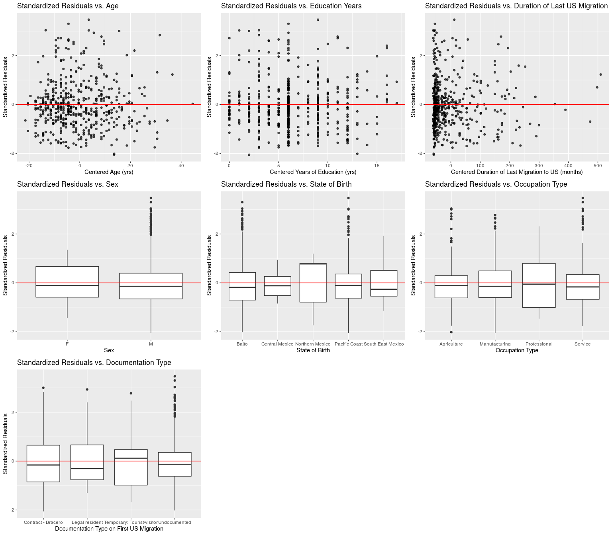
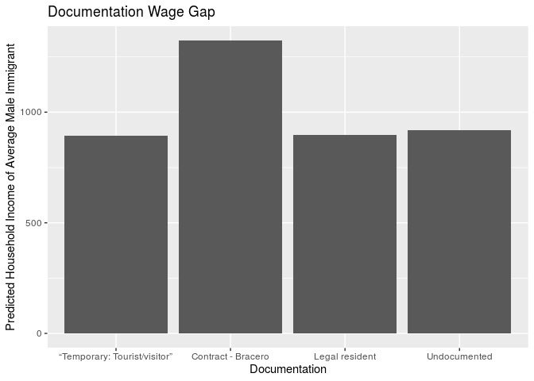

Characteristics of Recent Mexican Immigrants to California, USA, that
Influence Household Income
================
Ben 10
12/05/2019

## Section 1: Introduction and Exploratory Data Analysis

### 1.1 Objective

We are aiming to build a model to determine which characteristics of
Mexican immmigrants to the United States, specifically California,
well-explain variation in household income.

### 1.2 Description of Dataset

The dataset is from The Mexican Migration Project (MMP, \*see References
below for confidentiality terms), which was created in 1982 an
interdisciplinary team of researchers to further our understanding of
the complex process of Mexican migration to the United States. The
project is a binational research effort co-directed by Jorge Durand,
professor of Social Anthropology at the University of Guadalajara
(Mexico), and Douglas S. Massey, professor of Sociology and Public
Affairs, with a joint appointment in the Woodrow Wilson School, at
Princeton University (U.S.).

Since its inception, the MMP’s main focus has been to gather social and
economic information on Mexican-US migration. The data collected has
been compiled in a comprehensive database that is available to the
public free of charge for research and educational purposes through its
website. The MMP uses the ethnosurvey approach to gather data: in winter
months, they randomly sample households in communities throughout
Mexico, surveying household heads and members about their trips to the
U.S., as well as economic and demographic information. They then
conducted the same survey in areas in the U.S., sampling migrants from
the same communities they surveyed in Mexico but who have not returned
to Mexico. Thus, the sample of migrants includes residents in both
Mexico and the U.S.

The MMP170 Database contains an initial file with general demographic,
economic, and migratory information for each member of a surveyed
household (PERS). Pers170 is a large data which has 132 variables and
176,701 observations. Therefore, we selected 17 relatively meaningful
variables and filtered out rows that contain N/A’s to create a new
dataset labeled `data`.

### 1.3 Method

We will build a multiple linear regression model to predict household
income considering the following variables: `sex`, `relhead`, `age`,
`statebrn`, `marstat`, `edyrs`, `occtype`, `usdur1`, `usdurl`, `usdoc1`,
`uscity`, `yrborn`. The data dictionary for these variables can be found
in project-\>data-\>Data Dictionary.

Our response variable is household income. We chose to use the multiple
linear regression because our response variable is numerical, and there
are multiple predictor variables.

### 1.4 Data Cleaning

Our original data was extremely complex and necessitated us to clean our
data extensively. All of our data cleaning can be found in the proposal.

However, we did make some adjustments according to the feedback
Dr. Tackett, which can be found
below.

### 1.5 Updated Data Exploration

#### 1.5.1 Filter Only Immigrants in California

<!-- -->

Given that a majority of the immigrants in the dataset settled in
California, we have decided to concentrate on California immigrants,
only.

#### 1.5.2 Cut Household Income Groups

Originally, the distribution of household income was bimodal and had a
median of 412,647 dollars. A plot of household income in natural units
reveals very little information, due to a scattering of very high
incomes which blow up the range of the plot. However, a logged plot
reveals that household income almost looks like 3 separate
distributions.

<!-- -->

We determined that 412,647 dollars is an absurdly high median income for
a survey of largely undocumented immigrants in the U.S., and believe
that a significant chunk of the incomes were recorded in pesos. The
documentation for the data from the Mexican Migration Project does not
specify the units of `hhincome`; however, the project site details that
researchers surveyed communities in Mexico, then traveled to the US to
survey communities there. It seems likely that the communities surveyed
in Mexico would report income in pesos and those surveyed in the U.S.
would report income in $USD. However, the data was collected over a
period of 10 years, during which the exchange rate changed
significantly. Therefore, we cannot convert all the incomes that appear
to be recorded in pesos into USD.

Therefore, we decided to filter out the incomes above 60,000 to remove
income that might be in pesos. We will also remove incomes of zero from
consideration, because it will interfere with our model’s explanatory
scope, in that it can only explain income of employed persons.

<!-- -->

Now the distribution of response variable (hhincome) looks like a right
skewed normal
distribution.

#### 1.5.3 Group Cities by Region

We decided to group the cities to which immigrants to California arrived
into the three categories, as follows.

Bay Area: Vallejo-Fairfield-Napa, San Francisco, San Jose, Santa
Cruz-Watsonville

Central California: Sacramento, Merced, Fresno, Bakersfield

Southern California: Santa Barbara-Santa Maria-Lompoc, Ventura, Los
Angeles-Long Beach, Orange County, Riverside-San Bernardino, and San
Diego.

Given the comparatively small number of cases in which no city was
reported, we deleted these instances. The majority of immigrants went to
LA-Long Beach area in Southern California.

#### 1.5.4 Remove Variable “relhead”

It turned out that all values from `relhead` (relationship to head of
household) in our cleaned data were “1” or head. So we will remove this
variable, as well as state variables, since we are only using California
data. We will also remove place data since we are using `uscity`, and
`occ` since we are using `occtype`.

#### 1.5.5 Mean-center “age” , “usdur1” and “usdurl”

We must mean-center `age` and `usdurl` in order to have a meaningful
intercept interpretation.

The mean age in the dataset is 39.43 years ; the mean duration of last
US migration is 60.27 months (about 5 years); and the mean duration of
first US migration is 43.99 months (less than 3.5
years).

### 1.5.6 Remove El Salvador Data and Regionalize State Born Variable

We do not have any data from seven states, Baja California Sur, Chiapas,
Hidalgo, Quintana Roo, Sinaloa, Tlaxcala, and Yucatán and there was a
small amount of non-Mexican data, which we omitted.

We divided the remaining states into the following regions.

South East Mexico: Tabasco, Oaxaca, Campeche, Veracruz

Northern Mexico: Coahuila, Chihuahua, Durango, Nuevo Leon, Sonora,
Tamaulipas, Baja California del Norte

Bajío: Aguascalientes, Guanajuato, Querétaro, San Luis Potosí, Zacatecas

Central Mexico: Mexico City, México, Morelos, Puebla

Pacific Coast: Colima, Guerrero, Jalisco, Michoacán,
Nayarit

#### 1.5.7 Remove Obvious Collinear Variable

`yrborn` and `age` provide the same information and are perfectly
linear, therefore we decided to remove `yrborn` from consideration.

#### 1.5.8 Simplify Occupation Type

Our model only considers immigrants with paid jobs, so we filtered for
paying occupations only.

<!-- -->

We first filter out migrants with occupations indicating lack of paid
employment, because our anaylsis focuses only on those migrants

## Section 2: Regression Analysis - Multiple Linear Regression Model

We will use a multiple linear regression model in an effort to explain
which characteristics of migrants influence their household income.

We will consider the potential interaction between principal occupation
and number of years of school completed, since those are generally
interconnected. We may also consider the interaction between
documentation type and occupation type, although the effect may be
insignificant. However, if the variables `occtype`, `edyrs`, or `usdoc1`
do not make it through the process of inital model selection, we will
not include these interactions in the model as that would not be
prudent. If other interactions appear significant, we will include these
as well.

We will select our model using AIC criteria, since we are dealing with
people, we want to build a model that accounts for volatile human nature
and the ever-changing socioeconomic and political climate that could
influence someone’s household income. AIC is used when we would rather
say a variable is a relevant predictor, when in reality it might not be
and so in this case, we would rather err on the side of a false positive
because we are dealing with a constantly fluctuating issue.

### 2.1 Description of Methods

In our first multiple linear regression model, we included all 19
variables. Then, we used backwards model selection to reduce the model
to 7 significant variables: `edyrs`, `usdurl`, `sex`, `statebrn`,
`usdoc1`, `occtype` and `age`.

After backwards selection, we will explore the possible interactions
between remaining variables: `edyrs`, `usdurl`, `sex`, `statebrn`,
`usdoc1`, `occtype` and `age`, to determine if any are significant. The
significant interactions that survived to our final model are:

age\*edyrs: p-value = 0 \< 0.05. This interaction makes sense, because
we expect older immigrants to be more educated.

statebrn\*edyrs: p-value = 0.001 \< 0.05. This interaction makes sense,
because we expect different region of Mexico have different level of
development and hence access to education.

statebrn\*usdurl: p-value = 0.005 \< 0.05. This interaction makes sense,
because immigrants from certain regions in Mexico may have a easier time
staying longer in California because there is already a large community
of immigrants from that region there.

age\*usdoc1: p-value = .007 \< 0.05. This interaction could make some
sense, because the physical stamina required to immigrate illegally
could be very related to age, and age is likely considered by the US
government in applications for legal immigration status.

usdurl\*usdoc1: p-value = .012 \< 0.05. This interaction makes sense,
because type of documentation and duration of migration would logically
be highly related. Legal immigrants and contract workers can travel back
and forth between Mexico and the US with greater ease than undocumented
migrants, leading to potentially shorter stays, but they also don’t face
the same threat of deportation, which could possibly lead them to be
able to stay in the US longer.

We included these interactions in our original full model, and did
backward selection again to get our final model.

(Please see “Section 5 : Additional Work” for detailed coding process.)

### 2.2 Full Model after Evaluating Interactions

Model hidden due to
length.

### 2.3 Final Model

| term                                    |  estimate | std.error | statistic | p.value |   conf.low | conf.high |
| :-------------------------------------- | --------: | --------: | --------: | ------: | ---------: | --------: |
| (Intercept)                             |   629.277 |   297.065 |     2.118 |   0.035 |     45.530 |  1213.024 |
| sexM                                    |   327.669 |   123.480 |     2.654 |   0.008 |     85.025 |   570.314 |
| age                                     |  \-22.666 |    11.074 |   \-2.047 |   0.041 |   \-44.426 |   \-0.905 |
| statebrnCentral Mexico                  |  2482.855 |   868.543 |     2.859 |   0.004 |    776.129 |  4189.581 |
| statebrnNorthern Mexico                 |  \-18.793 |   405.261 |   \-0.046 |   0.963 |  \-815.149 |   777.563 |
| statebrnPacific Coast                   |   157.480 |    95.472 |     1.649 |   0.100 |   \-30.127 |   345.087 |
| statebrnSouth East Mexico               | \-185.051 |   655.663 |   \-0.282 |   0.778 | \-1473.458 |  1103.356 |
| edyrs                                   |    42.483 |    11.337 |     3.747 |   0.000 |     20.205 |    64.762 |
| occtypeManufacturing                    |   100.196 |    62.074 |     1.614 |   0.107 |   \-21.783 |   222.175 |
| occtypeProfessional                     |   208.005 |   105.018 |     1.981 |   0.048 |      1.641 |   414.369 |
| occtypeService                          |   138.882 |    66.983 |     2.073 |   0.039 |      7.258 |   270.506 |
| usdurl                                  |   \-1.914 |     1.340 |   \-1.429 |   0.154 |    \-4.548 |     0.719 |
| usdoc1Legal resident                    | \-244.490 |   265.390 |   \-0.921 |   0.357 |  \-765.993 |   277.013 |
| usdoc1Temporary: Tourist/visitor        | \-431.169 |   275.379 |   \-1.566 |   0.118 |  \-972.302 |   109.964 |
| usdoc1Undocumented                      | \-406.538 |   253.226 |   \-1.605 |   0.109 |  \-904.139 |    91.064 |
| age:edyrs                               |     2.434 |     0.620 |     3.924 |   0.000 |      1.215 |     3.654 |
| statebrnCentral Mexico:edyrs            | \-304.707 |   114.163 |   \-2.669 |   0.008 |  \-529.042 |  \-80.372 |
| statebrnNorthern Mexico:edyrs           |    14.954 |    44.830 |     0.334 |   0.739 |   \-73.138 |   103.047 |
| statebrnPacific Coast:edyrs             |  \-38.703 |    13.223 |   \-2.927 |   0.004 |   \-64.688 |  \-12.719 |
| statebrnSouth East Mexico:edyrs         |    10.996 |    35.425 |     0.310 |   0.756 |   \-58.616 |    80.608 |
| statebrnCentral Mexico:usdurl           |    10.870 |     6.326 |     1.718 |   0.086 |    \-1.562 |    23.301 |
| statebrnNorthern Mexico:usdurl          |   \-5.348 |     1.852 |   \-2.888 |   0.004 |    \-8.987 |   \-1.709 |
| statebrnPacific Coast:usdurl            |   \-0.856 |     0.587 |   \-1.460 |   0.145 |    \-2.009 |     0.296 |
| statebrnSouth East Mexico:usdurl        |   \-5.475 |    11.303 |   \-0.484 |   0.628 |   \-27.686 |    16.736 |
| age:usdoc1Legal resident                |   \-1.828 |    14.365 |   \-0.127 |   0.899 |   \-30.056 |    26.400 |
| age:usdoc1Temporary: Tourist/visitor    |    16.945 |    15.000 |     1.130 |   0.259 |   \-12.530 |    46.419 |
| age:usdoc1Undocumented                  |    17.680 |    11.604 |     1.524 |   0.128 |    \-5.123 |    40.483 |
| usdurl:usdoc1Legal resident             |     2.272 |     1.453 |     1.564 |   0.119 |    \-0.583 |     5.127 |
| usdurl:usdoc1Temporary: Tourist/visitor |     1.920 |     1.498 |     1.282 |   0.201 |    \-1.024 |     4.864 |
| usdurl:usdoc1Undocumented               |     3.345 |     1.302 |     2.570 |   0.010 |      0.787 |     5.902 |

### 2.4 Description of Method in Model Diagnostics

We checked leverage, standardized residuals, estimate of standard
deviation, Cook’s distance, VIF and adjusted R-squared. (Please see
“Section 5 : Additional Work” for detailed codes and graphs)

#### 2.4.1 Leverage

Just under half of our observations are high leverage points, meaning
that their combinations of values for the predictor variables are very
far from the typical combinations in the data. Since human circumstances
and economic conditions are often so extremely variable, we would not
expect most migrants to share common values for the predictor variables.

Of the individuals in the data with high leverage, two are highly
educated professionals, and three have 5 years of education and work in
manufacturing jobs. All are male. Age, documentation, and duration of
migration vary. These points are potentially, but not certainly,
influential points, so we use other methods to sort out influential
points.

#### 2.4.2 Standardized Residuals

The 6% of our observations with standardized residuals of magnitude
greater than 2 should be examined more closely as these are outliers,
but they may not have an impact on the regression line. We can look
plots of the standardized residuals versus all of our predictors. Plots
of the standardized residuals for each predictor variable reveal that,
for the most part, our data satisfies the constant variance assumption.

#### 2.4.3 Estimate of Standard Deviation

The estimate of our regression standard deviation using all observations
is 481.0428, whereas the standard deviation estimate without points with
large magnitude standardized residuals is 370.9477. Removing points with
large magnitude standardized residuals would affect our conclusions by
decreasing the standard error associated with our model coefficients,
however, we do not want to damage our model’s integrity and explanatory
power by removing too much human variability from the observations we
base it on. We will examine Cook’s Distance to see if any observations
have excessive overall impact or significantly affect the estimated
coefficients when removed.

#### 2.4.4 Cook’s Distance

No observations have a Cook’s Distance greater than 1. Thus, none of the
high leverage points exert significantly greater influence on the final
coefficients of our model than the other points do and could distort our
explanations.

#### 2.4.5 VIF

There are 10 coefficients with high VIFs (\>10):

usdoc1Legal resident: 10.424955 usdurl:usdoc1Undocumented: 18.919794
statebrnCentral Mexico: 19.324207 statebrnCentral Mexico:edyrs:
19.878084 usdoc1Undocumented: 20.608986 statebrnSouth East
Mexico:usdurl: 24.55331 age:usdoc1Undocumented: 25.065321 usdurl:
28.95936 statebrnSouth East Mexico: 33.951032 age: 34.366655

It is likely the state born coefficients are collinear with education,
as education is highly related to region in Mexico: Central Mexico and
Northern Mexico have the best schools, while the South East has the
worst. Length of time in the U.S. obviously will be correlated to age,
as well. Additionally, the coefficients of the regions may have high
collinearity because when we divided the birth state into regions, there
are very few and very geographically sparse observations in the South
East Mexico, and a lot more observations in Central Mexico. Hence, in
order to make each region more representative, we included some of the
ambiguous states that could possibly be included in both regions into
South East Mexico. Since the geographical regional divide is subjective
and continuous, we expect there to be collinearity.

The duration of time in the U.S. is likely collinear with documentation
status, as the longer a person lives in the U.S., the more likely they
are to progress in the visa application process.

#### 2.4.6 Adjusted R-squared

The adjusted R-squared of our final model is 0.1810094, meaning that our
model explains around 18.1% of the variation in household income. Given
that there are numerous social determinants of income, and we only
included Californian data and those who have income between 1 and
60,000, the R-squared seems reasonable.

## Section 3: Discussion and Limitations

### 3.1 Limitations

In order to complete an effective analysis in the time given, we greatly
simplified our raw data to predict our response variable, household
income. We ended up only analyzing a subgroup of the immigrants and
focused on those who migrated to California because they made up a large
majority of our original dataset. However, because of that, our findings
may not be able to be generalized into other states in the US. If we
were given more time, we would have analyzed the entirety of the
dataset.

Additionally, we cut a chunk of the data out because it appeared that
some of the income was reported in pesos and USD, though we are not
definitively sure. Further analysis could investigate why it appeared
that some income was reported in a potentially different currency and
adjust for it so we can include all observations in our analysis. We
also cut off the data with no income to avoid the influence of zero
inflation on the final model, hence biasing the model against immigrants
who are unemployed. Future models should be adjusted for zero inflation.

Moreover, in an attempt to simplify the variable “statebrn”, we grouped
observations into regions. However, in order to arrive at a balanced
grouping in terms of the number of observations in each region, we
artificially divided the regions geographically, rather than dividing
them according to socio-economic characteristics. As a result, the
household income in some regions, such as South East Mexico, has a wide
range. Furthermore, through compromising between geographic integrity
and number of observations in each region, the majority of observations
are still in Pacific Coast and Bajío regions due to the nature of the
data. In fact, only those 2 regions had over 30 observations. Further
work can look into weighing mechanisms for multiple linear models.

We also had very few data points for female immigrants. In the future we
would want more equal numbers.

According to our analysis of leverage and adjusted R-square, we conclude
that there might be many outliers in our data, which makes sense since
the immigrants in the data have drastically different demographics and
income. Hence, our model should only be taken as a reference to analyse
general trends, rather than to predict precise incomes. Given that wage
depends on numerous socio-economic factors, our model is satisfactory,
yet it cannot tell the entire story.

If we could continue to work on the project, we would operate under the
assumption that the household income that is unusual was reported in
pesos and potentially recorded in the Mexico and split the data set into
two and investigate that. Our model could be stronger if we were able to
include this very valuable data and inform our predictions with this
information.

### 3.2 Prediction

### 3.2.1 Effect of “Gender” on Wage

For this analysis we used a base of a person who is 39 years old
(average age), has 6 years of education (average edyrs), first
immigrated to the US for 5 years (average duration), last immigrated to
the US for 3 years and 7 months (average duration), works in
manufacturing (most common occupation in the dataset), has undocumented
status (most common documentation in the dataset), and was born in the
region of “Bajío”.

    ##        fit      lwr      upr
    ## 1 905.5048 814.7695 996.2402

Male predicted wage is $905.59. We are 95% confident that the actual
salary falls in the interval of \[814.77, 996.24\].

    ##        fit      lwr      upr
    ## 1 577.8354 320.7065 834.9644

Female predicted wage is $577.84. We are 95% confident that the actual
salary falls in the interval of \[320.71, 834.96\].

We can see from the prediction that there is a large gender wage gap,
since a male’s predicted wage is much higher than a female of the same
average demographics.

### 3.2.2 Effect of “State born” on Wage

We used male as a model input because the majority of the immigrants in
our data set are male. We used edyrs = 6 as the input because it is the
average number of years of education for the data set. Manufacturing is
the most common occupation type in the data, undocumented the most
common immigration status. The rest of the inputs are 0 since those
predictors are mean-centered.

    ##        fit      lwr      upr
    ## 1 905.5048 814.7695 996.2402

For a male who is 39 years old (average age), has 6 years of education
(average edyrs), first immigrated to the US for 5 years (average
duration), last immigrated to the US for 3 years and 7 months (average
duration), works in manufacturing (most common occupation in the
dataset), has undocumented status (most common documentation in the
dataset), and was born in the region of of “Bajío”, his predicted salary
is $905.50 We are 95% confident that the actual salary falls in the
interval of \[814.77, 996.24\].

    ##        fit     lwr      upr
    ## 1 1560.119 1054.74 2065.498

For our default person born in “Central Mexico”, the predicted salary is
$1560.12 We are 95% confident that the actual salary falls in the
interval of \[1054.74, 2065.50\].

    ##        fit      lwr      upr
    ## 1 976.4381 502.3831 1450.493

For our default person born in “Northern Mexico”, the predicted salary
is $976.44 We are 95% confident that the actual salary falls in the
interval of \[502.38, 1450.50\].

    ##        fit       lwr      upr
    ## 1 786.4308 -317.2469 1890.109

For our default person born in “South East Mexico”, the predicted salary
is $786.43 We are 95% confident that the actual salary falls in the
interval of \[-317.25, 1890.11\].

    ##        fit     lwr      upr
    ## 1 830.7653 743.669 917.8617

For our default person born in “Pacific Coast”, the predicted salary is
$830.77 We are 95% confident that the actual salary falls in the
interval of \[743.67, 917.86\].

The prediction suggest a hierarchy in wage discrimination based on the
regions in Mexico that the immigrants are born in. Immigrants from the
region of Central Mexico has the highest predicted wage, followed by
Northern Mexico, Bajío, Pacific Coast, and South East Mexico has the
lowest average predicted wage. This is supported by literature on
economic inequality in Mexico. Specifically, early industrialization
started in Central and Northern Mexico, allowing more mobility and
opportunity for education and trade in these regions. In fact, in 2012,
the northern border states (6 of the 32) accounted for 52.87% of the
total export value. Therefore, it is possible that as a result,
immigrants from these regions have an easier time earning relative
higher wages than those from other regions.

However, it is worth noting that the confidence interval of South East
Mexico is very large, including as low as 0 and as high as $1901.58.
This could be due to the small sample size, as shown in the histogram
below:

<!-- -->

There are only actually 19 observations in the data from this region.

It may also be because this region was artifiically created from 4
distinct cultural/economic/geographic regions in Mexico: the Yucatan
Peninsula, Oaxaca, Veracruz and Chiapas & Tabasco. The regions were
combined in order to be useful for analysis, but with more data we would
have prefered to keep them as seperate regions, especially since
Veracruz is relatively better-off than the rest of the states.

### 3.2.3 Effect of “Occupation Type” on Wage

We used male as a model input because the majority of the immigrants in
our data set are male. We used average edyrs for the occtype.
Undocumented is the most common immigration status and many of the
immigrants in the data set were born in the region of Bajío. The rest of
the inputs are 0 since those predictors are mean-centered.

For Manufacturing, the predicted wage is $905.50. We are 95% confident
that the actual salary falls in the interval of \[814.7695, 996.2402\].

    ##        fit      lwr      upr
    ## 1 805.3087 695.6034 915.0141

For Agriculture, the predicted wage is $805.31 We are 95% confident that
the actual salary falls in the interval of \[695.60, 915.01\].

    ##        fit      lwr      upr
    ## 1 944.1907 844.1482 1044.233

For Service industry, the predicted wage is $944.19 We are 95% confident
that the actual salary falls in the interval of \[844.15, 1044.23\].

For Professional workers, the predicted wage is $1013.31 We are 95%
confident that the actual salary falls in the interval of \[826.52,
1200.10\].

We used the same level of education for each prediction in order to
focus on the effect of occupation type. However, different occupations
tend to require different levels of education- for agriculture,
manufacturing, service, and professional occupations the mean years
spent in education are 4.6, 6.281, 7.25, and 9.972 respectively. Using
the same education level for each of these predictions may not be
representative of what is likely to occur in the real world; however, it
allows us to examine the isolated effect of occupation type on household
income.

    ##      edyrs       
    ##  Min.   : 0.000  
    ##  1st Qu.: 4.000  
    ##  Median : 6.000  
    ##  Mean   : 6.281  
    ##  3rd Qu.: 9.000  
    ##  Max.   :17.000

    ##      edyrs     
    ##  Min.   : 0.0  
    ##  1st Qu.: 2.0  
    ##  Median : 4.0  
    ##  Mean   : 4.6  
    ##  3rd Qu.: 6.0  
    ##  Max.   :13.0

    ##      edyrs      
    ##  Min.   : 0.00  
    ##  1st Qu.: 4.00  
    ##  Median : 6.00  
    ##  Mean   : 7.25  
    ##  3rd Qu.: 9.00  
    ##  Max.   :17.00

    ##      edyrs       
    ##  Min.   : 1.000  
    ##  1st Qu.: 7.000  
    ##  Median : 9.000  
    ##  Mean   : 9.972  
    ##  3rd Qu.:13.000  
    ##  Max.   :16.000

### 3.2.4 Effect of “Documentation Type” on Wage

Our default person for this section is a male who is 39 years old
(average age), has 6.281 years of education, first immigrated to the US
for 5 years (average duration), occupation of Manufacturing, last
immigrated to the US for 3 years and 7 months (average duration), and
was born in the region of “Bajío” (Baseline region).

    ##        fit      lwr      upr
    ## 1 917.4427 826.3196 1008.566

For an undocumented person, the predicted wage is $917.44 We are 95%
confident that the actual salary falls in the interval of \[826.32,
1008.57\].

    ##        fit     lwr      upr
    ## 1 892.8114 661.567 1124.056

For a Temporary: Tourist/visitor person, the predicted wage is $892.81
We are 95% confident that the actual salary falls in the interval of
\[661.57, 1124.06\].

    ##       fit      lwr      upr
    ## 1 1323.98 818.7793 1829.182

For a Contract - Bracero person, the predicted wage is $1323.98 We are
95% confident that the actual salary falls in the interval of \[818.78,
1829.18\].

    ##       fit    lwr     upr
    ## 1 1079.49 897.65 1261.33

For a legal resident, the predicted wage is $1079.49 We are 95%
confident that the actual salary falls in the interval of \[897.65,
1261.33\].

The prediction suggest a hierarchy in wage discrimination based on the
immigrants’ documentation type. Immigrants who have “contract - barcero”
documentation earn the highest predicted household income, followed by
legal residents, undocumented, and lastly temporary workers. This is
counter intuitive because one would imagine legal residents to earn
more. However, this could be due to the relative imbalance in the
observations in the two groups: the number of observations in “Legal
resident” is significantly fewer than that in “Contract - Barcero”.

## Section 4: Conclusion

Through our exploration and analysis, we found sex, age, years of
education, occupation type, documentation type, duration of last US
immigration and region born to be significant predictors of household
income of Mexican immigrant living in California. Among these, there are
significant interactions between: - age and years of education, - age
and documentation type, - documentation type and duration of last US
migration, - region born and years of education, - and region born and
duration of last US migration.

From our predictions, we observe a large gender wage gap: the average
male has predicted wage of 893.32 USD, whereas the average female has
predicted wage of 590.11 USD. It is shocking that the average wage for
males in this sample is almost two times that of females in this sample.
However, we also had significantly more male data points in this
dataset, with 21 female datapoints and 477 male datapoints.

We also observed regional differences in terms of where the immigrant
was born. Immigrants from the region of Central Mexico have the highest
predicted wage, followed by Northern Mexico, Bajío, Pacific Coast, and
South East Mexico has the lowest average predicted wage. However, since
there is a prominent imbalance in number of observations from various
regions, this conclusion should be taken with caution – for example, we
are notably missing data from two of the three states in the Yucatan
Peninsula in the South East of Mexico, and over 50% of our data points
are from the Pacific Coast.

In terms of occupation type, as expected the highest incomes are found
among professionals, with service and manufacturing workers close
behind. As anticipated, agricultural workers had the lowest income. In
this case, our data is robust, as each category has over 30 datapoints.

In terms of documentation type, we observed a hierarchy in wage
discrimination based on the immigrants’ documentation type. Immigrants
who have “contract - barcero” documentation earn the highest predicted
household income, followed by legal residents, undocumented, and lastly
temporary workers.

## Section 5: Additional Work

### 5.1 Full Initial Model, No Interactions

<table>

<thead>

<tr>

<th style="text-align:left;">

term

</th>

<th style="text-align:right;">

estimate

</th>

<th style="text-align:right;">

std.error

</th>

<th style="text-align:right;">

statistic

</th>

<th style="text-align:right;">

p.value

</th>

</tr>

</thead>

<tbody>

<tr>

<td style="text-align:left;">

(Intercept)

</td>

<td style="text-align:right;">

336.219

</td>

<td style="text-align:right;">

260.490

</td>

<td style="text-align:right;">

1.291

</td>

<td style="text-align:right;">

0.197

</td>

</tr>

<tr>

<td style="text-align:left;">

sexM

</td>

<td style="text-align:right;">

306.283

</td>

<td style="text-align:right;">

183.313

</td>

<td style="text-align:right;">

1.671

</td>

<td style="text-align:right;">

0.095

</td>

</tr>

<tr>

<td style="text-align:left;">

age

</td>

<td style="text-align:right;">

6.422

</td>

<td style="text-align:right;">

2.789

</td>

<td style="text-align:right;">

2.302

</td>

<td style="text-align:right;">

0.022

</td>

</tr>

<tr>

<td style="text-align:left;">

statebrnCentral Mexico

</td>

<td style="text-align:right;">

243.019

</td>

<td style="text-align:right;">

217.955

</td>

<td style="text-align:right;">

1.115

</td>

<td style="text-align:right;">

0.265

</td>

</tr>

<tr>

<td style="text-align:left;">

statebrnNorthern Mexico

</td>

<td style="text-align:right;">

\-84.806

</td>

<td style="text-align:right;">

235.097

</td>

<td style="text-align:right;">

\-0.361

</td>

<td style="text-align:right;">

0.718

</td>

</tr>

<tr>

<td style="text-align:left;">

statebrnPacific Coast

</td>

<td style="text-align:right;">

\-91.483

</td>

<td style="text-align:right;">

49.246

</td>

<td style="text-align:right;">

\-1.858

</td>

<td style="text-align:right;">

0.064

</td>

</tr>

<tr>

<td style="text-align:left;">

statebrnSouth East Mexico

</td>

<td style="text-align:right;">

112.737

</td>

<td style="text-align:right;">

125.783

</td>

<td style="text-align:right;">

0.896

</td>

<td style="text-align:right;">

0.371

</td>

</tr>

<tr>

<td style="text-align:left;">

marstatDivorced

</td>

<td style="text-align:right;">

233.605

</td>

<td style="text-align:right;">

215.615

</td>

<td style="text-align:right;">

1.083

</td>

<td style="text-align:right;">

0.279

</td>

</tr>

<tr>

<td style="text-align:left;">

marstatMarried

</td>

<td style="text-align:right;">

34.821

</td>

<td style="text-align:right;">

116.576

</td>

<td style="text-align:right;">

0.299

</td>

<td style="text-align:right;">

0.765

</td>

</tr>

<tr>

<td style="text-align:left;">

marstatNever married

</td>

<td style="text-align:right;">

\-165.591

</td>

<td style="text-align:right;">

162.346

</td>

<td style="text-align:right;">

\-1.020

</td>

<td style="text-align:right;">

0.308

</td>

</tr>

<tr>

<td style="text-align:left;">

marstatSeparated

</td>

<td style="text-align:right;">

74.747

</td>

<td style="text-align:right;">

229.565

</td>

<td style="text-align:right;">

0.326

</td>

<td style="text-align:right;">

0.745

</td>

</tr>

<tr>

<td style="text-align:left;">

marstatWidowed

</td>

<td style="text-align:right;">

95.702

</td>

<td style="text-align:right;">

242.640

</td>

<td style="text-align:right;">

0.394

</td>

<td style="text-align:right;">

0.693

</td>

</tr>

<tr>

<td style="text-align:left;">

edyrs

</td>

<td style="text-align:right;">

15.296

</td>

<td style="text-align:right;">

7.580

</td>

<td style="text-align:right;">

2.018

</td>

<td style="text-align:right;">

0.044

</td>

</tr>

<tr>

<td style="text-align:left;">

occtypeManufacturing

</td>

<td style="text-align:right;">

118.000

</td>

<td style="text-align:right;">

64.682

</td>

<td style="text-align:right;">

1.824

</td>

<td style="text-align:right;">

0.069

</td>

</tr>

<tr>

<td style="text-align:left;">

occtypeProfessional

</td>

<td style="text-align:right;">

258.447

</td>

<td style="text-align:right;">

108.580

</td>

<td style="text-align:right;">

2.380

</td>

<td style="text-align:right;">

0.018

</td>

</tr>

<tr>

<td style="text-align:left;">

occtypeService

</td>

<td style="text-align:right;">

149.976

</td>

<td style="text-align:right;">

70.720

</td>

<td style="text-align:right;">

2.121

</td>

<td style="text-align:right;">

0.034

</td>

</tr>

<tr>

<td style="text-align:left;">

usdur1

</td>

<td style="text-align:right;">

\-0.375

</td>

<td style="text-align:right;">

0.453

</td>

<td style="text-align:right;">

\-0.828

</td>

<td style="text-align:right;">

0.408

</td>

</tr>

<tr>

<td style="text-align:left;">

usdurl

</td>

<td style="text-align:right;">

0.856

</td>

<td style="text-align:right;">

0.388

</td>

<td style="text-align:right;">

2.207

</td>

<td style="text-align:right;">

0.028

</td>

</tr>

<tr>

<td style="text-align:left;">

usdoc1Legal resident

</td>

<td style="text-align:right;">

161.966

</td>

<td style="text-align:right;">

145.344

</td>

<td style="text-align:right;">

1.114

</td>

<td style="text-align:right;">

0.266

</td>

</tr>

<tr>

<td style="text-align:left;">

usdoc1Temporary: Tourist/visitor

</td>

<td style="text-align:right;">

\-144.299

</td>

<td style="text-align:right;">

155.965

</td>

<td style="text-align:right;">

\-0.925

</td>

<td style="text-align:right;">

0.355

</td>

</tr>

<tr>

<td style="text-align:left;">

usdoc1Undocumented

</td>

<td style="text-align:right;">

\-47.150

</td>

<td style="text-align:right;">

121.970

</td>

<td style="text-align:right;">

\-0.387

</td>

<td style="text-align:right;">

0.699

</td>

</tr>

<tr>

<td style="text-align:left;">

uscitycentcal

</td>

<td style="text-align:right;">

39.085

</td>

<td style="text-align:right;">

102.900

</td>

<td style="text-align:right;">

0.380

</td>

<td style="text-align:right;">

0.704

</td>

</tr>

<tr>

<td style="text-align:left;">

uscitysocal

</td>

<td style="text-align:right;">

40.916

</td>

<td style="text-align:right;">

82.303

</td>

<td style="text-align:right;">

0.497

</td>

<td style="text-align:right;">

0.619

</td>

</tr>

</tbody>

</table>

### 5.2 Backward selection

    ## Start:  AIC=6233.96
    ## hhincome ~ sex + age + statebrn + marstat + edyrs + occtype + 
    ##     usdur1 + usdurl + usdoc1 + uscity
    ## 
    ##            Df Sum of Sq       RSS    AIC
    ## - marstat   5   1117380 125170807 6228.4
    ## - uscity    2     64974 124118402 6230.2
    ## - usdur1    1    178991 124232419 6232.7
    ## - statebrn  4   1815643 125869071 6233.2
    ## <none>                  124053428 6234.0
    ## - usdoc1    3   1706651 125760078 6234.8
    ## - sex       1    729080 124782508 6234.9
    ## - occtype   3   1862901 125916329 6235.4
    ## - edyrs     1   1063307 125116735 6236.2
    ## - usdurl    1   1271734 125325161 6237.0
    ## - age       1   1384513 125437941 6237.5
    ## 
    ## Step:  AIC=6228.43
    ## hhincome ~ sex + age + statebrn + edyrs + occtype + usdur1 + 
    ##     usdurl + usdoc1 + uscity
    ## 
    ##            Df Sum of Sq       RSS    AIC
    ## - uscity    2     75805 125246612 6224.7
    ## - usdur1    1    214264 125385071 6227.3
    ## <none>                  125170807 6228.4
    ## - usdoc1    3   1729934 126900742 6229.3
    ## - occtype   3   1755477 126926284 6229.4
    ## - statebrn  4   2273850 127444657 6229.4
    ## - edyrs     1   1108665 126279473 6230.8
    ## - sex       1   1162270 126333077 6231.0
    ## - usdurl    1   1342243 126513050 6231.7
    ## - age       1   1857888 127028695 6233.8
    ## 
    ## Step:  AIC=6224.73
    ## hhincome ~ sex + age + statebrn + edyrs + occtype + usdur1 + 
    ##     usdurl + usdoc1
    ## 
    ##            Df Sum of Sq       RSS    AIC
    ## - usdur1    1    188932 125435544 6223.5
    ## <none>                  125246612 6224.7
    ## - usdoc1    3   1666878 126913490 6225.3
    ## - statebrn  4   2314226 127560838 6225.8
    ## - occtype   3   1814497 127061109 6225.9
    ## - edyrs     1   1094602 126341214 6227.1
    ## - sex       1   1156574 126403186 6227.3
    ## - usdurl    1   1311263 126557875 6227.9
    ## - age       1   1846482 127093094 6230.0
    ## 
    ## Step:  AIC=6223.48
    ## hhincome ~ sex + age + statebrn + edyrs + occtype + usdurl + 
    ##     usdoc1
    ## 
    ##            Df Sum of Sq       RSS    AIC
    ## <none>                  125435544 6223.5
    ## - usdoc1    3   1631114 127066657 6223.9
    ## - occtype   3   1796091 127231634 6224.6
    ## - statebrn  4   2353643 127789187 6224.7
    ## - edyrs     1   1146434 126581977 6226.0
    ## - sex       1   1309985 126745529 6226.7
    ## - usdurl    1   1324851 126760395 6226.7
    ## - age       1   1959638 127395182 6229.2

| term                             |  estimate | std.error | statistic | p.value |  conf.low | conf.high |
| :------------------------------- | --------: | --------: | --------: | ------: | --------: | --------: |
| (Intercept)                      |   426.973 |   187.806 |     2.273 |   0.023 |    57.956 |   795.990 |
| sexM                             |   277.772 |   123.678 |     2.246 |   0.025 |    34.759 |   520.785 |
| age                              |     7.381 |     2.687 |     2.747 |   0.006 |     2.101 |    12.660 |
| statebrnCentral Mexico           |   286.819 |   215.560 |     1.331 |   0.184 | \-136.733 |   710.371 |
| statebrnNorthern Mexico          | \-105.700 |   233.279 |   \-0.453 |   0.651 | \-564.066 |   352.667 |
| statebrnPacific Coast            | \-103.875 |    48.530 |   \-2.140 |   0.033 | \-199.231 |   \-8.519 |
| statebrnSouth East Mexico        |   108.414 |   125.040 |     0.867 |   0.386 | \-137.277 |   354.104 |
| edyrs                            |    15.712 |     7.478 |     2.101 |   0.036 |     1.018 |    30.406 |
| occtypeManufacturing             |   120.484 |    63.986 |     1.883 |   0.060 |   \-5.241 |   246.208 |
| occtypeProfessional              |   253.715 |   107.237 |     2.366 |   0.018 |    43.007 |   464.424 |
| occtypeService                   |   138.278 |    69.463 |     1.991 |   0.047 |     1.790 |   274.766 |
| usdurl                           |     0.646 |     0.286 |     2.259 |   0.024 |     0.084 |     1.207 |
| usdoc1Legal resident             |   176.353 |   144.014 |     1.225 |   0.221 | \-106.619 |   459.324 |
| usdoc1Temporary: Tourist/visitor |  \-90.471 |   150.968 |   \-0.599 |   0.549 | \-387.106 |   206.163 |
| usdoc1Undocumented               |  \-38.190 |   120.305 |   \-0.317 |   0.751 | \-274.576 |   198.197 |

Using backward selection based on AIC, we narrowed down to 7 variables:
sex, edyrs, usdurl, statebrn, occtype, usdoc1 and age.

### 5.3 Interactions

To find potential interactions between the 7 variables, we used nested-F
test for each of the possible interactions:

After inital backwards selection, we will explore the possible
interactions between remaining variables: `edyrs`, `usdurl`, `sex`,
`statebrn`, `occtype`, `usdoc1` and `age`, to determine if any are
significant.

| Res.Df |       RSS | Df | Sum of Sq | Pr(\>Chi) |
| -----: | --------: | -: | --------: | --------: |
|    483 | 125435544 | NA |        NA |        NA |
|    482 | 125424763 |  1 |   10780.7 |     0.839 |

First, we tested the interaction between `edyrs` and `usdurl`. The
p-value for this test was 0.839 \> 0.05, therefore we will not include
it in the model.

| Res.Df |       RSS | Df | Sum of Sq | Pr(\>Chi) |
| -----: | --------: | -: | --------: | --------: |
|    483 | 125435544 | NA |        NA |        NA |
|    482 | 124081486 |  1 |   1354058 |     0.022 |

Then, we tested the interaction between `sex` and `usdurl`. The p-value
for this test was 0.022 \< 0.05, therefore we will include it in the
model.

| Res.Df |       RSS | Df | Sum of Sq | Pr(\>Chi) |
| -----: | --------: | -: | --------: | --------: |
|    483 | 125435544 | NA |        NA |        NA |
|    482 | 124099986 |  1 |   1335557 |     0.023 |

Then, we tested the interaction between `age` and `usdurl`. The p-value
for this test was 0.023 \< 0.05, therefore we will include it in the
model.

| Res.Df |       RSS | Df | Sum of Sq | Pr(\>Chi) |
| -----: | --------: | -: | --------: | --------: |
|    483 | 125435544 | NA |        NA |        NA |
|    482 | 125320504 |  1 |  115039.9 |     0.506 |

Then, we tested the interaction between `sex` and `edyrs`. The p-value
for this test was 0.506 \> 0.05, therefore we will not include it in the
model.

| Res.Df |       RSS | Df | Sum of Sq | Pr(\>Chi) |
| -----: | --------: | -: | --------: | --------: |
|    483 | 125435544 | NA |        NA |        NA |
|    482 | 119981867 |  1 |   5453677 |         0 |

Then, we tested the interaction between `age` and `edyrs`. The p-value
for this test was 0 \< 0.05, therefore we will include it in the model.

| Res.Df |       RSS | Df | Sum of Sq | Pr(\>Chi) |
| -----: | --------: | -: | --------: | --------: |
|    483 | 125435544 | NA |        NA |        NA |
|    482 | 125120075 |  1 |  315468.6 |      0.27 |

Then, we tested the interaction between `age` and `sex`. The p-value for
this test was 0.27 \> 0.05, therefore we will not include it in the
model.

| Res.Df |       RSS | Df | Sum of Sq | Pr(\>Chi) |
| -----: | --------: | -: | --------: | --------: |
|    483 | 125435544 | NA |        NA |        NA |
|    480 | 124722391 |  3 |    713153 |     0.433 |

Then, we tested the interaction between `statebrn` and `sex`. The
p-value for this test was 0.433\> 0.05, therefore we will not include it
in the model.

| Res.Df |       RSS | Df | Sum of Sq | Pr(\>Chi) |
| -----: | --------: | -: | --------: | --------: |
|    483 | 125435544 | NA |        NA |        NA |
|    479 | 123417127 |  4 |   2018417 |     0.098 |

Then, we tested the interaction between `statebrn` and `age`. The
p-value for this test was 0.098\> 0.05, therefore we will not include it
in the model.

| Res.Df |       RSS | Df | Sum of Sq | Pr(\>Chi) |
| -----: | --------: | -: | --------: | --------: |
|    483 | 125435544 | NA |        NA |        NA |
|    479 | 120606332 |  4 |   4829212 |     0.001 |

Then, we tested the interaction between `statebrn` and `edyrs`. The
p-value for this test was 0.001\< 0.05, therefore we will include it in
the model.

| Res.Df |       RSS | Df | Sum of Sq | Pr(\>Chi) |
| -----: | --------: | -: | --------: | --------: |
|    483 | 125435544 | NA |        NA |        NA |
|    479 | 121672866 |  4 |   3762678 |     0.005 |

Then, we tested the interaction between `statebrn` and `usdurl`. The
p-value for this test was 0.005 \< 0.05, therefore we will include it in
the model.

| Res.Df |       RSS | Df | Sum of Sq | Pr(\>Chi) |
| -----: | --------: | -: | --------: | --------: |
|    483 | 125435544 | NA |        NA |        NA |
|    480 | 125072371 |  3 |  363172.5 |     0.707 |

Then, we tested the interaction between `occtype` and `sex`. The p-value
for this test was 0.707 \> 0.05, therefore we will not include it in the
model.

| Res.Df |       RSS | Df | Sum of Sq | Pr(\>Chi) |
| -----: | --------: | -: | --------: | --------: |
|    483 | 125435544 | NA |        NA |        NA |
|    480 | 124082703 |  3 |   1352841 |     0.155 |

Then, we tested the interaction between `occtype` and `age`. The p-value
for this test was 0.155 \> 0.05, therefore we will not include it in the
model.

| Res.Df |       RSS | Df | Sum of Sq | Pr(\>Chi) |
| -----: | --------: | -: | --------: | --------: |
|    483 | 125435544 | NA |        NA |        NA |
|    474 | 120267831 |  9 |   5167712 |     0.016 |

Then, we tested the interaction between `occtype` and `statebrn`. The
p-value for this test was 0.016 \< 0.05, therefore we will include it in
the model.

| Res.Df |       RSS | Df | Sum of Sq | Pr(\>Chi) |
| -----: | --------: | -: | --------: | --------: |
|    483 | 125435544 | NA |        NA |        NA |
|    480 | 124859480 |  3 |  576063.6 |     0.529 |

Then, we tested the interaction between `occtype` and `edyrs`. The
p-value for this test was 0.529 \> 0.05, therefore we will not include
it in the model.

| Res.Df |       RSS | Df | Sum of Sq | Pr(\>Chi) |
| -----: | --------: | -: | --------: | --------: |
|    483 | 125435544 | NA |        NA |        NA |
|    480 | 123994932 |  3 |   1440612 |     0.134 |

Then, we tested the interaction between `occtype` and `usdurl`. The
p-value for this test was 0.134 \> 0.05, therefore we will not include
it in the model.

| Res.Df |       RSS | Df | Sum of Sq | Pr(\>Chi) |
| -----: | --------: | -: | --------: | --------: |
|    483 | 125435544 | NA |        NA |        NA |
|    481 | 125108642 |  2 |  326901.9 |     0.533 |

Then, we tested the interaction between `usdoc1` and `sex`. The p-value
for this test was 0.533 \> 0.05, therefore we will not include it in the
model.

| Res.Df |       RSS | Df | Sum of Sq | Pr(\>Chi) |
| -----: | --------: | -: | --------: | --------: |
|    483 | 125435544 | NA |        NA |        NA |
|    480 | 122360867 |  3 |   3074676 |     0.007 |

Then, we tested the interaction between `usdoc1` and `age`. The p-value
for this test was 0.007 \< 0.05, therefore we will include it in the
model.

| Res.Df |       RSS | Df | Sum of Sq | Pr(\>Chi) |
| -----: | --------: | -: | --------: | --------: |
|    483 | 125435544 | NA |        NA |        NA |
|    476 | 121325821 |  7 |   4109723 |     0.024 |

Then, we tested the interaction between `usdoc1` and `statebrn`. The
p-value for this test was 0.024 \< 0.05, therefore we will include it in
the model.

| Res.Df |       RSS | Df | Sum of Sq | Pr(\>Chi) |
| -----: | --------: | -: | --------: | --------: |
|    483 | 125435544 | NA |        NA |        NA |
|    480 | 123759147 |  3 |   1676397 |      0.09 |

Then, we tested the interaction between `usdoc1` and `edyrs`. The
p-value for this test was 0.09 \> 0.05, therefore we will not include it
in the model.

| Res.Df |       RSS | Df | Sum of Sq | Pr(\>Chi) |
| -----: | --------: | -: | --------: | --------: |
|    483 | 125435544 | NA |        NA |        NA |
|    481 | 125108642 |  2 |  326901.9 |     0.533 |

Then, we tested the interaction between `usdoc1` and `occtype`. The
p-value for this test was 0.53 \> 0.05, therefore we will not include it
in the model.

| Res.Df |       RSS | Df | Sum of Sq | Pr(\>Chi) |
| -----: | --------: | -: | --------: | --------: |
|    483 | 125435544 | NA |        NA |        NA |
|    480 | 122649587 |  3 |   2785957 |     0.012 |

Then, we tested the interaction between `usdoc1` and `usdurl`. The
p-value for this test was 0.012 \< 0.05, therefore we will include it in
the model.

Through nested F-test, we observed significant interactions between sex
& usdurl, age & usdurl, age \* edyrs, statebrn & edyrs, statebrn &
usdurl, occtype & statebrn, usdoc1 & age, usdoc1 & statebrn, and usdoc1
& usdurl, and we will be including them in our model selection.

### 5.4 Model with Interactions

<table>

<thead>

<tr>

<th style="text-align:left;">

term

</th>

<th style="text-align:right;">

estimate

</th>

<th style="text-align:right;">

std.error

</th>

<th style="text-align:right;">

statistic

</th>

<th style="text-align:right;">

p.value

</th>

</tr>

</thead>

<tbody>

<tr>

<td style="text-align:left;">

(Intercept)

</td>

<td style="text-align:right;">

217.692

</td>

<td style="text-align:right;">

396.745

</td>

<td style="text-align:right;">

0.549

</td>

<td style="text-align:right;">

0.583

</td>

</tr>

<tr>

<td style="text-align:left;">

sexM

</td>

<td style="text-align:right;">

348.484

</td>

<td style="text-align:right;">

130.134

</td>

<td style="text-align:right;">

2.678

</td>

<td style="text-align:right;">

0.008

</td>

</tr>

<tr>

<td style="text-align:left;">

age

</td>

<td style="text-align:right;">

\-11.892

</td>

<td style="text-align:right;">

12.916

</td>

<td style="text-align:right;">

\-0.921

</td>

<td style="text-align:right;">

0.358

</td>

</tr>

<tr>

<td style="text-align:left;">

edyrs

</td>

<td style="text-align:right;">

33.262

</td>

<td style="text-align:right;">

11.893

</td>

<td style="text-align:right;">

2.797

</td>

<td style="text-align:right;">

0.005

</td>

</tr>

<tr>

<td style="text-align:left;">

usdurl

</td>

<td style="text-align:right;">

\-2.256

</td>

<td style="text-align:right;">

1.936

</td>

<td style="text-align:right;">

\-1.165

</td>

<td style="text-align:right;">

0.245

</td>

</tr>

<tr>

<td style="text-align:left;">

usdoc1Legal resident

</td>

<td style="text-align:right;">

269.145

</td>

<td style="text-align:right;">

399.689

</td>

<td style="text-align:right;">

0.673

</td>

<td style="text-align:right;">

0.501

</td>

</tr>

<tr>

<td style="text-align:left;">

usdoc1Temporary: Tourist/visitor

</td>

<td style="text-align:right;">

125.547

</td>

<td style="text-align:right;">

415.176

</td>

<td style="text-align:right;">

0.302

</td>

<td style="text-align:right;">

0.762

</td>

</tr>

<tr>

<td style="text-align:left;">

usdoc1Undocumented

</td>

<td style="text-align:right;">

\-88.618

</td>

<td style="text-align:right;">

374.066

</td>

<td style="text-align:right;">

\-0.237

</td>

<td style="text-align:right;">

0.813

</td>

</tr>

<tr>

<td style="text-align:left;">

occtypeManufacturing

</td>

<td style="text-align:right;">

274.716

</td>

<td style="text-align:right;">

91.986

</td>

<td style="text-align:right;">

2.987

</td>

<td style="text-align:right;">

0.003

</td>

</tr>

<tr>

<td style="text-align:left;">

occtypeProfessional

</td>

<td style="text-align:right;">

372.524

</td>

<td style="text-align:right;">

168.890

</td>

<td style="text-align:right;">

2.206

</td>

<td style="text-align:right;">

0.028

</td>

</tr>

<tr>

<td style="text-align:left;">

occtypeService

</td>

<td style="text-align:right;">

232.285

</td>

<td style="text-align:right;">

95.798

</td>

<td style="text-align:right;">

2.425

</td>

<td style="text-align:right;">

0.016

</td>

</tr>

<tr>

<td style="text-align:left;">

statebrnCentral Mexico

</td>

<td style="text-align:right;">

5231.495

</td>

<td style="text-align:right;">

5100.564

</td>

<td style="text-align:right;">

1.026

</td>

<td style="text-align:right;">

0.306

</td>

</tr>

<tr>

<td style="text-align:left;">

statebrnNorthern Mexico

</td>

<td style="text-align:right;">

\-593916.558

</td>

<td style="text-align:right;">

366494.740

</td>

<td style="text-align:right;">

\-1.621

</td>

<td style="text-align:right;">

0.106

</td>

</tr>

<tr>

<td style="text-align:left;">

statebrnPacific Coast

</td>

<td style="text-align:right;">

475.250

</td>

<td style="text-align:right;">

243.417

</td>

<td style="text-align:right;">

1.952

</td>

<td style="text-align:right;">

0.052

</td>

</tr>

<tr>

<td style="text-align:left;">

statebrnSouth East Mexico

</td>

<td style="text-align:right;">

\-646.675

</td>

<td style="text-align:right;">

894.884

</td>

<td style="text-align:right;">

\-0.723

</td>

<td style="text-align:right;">

0.470

</td>

</tr>

<tr>

<td style="text-align:left;">

sexM:usdurl

</td>

<td style="text-align:right;">

\-0.867

</td>

<td style="text-align:right;">

0.952

</td>

<td style="text-align:right;">

\-0.911

</td>

<td style="text-align:right;">

0.363

</td>

</tr>

<tr>

<td style="text-align:left;">

age:usdurl

</td>

<td style="text-align:right;">

0.026

</td>

<td style="text-align:right;">

0.024

</td>

<td style="text-align:right;">

1.069

</td>

<td style="text-align:right;">

0.286

</td>

</tr>

<tr>

<td style="text-align:left;">

age:edyrs

</td>

<td style="text-align:right;">

2.473

</td>

<td style="text-align:right;">

0.633

</td>

<td style="text-align:right;">

3.904

</td>

<td style="text-align:right;">

0.000

</td>

</tr>

<tr>

<td style="text-align:left;">

edyrs:statebrnCentral Mexico

</td>

<td style="text-align:right;">

\-614.591

</td>

<td style="text-align:right;">

582.353

</td>

<td style="text-align:right;">

\-1.055

</td>

<td style="text-align:right;">

0.292

</td>

</tr>

<tr>

<td style="text-align:left;">

edyrs:statebrnNorthern Mexico

</td>

<td style="text-align:right;">

87520.240

</td>

<td style="text-align:right;">

53969.780

</td>

<td style="text-align:right;">

1.622

</td>

<td style="text-align:right;">

0.106

</td>

</tr>

<tr>

<td style="text-align:left;">

edyrs:statebrnPacific Coast

</td>

<td style="text-align:right;">

\-25.925

</td>

<td style="text-align:right;">

14.171

</td>

<td style="text-align:right;">

\-1.829

</td>

<td style="text-align:right;">

0.068

</td>

</tr>

<tr>

<td style="text-align:left;">

edyrs:statebrnSouth East Mexico

</td>

<td style="text-align:right;">

53.522

</td>

<td style="text-align:right;">

55.816

</td>

<td style="text-align:right;">

0.959

</td>

<td style="text-align:right;">

0.338

</td>

</tr>

<tr>

<td style="text-align:left;">

usdurl:statebrnCentral Mexico

</td>

<td style="text-align:right;">

11.619

</td>

<td style="text-align:right;">

6.295

</td>

<td style="text-align:right;">

1.846

</td>

<td style="text-align:right;">

0.066

</td>

</tr>

<tr>

<td style="text-align:left;">

usdurl:statebrnNorthern Mexico

</td>

<td style="text-align:right;">

545.695

</td>

<td style="text-align:right;">

339.437

</td>

<td style="text-align:right;">

1.608

</td>

<td style="text-align:right;">

0.109

</td>

</tr>

<tr>

<td style="text-align:left;">

usdurl:statebrnPacific Coast

</td>

<td style="text-align:right;">

\-0.154

</td>

<td style="text-align:right;">

0.650

</td>

<td style="text-align:right;">

\-0.237

</td>

<td style="text-align:right;">

0.813

</td>

</tr>

<tr>

<td style="text-align:left;">

usdurl:statebrnSouth East Mexico

</td>

<td style="text-align:right;">

\-7.666

</td>

<td style="text-align:right;">

12.508

</td>

<td style="text-align:right;">

\-0.613

</td>

<td style="text-align:right;">

0.540

</td>

</tr>

<tr>

<td style="text-align:left;">

occtypeManufacturing:statebrnCentral Mexico

</td>

<td style="text-align:right;">

\-1308.260

</td>

<td style="text-align:right;">

2225.761

</td>

<td style="text-align:right;">

\-0.588

</td>

<td style="text-align:right;">

0.557

</td>

</tr>

<tr>

<td style="text-align:left;">

occtypeManufacturing:statebrnNorthern Mexico

</td>

<td style="text-align:right;">

362198.763

</td>

<td style="text-align:right;">

223688.926

</td>

<td style="text-align:right;">

1.619

</td>

<td style="text-align:right;">

0.106

</td>

</tr>

<tr>

<td style="text-align:left;">

occtypeProfessional:statebrnNorthern Mexico

</td>

<td style="text-align:right;">

\-779682.927

</td>

<td style="text-align:right;">

480632.930

</td>

<td style="text-align:right;">

\-1.622

</td>

<td style="text-align:right;">

0.105

</td>

</tr>

<tr>

<td style="text-align:left;">

occtypeManufacturing:statebrnPacific Coast

</td>

<td style="text-align:right;">

\-318.634

</td>

<td style="text-align:right;">

124.474

</td>

<td style="text-align:right;">

\-2.560

</td>

<td style="text-align:right;">

0.011

</td>

</tr>

<tr>

<td style="text-align:left;">

occtypeProfessional:statebrnPacific Coast

</td>

<td style="text-align:right;">

\-270.848

</td>

<td style="text-align:right;">

221.416

</td>

<td style="text-align:right;">

\-1.223

</td>

<td style="text-align:right;">

0.222

</td>

</tr>

<tr>

<td style="text-align:left;">

occtypeService:statebrnPacific Coast

</td>

<td style="text-align:right;">

\-197.902

</td>

<td style="text-align:right;">

133.179

</td>

<td style="text-align:right;">

\-1.486

</td>

<td style="text-align:right;">

0.138

</td>

</tr>

<tr>

<td style="text-align:left;">

occtypeManufacturing:statebrnSouth East Mexico

</td>

<td style="text-align:right;">

\-60.910

</td>

<td style="text-align:right;">

358.390

</td>

<td style="text-align:right;">

\-0.170

</td>

<td style="text-align:right;">

0.865

</td>

</tr>

<tr>

<td style="text-align:left;">

occtypeProfessional:statebrnSouth East Mexico

</td>

<td style="text-align:right;">

\-573.141

</td>

<td style="text-align:right;">

511.381

</td>

<td style="text-align:right;">

\-1.121

</td>

<td style="text-align:right;">

0.263

</td>

</tr>

<tr>

<td style="text-align:left;">

occtypeService:statebrnSouth East Mexico

</td>

<td style="text-align:right;">

\-315.750

</td>

<td style="text-align:right;">

417.685

</td>

<td style="text-align:right;">

\-0.756

</td>

<td style="text-align:right;">

0.450

</td>

</tr>

<tr>

<td style="text-align:left;">

age:usdoc1Legal resident

</td>

<td style="text-align:right;">

\-11.582

</td>

<td style="text-align:right;">

16.043

</td>

<td style="text-align:right;">

\-0.722

</td>

<td style="text-align:right;">

0.471

</td>

</tr>

<tr>

<td style="text-align:left;">

age:usdoc1Temporary: Tourist/visitor

</td>

<td style="text-align:right;">

3.106

</td>

<td style="text-align:right;">

16.639

</td>

<td style="text-align:right;">

0.187

</td>

<td style="text-align:right;">

0.852

</td>

</tr>

<tr>

<td style="text-align:left;">

age:usdoc1Undocumented

</td>

<td style="text-align:right;">

6.251

</td>

<td style="text-align:right;">

13.507

</td>

<td style="text-align:right;">

0.463

</td>

<td style="text-align:right;">

0.644

</td>

</tr>

<tr>

<td style="text-align:left;">

usdoc1Legal resident:statebrnPacific Coast

</td>

<td style="text-align:right;">

\-538.944

</td>

<td style="text-align:right;">

305.471

</td>

<td style="text-align:right;">

\-1.764

</td>

<td style="text-align:right;">

0.078

</td>

</tr>

<tr>

<td style="text-align:left;">

usdoc1Temporary: Tourist/visitor:statebrnPacific Coast

</td>

<td style="text-align:right;">

\-464.635

</td>

<td style="text-align:right;">

320.220

</td>

<td style="text-align:right;">

\-1.451

</td>

<td style="text-align:right;">

0.147

</td>

</tr>

<tr>

<td style="text-align:left;">

usdoc1Undocumented:statebrnPacific Coast

</td>

<td style="text-align:right;">

\-153.594

</td>

<td style="text-align:right;">

246.733

</td>

<td style="text-align:right;">

\-0.623

</td>

<td style="text-align:right;">

0.534

</td>

</tr>

<tr>

<td style="text-align:left;">

usdoc1Temporary: Tourist/visitor:statebrnSouth East Mexico

</td>

<td style="text-align:right;">

\-95.652

</td>

<td style="text-align:right;">

881.469

</td>

<td style="text-align:right;">

\-0.109

</td>

<td style="text-align:right;">

0.914

</td>

</tr>

<tr>

<td style="text-align:left;">

usdoc1Undocumented:statebrnSouth East Mexico

</td>

<td style="text-align:right;">

307.364

</td>

<td style="text-align:right;">

578.957

</td>

<td style="text-align:right;">

0.531

</td>

<td style="text-align:right;">

0.596

</td>

</tr>

<tr>

<td style="text-align:left;">

usdurl:usdoc1Legal resident

</td>

<td style="text-align:right;">

2.775

</td>

<td style="text-align:right;">

1.592

</td>

<td style="text-align:right;">

1.744

</td>

<td style="text-align:right;">

0.082

</td>

</tr>

<tr>

<td style="text-align:left;">

usdurl:usdoc1Temporary: Tourist/visitor

</td>

<td style="text-align:right;">

2.355

</td>

<td style="text-align:right;">

1.607

</td>

<td style="text-align:right;">

1.465

</td>

<td style="text-align:right;">

0.144

</td>

</tr>

<tr>

<td style="text-align:left;">

usdurl:usdoc1Undocumented

</td>

<td style="text-align:right;">

3.868

</td>

<td style="text-align:right;">

1.407

</td>

<td style="text-align:right;">

2.749

</td>

<td style="text-align:right;">

0.006

</td>

</tr>

</tbody>

</table>

### 5.5 Backwards Selection from Initial Model with Interactions

Since we observed 9 pairs of significant interactions, we will do the
backward selection again with the new interaction terms.

<table>

<thead>

<tr>

<th style="text-align:left;">

term

</th>

<th style="text-align:right;">

estimate

</th>

<th style="text-align:right;">

std.error

</th>

<th style="text-align:right;">

statistic

</th>

<th style="text-align:right;">

p.value

</th>

</tr>

</thead>

<tbody>

<tr>

<td style="text-align:left;">

(Intercept)

</td>

<td style="text-align:right;">

197.187

</td>

<td style="text-align:right;">

435.069

</td>

<td style="text-align:right;">

0.453

</td>

<td style="text-align:right;">

0.651

</td>

</tr>

<tr>

<td style="text-align:left;">

sexM

</td>

<td style="text-align:right;">

332.595

</td>

<td style="text-align:right;">

184.534

</td>

<td style="text-align:right;">

1.802

</td>

<td style="text-align:right;">

0.072

</td>

</tr>

<tr>

<td style="text-align:left;">

age

</td>

<td style="text-align:right;">

\-11.771

</td>

<td style="text-align:right;">

12.992

</td>

<td style="text-align:right;">

\-0.906

</td>

<td style="text-align:right;">

0.365

</td>

</tr>

<tr>

<td style="text-align:left;">

statebrnCentral Mexico

</td>

<td style="text-align:right;">

5894.923

</td>

<td style="text-align:right;">

5152.957

</td>

<td style="text-align:right;">

1.144

</td>

<td style="text-align:right;">

0.253

</td>

</tr>

<tr>

<td style="text-align:left;">

statebrnNorthern Mexico

</td>

<td style="text-align:right;">

\-592226.584

</td>

<td style="text-align:right;">

370577.697

</td>

<td style="text-align:right;">

\-1.598

</td>

<td style="text-align:right;">

0.111

</td>

</tr>

<tr>

<td style="text-align:left;">

statebrnPacific Coast

</td>

<td style="text-align:right;">

466.876

</td>

<td style="text-align:right;">

247.627

</td>

<td style="text-align:right;">

1.885

</td>

<td style="text-align:right;">

0.060

</td>

</tr>

<tr>

<td style="text-align:left;">

statebrnSouth East Mexico

</td>

<td style="text-align:right;">

\-737.453

</td>

<td style="text-align:right;">

905.264

</td>

<td style="text-align:right;">

\-0.815

</td>

<td style="text-align:right;">

0.416

</td>

</tr>

<tr>

<td style="text-align:left;">

marstatDivorced

</td>

<td style="text-align:right;">

77.826

</td>

<td style="text-align:right;">

211.837

</td>

<td style="text-align:right;">

0.367

</td>

<td style="text-align:right;">

0.714

</td>

</tr>

<tr>

<td style="text-align:left;">

marstatMarried

</td>

<td style="text-align:right;">

22.708

</td>

<td style="text-align:right;">

110.966

</td>

<td style="text-align:right;">

0.205

</td>

<td style="text-align:right;">

0.838

</td>

</tr>

<tr>

<td style="text-align:left;">

marstatNever married

</td>

<td style="text-align:right;">

\-169.691

</td>

<td style="text-align:right;">

154.579

</td>

<td style="text-align:right;">

\-1.098

</td>

<td style="text-align:right;">

0.273

</td>

</tr>

<tr>

<td style="text-align:left;">

marstatSeparated

</td>

<td style="text-align:right;">

90.457

</td>

<td style="text-align:right;">

220.463

</td>

<td style="text-align:right;">

0.410

</td>

<td style="text-align:right;">

0.682

</td>

</tr>

<tr>

<td style="text-align:left;">

marstatWidowed

</td>

<td style="text-align:right;">

\-65.660

</td>

<td style="text-align:right;">

240.294

</td>

<td style="text-align:right;">

\-0.273

</td>

<td style="text-align:right;">

0.785

</td>

</tr>

<tr>

<td style="text-align:left;">

edyrs

</td>

<td style="text-align:right;">

32.068

</td>

<td style="text-align:right;">

12.105

</td>

<td style="text-align:right;">

2.649

</td>

<td style="text-align:right;">

0.008

</td>

</tr>

<tr>

<td style="text-align:left;">

occtypeManufacturing

</td>

<td style="text-align:right;">

271.574

</td>

<td style="text-align:right;">

92.466

</td>

<td style="text-align:right;">

2.937

</td>

<td style="text-align:right;">

0.003

</td>

</tr>

<tr>

<td style="text-align:left;">

occtypeProfessional

</td>

<td style="text-align:right;">

376.031

</td>

<td style="text-align:right;">

170.446

</td>

<td style="text-align:right;">

2.206

</td>

<td style="text-align:right;">

0.028

</td>

</tr>

<tr>

<td style="text-align:left;">

occtypeService

</td>

<td style="text-align:right;">

245.302

</td>

<td style="text-align:right;">

97.644

</td>

<td style="text-align:right;">

2.512

</td>

<td style="text-align:right;">

0.012

</td>

</tr>

<tr>

<td style="text-align:left;">

usdur1

</td>

<td style="text-align:right;">

\-0.446

</td>

<td style="text-align:right;">

0.467

</td>

<td style="text-align:right;">

\-0.957

</td>

<td style="text-align:right;">

0.339

</td>

</tr>

<tr>

<td style="text-align:left;">

usdurl

</td>

<td style="text-align:right;">

\-1.812

</td>

<td style="text-align:right;">

2.030

</td>

<td style="text-align:right;">

\-0.893

</td>

<td style="text-align:right;">

0.373

</td>

</tr>

<tr>

<td style="text-align:left;">

usdoc1Legal resident

</td>

<td style="text-align:right;">

268.441

</td>

<td style="text-align:right;">

402.865

</td>

<td style="text-align:right;">

0.666

</td>

<td style="text-align:right;">

0.506

</td>

</tr>

<tr>

<td style="text-align:left;">

usdoc1Temporary: Tourist/visitor

</td>

<td style="text-align:right;">

129.304

</td>

<td style="text-align:right;">

419.976

</td>

<td style="text-align:right;">

0.308

</td>

<td style="text-align:right;">

0.758

</td>

</tr>

<tr>

<td style="text-align:left;">

usdoc1Undocumented

</td>

<td style="text-align:right;">

\-75.168

</td>

<td style="text-align:right;">

377.149

</td>

<td style="text-align:right;">

\-0.199

</td>

<td style="text-align:right;">

0.842

</td>

</tr>

<tr>

<td style="text-align:left;">

uscitycentcal

</td>

<td style="text-align:right;">

20.593

</td>

<td style="text-align:right;">

98.879

</td>

<td style="text-align:right;">

0.208

</td>

<td style="text-align:right;">

0.835

</td>

</tr>

<tr>

<td style="text-align:left;">

uscitysocal

</td>

<td style="text-align:right;">

3.642

</td>

<td style="text-align:right;">

81.210

</td>

<td style="text-align:right;">

0.045

</td>

<td style="text-align:right;">

0.964

</td>

</tr>

<tr>

<td style="text-align:left;">

sexM:usdurl

</td>

<td style="text-align:right;">

\-1.239

</td>

<td style="text-align:right;">

1.023

</td>

<td style="text-align:right;">

\-1.212

</td>

<td style="text-align:right;">

0.226

</td>

</tr>

<tr>

<td style="text-align:left;">

age:usdurl

</td>

<td style="text-align:right;">

0.024

</td>

<td style="text-align:right;">

0.025

</td>

<td style="text-align:right;">

0.990

</td>

<td style="text-align:right;">

0.323

</td>

</tr>

<tr>

<td style="text-align:left;">

age:edyrs

</td>

<td style="text-align:right;">

2.350

</td>

<td style="text-align:right;">

0.645

</td>

<td style="text-align:right;">

3.644

</td>

<td style="text-align:right;">

0.000

</td>

</tr>

<tr>

<td style="text-align:left;">

statebrnCentral Mexico:edyrs

</td>

<td style="text-align:right;">

\-695.492

</td>

<td style="text-align:right;">

588.878

</td>

<td style="text-align:right;">

\-1.181

</td>

<td style="text-align:right;">

0.238

</td>

</tr>

<tr>

<td style="text-align:left;">

statebrnNorthern Mexico:edyrs

</td>

<td style="text-align:right;">

87272.462

</td>

<td style="text-align:right;">

54570.923

</td>

<td style="text-align:right;">

1.599

</td>

<td style="text-align:right;">

0.110

</td>

</tr>

<tr>

<td style="text-align:left;">

statebrnPacific Coast:edyrs

</td>

<td style="text-align:right;">

\-24.596

</td>

<td style="text-align:right;">

14.350

</td>

<td style="text-align:right;">

\-1.714

</td>

<td style="text-align:right;">

0.087

</td>

</tr>

<tr>

<td style="text-align:left;">

statebrnSouth East Mexico:edyrs

</td>

<td style="text-align:right;">

58.283

</td>

<td style="text-align:right;">

56.289

</td>

<td style="text-align:right;">

1.035

</td>

<td style="text-align:right;">

0.301

</td>

</tr>

<tr>

<td style="text-align:left;">

statebrnCentral Mexico:usdurl

</td>

<td style="text-align:right;">

11.188

</td>

<td style="text-align:right;">

6.352

</td>

<td style="text-align:right;">

1.761

</td>

<td style="text-align:right;">

0.079

</td>

</tr>

<tr>

<td style="text-align:left;">

statebrnNorthern Mexico:usdurl

</td>

<td style="text-align:right;">

544.221

</td>

<td style="text-align:right;">

343.216

</td>

<td style="text-align:right;">

1.586

</td>

<td style="text-align:right;">

0.114

</td>

</tr>

<tr>

<td style="text-align:left;">

statebrnPacific Coast:usdurl

</td>

<td style="text-align:right;">

\-0.227

</td>

<td style="text-align:right;">

0.662

</td>

<td style="text-align:right;">

\-0.343

</td>

<td style="text-align:right;">

0.731

</td>

</tr>

<tr>

<td style="text-align:left;">

statebrnSouth East Mexico:usdurl

</td>

<td style="text-align:right;">

\-9.147

</td>

<td style="text-align:right;">

12.619

</td>

<td style="text-align:right;">

\-0.725

</td>

<td style="text-align:right;">

0.469

</td>

</tr>

<tr>

<td style="text-align:left;">

statebrnCentral Mexico:occtypeManufacturing

</td>

<td style="text-align:right;">

\-1578.221

</td>

<td style="text-align:right;">

2246.514

</td>

<td style="text-align:right;">

\-0.703

</td>

<td style="text-align:right;">

0.483

</td>

</tr>

<tr>

<td style="text-align:left;">

statebrnNorthern Mexico:occtypeManufacturing

</td>

<td style="text-align:right;">

361183.490

</td>

<td style="text-align:right;">

226185.561

</td>

<td style="text-align:right;">

1.597

</td>

<td style="text-align:right;">

0.111

</td>

</tr>

<tr>

<td style="text-align:left;">

statebrnPacific Coast:occtypeManufacturing

</td>

<td style="text-align:right;">

\-311.180

</td>

<td style="text-align:right;">

125.454

</td>

<td style="text-align:right;">

\-2.480

</td>

<td style="text-align:right;">

0.013

</td>

</tr>

<tr>

<td style="text-align:left;">

statebrnSouth East Mexico:occtypeManufacturing

</td>

<td style="text-align:right;">

\-45.063

</td>

<td style="text-align:right;">

360.052

</td>

<td style="text-align:right;">

\-0.125

</td>

<td style="text-align:right;">

0.900

</td>

</tr>

<tr>

<td style="text-align:left;">

statebrnNorthern Mexico:occtypeProfessional

</td>

<td style="text-align:right;">

\-777466.540

</td>

<td style="text-align:right;">

485988.986

</td>

<td style="text-align:right;">

\-1.600

</td>

<td style="text-align:right;">

0.110

</td>

</tr>

<tr>

<td style="text-align:left;">

statebrnPacific Coast:occtypeProfessional

</td>

<td style="text-align:right;">

\-262.200

</td>

<td style="text-align:right;">

224.071

</td>

<td style="text-align:right;">

\-1.170

</td>

<td style="text-align:right;">

0.243

</td>

</tr>

<tr>

<td style="text-align:left;">

statebrnSouth East Mexico:occtypeProfessional

</td>

<td style="text-align:right;">

\-551.412

</td>

<td style="text-align:right;">

514.427

</td>

<td style="text-align:right;">

\-1.072

</td>

<td style="text-align:right;">

0.284

</td>

</tr>

<tr>

<td style="text-align:left;">

statebrnPacific Coast:occtypeService

</td>

<td style="text-align:right;">

\-187.867

</td>

<td style="text-align:right;">

135.316

</td>

<td style="text-align:right;">

\-1.388

</td>

<td style="text-align:right;">

0.166

</td>

</tr>

<tr>

<td style="text-align:left;">

statebrnSouth East Mexico:occtypeService

</td>

<td style="text-align:right;">

\-320.737

</td>

<td style="text-align:right;">

420.245

</td>

<td style="text-align:right;">

\-0.763

</td>

<td style="text-align:right;">

0.446

</td>

</tr>

<tr>

<td style="text-align:left;">

age:usdoc1Legal resident

</td>

<td style="text-align:right;">

\-11.128

</td>

<td style="text-align:right;">

16.157

</td>

<td style="text-align:right;">

\-0.689

</td>

<td style="text-align:right;">

0.491

</td>

</tr>

<tr>

<td style="text-align:left;">

age:usdoc1Temporary: Tourist/visitor

</td>

<td style="text-align:right;">

3.917

</td>

<td style="text-align:right;">

17.019

</td>

<td style="text-align:right;">

0.230

</td>

<td style="text-align:right;">

0.818

</td>

</tr>

<tr>

<td style="text-align:left;">

age:usdoc1Undocumented

</td>

<td style="text-align:right;">

5.985

</td>

<td style="text-align:right;">

13.633

</td>

<td style="text-align:right;">

0.439

</td>

<td style="text-align:right;">

0.661

</td>

</tr>

<tr>

<td style="text-align:left;">

statebrnPacific Coast:usdoc1Legal resident

</td>

<td style="text-align:right;">

\-523.494

</td>

<td style="text-align:right;">

310.524

</td>

<td style="text-align:right;">

\-1.686

</td>

<td style="text-align:right;">

0.093

</td>

</tr>

<tr>

<td style="text-align:left;">

statebrnPacific Coast:usdoc1Temporary: Tourist/visitor

</td>

<td style="text-align:right;">

\-472.147

</td>

<td style="text-align:right;">

324.449

</td>

<td style="text-align:right;">

\-1.455

</td>

<td style="text-align:right;">

0.146

</td>

</tr>

<tr>

<td style="text-align:left;">

statebrnSouth East Mexico:usdoc1Temporary: Tourist/visitor

</td>

<td style="text-align:right;">

\-181.277

</td>

<td style="text-align:right;">

900.820

</td>

<td style="text-align:right;">

\-0.201

</td>

<td style="text-align:right;">

0.841

</td>

</tr>

<tr>

<td style="text-align:left;">

statebrnPacific Coast:usdoc1Undocumented

</td>

<td style="text-align:right;">

\-150.866

</td>

<td style="text-align:right;">

251.023

</td>

<td style="text-align:right;">

\-0.601

</td>

<td style="text-align:right;">

0.548

</td>

</tr>

<tr>

<td style="text-align:left;">

statebrnSouth East Mexico:usdoc1Undocumented

</td>

<td style="text-align:right;">

295.384

</td>

<td style="text-align:right;">

585.080

</td>

<td style="text-align:right;">

0.505

</td>

<td style="text-align:right;">

0.614

</td>

</tr>

<tr>

<td style="text-align:left;">

usdurl:usdoc1Legal resident

</td>

<td style="text-align:right;">

3.009

</td>

<td style="text-align:right;">

1.649

</td>

<td style="text-align:right;">

1.825

</td>

<td style="text-align:right;">

0.069

</td>

</tr>

<tr>

<td style="text-align:left;">

usdurl:usdoc1Temporary: Tourist/visitor

</td>

<td style="text-align:right;">

2.548

</td>

<td style="text-align:right;">

1.646

</td>

<td style="text-align:right;">

1.548

</td>

<td style="text-align:right;">

0.122

</td>

</tr>

<tr>

<td style="text-align:left;">

usdurl:usdoc1Undocumented

</td>

<td style="text-align:right;">

4.072

</td>

<td style="text-align:right;">

1.458

</td>

<td style="text-align:right;">

2.794

</td>

<td style="text-align:right;">

0.005

</td>

</tr>

</tbody>

</table>

    ## Start:  AIC=6198.62
    ## hhincome ~ sex + age + statebrn + marstat + edyrs + occtype + 
    ##     usdur1 + usdurl + usdoc1 + uscity + sex * usdurl + age * 
    ##     usdurl + age * edyrs + statebrn * edyrs + statebrn * usdurl + 
    ##     occtype * statebrn + usdoc1 * age + usdoc1 * statebrn + usdoc1 * 
    ##     usdurl
    ## 
    ##                    Df Sum of Sq       RSS    AIC
    ## - marstat           5    798713 102826911 6192.5
    ## - uscity            2     14733 102042930 6194.7
    ## - statebrn:usdoc1   5   1547301 103575499 6196.1
    ## - statebrn:occtype  7   2437442 104465639 6196.4
    ## - age:usdoc1        3    892540 102920737 6197.0
    ## - statebrn:usdurl   4   1445151 103473349 6197.6
    ## - usdur1            1    210340 102238537 6197.6
    ## - age:usdurl        1    225226 102253423 6197.7
    ## - sex:usdurl        1    337346 102365544 6198.3
    ## <none>                          102028197 6198.6
    ## - statebrn:edyrs    2   1069840 103098037 6199.8
    ## - usdurl:usdoc1     3   2402643 104430841 6204.2
    ## - age:edyrs         1   3051141 105079338 6211.3
    ## 
    ## Step:  AIC=6192.5
    ## hhincome ~ sex + age + statebrn + edyrs + occtype + usdur1 + 
    ##     usdurl + usdoc1 + uscity + sex:usdurl + age:usdurl + age:edyrs + 
    ##     statebrn:edyrs + statebrn:usdurl + statebrn:occtype + age:usdoc1 + 
    ##     statebrn:usdoc1 + usdurl:usdoc1
    ## 
    ##                    Df Sum of Sq       RSS    AIC
    ## - uscity            2     10173 102837084 6188.6
    ## - statebrn:usdoc1   5   1530750 104357660 6189.9
    ## - statebrn:occtype  7   2443383 105270294 6190.2
    ## - age:usdoc1        3    944526 103771437 6191.1
    ## - statebrn:usdurl   4   1422686 104249596 6191.3
    ## - age:usdurl        1    188407 103015318 6191.4
    ## - usdur1            1    247729 103074639 6191.7
    ## - sex:usdurl        1    319842 103146753 6192.0
    ## <none>                          102826911 6192.5
    ## - statebrn:edyrs    2   1058066 103884977 6193.6
    ## - usdurl:usdoc1     3   2484584 105311495 6198.4
    ## - age:edyrs         1   3373302 106200212 6206.6
    ## 
    ## Step:  AIC=6188.55
    ## hhincome ~ sex + age + statebrn + edyrs + occtype + usdur1 + 
    ##     usdurl + usdoc1 + sex:usdurl + age:usdurl + age:edyrs + statebrn:edyrs + 
    ##     statebrn:usdurl + statebrn:occtype + age:usdoc1 + statebrn:usdoc1 + 
    ##     usdurl:usdoc1
    ## 
    ##                    Df Sum of Sq       RSS    AIC
    ## - statebrn:usdoc1   5   1525065 104362149 6185.9
    ## - statebrn:occtype  7   2473924 105311008 6186.4
    ## - age:usdoc1        3    947361 103784445 6187.1
    ## - statebrn:usdurl   4   1425368 104262451 6187.4
    ## - age:usdurl        1    193519 103030603 6187.5
    ## - usdur1            1    244035 103081119 6187.7
    ## - sex:usdurl        1    317154 103154238 6188.1
    ## <none>                          102837084 6188.6
    ## - statebrn:edyrs    2   1068165 103905248 6189.7
    ## - usdurl:usdoc1     3   2534511 105371595 6194.7
    ## - age:edyrs         1   3369641 106206725 6202.6
    ## 
    ## Step:  AIC=6185.88
    ## hhincome ~ sex + age + statebrn + edyrs + occtype + usdur1 + 
    ##     usdurl + usdoc1 + sex:usdurl + age:usdurl + age:edyrs + statebrn:edyrs + 
    ##     statebrn:usdurl + statebrn:occtype + age:usdoc1 + usdurl:usdoc1
    ## 
    ##                    Df Sum of Sq       RSS    AIC
    ## - statebrn:occtype  9   3009945 107372094 6182.0
    ## - age:usdoc1        3    906059 105268208 6184.2
    ## - statebrn:usdurl   4   1428113 105790262 6184.7
    ## - age:usdurl        1    165149 104527298 6184.7
    ## - usdur1            1    312173 104674322 6185.4
    ## - sex:usdurl        1    354542 104716691 6185.6
    ## <none>                          104362149 6185.9
    ## - usdurl:usdoc1     3   2292523 106654672 6190.7
    ## - statebrn:edyrs    4   2751893 107114042 6190.8
    ## - age:edyrs         1   3217930 107580079 6199.0
    ## 
    ## Step:  AIC=6182.04
    ## hhincome ~ sex + age + statebrn + edyrs + occtype + usdur1 + 
    ##     usdurl + usdoc1 + sex:usdurl + age:usdurl + age:edyrs + statebrn:edyrs + 
    ##     statebrn:usdurl + age:usdoc1 + usdurl:usdoc1
    ## 
    ##                   Df Sum of Sq       RSS    AIC
    ## - age:usdurl       1    107689 107479783 6180.5
    ## - sex:usdurl       1    317883 107689977 6181.5
    ## - usdur1           1    343670 107715764 6181.6
    ## <none>                         107372094 6182.0
    ## - age:usdoc1       3   1557910 108930005 6183.2
    ## - occtype          3   1575804 108947898 6183.3
    ## - statebrn:usdurl  4   2191847 109563941 6184.1
    ## - usdurl:usdoc1    3   2449288 109821382 6187.3
    ## - statebrn:edyrs   4   3629661 111001755 6190.6
    ## - age:edyrs        1   3202097 110574192 6194.7
    ## 
    ## Step:  AIC=6180.54
    ## hhincome ~ sex + age + statebrn + edyrs + occtype + usdur1 + 
    ##     usdurl + usdoc1 + sex:usdurl + age:edyrs + statebrn:edyrs + 
    ##     statebrn:usdurl + age:usdoc1 + usdurl:usdoc1
    ## 
    ##                   Df Sum of Sq       RSS    AIC
    ## - usdur1           1    400164 107879947 6180.4
    ## <none>                         107479783 6180.5
    ## - sex:usdurl       1    629906 108109689 6181.5
    ## - occtype          3   1555672 109035455 6181.7
    ## - age:usdoc1       3   1563108 109042891 6181.7
    ## - statebrn:usdurl  4   2581121 110060904 6184.4
    ## - usdurl:usdoc1    3   2348044 109827827 6185.3
    ## - statebrn:edyrs   4   3617967 111097751 6189.0
    ## - age:edyrs        1   3162532 110642315 6193.0
    ## 
    ## Step:  AIC=6180.39
    ## hhincome ~ sex + age + statebrn + edyrs + occtype + usdurl + 
    ##     usdoc1 + sex:usdurl + age:edyrs + statebrn:edyrs + statebrn:usdurl + 
    ##     age:usdoc1 + usdurl:usdoc1
    ## 
    ##                   Df Sum of Sq       RSS    AIC
    ## - sex:usdurl       1    416290 108296237 6180.3
    ## <none>                         107879947 6180.4
    ## - occtype          3   1478605 109358553 6181.2
    ## - age:usdoc1       3   1602727 109482674 6181.7
    ## - usdurl:usdoc1    3   2074169 109954117 6183.9
    ## - statebrn:usdurl  4   2858610 110738557 6185.4
    ## - statebrn:edyrs   4   3832434 111712381 6189.8
    ## - age:edyrs        1   3223397 111103344 6193.1
    ## 
    ## Step:  AIC=6180.31
    ## hhincome ~ sex + age + statebrn + edyrs + occtype + usdurl + 
    ##     usdoc1 + age:edyrs + statebrn:edyrs + statebrn:usdurl + age:usdoc1 + 
    ##     usdurl:usdoc1
    ## 
    ##                   Df Sum of Sq       RSS    AIC
    ## <none>                         108296237 6180.3
    ## - occtype          3   1336279 109632517 6180.4
    ## - age:usdoc1       3   1711825 110008063 6182.1
    ## - usdurl:usdoc1    3   2120982 110417220 6184.0
    ## - sex              1   1629464 109925701 6185.7
    ## - statebrn:usdurl  4   3009678 111305915 6186.0
    ## - statebrn:edyrs   4   3819971 112116208 6189.6
    ## - age:edyrs        1   3562596 111858833 6194.4

| term                                    |  estimate | std.error | statistic | p.value |   conf.low | conf.high |
| :-------------------------------------- | --------: | --------: | --------: | ------: | ---------: | --------: |
| (Intercept)                             |   629.277 |   297.065 |     2.118 |   0.035 |     45.530 |  1213.024 |
| sexM                                    |   327.669 |   123.480 |     2.654 |   0.008 |     85.025 |   570.314 |
| age                                     |  \-22.666 |    11.074 |   \-2.047 |   0.041 |   \-44.426 |   \-0.905 |
| statebrnCentral Mexico                  |  2482.855 |   868.543 |     2.859 |   0.004 |    776.129 |  4189.581 |
| statebrnNorthern Mexico                 |  \-18.793 |   405.261 |   \-0.046 |   0.963 |  \-815.149 |   777.563 |
| statebrnPacific Coast                   |   157.480 |    95.472 |     1.649 |   0.100 |   \-30.127 |   345.087 |
| statebrnSouth East Mexico               | \-185.051 |   655.663 |   \-0.282 |   0.778 | \-1473.458 |  1103.356 |
| edyrs                                   |    42.483 |    11.337 |     3.747 |   0.000 |     20.205 |    64.762 |
| occtypeManufacturing                    |   100.196 |    62.074 |     1.614 |   0.107 |   \-21.783 |   222.175 |
| occtypeProfessional                     |   208.005 |   105.018 |     1.981 |   0.048 |      1.641 |   414.369 |
| occtypeService                          |   138.882 |    66.983 |     2.073 |   0.039 |      7.258 |   270.506 |
| usdurl                                  |   \-1.914 |     1.340 |   \-1.429 |   0.154 |    \-4.548 |     0.719 |
| usdoc1Legal resident                    | \-244.490 |   265.390 |   \-0.921 |   0.357 |  \-765.993 |   277.013 |
| usdoc1Temporary: Tourist/visitor        | \-431.169 |   275.379 |   \-1.566 |   0.118 |  \-972.302 |   109.964 |
| usdoc1Undocumented                      | \-406.538 |   253.226 |   \-1.605 |   0.109 |  \-904.139 |    91.064 |
| age:edyrs                               |     2.434 |     0.620 |     3.924 |   0.000 |      1.215 |     3.654 |
| statebrnCentral Mexico:edyrs            | \-304.707 |   114.163 |   \-2.669 |   0.008 |  \-529.042 |  \-80.372 |
| statebrnNorthern Mexico:edyrs           |    14.954 |    44.830 |     0.334 |   0.739 |   \-73.138 |   103.047 |
| statebrnPacific Coast:edyrs             |  \-38.703 |    13.223 |   \-2.927 |   0.004 |   \-64.688 |  \-12.719 |
| statebrnSouth East Mexico:edyrs         |    10.996 |    35.425 |     0.310 |   0.756 |   \-58.616 |    80.608 |
| statebrnCentral Mexico:usdurl           |    10.870 |     6.326 |     1.718 |   0.086 |    \-1.562 |    23.301 |
| statebrnNorthern Mexico:usdurl          |   \-5.348 |     1.852 |   \-2.888 |   0.004 |    \-8.987 |   \-1.709 |
| statebrnPacific Coast:usdurl            |   \-0.856 |     0.587 |   \-1.460 |   0.145 |    \-2.009 |     0.296 |
| statebrnSouth East Mexico:usdurl        |   \-5.475 |    11.303 |   \-0.484 |   0.628 |   \-27.686 |    16.736 |
| age:usdoc1Legal resident                |   \-1.828 |    14.365 |   \-0.127 |   0.899 |   \-30.056 |    26.400 |
| age:usdoc1Temporary: Tourist/visitor    |    16.945 |    15.000 |     1.130 |   0.259 |   \-12.530 |    46.419 |
| age:usdoc1Undocumented                  |    17.680 |    11.604 |     1.524 |   0.128 |    \-5.123 |    40.483 |
| usdurl:usdoc1Legal resident             |     2.272 |     1.453 |     1.564 |   0.119 |    \-0.583 |     5.127 |
| usdurl:usdoc1Temporary: Tourist/visitor |     1.920 |     1.498 |     1.282 |   0.201 |    \-1.024 |     4.864 |
| usdurl:usdoc1Undocumented               |     3.345 |     1.302 |     2.570 |   0.010 |      0.787 |     5.902 |

After backwards selection, including all possible relevant interactions,
our model contains the following variables: sex, age, edyrs, usdurl,
usdoc1, occtype, statebrn. It also includes these interactions: age &
edyrs, edyrs & statebrn, usdurl & statebrn, age & usdoc1, and usdurl &
usdoc1.

### 5.6 Model Diagnostics

<!-- -->

    ## [1] 0.4678715

Just under half of our observations are high leverage points, meaning
that their combinations of values for the predictor variables are very
far from the typical combinations in the data. Because human
circumstances and economic conditions are often so extremely variable,
we would not expect most migrants to share common values for the
predictor variables.

We can look at the four observations with the highest leverage:

    ## # A tibble: 5 x 16
    ##   hhincome sex      age statebrn edyrs occtype usdurl usdoc1 .fitted
    ##      <dbl> <chr>  <dbl> <chr>    <dbl> <chr>    <dbl> <chr>    <dbl>
    ## 1     2421 M       6.58 Central…     5 Manufa…   41.7 Undoc…   2383.
    ## 2     1000 M      -2.42 Central…     5 Manufa…  -54.3 Undoc…   1137.
    ## 3       32 M      14.6  Pacific…     5 Manufa…  300.  Contr…    250.
    ## 4       16 M     -10.4  Norther…    14 Profes…  270.  Undoc…    184.
    ## 5     2000 M      -9.42 Norther…    16 Profes…  -48.3 Legal…   1925.
    ## # … with 7 more variables: .se.fit <dbl>, .resid <dbl>, .hat <dbl>,
    ## #   .sigma <dbl>, .cooksd <dbl>, .std.resid <dbl>, obs_num <int>

Within the individuals in the data with high leverage, two are highly
educated professionals, and three have 5 years of education and work in
manufacturing jobs. All are male. Age, documentation, and duration of
migration vary. These points are potentially, but not certainly,
influential points, so we use other methods to sort out influential
points.

<!-- -->

    ## [1] 0.062249

The 6% of our observations with standardized residuals of magnitude
greater than 2 should be examined more closely- these are outliers, but
they may not have an impact on the regression line. We can look plots of
the standardized residuals versus all of our
predictors.

<!-- -->

Plots of the standardized residuals for each predictor variable reveal
that, for the most part, our data satisfies the constant variance
assumption.

    ## [1] 481.0428

    ## # A tibble: 1 x 1
    ##   sigma_est
    ##       <dbl>
    ## 1      371.

The estimate of our regression standard deviation using all observations
is 481.0428, whereas the standard deviation estimate without points with
large magnitude standardized residuals is 370.9477. Removing points with
large magnitude standardized residuals would affect our conclusions by
decreasing the standard error associated with our model coefficients,
however, we do not want to damage our model’s integrity and explanatory
power by removing too much human variability from the observations we
base it on. We will examine Cook’s Distance to see if any observations
have excessive overall impact or significantly affect the estimated
coefficients when removed.

<!-- -->

No observations have a Cook’s Distance greater than 1, thus none of the
high leverage points exert significantly greater influence on the final
coefficients of our model than the other points and could distort our
explanations.

    ## # A tibble: 29 x 2
    ##    names                         x
    ##    <chr>                     <dbl>
    ##  1 sexM                       1.33
    ##  2 age                       34.4 
    ##  3 statebrnCentral Mexico    19.3 
    ##  4 statebrnNorthern Mexico    3.51
    ##  5 statebrnPacific Coast      4.89
    ##  6 statebrnSouth East Mexico 34.0 
    ##  7 edyrs                      3.85
    ##  8 occtypeManufacturing       2.00
    ##  9 occtypeProfessional        1.59
    ## 10 occtypeService             1.98
    ## # … with 19 more rows

There appear to be several coefficients which exhibit dangerously high
multicollinearity. This is discussed in Section 2.

    ## [1] 0.1810094

The adjusted R-squared for our final model is 0.181. This means the
approximately 18% of the variation in household income is well-accounted
for by our model.

### 5.7 Gender Wage Gaps

    ##   Gender pred_hhincome
    ## 1   Male        893.32
    ## 2 Female        590.11

<!-- --><!-- --><!-- --><!-- -->

### 5.8 ANOVA Tables

| term      |  df |     sumsq |    meansq | statistic | p.value |
| :-------- | --: | --------: | --------: | --------: | ------: |
| occtype   |   3 |   3395674 | 1131891.3 |     4.081 |   0.007 |
| Residuals | 494 | 137029505 |  277387.7 |        NA |      NA |

    ## [1] 282545.6

<!-- -->
